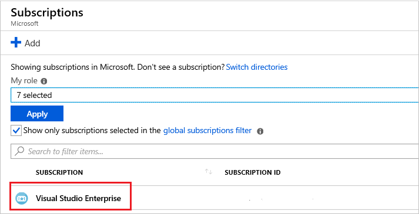
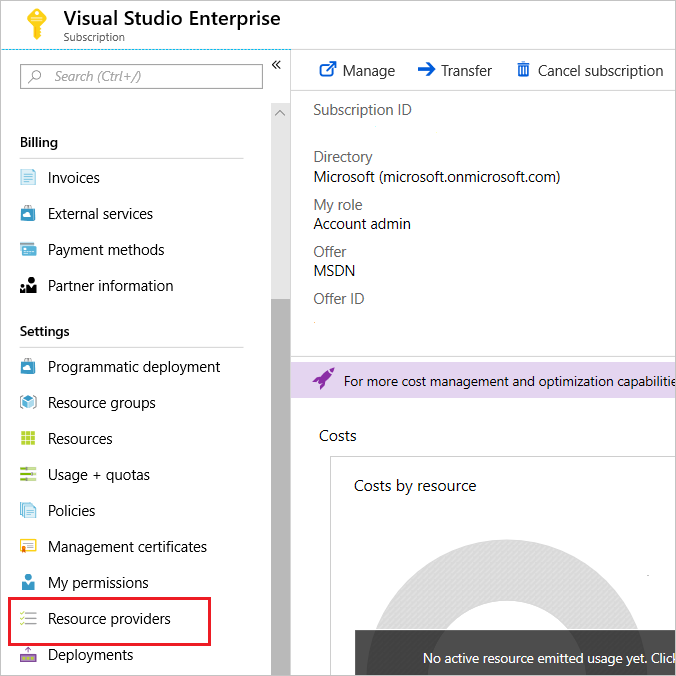

---
lab:
    title: 'Lab 03: Setup the Development Environment'
    module: 'Module 2: Devices and Device Communication'
---

# Set up the Development Environment

## Lab Scenario

As one of the developers at Contoso, you know that setting up your development environment is an important step before starting to build your Azure IoT solution. You also know that Microsoft and other companies provide a number of tools that can be used to develop and support your IoT solutions, and that some decisions should be made about which tools your team will use.

You decide to prepare a development environment that the team can use to work on your IoT solution. The environment will need to support your work in Azure and on your local PC. After some discussion, your team has made the following high-level decisions about the dev environment:

* Operating System: Windows 10 will be used as the OS. Windows is used by most of your team, so it was a logical choice. You make a note to the team that Azure services support other operating systems (such as Mac OS and Linux), and that Microsoft provides supporting documentation for the members of your team who choose one of these alternatives.
* General Coding Tools: Visual Studio Code and Azure CLI will be used as the primary coding tools. Both of these tools support extensions for IoT that leverage the Azure IoT SDKs.
* IoT Edge Tools: Docker Desktop Community and Python will be used to support custom IoT Edge module development (along with Visual Studio Code).

In support of these decisions, you will be setting up the following environment:

* Windows 10 64-bit: Pro, Enterprise, or Education (Build 15063 or later). Including
  * 4GB – 8GB system RAM (higher the better for Docker)
  * Hyper-V and Containers features of Windows must be enabled.
  * BIOS-level hardware virtualization support must be enabled in the BIOS settings.

  > **Note**: When setting up the development environment on a virtual machine, the VM environment must support nested virtualization - [nested virtualization](https://docs.microsoft.com/en-us/virtualization/hyper-v-on-windows/user-guide/nested-virtualization)

* Azure CLI (current/latest)
* .NET Core 3.1.200 (or later) SDK
* VS Code (latest)
* Python 3.9
* Docker Desktop Community 2.1.0.5 (or later) set to Linux Containers
* IoT Extensions for VS Code and Azure CLI
* node.js (latest)

> **Note**: A virtual machine has been created for this course that provides a majority of the tools specified above. The instructions below support using the prepared VM or setting up the development environment locally using your PC.

## In This Lab

In this lab, you will set up the base developer tools for your development environment, install the Azure IoT extensions for Visual Studio Code and Azure CLI, and then download some files from GitHub that you will use during the labs. The lab includes the following exercises:

* Install Developer Tools and Products
* Install Dev Tool Extensions
* Set Up Course Lab Files and Alternative Tools

## Lab Instructions

### Exercise 1: Install Developer Tools and Products

> **Important**: The tools and products associated with this Exercise are pre-installed on the virtual machine created for this course. Before continuing, check with your course Instructor to understand if you will be completing labs using the hosted lab VM environment or setting up the dev environment locally on your PC.

#### Task 1: Install .NET Core

.NET Core is a cross-platform version of .NET for building websites, services, and console apps.

1. To open the .NET Core download page, use the following link: [.NET Download](https://dotnet.microsoft.com/download)

1. On the .NET download page, under .NET Core, click **Download .NET Core SDK**.

    The .NET Core SDK is used to build .NET Core apps. You will be using it to build/edit code files during the labs in this course.

1. On the popup menu, click **Run**, and then follow the on-screen instructions to complete the installation.

    The installation should take less than a minute to complete. The following components will be installed:

    * .NET Core SDK 3.1.100 or later
    * .NET Core Runtime 3.1.100 or later
    * ASP.NET Core Runtime 3.1.100 or later
    * .NET Core Windows Desktop Runtime 3.1.0 or later

    The following resources are available for further information:

    * [.NET Core Documentation](https://aka.ms/dotnet-docs)
    * [.NET Core dependencies and requirements](https://docs.microsoft.com/en-us/dotnet/core/install/dependencies?tabs=netcore31&pivots=os-windows)
    * [SDK Documentation](https://aka.ms/dotnet-sdk-docs)
    * [Release Notes](https://aka.ms/netcore3releasenotes)
    * [Tutorials](https://aka.ms/dotnet-tutorials)

#### Task 2: Install Visual Studio Code

Visual Studio Code is a lightweight but powerful source code editor which runs on your desktop and is available for Windows, macOS and Linux. It comes with built-in support for JavaScript, TypeScript and Node.js and has a rich ecosystem of extensions for other languages (such as C++, C#, Java, Python, PHP, Go) and run times (such as .NET and Unity).

1. To open the Visual Studio Code download page, click the following link: [Download Visual Studio Code](https://code.visualstudio.com/Download)

    Instructions for installing Visual Studio Code on Mac OS X and Linux can be found on the Visual Studio Code set up guide [here](https://code.visualstudio.com/docs/setup/setup-overview). This page also includes more detailed instructions and tips for the Windows installation.

1. On the Download Visual Studio Code page, click **Windows**.

    When you start the download, two things will happen: a popup dialog opens and some getting started guidance will be displayed.

1. On the popup dialog, to begin the set up process, click **Run** and then follow the on-screen instructions.

    If you choose to Save the installer to your Downloads folder, you you can complete the installation by opening the folder and then double-clicking the VSCodeSetup executable.

    By default, Visual Studio Code is installed in the "C:\Program Files (x86)\Microsoft VS Code" folder location (for a 64-bit machine). The set up process should only take about a minute.

    > **Note**:  .NET Framework 4.5 is required for Visual Studio Code when installing on Windows. If you are using Windows 7, please ensure [.NET Framework 4.5](https://www.microsoft.com/en-us/download/details.aspx?id=30653) is installed.

    For detailed instructions on installing Visual Studio Code, see the Microsoft Visual Studio Code Installation Instruction guide here: [https://code.visualstudio.com/Docs/editor/setup](https://code.visualstudio.com/Docs/editor/setup)

#### Task 3: Install Azure CLI

Azure CLI is a command-line tool that is designed to make scripting Azure-related tasks easier. It also enables you to flexibly query data, and it supports long-running operations as non-blocking processes.

1. Open your browser, and then navigate to the Azure CLI tools download page: [Install Azure CLI](https://docs.microsoft.com/en-us/cli/azure/install-azure-cli?view=azure-cli-latest "Azure CLI Install")

    You should be installing the latest version of the Azure CLI tools (currently version 2.4). If version 2.4 is not the latest version listed on this "azure-cli-latest" download page, install the more recent version.

1. On the **Install Azure CLI** page, select the install option for your OS (such as **Install on Windows**), and then follow the on-screen instructions to install the Azure CLI tool.

    You will be given detailed instructions for using the Azure CLI tools during the labs in this course, but if you want more information now, see [Get started with Azure CLI](https://docs.microsoft.com/en-us/cli/azure/get-started-with-azure-cli?view=azure-cli-latest)

#### Task 4: Install Python 3.9

You will be using Python 3.9 in support of IoT Edge and Docker.

1. In your Web browser, navigate to [https://www.python.org/downloads/](https://www.python.org/downloads/)

1. On the Python download page, select the installer file that is appropriate for your Operating System.

1. When prompted, select the option to run the installer

1. On the Install Python  dialog, click **Add Python 3.9 to PATH**.

1. Click **Install Now**.

1. When the "Setup was successful" page appears, click **Disable path length limit**.

1. To finish the installation process, click **Close**.

#### Task 5: Install Docker Desktop

You will be using Docker Desktop Community (latest stable version) during a lab that covers creating and deploying custom IoT Edge modules.

1. In your Web browser, navigate to [https://docs.docker.com/docker-for-windows/install/](https://docs.docker.com/docker-for-windows/install/)

    The left-side navigation menu provides access to installations for additional operating systems.

1. Verify that your PC meets the System Requirements.

    You can use Windows Settings to open the Windows Features dialog, and use that to verify that Hyper-V and Containers are enabled.

1. Click **Download from Docker Hub**

1. Under Docker Desktop for Windows, click **Get Docker Desktop for Windows (stable)**.

1. To start the installation, click **Run**.

    It can take a little while for the installation dialog for Docker Desktop to appear.

1. When the Installation Succeeded message appears, click **Close**.

    Docker Desktop does not start automatically after installation. To start Docker Desktop, search for Docker, and select Docker Desktop in the search results. When the whale icon in the status bar stays steady, Docker Desktop is up-and-running, and is accessible from any terminal window.

#### Task 6 - Install node.js

Some sample web applications are run locally using node.js. The following steps ensure node.js is installed and running the latest version:

1. Using a browser, open the [node.js download page](https://nodejs.org/en/#home-downloadhead)

1. Download the latest LTS (Long Term Support) version - 14.16.0 at the time of writing.

1. When prompted, select the option to run the installer.

1. Step through the installer:

   * **End-User License Agreement** - accept terms and click **Next**.
   * **Destination Folder** - accept the default (or change if required) and click **Next**.
   * **Custom Setup** - accept the defaults and click **Next**.
   * **Tools for Native Modules** - check the **Automatically install** and click **Next**.
   * **Ready to install Node.js** - click **Install**
     * On the UAC dialog, click **Yes**.

1. Wait for the install to complete and click **Finish**.

1. In the **Install Additional Tools for Node.js** command window, when prompted, press **Enter** to continue.

1. On the UAC dialog, click **Yes**.

    Multiple packages will be downloaded and installed. This will take some time.

1. Once the installation has completed, open a **new** command shell and enter the following command:

    ```powershell
    node --version
    ```

    If node is installed successfully, the installed version will be displayed.

### Exercise 2: Install Dev Tool Extensions

The Visual Studio Code and Azure CLI tools both support an Azure IoT extension that helps developers to create their solutions more efficiently. These extensions leverage the Azure IoT SDKs and will often reduce development time while ensuring security provisions. You will also be adding a C# extension for Visual Studio Code.

#### Task 1: Install Visual Studio Code Extensions

1. Open Visual Studio Code.

1. On the left side of the Visual Studio Code window, click **Extensions**.

    You can hover the mouse pointer over the buttons to display the button titles. The Extensions button is sixth from the top.

1. In the Visual Studio Code Extension manager, search for and then install the following Extensions:

    * [Azure IoT Tools](https://marketplace.visualstudio.com/items?itemName=vsciot-vscode.azure-iot-tools) (`vsciot-vscode.azure-iot-tools`) by Microsoft
    * [C# for Visual Studio Code](https://marketplace.visualstudio.com/items?itemName=ms-vscode.csharp) (`ms-vscode.csharp`) by Microsoft
    * [Azure Tools for Visual Studio Code](https://marketplace.visualstudio.com/items?itemName=ms-vscode.vscode-node-azure-pack) (ms-vscode.vscode-node-azure-pack) by Microsoft
    * [DTDL Editor for Visual Studio Code](https://marketplace.visualstudio.com/items?itemName=vsciot-vscode.vscode-dtdl) (vsciot-vscode.vscode-dtdl) by Microsoft

1. Close Visual Studio Code.

#### Task 2: Install Azure CLI Extension - local environment

1. Open a new command-line / terminal window, to install the Azure IoT CLI extensions locally.

    For example, you can use the Windows **Command Prompt** command-line application.

1. At the command prompt, to install the Azure CLI extension for IoT, enter the following command:

    ```bash
    az extension add --name azure-iot
    ```

1. At the command prompt, to install the Azure CLI extension for Time Series Insights, enter the following command:

    ```bash
    az extension add --name timeseriesinsights
    ```

#### Task 3: Install Azure CLI Extension - cloud environment

Many of the labs will require the use of the Azure CLI IoT extensions via the Azure Cloud Shell. The following steps ensure the extension is installed and running the latest version.

1. Using a browser, open the [Azure Cloud Shell](https://shell.azure.com/) and login with the Azure subscription you are using for this course.

1. If you are prompted about setting up storage for Cloud Shell, accept the defaults.

1. Verify that the Cloud Shell is using **Bash**.

    The dropdown in the top-left corner of the Azure Cloud Shell page is used to select the environment. Verify that the selected dropdown value is **Bash**.

1. At the command prompt, to install the Azure CLI extension for IoT, enter the following command:

    ```bash
    az extension add --name azure-iot
    ```

    **Note**: If the extension is already installed, you can ensure you are running the latest version by entering the following command:

    ```bash
    az extension update --name azure-iot
    ```

1. At the command prompt, to install the Azure CLI extension for Time Series Insights, enter the following command:

    ```bash
    az extension add --name timeseriesinsights
    ```

#### Task 4: Verify Development Environment Setup

You should verify that the development environment has been set up successfully. Once this is complete, you will be ready to start building your IoT solutions.

1. Open a new command-line / terminal window.

1. Validate the **Azure CLI** installation by running the following command that will output the version information for the currently installed version of the Azure CLI.

    ```cmd/sh
    az --version
    ```

    The `az --version` command will output the version information for Azure CLI that you have installed (the `azure-cli` version number). This command also outputs the version number for all the Azure CLI modules installed, including the IoT extension. You should see output similar to the following:

    ```cmd/sh
    azure-cli                           2.20.0

    core                                2.20.0
    telemetry                           1.0.6

    Extensions:
    azure-iot                           0.10.9
    ```

1. Validate the **.NET Core 3.x SDK** installation by running the following command that will output the version number for the currently installed version of the .NET Core SDK.

    ```cmd/sh
    dotnet --version
    ```

    The `dotnet --version` command will output the version of the .NET Core SDK that is currently installed.

1. Verify that .NET Core 3.1 or higher is installed.

Your development environment should now be set up!

### Exercise 3: Set Up Course Lab Files and Alternative Tools

A number of the labs in this course rely on pre-built resources, such as a code project that can be used as a starting point for the lab activity. These lab resources are provided in a GitHub project that you should download to your dev environment.

In addition to the resources that directly support the course labs (the resources contained in the GitHub project), there are some optional tools that you may choose to install because they support learning opportunities outside of this course. One example is PowerShell, which you may see referenced within Microsoft tutorials and other resources.

The instructions below lead you through the configuration of both these resource types.

#### Task 1: Download Course Lab Files

Microsoft has created a GitHub repo to provide access to lab resource files. Having these files local to the dev environment is required in some cases and convenient in many others. In this task you will be downloading and extracting the contents of the repo within your development environment.

1. In your Web browser, navigate to the following location: [https://github.com/MicrosoftLearning/AZ-220-Microsoft-Azure-IoT-Developer](https://github.com/MicrosoftLearning/AZ-220-Microsoft-Azure-IoT-Developer)

1. On the right side of the page, click **Clone or download**, and then click **Download ZIP**.

1. To save the ZIP file to your dev environment, click **Save**.

1. Once the file has been saved, click **Open folder**.

1. Right-click the saved ZIP file, and then click **Extract all**

1. Click **Browse**, and then navigate to folder location that is convenient to access.

    > **Important**: By default, Windows has a [maximum file path length of 260](https://docs.microsoft.com/en-us/windows/win32/fileio/naming-a-file#maximum-path-length-limitation). As the file paths within the ZIP are already long, avoid extracting the archive within nested folders with a large file path. For example, the default path prompted to extract the zip could be similar to **c:\users\\[username]\downloads\AZ-220-Microsoft-Azure-IoT-Developer-master** - it is recommended that you shorten this as much as possible, to perhaps **c:\az220**

1. To extract the files, click **Extract**.

    Be sure to make note of where you located the files.

#### Task 2: Install Azure PowerShell Module

> **Note**: The lab activities in this course do NOT include using PowerShell, however, you may see sample code in reference documents that use PowerShell. If you want to run PowerShell code, you can use the following instructions to complete the installation steps.

Azure PowerShell is a set of cmdlets for managing Azure resources directly from the PowerShell command line. Azure PowerShell is designed to make it easy to learn and get started with, but provides powerful features for automation. Written in .NET Standard, Azure PowerShell works with PowerShell 5.1 on Windows, and PowerShell 6.x and higher on all platforms.

> **Warning**:  You can't have both the AzureRM and Az modules installed for PowerShell 5.1 for Windows at the same time. If you need to keep AzureRM available on your system, install the Az module for PowerShell Core 6.x or later. To do this, install PowerShell Core 6.x or later and then follow these instructions in a PowerShell Core terminal.

1. Decide if you wish to install the Azure PowerShell module for just the current user (recommended approach) or for all users.

1. Launch the PowerShell terminal of your choice - if you are installing for all users you must launch an elevated PowerShell session either by either selecting **run as administrator** or with the **sudo** command on macOS or Linux.

1. To only install for the current user, enter the following command:

    ```powershell
    Install-Module -Name Az -AllowClobber -Scope CurrentUser
    ```

    or to install for all users on a system, enter the following command:

    ```powershell
    Install-Module -Name Az -AllowClobber -Scope AllUsers
    ```

1. By default, the PowerShell gallery isn't configured as a trusted repository for PowerShellGet. The first time you use the PSGallery you see the following prompt:

    ```output
    Untrusted repository

    You are installing the modules from an untrusted repository. If you trust this repository, change
    its InstallationPolicy value by running the Set-PSRepository cmdlet.

    Are you sure you want to install the modules from 'PSGallery'?
    [Y] Yes  [A] Yes to All  [N] No  [L] No to All  [S] Suspend  [?] Help (default is "N"):
    ```

1. Answer **Yes** or **Yes to All** to continue with the installation.

    The Az module is a rollup module for the Azure PowerShell cmdlets. Installing it downloads all of the available Azure Resource Manager modules, and makes their cmdlets available for use.

> **Note**: If the **Az** module is already installed, you can update to the latest version using:
>
> ```powershell
> Update-Module -Name Az
> ```

### Exercise 3 - Register resource providers

Many different types of resources will be created during this course, some of which may not have been register for use in the current subscription. While some resources are registered automatically during the first use, others must be registered before they can be used, otherwise errors will be reported.

#### Task 1 - Register resource providers using the Azure CLI

The Azure CLI provides a number of commands to help manage resource providers. In this task, you will ensure that the resource providers required for this course are registered.

1. Using a browser, open the [Azure Cloud Shell](https://shell.azure.com/) and login with the Azure subscription you are using for this course.

1. To view a list of the current state of the resource providers, enter the following command:

    ```powershell
    az provider list -o table
    ```

    This will display a *long* list of resources, similar to:

    ```powershell
    Namespace                                RegistrationPolicy    RegistrationState
    ---------------------------------------  --------------------  -------------------
    Microsoft.OperationalInsights            RegistrationRequired  Registered
    microsoft.insights                       RegistrationRequired  NotRegistered
    Microsoft.DataLakeStore                  RegistrationRequired  Registered
    Microsoft.DataLakeAnalytics              RegistrationRequired  Registered
    Microsoft.Web                            RegistrationRequired  Registered
    Microsoft.ContainerRegistry              RegistrationRequired  Registered
    Microsoft.ResourceHealth                 RegistrationRequired  Registered
    Microsoft.BotService                     RegistrationRequired  Registered
    Microsoft.Search                         RegistrationRequired  Registered
    Microsoft.EventGrid                      RegistrationRequired  Registered
    Microsoft.SignalRService                 RegistrationRequired  Registered
    Microsoft.VSOnline                       RegistrationRequired  Registered
    Microsoft.Sql                            RegistrationRequired  Registered
    Microsoft.ContainerService               RegistrationRequired  Registered
    Microsoft.ManagedIdentity                RegistrationRequired  Registered
    ...
    ```

1. To see return a list of the namespaces that contains the string **Event**, run the following command:

    ```powershell
    az provider list -o table --query "[?contains(namespace, 'Event')]"
    ```

    The results will be similar to:

    ```powershell
    Namespace            RegistrationState    RegistrationPolicy
    -------------------  -------------------  --------------------
    Microsoft.EventGrid  NotRegistered        RegistrationRequired
    Microsoft.EventHub   Registered           RegistrationRequired
    ```

1. To register the resources required for this course, execute the following commands:

    ```powershell
    az provider register --namespace "Microsoft.EventGrid" --accept-terms
    az provider register --namespace "Microsoft.EventHub" --accept-terms
    az provider register --namespace "Microsoft.Insights" --accept-terms
    az provider register --namespace "Microsoft.TimeSeriesInsights" --accept-terms
    ```

    > **NOTE**: You may see a warning that **-accept-terms** is in preview - you can ignore this.

    > **NOTE**: The **microsoft.insights** is listed in lowercase - however the register/unregister commands are case-insensitive.

1. To view the updated status of the  resources, execute the following commands:

    ```powershell
    az provider list -o table --query "[?(contains(namespace, 'insight') || contains(namespace, 'Event') || contains(namespace, 'TimeSeriesInsights'))]"
    ```

    > **NOTE**: Although the register/unregister commands are case-insensitive, the query language is not, so **insight** must be lowercase.

    The resources should now be registered.

#### Task 2 - Register resource providers using the Azure Portal

You can see the registration status and register a resource provider namespace through the portal. In this task, you will familiarize yourself with the UI.

1. If necessary, log in to [portal.azure.com](https://portal.azure.com) using your Azure account credentials.

1. From the portal, select **All services**.

    

1. Select Subscriptions.

    

1. From the list of subscriptions, select the subscription you want to use for registering the resource provider.

    

1. For your subscription, select **Resource providers**.

    

1. Look at the list of resource providers, resources can be be registered or unregistered by clicking the appropriate action.

    

1. To filter the listed resources, in the search textbox, enter **insights**.

    Notice that the list is filtered as search criteria is entered. The search is also case-insensitive.
