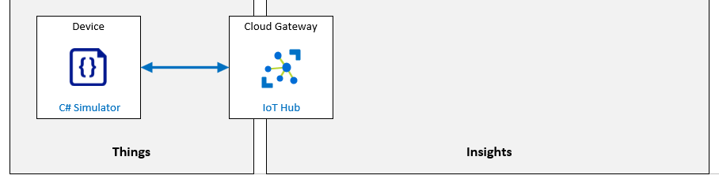

---
lab:
    title: 'Lab 04: Connect an IoT Device to Azure'
    module: 'Module 2: Devices and Device Communication'
---

# Connect an IoT Device to Azure

## Lab Scenario

Contoso is known for producing high quality cheeses. Due to the company's rapid growth in both popularity and sales, they want to take steps to ensure that their cheeses stay at the same high level of quality that their customers expect.

In the past, temperature and humidity data was collected by factory floor workers during each work shift. The company is concerned that the factory expansions will require increased monitoring as the new facilities come online and that a manual process for collecting data won't scale.

Contoso has decided to launch an automated system that uses IoT devices to monitor temperature and humidity. The rate at which telemetry data is communicated will be adjustable to help ensure that their manufacturing process is under control as batches of cheese proceed through environmentally sensitive processes.

To evaluate this asset monitoring solution prior to full scale implementation, you will be connecting an IoT device (that includes temperature and humidity sensors) to IoT Hub.

> **Note**: For the purposes of this lab, you will be creating a .NET Core console application that simulates the physical IoT device and sensors. Your simulated device will implement the IoT Device SDK and it will connect to IoT Hub just like a physical device would. Your simulated device will also communicate telemetry values using the same SDK resources used by a physical device, but the sensor readings will be generated values rather than real values read from temperature and humidity sensors.

The following resources will be created:



## In This Lab

In this lab, you will begin by reviewing the lab prerequisites and you will run a script if needed to ensure that your Azure subscription includes the required resources. You will then use the Azure portal to register a device ID with Azure IoT Hub and develop the corresponding simulated device app in Visual Studio Code. You will then insert the connection string (created by IoT Hub when you registered the device) into your simulated device code and run the app to test the connection and verify that telemetry is reaching IoT Hub as intended. The lab includes the following exercises:

* Verify Lab Prerequisites
* Create an Azure IoT Hub Device ID using the Azure portal
* Create and Test a Simulated Device (C#)

## Lab Instructions

### Exercise 1: Verify Lab Prerequisites

This lab assumes that the following Azure resources are available:

| Resource Type  | Resource Name                |
| :------------- | :--------------------------- |
| Resource Group | @lab.CloudResourceGroup(ResourceGroup1).Name                     |
| IoT Hub        | iot-az220-training-{your-id} |

To ensure these resources are available, complete the following tasks.

1. Select **Deploy to Azure**:

    [](https://portal.azure.com/#create/Microsoft.Template/uri/https%3a%2f%2fraw.githubusercontent.com%2fMicrosoftLearning%2fMSLearnLabs-AZ-220-Microsoft-Azure-IoT-Developer%2fmaster%2fAllfiles%2fARM%2flab04.json)

1. If prompted, login to the **Azure Portal**.

    The **Custom deployment** page will be displayed.

1. Under **Project details**, in the **Subscription** dropdown, ensure that the Azure subscription that you intend to use for this course is selected.

1. In the **Resource group** dropdown, select **@lab.CloudResourceGroup(ResourceGroup1).Name**.

    > **NOTE**: If **@lab.CloudResourceGroup(ResourceGroup1).Name** is not listed:
    >
    > 1. Under the **Resource group** dropdown, click **Create new**.
    > 1. Under **Name**, enter **@lab.CloudResourceGroup(ResourceGroup1).Name**.
    > 1. Click **OK**.

1. Under **Instance details**, in the **Region** dropdown, select the region closest to you.

    > **NOTE**: If the **@lab.CloudResourceGroup(ResourceGroup1).Name** group already exists, the **Region** field is set to the region used by the resource group and is read-only.

1. In the **Your ID** field, enter the unique ID you created in Exercise 1.

1. In the **Course ID** field, enter **az220**.

1. To validate the template, click **Review and create**.

1. If validation passes, click **Create**.

    The deployment will start.

1. Once the deployment has completed, in the left navigation area, to review any output values from the template,  click **Outputs**.

    Make a note of any outputs as necessary.

The resources have now been created.

### Exercise 2: Create an Azure IoT Hub Device ID using the Azure portal

During this course you will be using IoT Hub's capabilities to help you build a scalable, full-featured IoT solution for Contoso, but in this lab you are focused on using IoT Hub to establish reliable and secure bidirectional communications between IoT Hub and your IoT device(s).

In this exercise, you will open your IoT Hub in the Azure portal, add a new IoT device to the device registry, and then get a copy of the Connection String that IoT Hub created for your device (which you will use in your device code later in the lab).

#### Task 1: Create the Device

1. If necessary, log in to [portal.azure.com](https://portal.azure.com) using your Azure account credentials.

    If you have more than one Azure account, be sure that you are logged in with the account that is tied to the subscription that you will be using for this course.

1. Verify that your AZ-220 dashboard is being displayed.

1. On the **@lab.CloudResourceGroup(ResourceGroup1).Name** resource group tile, click **iot-az220-training-{your-id}**

1. On the left-side menu of your IoT Hub blade, under **Explorers**, click **IoT devices**.

1. At the top of the **IoT devices** pane, click **+ New**.

1. In the **Device ID** field, enter **sensor-th-0001**

    The device identity (Device ID) is used for device authentication and access control.

    It is helpful to establish some form of naming convention for your device identities. There are several reasons for this, including that the device ID is the value IoT Hub uses represent a device. Having a device ID that succinctly and informatively differentiates one device from another is therefor helpful.

    The suggested naming convention above, _sensor-th-0001_, identifies this device as a sensor enabled device (_sensor_) that reports temperature and humidity values (_-th_) and is the first device of this type in a series of up to 9999 (_-0001_). Contoso may have 200 or 5000 of these devices installed and reporting environmental conditions from the factory floor, and the device identity will be one of the ways that a device can be recognized.

1. Under **Authentication type**, ensure that **Symmetric key** is selected.

    Notice that there are three types of authentication available. In this lab you will leverage the simplest of the three, Symmetric key. X.509 Certificates and their use for authentication will be covered in later labs.

1. Notice that the **Primary key** and **Secondary key** fields are disabled.

1. Under **Auto-generate keys**, ensure the checkbox is selected.

    With **Auto-generate keys** selected, the **Primary key** and **Secondary key** fields are disabled and will be populated once the record is saved. Un-selecting **Auto-generate keys** will enable those fields, allowing for values to be entered directly.

1. Under **Connect this device to an IoT hub**, ensure that **Enable** is selected.

    You could choose the Disable option here during the initial creation of a device if you were creating the device entry ahead of rollout. You could also choose to set this value to Disable at some future time if you wished to retain the device record, but prevent the associated device from connecting to the IoT Hub.

1. Under **Parent device**, leave **No parent device** as the value.

    IoT devices may be parented by other devices such as IoT Edge devices. You will get a chance to implement a Parent-Child device relationship later in the course.

1. To add this device record to the IoT Hub, click **Save**.

    After a few moments, the **IoT devices** pane will refresh and the new device will be listed.

    > **TIP**: You may need to refresh manually - click the **Refresh** button on the page, rather than refreshing the browser

#### Task 2: Get the Device Connection String

In order for a device to connect to an IoT Hub, it needs to establish a connection. In this lab, you will use a connection string to connect your device directly to the IoT Hub (this for of authentication is often referred to as symmetric key authentication). When using Symmetric key authentication, there are two connection strings available - one that utilizes the Primary key, the other that uses the Secondary key. As noted above, the Primary and Secondary keys are only generated once the device record is saved. Therefore, to obtain one of the connection strings, you must first save the record (as you did in the task above) and then re-open the device record (which is what you are about to do).

1. On the **IoT devices** pane of your IoT Hub, under **DEVICE ID**, click **sensor-th-0001**.

1. Take a minute to review the contents of the **sensor-th-0001** device detail blade.

    In addition to the device properties, notice that the device detail blade provides access to a number of device related functions (such as Direct Method and Device Twin) along the top of the blade.

1. Notice that the key and connection string values are now populated.

    The values are obfuscated by default, but you can click the "eye" icon on the right of each field to toggle between showing and hiding the values.

1. To the right of the **Primary Connection String** field, click **Copy**.

    You can hover your mouse pointer over the button icons to display their names; the Copy button is on the far right.

    > **Note**: You will need to use the Primary Connection String value later in the lab, so you may want to save it to an accessible location (perhaps by pasting the value into a text editor such as NotePad).

    The connection string will be in the following format:

    ```text
    HostName={IoTHubName}.azure-devices.net;DeviceId=sensor-th-0001;SharedAccessKey={SharedAccessKey}
    ```

### Exercise 3: Create and Test a Simulated Device (C#)

The Azure IoT Device SDKs enable you to build apps that run on your IoT devices using the device client. Tools in the SDK will help you to establish secure connections as well as packaging messages and implementing communication with your IoT hub. The device SDK will also help you to receive messages, job, method, or device twin updates from your IoT hub.

In this exercise, you will create a simulated device application using Visual Studio Code and the Azure IoT Device SDKs. You will connect your device to Azure IoT Hub using the Device ID and Shared Access Key (Primary Connection String) that you created in the previous exercise. You will then test your secured device connection and communication to ensure that IoT Hub is receiving the simulated temperature and humidity values from your device as expected.

> **Note**: You will be writing your simulated device code using the C# programming language, but don't worry if you are more accustomed to another programming language or if your programming skills are a bit rusty, the instructions will be easy to follow. The important thing is for you to recognize how the IoT Device SDK is implemented in code (which is also explained in detail).

#### Task 1: Create the initial project

1. Open a new command-line / terminal window.

    For example, you can use the Windows **Command Prompt** command-line application.

1. Navigate to the folder location where you want to create your simulated device application.

    The root folder location is not critical, but something easy to find with a short folder path amy be helpful.

1. At the command prompt, to create a directory named "CaveDevice" and change the current directory to that directory, enter the following commands:

   ```bash
   mkdir CaveDevice
   cd CaveDevice
   ```

1. To create a new .NET console application, enter the following command:

    ```bash
    dotnet new console
    ```

    This command creates a **Program.cs** file in your folder, along with a project file.

1. To install the Azure IoT Device SDK and code libraries required for your simulated device app, enter the following commands:

    ```bash
    dotnet add package Microsoft.Azure.Devices.Client
    ```

    > **Note**: The **Microsoft.Azure.Devices.Client** package contains the Azure IoT Device SDK for .NET and has the **Newtonsoft.Json** package as a dependency. The **Newtonsoft.Json** package contains APIs that aid in the creation and manipulation of JSON.

    You will build and test your simulated device app in the next task.

1. To ensure all of the application dependencies are downloaded, enter the following command

    ```bash
    dotnet restore
    ```

1. Open **Visual Studio Code**.

1. On the **File** menu, click **Open Folder**.

1. In the **Open Folder** dialog, navigate to the location where you created the **CaveDevice** directory.

1. In the list of folders, click **CaveDevice**, and then click **Select Folder**.

    The EXPLORER pane of Visual Studio Code should now list two C# project files:

    * CaveDevice.csproj
    * Program.cs

    > **Note**: If you see a message **Required assets to build and debug are missing from CaveDevice. Add them?**, you may click **Yes** to proceed.

#### Task 2: Explore the application

As noted above, the application currently consists of two files:

* CaveDevice.csproj
* Program.cs

In this task, you will use Visual Studio Code to review the contents and purpose of the two application files.

1. In the **EXPLORER** pane, to open the application project file, click **CaveDevice.csproj**.

    The **CaveDevice.csproj** file should now be opened in the code editor pane.

1. Take a minute to review the contents of the **CaveDevice.csproj** file.

    Your file contents should be similar to the following:

    ```xml
    <Project Sdk="Microsoft.NET.Sdk">

        <PropertyGroup>
            <OutputType>Exe</OutputType>
            <TargetFramework>netcoreapp3.1</TargetFramework>
        </PropertyGroup>

        <ItemGroup>
            <PackageReference Include="Microsoft.Azure.Devices.Client" Version="1.*" />
        </ItemGroup>

    </Project>
    ```

    > **Note**: The package version numbers in your file may differ from those shown above, that's okay.

    The project file (.csproj) is an XML document that specifies the type of project that you are working on. In this case, the project is an **Sdk** style project.

    As you can see, the project definition contains two sections - a **PropertyGroup** and an **ItemGroup**.

    The **PropertyGroup** defines the type of output that building this project will produce. In this case you will be building an executable file that targets .NET Core 3.1.

    The **ItemGroup** specifies any external libraries that are required for the application. These particular references are for NuGet packages, and each package reference specifies the package name and the version. The `dotnet add package` commands (that you entered in the steps above) added these references to the project file and the `dotnet restore` command ensured that all of the dependencies were downloaded.

    > **Tip**: You can learn more about NuGet [here](https://docs.microsoft.com/en-us/nuget/what-is-nuget).

1. In the **EXPLORER** pane, click **Program.cs**.

    The **Program.cs** file should now be opened in the code editor pane.

1. Take a minute to review the contents of the **Program.cs** file.

    Your file contents should be similar to the following:

    ```csharp
    using System;

    namespace CaveSensor
    {
        class Program
        {
            static void Main(string[] args)
            {
                Console.WriteLine("Hello World!");
            }
        }
    }
    ```

    This program simply writes "Hello World!" to the command line window. Even though there isn't much code here, there are still some things worth noting:

    * The `using` area - the source file lists the namespaces that the code is **using** (this is typically done at the top of the file as it is here). In this example, the code specifies that it is using `System`. This means that when your code uses a component that's contained within the **System** namespace, you don't have to explicitly list the word **System** within that code line. For example, in the code above, the `Console` class is used to write "Hello World!". The `Console` class is part of the **System** namespace, but you didn't have to include the word `System` when you used `Console`. The benefit of this becomes more apparent when you consider that some namespaces are nested quite deeply (five or more levels is common). Once again referring to the code above, if you didn't specify `using System;`, you would have to write the console line as:

        ```csharp
        System.Console.WriteLine("Hello World!");
        ```

    * The `namespace` area - this specifies that the classes contained with the `{ }` that follow the namespace are part of that namespace. So, similar to how **Console** is part of the **System** namespace, in the example above, the **Program** class is part of the **CaveSensor** namespace, and its full name is **CaveSensor.Program**.

    * The `class` area - this defines the contents of the **Program** class. You can have more than one class within a single source file

    > **Note**: Developers will typically separate classes into their own source file (a single class per source file), especially in larger projects. However, in the labs for this course, you will be including multiple classes per file. This will help to simplify the lab instructions and does not imply best practice.

1. On the Visual Studio Code **View** menu, click **Terminal**.

    This will open the integrated Terminal at the bottom of the Visual Studio Code window. You will be using the Terminal window to compile and run your console application.

1. In the Terminal pane, ensure that the current directory path is set to the `CaveDevice` folder.

    The Terminal command prompt includes the current directory path. The commands that you enter are run at the current location, so be sure that you are located in the `CaveDevice` folder.

1. To build and run the **CaveDevice** project, enter the following command:

    ```cmd/sh
    dotnet run
    ```

1. Notice that **Hello World!** is displayed.

    After a moment, you should see **Hello World!** displayed on the line directly below the `dotnet run` command that you entered.

    You will be using the same `Console.WriteLine` approach in your simulated device application to display information locally, which will help you see the information being sent to IoT Hub and keep track of processes that are being completed by your device.

    Although this Hello World app demonstrates some basic concepts, it is clearly not a simulated device. In the next task you will replace this code with the code for your simulated device.

#### Task 3: Implement the simulated device code

In this task, you will use Visual Studio Code to enter the code that leverages the Azure IoT Device SDK to connect to your IoT Hub resource.

1. In the **EXPLORER** pane, click **Program.cs**.

1. Select all of the existing code, and then delete it.

1. In the code editor pane, to create the basic structure of your simulated device application, enter the following code:

    > **Important**: If you are intending to paste the code into a learning environment such as LODS, there are a few things to be aware of:
    >
    > * The **Type text -> Type clipboard text** buffer is limited, so it may truncate the code that is copied - double check your work and add any missing characters.
    > * As the **Type clipboard text** simulates typing, the default settings in Visual Studio Code will automatically indent code and insert closing braces - `)`, `}` and `]` - resulting in duplicate characters and incorrect indentation. These actions can be turned off with the following settings:
    >    * **Editor: Auto Closing Brackets**
    >    * **Editor: Auto Indent**
    > * The source can be reformatted at any time by using **F1** and entering **Format Document** or by pressing **SHIFT + ALT + F**


    ```csharp
    // INSERT using statements below here

    namespace CaveDevice
    {
        class Program
        {
            // INSERT variables below here

            // INSERT Main method below here

            // INSERT SendDeviceToCloudMessagesAsync method below here

            // INSERT CreateMessageString method below here

        }

        // INSERT EnvironmentSensor class below here

    }
    ```

    > **Note:** As you can see, the namespace and the class have been retained, however, the other items are placeholder comments. In the following steps you will be inserting code into the file below specific comments.

    > **Tip**: To reformat the pasted text in Visual Studio Code, press **SHIFT + ALT + F**, or press **F1** to open the command palette and search for **Format Document**.

1. Locate the `// INSERT using statements below here` comment.

1. To specify the namespaces that the application code will be using, enter the following code:

    ```csharp
    using System;
    using System.Text;
    using System.Threading.Tasks;
    using Microsoft.Azure.Devices.Client;
    using Newtonsoft.Json;
    ```

    Notice that as well as specifying **System**, you are also declaring other namespaces that the code will be using, such as **System.Text** for encoding strings, **System.Threading.Tasks** for asynchronous tasks, and the namespaces for the two packages you added earlier.

    > **Tip**: When inserting code, the code layout may not be ideal. You can have Visual Studio Code format the document for you by right-clicking in the code editor pane and then clicking **Format Document**. You can achieve the same result by opening the **Task** pane (press **F1**) and typing **Format Document** and then pressing **Enter**. And on Windows, the shortcut for this task is **SHIFT+ALT+F**.

1. Locate the `// INSERT variables below here` comment.

1. To specify the variables that the program is using, enter the following code:

    ```csharp
    // Contains methods that a device can use to send messages to and receive from an IoT Hub.
    private static DeviceClient deviceClient;

    // The device connection string to authenticate the device with your IoT hub.
    // Note: in real-world applications you would not "hard-code" the connection string
    // It could be stored within an environment variable, passed in via the command-line or
    // stored securely within a TPM module.
    private readonly static string connectionString = "{Your device connection string here}";
    ```

1. Take a moment to review the code (and code comments) that you just entered.

    The **deviceClient** variable is used to store an instance of **DeviceClient** - this class comes from the Azure IoT Device SDK and contains methods that a device can use to send messages to and receive from an IoT Hub.

    The **connectionString** variable will contain the connection string for the device we created earlier. This value is used by the **DeviceClient** to connect to the IoT Hub.

    > **Important**: You will see examples in this and other labs throughout this course where connection strings, passwords and other configuration information is hard-coded into the application. This is done solely to simplify the labs and **is not** a recommended practice. As much as possible, security issues like this will be addressed as they come up in the labs. Security topics (and other important considerations) will be addressed during the instructor presentation and in your Student Handbook content in a manner that supports the overall flow of the course. The two may not always align perfectly. As a result, you may be exposed to topics in the labs that are not covered in detail until later in the course.

    As noted within the code comments, connection strings and similar configuration values should be supplied via alternative means such as environment variables, command-line parameters or, better still, stored in secured hardware such as Trusted Platform Modules (TPM).

1. In the code that you just entered, update the value for **connectionString** using the Primary Connection String that you copied from IoT Hub.

    Once updated, the **connectionString** variable line should be similar to the following:

    ```csharp
    private readonly static string connectionString = "HostName=iot-az220-training-dm200420.azure-devices.net;DeviceId=sensor-th-0001;SharedAccessKey=hfavUmFgoCPA9feWjyfTx23SUHr+dqG9X193ctdEd90=";
    ```

1. Locate the `// INSERT Main method below here` comment.

1. To construct the **Main** method of your simulated device application, enter the following code:

    ```csharp
    private static void Main(string[] args)
    {
        Console.WriteLine("IoT Hub C# Simulated Cave Device. Ctrl-C to exit.\n");

        // Connect to the IoT hub using the MQTT protocol
        deviceClient = DeviceClient.CreateFromConnectionString(connectionString, TransportType.Mqtt);
        SendDeviceToCloudMessagesAsync();
        Console.ReadLine();
    }
    ```

    The **Main** method is the first part of your application that runs once your app is started.

1. Take a minute to review the code (and code comments) that you just entered.

    The basic structure of a simple device app is as follows:

    * Connect to the IoT Hub
    * Send telemetry to the app (Device to Cloud messages)

    Notice that the **deviceClient** variable is initialized with the result of the **DeviceClient** static method, **CreateFromConnectionString**. This method uses the connection string you specified earlier, as well as selecting the protocol that the device will use to the send telemetry -  in this case MQTT.

    > **Note**: In a production application, the **CreateFromConnectionString** method call would be wrapped in exception handling code to gracefully deal with any connection issues. This and other lab code is kept as simple as possible to highlight the key points, so most error-handling is omitted for brevity.

    Once connected, the **SendDeviceToCloudMessagesAsync** method is called. You may notice that the method name is underlined with "red squiggles" - this is because Visual Studio Code has noticed that **SendDeviceToCloudMessagesAsync** is not yet implemented. We will add the method shortly.

    Finally, the application waits for user input.

    > **Information**: The **DeviceClient** class is documented [here](https://docs.microsoft.com/en-us/dotnet/api/microsoft.azure.devices.client.deviceclient?view=azure-dotnet).
    >
    > **Information**: The **CreateFromConnectionString** method is documented [here](https://docs.microsoft.com/en-us/dotnet/api/microsoft.azure.devices.client.deviceclient.createfromconnectionstring?view=azure-dotnet#Microsoft_Azure_Devices_Client_DeviceClient_CreateFromConnectionString_System_String_Microsoft_Azure_Devices_Client_TransportType_).
    >
    > **Information**: The supported transport protocols are documented [here](https://docs.microsoft.com/en-us/azure/iot-hub/iot-hub-devguide-protocols).

1. Locate the `// INSERT - SendDeviceToCloudMessagesAsync below here` comment.

1. To construct the **SendDeviceToCloudMessagesAsync** method, enter the following code:

    ```csharp
    private static async void SendDeviceToCloudMessagesAsync()
    {
        // Create an instance of our sensor
        var sensor = new EnvironmentSensor();

        while (true)
        {
            // read data from the sensor
            var currentTemperature = sensor.ReadTemperature();
            var currentHumidity = sensor.ReadHumidity();

            var messageString = CreateMessageString(currentTemperature, currentHumidity);

            // create a byte array from the message string using ASCII encoding
            var message = new Message(Encoding.ASCII.GetBytes(messageString));

            // Add a custom application property to the message.
            // An IoT hub can filter on these properties without access to the message body.
            message.Properties.Add("temperatureAlert", (currentTemperature > 30) ? "true" : "false");

            // Send the telemetry message
            await deviceClient.SendEventAsync(message);
            Console.WriteLine("{0} > Sending message: {1}", DateTime.Now, messageString);

            await Task.Delay(1000);
        }
    }
    ```

    Notice that the declaration for the **SendDeviceToCloudMessagesAsync** method includes the keyword `async`. This specifies that the method contains asynchronous code that uses the `await` keyword and instructs the compiler to handle the callback plumbing for you.

1. Take a minute to review the code (and code comments) that you just entered.

    This method implements a typical message loop:

    * Read from one or more sensors
    * Create a message to send
    * Send the message
    * Wait for some time, or for an event to occur, etc.
    * Repeat the loop

    The following description explains the method code in more detail:

    * The first thing that your code does is create an instance of the **EnvironmentSensor** class. This is done outside the loop and is used to support simulating the sensor data inside the loop. You will add the **EnvironmentSensor** class shortly.

    * You then start an infinite loop - `while(true) {}` will repeat until the user hits **CTRL+C**.

    * Within the loop, the first thing you do is read the temperature and humidity from your sensor and use those values to create a message string - you will add the code for **CreateMessageString** in a moment as well.

    * Then you create the actual **message** that will be sent to IoT Hub. You do this by creating an instance of the **Message** class from the Azure IoT Device SDK - the data structure that represents the message that is used for interacting with Iot Hub (IoT Hub expects a specific message format). The constructor that you use for the **Message** class requires that the message string be encoded as a byte array.

    * Next, you augment the message with additional properties - here, for example, you set the **temperatureAlert** property to true if the **currentTemperature** is greater than 30, otherwise false.

    * You then send the telemetry message via the `await deviceClient.SendEventAsync(message);` call. Note that this line contains an `await` keyword. This instructs the compiler that the following code is asynchronous and will complete some time in the future - when it does complete, this method will continue executing on the next line.

    * Finally, you write the message string to the local console window to show that telemetry has been sent to IoT Hub, and then wait for 1000 milliseconds (1 second) before repeating the loop.

    > **Information**: You can learn more about `async`, `await` and asynchronous programming in C# [here](https://docs.microsoft.com/en-us/dotnet/csharp/async).

    > **Information**: The **Message** class is documented [here](https://docs.microsoft.com/en-us/dotnet/api/microsoft.azure.devices.client.message?view=azure-dotnet)

1. Locate the `// INSERT CreateMessageString method below here` comment.

1. To construct the **CreateMessageString** method that creates a JSON string from the sensor readings, enter the following code:

    ```csharp
    private static string CreateMessageString(double temperature, double humidity)
    {
        // Create an anonymous object that matches the data structure we wish to send
        var telemetryDataPoint = new
        {
            temperature = temperature,
            humidity = humidity
        };

        // Create a JSON string from the anonymous object
        return JsonConvert.SerializeObject(telemetryDataPoint);
    }
    ```

    This method creates an anonymous object with the temperature and humidity properties and assigns it to **telemetryDataPoint**.

    The value of **telemetryDataPoint** is then converted to a JSON string via the **JsonConvert** class that is part of the **Newtonsoft.Json** package you added earlier. The JSON string value is then returned to be used as the payload in the message.

1. Locate the `// INSERT EnvironmentSensor class below here` comment.

1. To construct the **EnvironmentSensor** class, enter the following code:

    ```csharp
    /// <summary>
    /// This class represents a sensor
    /// real-world sensors would contain code to initialize
    /// the device or devices and maintain internal state
    /// a real-world example can be found here: https://bit.ly/IoT-BME280
    /// </summary>
    internal class EnvironmentSensor
    {
        // Initial telemetry values
        double minTemperature = 20;
        double minHumidity = 60;
        Random rand = new Random();

        internal EnvironmentSensor()
        {
            // device initialization could occur here
        }

        internal double ReadTemperature()
        {
            return minTemperature + rand.NextDouble() * 15;
        }

        internal double ReadHumidity()
        {
            return minHumidity + rand.NextDouble() * 20;
        }
    }
    ```

    This is a very simple class that uses random numbers to return values that represent temperature and humidity. In reality, it is often much more complex to interact with sensors, especially if you have to communicate with them at a low-level and derive the measurement value (rather than getting a direct reading in the appropriate units).

    > **Information**: You can view a more representative example of the code that interacts with a simple temperature, humidity and pressure sensor [here](https://bit.ly/IoT-BME280).

1. On the **File** menu, click **Save**.

1. Take a minute to scan through your completed application.

    Your completed application represents a simple simulated device. It demonstrates how to connect a device to an IoT Hub and send Device to Cloud messages.

    You are now ready to test the application

#### Task 4: Test the application

1. In Visual Studio Code Explorer pane, on the **View** menu, click **Terminal**.

    Verify that the selected terminal shell is the windows command prompt.

1. In the Terminal view, at the command prompt, enter the following command:

    ```cmd/sh
    dotnet run
    ```

    This command will build and run the Simulated Device application. Be sure the terminal location is set to the directory with the `CaveDevice.cs` file.

    > **Note**:  If the command outputs a `Malformed Token` or other error message, then make sure the **Primary Connection String** value is configured correctly as the value of the `connectionString` variable.

    If you receive additional error messages, you can verify that you constructed your code correctly by referring to completed solution code that is available for reference in the **Final** folder for this lab. This **Final** folder is included with the lab resources files that you downloaded when setting up your development environment in lab 3. The folder path is:

    >
    > * Allfiles
    >   * Labs
    >      * LAB_AK_04-connect-iot-device-to-azure
    >        * Final

1. Observe the message string output displayed in the Terminal.

    Once the Simulated Device application is running, it will be sending event messages to the Azure IoT Hub that include `temperature` and `humidity` values, and displaying message string output in the console.

    The terminal output will look similar to the following:

    ```text
    IoT Hub C# Simulated Cave Device. Ctrl-C to exit.

    10/25/2019 6:10:12 PM > Sending message: {"temperature":27.714212817472504,"humidity":63.88147743599558}
    10/25/2019 6:10:13 PM > Sending message: {"temperature":20.017463779085066,"humidity":64.53511070671263}
    10/25/2019 6:10:14 PM > Sending message: {"temperature":20.723927165718717,"humidity":74.07808918230147}
    10/25/2019 6:10:15 PM > Sending message: {"temperature":20.48506045736608,"humidity":71.47250854944461}
    10/25/2019 6:10:16 PM > Sending message: {"temperature":25.027703996760632,"humidity":69.21247714628115}
    10/25/2019 6:10:17 PM > Sending message: {"temperature":29.867399432634656,"humidity":78.19206098010395}
    10/25/2019 6:10:18 PM > Sending message: {"temperature":33.29597232085465,"humidity":62.8990878830194}
    10/25/2019 6:10:19 PM > Sending message: {"temperature":25.77350195766124,"humidity":67.27347029711747}
    ```

    > **Note**: Leave the simulated device app running for now. Your next task will be to verify that your IoT Hub is receiving the telemetry messages.

#### Task 3: Verify Telemetry Stream sent to Azure IoT Hub

In this task, you will use the Azure CLI to verify telemetry sent by the simulated device is being received by Azure IoT Hub.

1. Using a browser, open the [Azure Cloud Shell](https://shell.azure.com/) and login with the Azure subscription you are using for this course.

    > **Note**: If the cloud shell has not been configured, follow the steps in **Lab 3 - Exercise 2 - Task 3: Configure cloud shell storage & Task 4: Install Azure CLI Extension - cloud environment**.

1. In the Azure Cloud Shell, to monitor the event messages that are being received by your IoT hub, enter the following command:

    ```cmd/sh
    az iot hub monitor-events --hub-name {IoTHubName} --device-id sensor-th-0001
    ```

    _Be sure to replace the **{IoTHubName}** placeholder with the name of your Azure IoT Hub._

    > **Note**:  If you receive a message stating _"Dependency update required for IoT extension version"_ when running the Azure CLI command, then press `y` to accept the update and press `Enter`. This will allow the command to continue as expected.

    The `monitor-events` command (within the `az iot hub` Azure CLI module) offers the capability to monitor device telemetry and other message types sent to an Azure IoT Hub. This can be a very useful tool during code development, and the convenience of the command-line interface is also nice.

    The `--device-id` parameter is optional and allows you to monitor the events from a single device. If the parameter is omitted, the command will monitor all events sent to the specified Azure IoT Hub.

1. Notice that the `az iot hub monitor-events` Azure CLI command outputs a JSON representation of the events that are arriving at your specified Azure IoT Hub.

    This command enables you to monitor the events being sent to IoT hub. You are also verifying that the device is able to connect to and communicate with the your IoT hub.

    You should see messages displayed that are similar to the following:

    ```cmd/sh
    Starting event monitor, filtering on device: sensor-th-0001, use ctrl-c to stop...
    {
        "event": {
            "origin": "sensor-th-0001",
            "payload": "{\"temperature\":25.058683971901743,\"humidity\":67.54816981383979}"
        }
    }
    {
        "event": {
            "origin": "sensor-th-0001",
            "payload": "{\"temperature\":29.202181296051563,\"humidity\":69.13840303623043}"
        }
    }
    ```

1. Once you have verified that IoT hub is receiving the telemetry, press **Ctrl-C** in the Azure Cloud Shell and Visual Studio Code windows.

    Ctrl-C is used to stop the running apps. Always remember to shut down unneeded apps and jobs.
