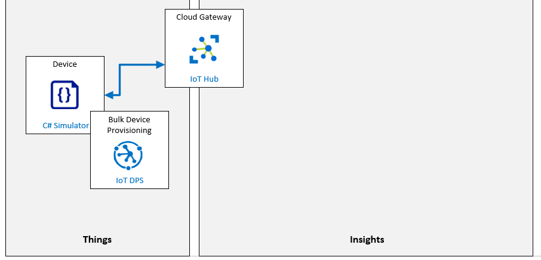

---
lab:
    title: 'Lab 06: Automatically provision IoT devices securely and at scale with DPS'
    module: 'Module 3: Device Provisioning at Scale'
---

# Automatically provision IoT devices securely and at scale with DPS

## Lab Scenario

Your work to-date on Contoso's Asset Monitoring and Tracking Solution has enabled you to validate the device provisioning and deprovisioning process using an Individual Enrollment approach. The management team has now asked that you begin testing the process for a larger scale rollout.

To keep the project moving forward you need to demonstrate that the Device Provisioning Service can be used to enroll larger numbers of devices automatically and securely using X.509 certificate authentication. You will be setting up a group enrollment to verify that Contoso's requirements are met.

The following resources will be created:



## In This Lab

In this lab, you will begin by reviewing the lab prerequisites and you will run a script if needed to ensure that your Azure subscription includes the required resources. You will then generate an X.509 root CA Certificate using OpenSSL within the Azure Cloud Shell, and use the root certificate to configure the Group Enrollment within the Device Provisioning Service (DPS). After that, you will use the root certificate to generate a device certificate, which you will use within a simulated device code to provision your device to IoT hub. While in your device code, you will implement access to the device twin properties used to perform initial configuration of the device. You will then test your simulated device. To finish up this lab, you will deprovision the entire group enrollment. The lab includes the following exercises:

* Verify Lab Prerequisites
* Generate and Configure X.509 CA Certificates using OpenSSL
* Configure simulated device with X.509 certificate
* Test the Simulated Device
* Deprovision a Group Enrollment

## Lab Instructions

### Exercise 1: Verify Lab Prerequisites

This lab assumes that the following Azure resources are available:

| Resource Type | Resource Name |
| :-- | :-- |
| Resource Group | @lab.CloudResourceGroup(ResourceGroup1).Name |
| IoT Hub | iot-az220-training-{your-id} |
| Device Provisioning Service | dps-az220-training-{your-id} |

To ensure these resources are available, complete the following tasks.

1. Select **Deploy to Azure**:

    [](https://portal.azure.com/#create/Microsoft.Template/uri/https%3a%2f%2fraw.githubusercontent.com%2fMicrosoftLearning%2fMSLearnLabs-AZ-220-Microsoft-Azure-IoT-Developer%2fmaster%2fAllfiles%2fARM%2flab06.json)

1. If prompted, login to the **Azure Portal**.

    The **Custom deployment** page will be displayed.

1. Under **Project details**, in the **Subscription** dropdown, ensure that the Azure subscription that you intend to use for this course is selected.

1. In the **Resource group** dropdown, select **@lab.CloudResourceGroup(ResourceGroup1).Name**.

    > **NOTE**: If **@lab.CloudResourceGroup(ResourceGroup1).Name** is not listed:
    >
    > 1. Under the **Resource group** dropdown, click **Create new**.
    > 1. Under **Name**, enter **@lab.CloudResourceGroup(ResourceGroup1).Name**.
    > 1. Click **OK**.

1. Under **Instance details**, in the **Region** dropdown, select the region closest to you.

    > **NOTE**: If the **@lab.CloudResourceGroup(ResourceGroup1).Name** group already exists, the **Region** field is set to the region used by the resource group and is read-only.

1. In the **Your ID** field, enter the unique ID you created in Exercise 1.

1. In the **Course ID** field, enter **az220**.

1. To validate the template, click **Review and create**.

1. If validation passes, click **Create**.

    The deployment will start.

1. Once the deployment has completed, in the left navigation area, to review any output values from the template,  click **Outputs**.

    Make a note of any outputs as necessary.

The resources have now been created.


### Exercise 2: Generate and Configure X.509 CA Certificates using OpenSSL

In this exercise, you will generate an X.509 CA Certificate using OpenSSL within the Azure Cloud Shell. This certificate will be used to configure the Group Enrollment within the Device Provisioning Service (DPS).

#### Task 1: Generate the certificates

1. If necessary, log in to the [Azure portal](https://portal.azure.com) using the Azure account credentials that you are using for this course.

    If you have more than one Azure account, be sure that you are logged in with the account that is tied to the subscription that you will be using for this course.

1. In the top right of the portal window, to open the Azure Cloud Shell, click **Cloud Shell**.

    The Cloud Shell button has an icon that appears to represent a command prompt - **`>_`**.

    A Cloud Shell window will open near the bottom of the display screen.

    > **Note**: If the cloud shell has not been configured, follow the steps in **Lab 3 - Exercise 2 - Task 3: Configure cloud shell storage & Task 4: Install Azure CLI Extension - cloud environment**.

1. In the upper left corner of the Cloud Shell window, ensure that **Bash** is selected as the environment option.

    > **Note**:  Both *Bash* and *PowerShell* interfaces for the Azure Cloud Shell support the use of **OpenSSL**. In this Exercise you will be using some helper scripts written for the *Bash* shell.

1. At the Cloud Shell command prompt, to create and then move into a new directory, enter the following commands:

    ```sh
    # ensure the current directory is the user's home directory
    cd ~

    # make a directory named "certificates"
    mkdir certificates

    # change directory to the "certificates" directory
    cd certificates
    ```

1. At the Cloud Shell command prompt, to download and prepare the Azure IoT helper scripts that you will be using, enter the following commands:

    ```sh
    # download helper script files
    curl https://raw.githubusercontent.com/Azure/azure-iot-sdk-c/master/tools/CACertificates/certGen.sh --output certGen.sh
    curl https://raw.githubusercontent.com/Azure/azure-iot-sdk-c/master/tools/CACertificates/openssl_device_intermediate_ca.cnf --output openssl_device_intermediate_ca.cnf
    curl https://raw.githubusercontent.com/Azure/azure-iot-sdk-c/master/tools/CACertificates/openssl_root_ca.cnf --output openssl_root_ca.cnf

    # update script permissions so user can read, write, and execute it
    chmod 700 certGen.sh
    ```

    The helper script and supporting files are being downloaded from the **Azure/azure-iot-sdk-c** open source project hosted on Github, which is a component of the Azure IoT Device SDK. The **certGen.sh** helper script will provide you with a chance to see how CA Certificates are used without diving too deeply into the specifics of OpenSSL configuration (which is outside the scope of this course).

    For additional instructions on using this helper script, and for instructions on how to use PowerShell instead of Bash, please see this link: [https://github.com/Azure/azure-iot-sdk-c/blob/master/tools/CACertificates/CACertificateOverview.md](https://github.com/Azure/azure-iot-sdk-c/blob/master/tools/CACertificates/CACertificateOverview.md)

    > **WARNING**: Certificates created by this helper script **MUST NOT** be used for Production. They contain hard-coded passwords ("*1234*"), expire after 30 days, and most importantly are provided for demonstration purposes only to help you quickly understand CA Certificates. When building products against CA Certificates, be sure to apply your company's security best practices for certificate creation and lifetime management.

    If you are interested, you can quickly scan the contents of the script file that you downloaded by using the editor that's built-in to the Cloud Shell.

    * In the Cloud Shell, to open the editor, click **`{}`**.
    * In the FILES list, click **certificates**, and then click **certGen.sh**

    > **Note**: If you are experienced with other text file viewing tools in the Bash environment, such as the `more` or `vi` commands, you could also use those tools.

    Next, you will use the script to create your root and intermediate certificates.

1. To generate the root and intermediate certificates, enter the following command:

    ```sh
    ./certGen.sh create_root_and_intermediate
    ```

    Notice that you ran the script with the `create_root_and_intermediate` option. This command assumes that you are running the script from within the `~/certificates` directory.

    This command generated a Root CA Certificate named `azure-iot-test-only.root.ca.cert.pem` and placed it within a `./certs` directory (under the certificates directory that you created).

1. To download the root certificate to your local machine (so it can be uploaded to DPS), enter the following command:

    ```sh
    download ~/certificates/certs/azure-iot-test-only.root.ca.cert.pem
    ```

    You will be prompted to save the file to your local machine. Make a note of where the file is being saved, you will need it in the next task.

#### Task 2: Configure DPS to trust the root certificate

1. In the Azure portal, open your Device Provisioning Service.

    The Device Provisioning Service is accessible from the Resources tile on your dashboard by clicking `dps-az220-training-{your-id}`.

1. On the left-side menu of the **dps-az220-training-{your-id}** blade, under **Settings**, click **Certificates**.

1. On the **Certificates** pane, at the top of the pane, click **+ Add**.

    Clicking **+ Add** will start the process of uploading the X.509 CA Certificate to the DPS service.

1. On the **Add Certificate** blade, under **Certificate Name**, enter **root-ca-cert**

    It is important to provide a name that enables you to differentiate between certificates, such as your root certificate and intermediate certificate, or multiple certificates at the same hierarchy level within the chain.

    > **Note**: The root certificate name that you entered could be the same as the name of the certificate file, or something different. The name that you provided is a logical name that has no correlation to the _Common Name_ that is embedded within the contents X.509 CA Certificate.

1. Under **Certificate .pem or .cer file.**, to the right of the text box, click **Open**.

    Clicking the **Open** button to the right of the text field will open an Open file dialog that enables you to navigate to the `azure-iot-test-only.root.ca.cert.pem` CA Certificate that you downloaded earlier.

1. Navigate to the folder location where you downloaded the root CA Certificate file, click **azure-iot-test-only.root.ca.cert.pem**, and then click **Open**.

1. At the bottom of the **Add Certificate** blade, click **Save**.

    Once the X.509 CA Certificate has been uploaded, the Certificates pane will display the certificate with the **Status** value set to **Unverified**. Before this CA Certificate can be used to authenticate devices to DPS, you will need to verify _Proof of Possession_ of the certificate.

1. To start the process of verifying Proof of Possession of the certificate, click **root-ca-cert**.

1. At the bottom of the **Certificate Details** pane, click **Generate Verification Code**.

    You may need to scroll down to see the **Generate Verification Code** button.

    When you click the button it will place the generated code ino the Verification Code field (located just above the button).

1. To the right of **Verification Code**, click **Copy to clipboard**.

    Proof of Possession of the CA certificate is provided to DPS by uploading a certificate generated from the CA certificate with the verification code that was just generated within DPS. This is how you provide proof that you actually own the CA Certificate.

    > **IMPORTANT**: You will need to leave the **Certificate Details** pane open while you generate the verification certificate. If you close the pane, you will invalidate the verification code, and will need to generate a new one.

1. Open the **Azure Cloud Shell**, if it's not still open from earlier, and navigate to the `~/certificates` directory.

1. To create the verification certificate, enter the following command:

    ```sh
    ./certGen.sh create_verification_certificate <verification-code>
    ```

    Be sure to replace the `<verification-code>` placeholder with the **Verification Code** generated by the Azure portal.

    For example, the command that you run will look similar to the following:

    ```sh
    ./certGen.sh create_verification_certificate 49C900C30C78D916C46AE9D9C124E9CFFD5FCE124696FAEA
    ```

    This generates a _verification certificate_ that is chained to the CA certificate. The subject of the certificate is the verification code. The generated Verification Certificate named `verification-code.cert.pem` is located within the `./certs` directory of the Azure Cloud Shell.

    The next step is to download the verification certificate to your local machine (similar to what you did with the root certificate earlier), so that you can then upload it to DPS.

1. To download the verification certificate to your local machine, enter the following command:

    ```sh
    download ~/certificates/certs/verification-code.cert.pem
    ```

    > **Note**: Depending on the web browser, you may be prompted to allow multiple downloads at this point. If there appears to be no response to your download command, make sure there's not a prompt elsewhere on the screen asking for permission to allow the download.

1. Switch back to the **Certificate Details** pane.

    This pane of your DPS service should still be open in the Azure portal.

1. At the bottom the **Certificate Details** pane, below and to the right of **Verification Certificate .pem or .cer file.**, click **Open**.

1. In the Open file dialog, navigate to your downloads folder, click **verification-code.cert.pem**, and then click **Open**.

1. At the bottom the **Certificate Details** pane, click **Verify**.

1. On the **Certificates** pane, ensure that the **Status** for the certificate is now set to **Verified**.

    You may need to click **Refresh** at the top of the pane (to the right of the **Add** button) to see this change.

#### Task 3: Create Group Enrollment (X.509 Certificate) in DPS

In this task, you will create a new enrollment group within the Device Provisioning Service (DPS) that uses X.509 certificate attestation.

1. On the left-side menu of the **dps-az220-training-{your-id}** blade, under **Settings**, click **Manage enrollments**.

1. At the top of the **Manage enrollments** pane, click **Add enrollment group**.

    Recall that an enrollment group is basically a record of the devices that may register through auto-provisioning.

1. On the **Add Enrollment Group** blade, under **Group name**, enter **eg-test-simulated-devices**

1. Ensure that the **Attestation Type** is set to **Certificate**.

1. Ensure that the **Certificate Type** field is set to **CA Certificate**.

1. In the **Primary Certificate** dropdown, select the CA certificate that was uploaded to DPS previously, likely **root-ca-cert**.

1. Leave the **Secondary Certificate** dropdown set to **No certificate selected**.

    The secondary certificate is generally used for certificate rotation, to accommodate expiring certificates or certificates that have been compromised. You can find more information on rolling certificates here: [https://docs.microsoft.com/en-us/azure/iot-dps/how-to-roll-certificates](https://docs.microsoft.com/en-us/azure/iot-dps/how-to-roll-certificates)

1. Leave the **Select how you want to assign devices to hubs** field set to **Evenly weighted distribution**.

    In large environments where you have multiple distributed hubs, this setting will control how to choose what IoT Hub should receive this device enrollment. You will have a single IoT Hub associated with the enrollment in this lab, so how you assign devices to IoT hubs doesn't really apply within this lab scenario.

1. Notice that the **Select the IoT hubs this group can be assigned to** dropdown has your **iot-az220-training-{your-id}** IoT Hub selected.

    This field is used to ensure that when the device is provisioned, it gets added to the correct IoT Hub.

1. Leave the **Select how you want device data to be handled on re-provisioning** field set to **Re-provision and migrate data**.

    This field gives you high-level control over the re-provisioning behavior, where the same device (as indicated through the same Registration ID) submits a later provisioning request after already being provisioned successfully at least once.

1. In the **Initial Device Twin State** field, modify the JSON object as follows:

    ```json
    {
        "tags": {},
        "properties": {
            "desired": {
                "telemetryDelay": "1"
            }
        }
    }
    ```

    This JSON data represents the initial configuration of device twin desired properties for any device that participates in this enrollment group.

    The devices will use the `properties.desired.telemetryDelay` property to set the time delay for reading and sending telemetry to IoT Hub.

1. Leave **Enable entry** set to **Enable**.

    Generally, you'll want to enable new enrollment entries and keep them enabled.

1. At the top of the **Add Enrollment Group** blade, click **Save**.

### Exercise 3: Configure simulated device with X.509 certificate

In this exercise, you will generate a device certificate using the root certificate, and configure a simulated device that connects by using the device certificate for attestation.

#### Task 1: Generate a device certificate

1. If necessary, log in to your Azure portal using your Azure account credentials.

    If you have more than one Azure account, be sure that you are logged in with the account that is tied to the subscription that you will be using for this course.

1. On the Azure portal toolbar, click **Cloud Shell**

    The Azure portal toolbar runs across the top of the portal window. The Cloud Shell button is the 6th in from the right.

1. Verify that the Cloud Shell is using **Bash**.

    The dropdown in the top-left corner of the Azure Cloud Shell page is used to select the environment. Verify that the selected dropdown value is **Bash**.

1. At the Cloud Shell command prompt, to navigate to the `~/certificates` directory, enter the following command:

    ```sh
    cd ~/certificates
    ```

    The `~/certificates` directory is where the `certGen.sh` helper scripts were downloaded. You used them to generate the CA Certificate for DPS earlier in this lab. This helper script will also be used to generate a device certificate within the CA Certificate chain.

1. To generate an X.509 device certificate within the CA certificate chain, enter the following command:

    ```sh
    ./certGen.sh create_device_certificate sensor-thl-2000
    ```

    This command will create a new X.509 certificate that's signed by the CA certificate that was generated previously. Notice that the device id (`sensor-thl-2000`) is passed to the `create_device_certificate` command of the `certGen.sh` script. This device id will be set within the _common name_, or `CN=`, value of the device certificate. This certificate will generate a leaf device X.509 certificate for your simulated device, and will be used to authenticate the device with the Device Provisioning Service (DPS).

    Once the `create_device_certificate` command has completed, the generated X.509 device certificate will be named `new-device.cert.pfx`, and will be located within the `/certs` sub-directory.

    > **Note**: This command overwrites any existing device certificate in the `/certs` sub-directory. If you want to create a certificate for multiple devices, ensure that you save a copy of the `new-device.cert.pfx` each time you run the command.

1. To rename the device certificate that you just created, enter the following commands:

    ```sh
    mv ~/certificates/certs/new-device.cert.pfx ~/certificates/certs/sensor-thl-2000-device.cert.pfx
    mv ~/certificates/certs/new-device.cert.pem ~/certificates/certs/sensor-thl-2000-device.cert.pem
    ```

1. To create four additional device certificates, enter the following commands:

    ```sh
    ./certGen.sh create_device_certificate sensor-thl-2001
    mv ~/certificates/certs/new-device.cert.pfx ~/certificates/certs/sensor-thl-2001-device.cert.pfx
    mv ~/certificates/certs/new-device.cert.pem ~/certificates/certs/sensor-thl-2001-device.cert.pem

    ./certGen.sh create_device_certificate sensor-thl-2002
    mv ~/certificates/certs/new-device.cert.pfx ~/certificates/certs/sensor-thl-2002-device.cert.pfx
    mv ~/certificates/certs/new-device.cert.pem ~/certificates/certs/sensor-thl-2002-device.cert.pem

    ./certGen.sh create_device_certificate sensor-thl-2003
    mv ~/certificates/certs/new-device.cert.pfx ~/certificates/certs/sensor-thl-2003-device.cert.pfx
    mv ~/certificates/certs/new-device.cert.pem ~/certificates/certs/sensor-thl-2003-device.cert.pem

    ./certGen.sh create_device_certificate sensor-thl-2004
    mv ~/certificates/certs/new-device.cert.pfx ~/certificates/certs/sensor-thl-2004-device.cert.pfx
    mv ~/certificates/certs/new-device.cert.pem ~/certificates/certs/sensor-thl-2004-device.cert.pem
    ```

1. To download the generated X.509 device certificates from the Cloud Shell to your local machine, enter the following commands:

    ```sh
    download ~/certificates/certs/sensor-thl-2000-device.cert.pfx
    download ~/certificates/certs/sensor-thl-2001-device.cert.pfx
    download ~/certificates/certs/sensor-thl-2002-device.cert.pfx
    download ~/certificates/certs/sensor-thl-2003-device.cert.pfx
    download ~/certificates/certs/sensor-thl-2004-device.cert.pfx
    ```

    In the next task, you will start building the simulated devices that will use the X.509 device certificates to authenticate with the Device Provisioning Service.

#### Task 2: Configure a simulated device

In this task, you will complete the following:

* Get the ID Scope from DPS that will be placed in code
* Copy the downloaded device certificate into the root folder of the application
* Configure the application in Visual Studio Code

1. In the Azure portal, open your Device Provisioning Service blade and ensure that the **Overview** pane is selected.

1. On the **Overview** pane, copy the **ID Scope** for the Device Provisioning Service, and save it for later reference.

    There is a copy button to the right of the value that will appear when you hover over the value.

    The **ID Scope** will be similar to this value: `0ne0004E52G`

1. Open Windows File Explorer, and then navigate to the folder where the `sensor-thl-2000-device.cert.pfx` certificate file was downloaded.

1. Use File Explorer to create a copy of the 5 device certificate files.

    It will save some time to copy all five certificate files now, but you will only be using the first one, `sensor-thl-2000-device.cert.pfx`, in the code project that you build initially.

1. In File Explorer, navigate to the Starter folder for lab 6 (Automatic Enrollment of Devices in DPS).

    In _Lab 3: Setup the Development Environment_, you cloned the GitHub repository containing lab resources by downloading a ZIP file and extracting the contents locally. The extracted folder structure includes the following folder path:

    * Allfiles
      * Labs
          * 06-Automatic Enrollment of Devices in DPS
            * Starter
              * ContainerDevice

1. With the ContainerDevice folder open, paste-in the copied device certificate files.

    The root directory of the ContainerDevice folder includes the `Program.cs` file for your simulated device app. The simulated device app will use the device certificate file when authenticating to the Device Provisioning Service.

1. Open **Visual Studio Code**.

1. On the **File** menu, click **Open Folder**

1. In the **Open Folder** dialog, navigate to the Starter folder for lab 6 (Automatic Enrollment of Devices in DPS).

1. Click **ContainerDevice**, and then click **Select Folder**.

    You should see the following files listed in the EXPLORER pane of Visual Studio Code:

    * ContainerDevice.csproj
    * Program.cs
    * sensor-thl-2000-device.cert.pfx

    **Note**: The other device certificate files that you copied to this folder will be used later in this lab, but for now you will focus on implementing just the first device certificate file.

1. In the **EXPLORER** pane, to open the ContainerDevice.csproj file, click **ContainerDevice.csproj**.

1. In the code editor pane, within the `<ItemGroup>` tag, update the certificate file name as follows:

    ```xml
    <ItemGroup>
        <None Update="sensor-thl-2000-device.cert.pfx" CopyToOutputDirectory="PreserveNewest" />
        <PackageReference Include="Microsoft.Azure.Devices.Client" Version="1.*" />
        <PackageReference Include="Microsoft.Azure.Devices.Provisioning.Transport.Mqtt" Version="1.*" />
        <PackageReference Include="Microsoft.Azure.Devices.Provisioning.Transport.Amqp" Version="1.*" />
        <PackageReference Include="Microsoft.Azure.Devices.Provisioning.Transport.Http" Version="1.*" />
    </ItemGroup>
    ```

    This configuration ensures that the `sensor-thl-2000-device.cert.pfx` certificate file is copied to the build folder when the C# code is compiled, and made available for the program to access when it executes.

1. On the Visual Studio Code **File** menu, click **Save**.

    **Note**: If you are prompted by Visual Studio Code to Restore, do that now.

1. In the **EXPLORER** pane, click **Program.cs**.

    A cursory glance will reveal that this version of the **ContainerDevice** application is virtually identical to the version used in the preceding lab. The only changes will be those that relate specifically to the use of X.509 certificates as an attestation mechanism. From the application perspective, it matters little that this device will be connecting via a Group Enrollment vs an Individual Enrollment.

1. Locate the **GlobalDeviceEndpoint** variable, and notice that its value is set to the Global Device Endpoint for the Azure Device Provisioning Service (`global.azure-devices-provisioning.net`).

    Within the Public Azure Cloud, **global.azure-devices-provisioning.net** is the Global Device Endpoint for the Device Provisioning Service (DPS). All devices connecting to Azure DPS will be configured with this Global Device Endpoint DNS name. You should see code that is similar to the following:

    ```csharp
    private const string GlobalDeviceEndpoint = "global.azure-devices-provisioning.net";
    ```

1. Locate the **dpsIdScope** variable, and update the assigned value using the **ID Scope** that you copied from the Overview pane of the Device Provisioning Service.

    When you have updated your code, it should look similar to the following:

    ```csharp
    private static string dpsIdScope = "0ne000CBD6C";
    ```

1. Locate the **certificateFileName** variable, and notice that its value is set to the default name of the device certificate file that you generated (**new-device.cert.pfx**).

    Rather than using symmetric keys as in the earlier lab, this time the application is using an X.509 certificate. The **new-device.cert.pfx** file is the X.509 device certificate file that you generated using the **certGen.sh** helper script within the Cloud Shell. This variable tells the device code which file contains the X.509 device certificate that it will use when authenticating with the Device Provisioning Service.

1. Update the value assigned to the **certificateFileName** variable as follows:

    ```csharp
    private static string certificateFileName = "sensor-thl-2000-device.cert.pfx";
    ```

1. Locate the **certificatePassword** variable, and notice that its value is set to the default password defined by the **certGen.sh** script.

    The **certificatePassword** variable contains the password for the X.509 device certificate. It's set to `1234`, as this is the default password used by the **certGen.sh** helper script when generating the X.509 certificates.

    > **Note**: For the purpose of this lab, the password is hard coded. In a _production_ scenario, the password will need to be stored in a more secure manner, such as in an Azure Key Vault. Additionally, the certificate file (PFX) should be stored securely on a production device using a Hardware Security Module (HSM).
    >
    > An HSM (Hardware Security Module), is used for secure, hardware-based storage of device secrets, and is the most secure form of secret storage. Both X.509 certificates and SAS tokens can be stored in the HSM. HSMs can be used with all attestation mechanisms the provisioning service supports. HMS will be discussed in more detail later in this course.

#### Task 3: Add the provisioning code

In this task, you will enter code that completes the implementation associated with the Main method, device provisioning, device twin properties.

1. In the code editor pane for the Program.cs file, locate the `// INSERT Main method below here` comment.

1. To implement the Main method, enter the following code:

    ```csharp
    public static async Task Main(string[] args)
    {
        X509Certificate2 certificate = LoadProvisioningCertificate();

        using (var security = new SecurityProviderX509Certificate(certificate))
        using (var transport = new ProvisioningTransportHandlerAmqp(TransportFallbackType.TcpOnly))
        {
            ProvisioningDeviceClient provClient =
                ProvisioningDeviceClient.Create(GlobalDeviceEndpoint, dpsIdScope, security, transport);

            using (deviceClient = await ProvisionDevice(provClient, security))
            {
                await deviceClient.OpenAsync().ConfigureAwait(false);

                // INSERT Setup OnDesiredPropertyChanged Event Handling below here

                // INSERT Load Device Twin Properties below here

                // Start reading and sending device telemetry
                Console.WriteLine("Start reading and sending device telemetry...");
                await SendDeviceToCloudMessagesAsync();

                await deviceClient.CloseAsync().ConfigureAwait(false);
            }
        }
    }
    ```

    This Main method is very similar to that used in the earlier lab. The two significant changes are the need to load the X.509 certificate and then the change to using **SecurityProviderX509Certificate** as the security provider. The remaining code is identical - you should note that the device twin property change code is also present.

1. Locate the `// INSERT LoadProvisioningCertificate method below here` comment.

1. To implement the LoadProvisioningCertificate method, insert the following code:

    ```csharp
    private static X509Certificate2 LoadProvisioningCertificate()
    {
        var certificateCollection = new X509Certificate2Collection();
        certificateCollection.Import(certificateFileName, certificatePassword, X509KeyStorageFlags.UserKeySet);

        X509Certificate2 certificate = null;

        foreach (X509Certificate2 element in certificateCollection)
        {
            Console.WriteLine($"Found certificate: {element?.Thumbprint} {element?.Subject}; PrivateKey: {element?.HasPrivateKey}");
            if (certificate == null && element.HasPrivateKey)
            {
                certificate = element;
            }
            else
            {
                element.Dispose();
            }
        }

        if (certificate == null)
        {
            throw new FileNotFoundException($"{certificateFileName} did not contain any certificate with a private key.");
        }

        Console.WriteLine($"Using certificate {certificate.Thumbprint} {certificate.Subject}");
        return certificate;
    }
    ```

    As you might expect from the name, the purpose of this method is to load the X.509 certificate from disk. Should the load succeed, the method returns an instance of the **X509Certificate2** class.

    > **Information**: You may be curious as to why the result is an **X509Certificate2** type rather than an **X509Certificate**. The **X509Certificate** is an earlier implementation and is limited in its functionality. The **X509Certificate2** is a subclass of **X509Certificate** with additional functionality that supports both V2 and V3 of the X509 standard.

    The method creates an instance of the **X509Certificate2Collection** class and then attempts to import the certificate file from disk, using the the hard-coded password. The **X509KeyStorageFlags.UserKeySet** values specifies that private keys are stored in the current user store rather than the local computer store. This occurs even if the certificate specifies that the keys should go in the local computer store.

    Next, the method iterates through the imported certificates (in this case, there should only be one) and verifies that the certificate has a private key. Should the imported certificate not match this criteria, an exception is thrown, otherwise the method returns the imported certificate.

1. Locate the `// INSERT ProvisionDevice method below here` comment.

1. To implement the ProvisionDevice method, enter the following code:

    ```csharp
    private static async Task<DeviceClient> ProvisionDevice(ProvisioningDeviceClient provisioningDeviceClient, SecurityProviderX509Certificate security)
    {
        var result = await provisioningDeviceClient.RegisterAsync().ConfigureAwait(false);
        Console.WriteLine($"ProvisioningClient AssignedHub: {result.AssignedHub}; DeviceID: {result.DeviceId}");
        if (result.Status != ProvisioningRegistrationStatusType.Assigned)
        {
            throw new Exception($"DeviceRegistrationResult.Status is NOT 'Assigned'");
        }

        var auth = new DeviceAuthenticationWithX509Certificate(
            result.DeviceId,
            security.GetAuthenticationCertificate());

        return DeviceClient.Create(result.AssignedHub, auth, TransportType.Amqp);
    }
    ```

    This version of **ProvisionDevice** is very similar to that you used in an earlier lab. The primary change is that the **security** parameter is now of type **SecurityProviderX509Certificate**. This means that the **auth** variable used to create a **DeviceClient** must now be of type **DeviceAuthenticationWithX509Certificate** and uses the `security.GetAuthenticationCertificate()` value. The actual device registration is the same as before.

#### Task 4: Add the Device Twin Integration Code

To use the device twin properties (from Azure IoT Hub) on a device, you need to create the code that accesses and applies the device twin properties. In this case, you wish to update the simulated device code to read a device twin Desired Property, and then assign that value to the **telemetryDelay** variable. You also want to update the device twin Reported Property to indicate the delay value that is currently implemented on the device.

1. In the Visual Studio Code editor, locate the **Main** method.

1. Take a moment to review the code, and then locate the `// INSERT Setup OnDesiredPropertyChanged Event Handling below here` comment.

    To begin the integration of device twin properties, you need code that enables the simulated device to be notified when a device twin property is updated.

    To achieve this, you can use the **DeviceClient.SetDesiredPropertyUpdateCallbackAsync** method, and set up an event handler by creating an **OnDesiredPropertyChanged** method.

1. To set up the DeviceClient for an OnDesiredPropertyChanged event, enter the following code:

    ```csharp
    await deviceClient.SetDesiredPropertyUpdateCallbackAsync(OnDesiredPropertyChanged, null).ConfigureAwait(false);
    ```

    The **SetDesiredPropertyUpdateCallbackAsync** method is used to set up the **DesiredPropertyUpdateCallback** event handler to receive device twin desired property changes. This code configures **deviceClient** to call a method named **OnDesiredPropertyChanged** when a device twin property change event is received.

    Now that the **SetDesiredPropertyUpdateCallbackAsync** method is in place to set up the event handler, you need to create the **OnDesiredPropertyChanged** method that it calls.

1. Locate the `// INSERT OnDesiredPropertyChanged method below here` comment.

1. To complete the setup of the event handler, enter the following code:

    ```csharp
    private static async Task OnDesiredPropertyChanged(TwinCollection desiredProperties, object userContext)
    {
        Console.WriteLine("Desired Twin Property Changed:");
        Console.WriteLine($"{desiredProperties.ToJson()}");

        // Read the desired Twin Properties
        if (desiredProperties.Contains("telemetryDelay"))
        {
            string desiredTelemetryDelay = desiredProperties["telemetryDelay"];
            if (desiredTelemetryDelay != null)
            {
                telemetryDelay = int.Parse(desiredTelemetryDelay);
            }
            // if desired telemetryDelay is null or unspecified, don't change it
        }

        // Report Twin Properties
        var reportedProperties = new TwinCollection();
        reportedProperties["telemetryDelay"] = telemetryDelay.ToString();
        await deviceClient.UpdateReportedPropertiesAsync(reportedProperties).ConfigureAwait(false);
        Console.WriteLine("Reported Twin Properties:");
        Console.WriteLine($"{reportedProperties.ToJson()}");
    }
    ```

    Notice that the **OnDesiredPropertyChanged** event handler accepts a **desiredProperties** parameter of type **TwinCollection**.

    Notice that if the value of the **desiredProperties** parameter contains **telemetryDelay** (a device twin desired property), the code will assign the value of the device twin property to the **telemetryDelay** variable. You may recall that the **SendDeviceToCloudMessagesAsync** method include a **Task.Delay** call that uses the **telemetryDelay** variable to set the delay time between messages sent to IoT hub.

    Notice the next block of code is used to report the current state of the device back up to Azure IoT Hub. This code calls the **DeviceClient.UpdateReportedPropertiesAsync** method and passes it a **TwinCollection** that contains the current state of the device properties. This is how the device reports back to IoT Hub that it received the device twin desired properties changed event, and has now updated its configuration accordingly. Note that it reports what the properties are now set to, not an echo of the desired properties. In the case where the reported properties sent from the device are different than the desired state that the device received, IoT Hub will maintain an accurate Device Twin that reflects the state of the device.

    Now that the device can receive updates to the device twin desired properties from Azure IoT Hub, it also needs to be coded to configure its initial setup when the device starts up. To do this the device will need to load the current device twin desired properties from Azure IoT Hub, and configure itself accordingly.

1. In the **Main** method, locate the `// INSERT Load Device Twin Properties below here` comment.

1. To read the device twin desired properties and configure the device to match on device startup, enter the following code:

    ```csharp
    var twin = await deviceClient.GetTwinAsync().ConfigureAwait(false);
    await OnDesiredPropertyChanged(twin.Properties.Desired, null);
    ```

    This code calls the **DeviceTwin.GetTwinAsync** method to retrieve the device twin for the simulated device. It then accesses the **Properties.Desired** property object to retrieve the current Desired State for the device, and passes that to the **OnDesiredPropertyChanged** method that will configure the simulated devices **telemetryDelay** variable.

    Notice, this code reuses the **OnDesiredPropertyChanged** method that was already created for handling _OnDesiredPropertyChanged_ events. This helps keep the code that reads the device twin desired state properties and configures the device at startup in a single place. The resulting code is simpler and easier to maintain.

1. On the Visual Studio Code **File** menu, click **Save**.

    Your simulated device will now use the device twin properties from Azure IoT Hub to set the delay between telemetry messages.

1. On the **Terminal** menu, click **New Terminal**.

1. At the Terminal command prompt, to verify that you code will build correctly, enter **dotnet build**

    If you see build error listed, fix them now before continuing to the next exercise. Work with your instructor if needed.

### Exercise 4: Create Additional Instances of your Simulated Device

In this exercise, you will make copies of your simulated device project, and then update your code to use the different device certificates that you created and added to the project folder.

#### Task 1: Make copies of your code project

1. Open Windows File Explorer.

1. In File Explorer, navigate to the Starter folder for lab 6 (Automatic Enrollment of Devices in DPS).

    In _Lab 3: Setup the Development Environment_, you cloned the GitHub repository containing lab resources by downloading a ZIP file and extracting the contents locally. The extracted folder structure includes the following folder path:

    * Allfiles
      * Labs
          * 06-Automatic Enrollment of Devices in DPS
            * Starter

1. Right-click **ContainerDevice**, and then click **Copy**.

    The ContainerDevice folder should be the folder containing your simulated device code.

1. Right-click in the empty space below **ContainerDevice**, and then click **Paste**

    You should see that a folder named "ContainerDevice - Copy" has been created.

1. Right-click **ContainerDevice - Copy**, click **Rename**, and then type **ContainerDevice2001**

1. Repeat steps 3-5 to create folders with the following names:

    * **ContainerDevice2002**
    * **ContainerDevice2003**
    * **ContainerDevice2004**

#### Task 2: Update the certificate file references in your code project

1. If necessary, open Visual Studio Code.

1. On the **File** menu, click **Open Folder**.

1. Navigate to the lab 6 Starter folder.

1. Click **ContainerDevice2001**, and then click **Select Folder**.

1. In the EXPLORER pane, click **Program.cs**.

1. In the code editor, locate the **certificateFileName** variable, and then update the value assigned to the **certificateFileName** variable as follows:

    ```csharp
    private static string certificateFileName = "sensor-thl-2001-device.cert.pfx";
    ```

1. In the **EXPLORER** pane, to open the ContainerDevice.csproj file, click **ContainerDevice.csproj**.

1. In the code editor pane, within the `<ItemGroup>` tag, update the certificate file name as follows:

    ```xml
    <ItemGroup>
        <None Update="sensor-thl-2001-device.cert.pfx" CopyToOutputDirectory="PreserveNewest" />
        <PackageReference Include="Microsoft.Azure.Devices.Client" Version="1.*" />
        <PackageReference Include="Microsoft.Azure.Devices.Provisioning.Transport.Mqtt" Version="1.*" />
        <PackageReference Include="Microsoft.Azure.Devices.Provisioning.Transport.Amqp" Version="1.*" />
        <PackageReference Include="Microsoft.Azure.Devices.Provisioning.Transport.Http" Version="1.*" />
    </ItemGroup>
    ```

1. On the **File** menu, click **Save All**.

1. Repeat steps 3-9 above to update **Program.cs** and **ContainerDevice.csproj** files for each of the remaining code projects as follows:

    | Project Folder | Certificate Name |
    |----------------|------------------------------|
    | ContainerDevice2002 | sensor-thl-2002-device.cert.pfx |
    | ContainerDevice2003 | sensor-thl-2003-device.cert.pfx |
    | ContainerDevice2004 | sensor-thl-2004-device.cert.pfx |

    **Note**: Be sure to **Save All** each time before continuing to the next folder.

### Exercise 5: Test the Simulated Device

In this exercise, you will run the simulated device. When the device is started for the first time, it will connect to the Device Provisioning Service (DPS) and automatically be enrolled using the configured group enrollment. Once enrolled into the DPS group enrollment, the device will be automatically registered within the Azure IoT Hub device registry. Once enrolled and registered, the device will begin communicating with Azure IoT Hub securely using the configured X.509 certificate authentication.

#### Task 1: Build and run the simulated device projects

1. Ensure that you have Visual Studio Code open.

1. On the **File** menu, click **Open Folder**.

1. Navigate to the lab 6 Starter folder.

1. Click **ContainerDevice**, and then click **Select Folder**.

1. On the **View** menu, click **Terminal**.

    This will open the integrated Terminal at the bottom of the Visual Studio Code window.

1. At the Terminal command prompt, ensure that the current directory path is set to the `\ContainerDevice` folder.

    You should see something similar to the following:

    `Allfiles\Labs\06-Automatic Enrollment of Devices in DPS\Starter\ContainerDevice>`

1. To build and run the **ContainerDevice** project, enter the following command:

    ```cmd/sh
    dotnet run
    ```

    > **Note**:  When you run your simulated device for the first time, the most common error is an _Invalid certificate_ error. If a `ProvisioningTransportException` exception is displayed, it is most likely due to this error. If you see a message similar to the one shown below, you will need to ensure that the CA Certificate in DPS, and the Device Certificate for the simulated device application are configured correctly before you can continue.
    >
    > ```text
    > localmachine:LabFiles User$ dotnet run
    > Found certificate: AFF851ED016CA5AEB71E5749BCBE3415F8CF4F37 CN=sensor-thl-2000; PrivateKey: True
    > Using certificate AFF851ED016CA5AEB71E5749BCBE3415F8CF4F37 CN=sensor-thl-2000
    > RegistrationID = sensor-thl-2000
    > ProvisioningClient RegisterAsync . . . Unhandled exception. Microsoft.Azure.Devices.Provisioning.Client.ProvisioningTransportException: {"errorCode":401002,"trackingId":"2e298c80-0974-493c-9fd9-6253fb055ade","message":"Invalid certificate.","timestampUtc":"2019-12-13T14:55:40.2764134Z"}
    >   at Microsoft.Azure.Devices.Provisioning.Client.Transport.ProvisioningTransportHandlerAmqp.ValidateOutcome(Outcome outcome)
    >   at Microsoft.Azure.Devices.Provisioning.Client.Transport.ProvisioningTransportHandlerAmqp.RegisterDeviceAsync(AmqpClientConnection client, String correlationId, DeviceRegistration deviceRegistration)
    >   at Microsoft.Azure.Devices.Provisioning.Client.Transport.ProvisioningTransportHandlerAmqp.RegisterAsync(ProvisioningTransportRegisterMessage message, CancellationToken cancellationToken)
    >   at X509CertificateContainerDevice.ProvisioningDeviceLogic.RunAsync() in /Users/User/Documents/AZ-220/LabFiles/Program.cs:line 121
    >   at X509CertificateContainerDevice.Program.Main(String[] args) in /Users/User/Documents/AZ-220/LabFiles/Program.cs:line 55
    > ...
    > ```

1. Notice that the simulated device app sends output to the Terminal window.

    When the simulated device application is running correctly, the **Terminal** will display the Console output from the app.

    Scroll up to the top of the information displayed in the Terminal window.

    Notice the X.509 certificate was loaded, the device was registered with the Device Provisioning Service, it was assigned to connect to the **iot-az220-training-{your-id}** IoT Hub, and the device twin desired properties are loaded.

    ```text
    localmachine:LabFiles User$ dotnet run
    Found certificate: AFF851ED016CA5AEB71E5749BCBE3415F8CF4F37 CN=sensor-thl-2000; PrivateKey: True
    Using certificate AFF851ED016CA5AEB71E5749BCBE3415F8CF4F37 CN=sensor-thl-2000
    RegistrationID = sensor-thl-2000
    ProvisioningClient RegisterAsync . . . Device Registration Status: Assigned
    ProvisioningClient AssignedHub: iot-az220-training-CP1119.azure-devices.net; DeviceID: sensor-thl-2000
    Creating X509 DeviceClient authentication.
    simulated device. Ctrl-C to exit.
    DeviceClient OpenAsync.
    Connecting SetDesiredPropertyUpdateCallbackAsync event handler...
    Loading Device Twin Properties...
    Desired Twin Property Changed:
    {"$version":1}
    Reported Twin Properties:
    {"telemetryDelay":1}
    Start reading and sending device telemetry...
    ```

    To review the source code for the simulated device, open the `Program.cs` source code file. Look for several `Console.WriteLine` statements that are used to output the messages seen to the console.

1. Notice that JSON formatted telemetry messages are being sent to Azure IoT Hub.

    ```text
    Start reading and sending device telemetry...
    12/9/2019 5:47:00 PM > Sending message: {"temperature":24.047539159212047,"humidity":67.00504162675004,"pressure":1018.8478924248358,"latitude":40.129349260196875,"longitude":-98.42877188146265}
    12/9/2019 5:47:01 PM > Sending message: {"temperature":26.628804161040485,"humidity":68.09610794675355,"pressure":1014.6454375411363,"latitude":40.093269544242695,"longitude":-98.22227128174003}
    ```

    Once the simulated device has passed through the initial start up, it will begin sending simulated sensor telemetry messages to Azure IoT Hub.

    Notice that the delay, as defined by the `telemetryDelay` Device Twin Property, between each message sent to IoT Hub is currently delaying **1 second** between sending sensor telemetry messages.

1. Leave the simulated device running.

#### Task 2: Start the other simulated devices

1. Open a new instance of Visual Studio Code.

    You can do this from the Windows 10 Start menu as follows: On the Windows 10 **Start** menu, right-click **Visual Studio Code**, and then click **New Window**.

1. In the new Visual Studio Code window, on the **File** menu, click **Open Folder**.

1. Navigate to the lab 6 Starter folder.

1. Click **ContainerDevice2001**, and then click **Select Folder**.

1. On the **View** menu, click **Terminal**.

    This will open the integrated Terminal at the bottom of the Visual Studio Code window.

1. At the Terminal command prompt, ensure that the current directory path is set to the `\ContainerDevice2001` folder.

    You should see something similar to the following:

    `Allfiles\Labs\06-Automatic Enrollment of Devices in DPS\Starter\ContainerDevice2001>`

1. To build and run the **ContainerDevice** project, enter the following command:

    ```cmd/sh
    dotnet run
    ```

1. Repeat steps 1-7 above to open and start the other simulated device projects as follows:

    | Project Folder |
    |----------------|
    | ContainerDevice2002 |
    | ContainerDevice2003 |
    | ContainerDevice2004 |

#### Task 3: Change the device configuration through its twin

With the simulated devices running, the `telemetryDelay` configuration can be updated by editing the device twin Desired State within Azure IoT Hub.

1. Open the **Azure portal**, and then navigate to your **Azure IoT Hub** service.

1. On the left-side menu of your IoT hub blade, under **Explorers**, click **IoT devices**.

1. Within the list of IoT devices, click **sensor-thl-2000**.

    > **IMPORTANT**: Make sure you select the device from this lab. You may also see a device named _sensor-th-0001_ that was created earlier in the course.

1. On the **sensor-thl-2000** device blade, at the top of the blade, click **Device Twin**.

    On the **Device twin** blade, there is an editor with the full JSON for the device twin. This enables you to view and/or edit the device twin state directly within the Azure portal.

1. Locate the `properties.desired` node within the Device Twin JSON.

1. Update the `telemetryDelay` property to have the value of `"2"`.

    This will update the `telemetryDelay` of the simulated device to send sensor telemetry every **2 seconds**.

    The resulting JSON for this section of the device twin desired properties will look similar to the following:

    ```json
    "properties": {
        "desired": {
          "telemetryDelay": "2",
          "$metadata": {
            "$lastUpdated": "2019-12-09T22:48:05.9703541Z",
            "$lastUpdatedVersion": 2,
            "telemetryDelay": {
              "$lastUpdated": "2019-12-09T22:48:05.9703541Z",
              "$lastUpdatedVersion": 2
            }
          },
          "$version": 2
        },
    ```

    Leave the `$metadata` and `$version` value of the `properties.desired` node within the JSON. You should only update the `telemetryDelay` value to set the new device twin desired property value.

1. At the top of the blade, to apply the device twin desired properties for the device, click **Save**.

    Once saved, the updated device twin desired properties will automatically be sent to the simulated device.

1. Switch back to the **Visual Studio Code** window that contains the original **ContainerDevice** project.

1. Notice that the application has been notified of the updated device twin `telemetryDelay` desired property setting.

    The application outputs messages to the Console that show that the new device twin desired properties have been loaded, and the changes have been set and reported back to the Azure IoT Hub.

    ```text
    Desired Twin Property Changed:
    {"telemetryDelay":2,"$version":2}
    Reported Twin Properties:
    {"telemetryDelay":2}
    ```

1. Notice the simulated device sensor telemetry messages are now being sent to Azure IoT Hub every _2_ seconds.

    ```text
    12/9/2019 5:48:07 PM > Sending message: {"temperature":33.89822140284731,"humidity":78.34939097908763,"pressure":1024.9467544610131,"latitude":40.020042418755764,"longitude":-98.41923808825841}
    12/9/2019 5:48:09 PM > Sending message: {"temperature":27.475786026323114,"humidity":64.4175510594703,"pressure":1020.6866468579678,"latitude":40.2089999240047,"longitude":-98.26223221770334}
    12/9/2019 5:48:11 PM > Sending message: {"temperature":34.63600901637041,"humidity":60.95207713588703,"pressure":1013.6262313688063,"latitude":40.25499096898331,"longitude":-98.51199886959347}
    ```

1. Within the **Terminal** pane, to exit the simulated device app, press **Ctrl-C**.

1. Switch to each of your Visual Studio Code windows and use the **Terminal** prompt to close the simulated device apps.

1. Switch the Azure portal window.

1. Close the **Device twin** blade.

1. On the **sensor-thl-2000** blade, click **Device Twin**.

1. Scroll down to locate the JSON for the `properties.reported` object.

    This contains the state reported by the device.

1. Notice that the `telemetryDelay` property exists here as well, and that it has also been set to `2`.

    There is also a `$metadata` value that shows you when the `reported` values were last updated.

1. Again close the **Device twin** blade.

1. Close the **sensor-thl-2000** blade, and then navigate back to your Azure portal Dashboard.

### Exercise 5: Deprovision a single device from the Group Enrollment

There are many reasons why you might need to deprovision just a portion of the devices that are registered as part of a group enrollment. For example, a device may no longer be needed, a newer version of the device may have become available, or it may have been broken or compromised.

To deprovision a single device from an enrollment group, you must do two things:

* Create a disabled individual enrollment for the device's leaf (device) certificate.

    This revokes access to the provisioning service for that device while still permitting access for other devices that have the enrollment group's signing certificate in their chain. Note that you should not delete the disabled individual enrollment for the device, as doing so would allow the device to re-enroll through the enrollment group.

* Disable or delete the device from the IoT hub's identity registry.

    If your solution includes multiple IoT hubs, you should use the list of provisioned devices for the enrollment group to find the IoT hub that the device was provisioned to (so that you can disable or delete the device). In this case you have a single IoT hub, so you don't need to look up which IoT hub was used.

In this exercise, you will deprovision a single device from an enrollment group.

#### Task 1: Create a disabled individual enrollment for the device.

In this task, you will use the **sensor-thl-2004** device for the individual enrollment.

1. If necessary, log in to your Azure portal using your Azure account credentials.

    If you have more than one Azure account, be sure that you are logged in with the account that is tied to the subscription that you will be using for this course.

1. On the Azure portal toolbar, click **Cloud Shell**

    The Azure portal toolbar runs across the top of the portal window. The Cloud Shell button is the 6th in from the right.

1. Verify that the Cloud Shell is using **Bash**.

    The dropdown in the top-left corner of the Azure Cloud Shell page is used to select the environment. Verify that the selected dropdown value is **Bash**.

1. At the Cloud Shell command prompt, to navigate to the `~/certificates` directory, enter the following command:

    ```sh
    cd ~/certificates
    ```

1. To download the .pem device certificates from the Cloud Shell to your local machine, enter the following commands:

    ```sh
    download ~/certificates/certs/sensor-thl-2004-device.cert.pem
    ```

1. Switch to your Azure Dashboard.

1. On your Resources tile, click **dps-az220-training-{your-id}**.

1. On the left-side menu of your DPS blade, under **Settings**, click **Manage enrollments**.

1. On the **Manage enrollments** pane, click **Add individual enrollment**.

1. On the **Add Enrollment** blade, under **Mechanism**, ensure that **X.509** is selected.

1. Under **Primary Certificate .pem or .cer file**, click **Open**.

1. In the **Open** dialog, navigate to the downloads folder.

1. In the downloads folder, click **sensor-thl-2004-device.cert.pem**, and then click **Open**.

1. On the **Add Enrollment** blade, under **IoT Hub Device ID**, enter **sensor-thl-2004**

1. Under **Enable entry**, click **Disable**.

1. At the top of the blade, click **Save**.

1. Navigate back to your Azure Dashboard.

#### Task 2: Deregister the device from IoT hub

1. On the Resources tile, click **iot-az220-training-{your-id}**.

1. On the left-side mnu of your IoT hub blade, under **Explorers**, click **IoT devices**.

1. On the **IoT devices** pane, under **DEVICE ID**, locate the **sensor-thl-2004** device.

1. To the loft of **sensor-thl-2004**, click the checkbox.

1. At the top of the **IoT devices** pane, click **Delete**, and then click **Yes**.

#### Task 3: Confirm that the device is deprovisioned

1. Switch to the Visual Studio Code window containing your ContainerDevice2004 code project.

    If you closed Visual Studio Code after the previous exercise, use Visual Studio Code to open the ContainerDevice2004 folder.

1. On the **View** menu, click **Terminal**.

1. Ensure that the command prompt is locate at the **ContainerDevice2004** folder location.

1. To begin running the simulated device app, enter the following command:

    ```cmd/sh
    dotnet run
    ```

1. Notice the exceptions listed when the device attempts to provision.

    When a device attempts to connect and authenticate with Device Provisioning Service, the service first looks for an individual enrollment that matches the device's credentials. The service then searches enrollment groups to determine whether the device can be provisioned. If the service finds a disabled individual enrollment for the device, it prevents the device from connecting. The service prevents the connection even if an enabled enrollment group for an intermediate or root CA in the device's certificate chain exists.

    When the application attempts to use the configured X.509 certificate to connect to DPS, DPS reports DeviceRegistrationResult.Status is NOT 'Assigned'.

    ```txt
    Found certificate: 13F32448E03F451E897B681758BAC593A60BFBFA CN=sensor-thl-2004; PrivateKey: True
    Using certificate 13F32448E03F451E897B681758BAC593A60BFBFA CN=sensor-thl-2004
    ProvisioningClient AssignedHub: ; DeviceID:
    Unhandled exception. System.Exception: DeviceRegistrationResult.Status is NOT 'Assigned'
    at ContainerDevice.Program.ProvisionDevice(ProvisioningDeviceClient provisioningDeviceClient, SecurityProviderX509Certificate security) in C:\Users\howdc\Allfiles\Labs\06-Automatic Enrollment of Devices
    in DPS\Starter\ContainerDevice2004\Program.cs:line 107
    at ContainerDevice.Program.Main(String[] args) in C:\Users\howdc\Allfiles\Labs\06-Automatic Enrollment of Devices in DPS\Starter\ContainerDevice2004\Program.cs:line 49
    at ContainerDevice.Program.<Main>(String[] args)
    ```

    If you were to go back into your Azure portal and either enable the individual enrollment or delete the individual enrollment, the device will once again be able to authenticate with DPS and connect to IoT hub. If the individual enrollment is deleted, the device is automatically added back to the group enrollment.

### Exercise 6: Deprovision the Group Enrollment

In this exercise, you will deprovision the full enrollment group. Again, this includes disenrolling from Device Provisioning Service and deregistering the devices from IoT Hub.

#### Task 1: Disenroll the enrollment group from the DPS


In this task, you will delete your Enrollment Group, which will remove the enrolled devices.

1. Navigate to your Azure Dashboard.

1. On your Resources tile, click **dps-az220-training-{your-id}**.

1. On the left-side menu of your DPS blade, under **Settings**, click **Manage enrollments**.

1. In the list of **Enrollment Groups**, under **GROUP NAME**, click **eg-test-simulated-devices**.

1. On the **Enrollment Group Details** blade, scroll down to locate the **Enable entry** field, and then click **Disable**.

    Disabling the Group Enrollment within DPS allows you to temporarily disable devices within this Enrollment Group. This provides a temporary list of the X.509 certificate that should not be used by these devices.

1. At the top of the blade, click **Save**.

    If you run one of your simulated devices now, you will see an error message similar to what you saw with the disabled individual enrollment.

    To permanently delete the Enrollment Group, you must delete the enrollment group from DPS.

1. On the **Manage enrollments** pane, under **GROUP NAME**, select the check box to the left of **eg-test-simulated-devices**.

    If the check box to the left of **simulated-devices** was already checked, leave it checked.

1. At the top of the **Manage enrollments** pane, click **Delete**.

1. When prompted to confirm the action to **Remove enrollment**, click **Yes**.

    Once deleted, the Group Enrollment is completely removed from DPS, and would need to be recreated to add it back.

    > **Note**:  If you delete an enrollment group for a certificate, devices that have the certificate in their certificate chain might still be able to enroll if a different, enabled enrollment group still exists for the root certificate or another intermediate certificate higher up in their certificate chain.

1. Navigate back to your Azure portal Dashboard

#### Task 2: Deregister the devices from the IoT Hub

Once the enrollment group has been removed from the Device Provisioning Service (DPS), the device registration will still exist within Azure IoT Hub. To fully deprovision the devices, you will need to remove that registration as well.

1. On your Resources tile, click **iot-az220-training-{your-id}**.

1. On the left-side menu of your IoT hub blade, under **Explorers**, click **IoT devices**.

1. Notice that the device IDs for **sensor-thl-2000** and the other group enrolled devices still exist within the Azure IoT Hub device registry.

1. To remove the sensor-thl-2000 device, select the check box to the left of **sensor-thl-2000**, then click **Delete**.

1. When prompted with "_Are you certain you wish to delete selected device(s)_", click **Yes**.

1. Repeat the steps 4-5 above to remove the following devices:

    * sensor-thl-2001
    * sensor-thl-2002
    * sensor-thl-2003

#### Task 3: Confirm that your devices have been deprovisioned

With the group enrollment deleted from the Device Provisioning Service, and the device deleted from the Azure IoT Hub device registry, the device(s) have been fully removed from the solution.

1. Switch to the Visual Studio Code window containing your ContainerDevice code project.

    If you closed Visual Studio Code after the previous exercise, use Visual Studio Code to open the lab 6 Starter folder.

1. On the Visual Studio Code **View** menu, click **Terminal**.

1. Ensure that the command prompt is locate at the **ContainerDevice** folder location.

1. To begin running the simulated device app, enter the following command:

    ```cmd/sh
    dotnet run
    ```

1. Notice the exceptions listed when the device attempts to provision.

    Now that the group enrollment and registered device have been deleted, the simulated device will no longer be able to provision or connect. When the application attempts to use the configured X.509 certificate to connect to DPS, it will return a `ProvisioningTransportException` error message.

    ```txt
    Found certificate: AFF851ED016CA5AEB71E5749BCBE3415F8CF4F37 CN=sensor-thl-2000; PrivateKey: True
    Using certificate AFF851ED016CA5AEB71E5749BCBE3415F8CF4F37 CN=sensor-thl-2000
    RegistrationID = sensor-thl-2000
    ProvisioningClient RegisterAsync . . . Unhandled exception. Microsoft.Azure.Devices.Provisioning.Client.ProvisioningTransportException: {"errorCode":401002,"trackingId":"df969401-c766-49a4-bab7-e769cd3cb585","message":"Unauthorized","timestampUtc":"2019-12-20T21:30:46.6730046Z"}
       at Microsoft.Azure.Devices.Provisioning.Client.Transport.ProvisioningTransportHandlerAmqp.ValidateOutcome(Outcome outcome)
       at Microsoft.Azure.Devices.Provisioning.Client.Transport.ProvisioningTransportHandlerAmqp.RegisterDeviceAsync(AmqpClientConnection client, String correlationId, DeviceRegistration deviceRegistration)
       at Microsoft.Azure.Devices.Provisioning.Client.Transport.ProvisioningTransportHandlerAmqp.RegisterAsync(ProvisioningTransportRegisterMessage message, CancellationToken cancellationToken)
    ```

You have completed the registration, configuration, and deprovisioning as part of the IoT devices life cycle with Device Provisioning Service.
