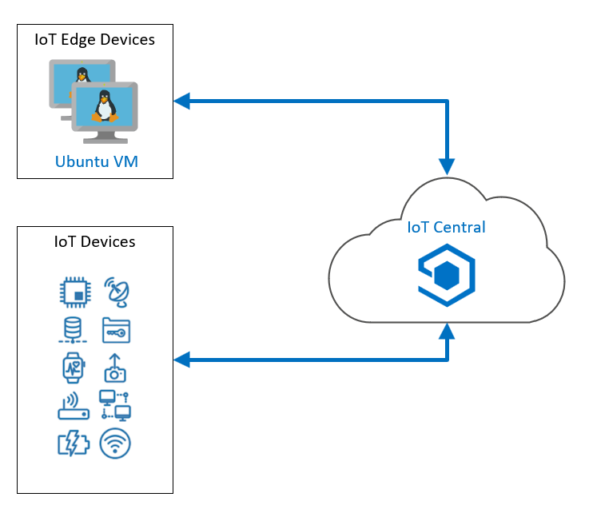

---
lab:
    title: 'Lab 20: Build with IoT Central'
    module: 'Module 12: Build with IoT Central'
---

# Create your first Azure IoT Central App

Azure IoT Services and technologies work great and are easy to manage when you have the team of people, but a full IoT solution architecture can be a lot for a small, less specialized team to implement and support. Azure IoT Central is a SaaS application that encompasses a full range of underlying IoT technologies, including Azure IoT Hub, Azure Device Provisioning System (DPS), Azure Maps, Azure Time Series Insights, Azure IoT Edge, and others. Although IoT Central does not provide the level of granularity that you get when you implement these technologies directly, it does enable a smaller team to easily manage and monitor a fleet of remote devices.

Among other things, this lab will help you to decide when IoT Central is the right tool to support a particular scenario. So, get ready to explore what IoT Central can do.

## Lab Scenario

Contoso operates a fleet of refrigerated trucks that are used to deliver cheese within a city and the surrounding area. You have a large number of customers in the region and use a centralized location in the city to operate the fleet. Each day, the trucks are loaded with products and the driver is given a delivery route by the dispatcher. The system works great and there are seldom issues. However, if the cooling system on a truck fails, the drivers and dispatcher needs discuss how best to proceed. The dispatcher will either have the products returned to the warehouse for inspection, or delivered to a customer location that is close by the vehicle's current location. The amount of product remaining undelivered on the truck as well as the temperature in the refrigeration area are both factors in the decision.

In order to make an informed decision, the driver and dispatcher need up-to-date information about the truck and the products that it is carrying. They need to know the location of each truck on a map, the status of the truck's cooling system, and the status of the truck's cargo.

IoT Central provides everything that you will need to handle this scenario.

The following resources will be created:



## In This Lab

In this lab, you will complete the following activities:

* Create an Azure IoT Central custom app, using the IoT Central portal
* Create a device template for a custom device, using the IoT Central portal
* Create a programming project to simulate a refrigerated truck, with routes selected by Azure Maps, using Visual Studio Code, or Visual Studio
* Monitor and command the simulated device, from an IoT Central dashboard

## Lab Instructions

### Exercise 1: Create and Configure Azure IoT Central

#### Task 1: Create the initial IoT Central app

1. Navigate to [Azure IoT Central](https://apps.azureiotcentral.com/?azure-portal=true).

    It's a good idea to bookmark this URL, as it's the home for all your IoT Central apps.

1. Take a minute to scroll down and read the contents of this home page.

1. On the left side navigation menu, click **Build**.

    Notice that there are several options that provide a more advanced starting point for certain scenarios.

1. Under **Featured**, click **Custom apps**.

1. On the **New application** page, under **Application name**, enter **Refrigerated-Trucks-{your-id}**.

    Notice that the Application name that you enter is being used as the root for your application URL (converted to lower-case).

    Although your Application name can be any friendly name, the **URL** _must_ be unique. The two don't have to match exactly, but it can be less confusing when they do.

    Appending `{your-id}` to the Application name helps to ensure that the URL will be unique.

1. Under **Application template**, leave the default **Custom application** value.

1. Take a minute to review the fields under **Billing info**.

    The **Directory** field is used to specify an Azure Active Directory tenant. If your organization uses an AAD tenant, you would specify that here. For this course we will leave the default.

    If you select a pricing option that includes a cost, you would need to specify an Azure subscription.

1. Under **Pricing plan**, click **Free**.

    Notice that the free option provides a 7 day trial and includes 5 free devices. The **Billing info** section has also been updated for **Contact info** instead.

1. Under **Contact info**, provide your contact information within each of the required fields.

    > **Note**: There is no commitment or termination fees associated with the plan. The **Build** page includes a link to [Get pricing details](https://aka.ms/iotcentral-pricing) if you are interested in reading more about IoT Central pricing.

1. At the bottom of the page, click **Create**.

    Wait a few seconds while the app resource is built, then you should see a **Dashboard** with a few default links.

1. Close the Azure IoT Central browser tab.

    The next time you open the Azure IoT Central home page, you will select **My apps** from the left side navigation menu, and your  **Refrigerated-Trucks-{your-id}** app will be listed.

1. Use your browser to open [Azure IoT Central](https://apps.azureiotcentral.com/?azure-portal=true).

1. On the left side navigation menu, click **My apps**, and then click **Refrigerated-Trucks-{your-id}**.

    Your next step is to specify a _device template_.

#### Task 2: Create a device template

The data that will be communicated between a remote device and IoT Central is specified in a _device template_. The device template encapsulates all the details of the data, so that both the device and IoT Central have all they need to make sense of the communication.

1. On the **Dashboard** page of your Azure IoT Central app, on the left side navigation menu under **App settings**, click **Device templates**.

1. Under **Device templates**, click **+ New**.

    You should see a range of custom and preconfigured device template options.

    > **TIP**: Take note of the preconfigured options. You may want to use one of these preconfigured device templates for a future project if you have the associated hardware.

1. Under **Create a custom device template**, click **IoT device**.

1. At the bottom of the page, click **Next: Customize**

1. In the **Enter a device template name** textbox, enter **RefrigeratedTruck** and then press **Enter**.

    > **Note**: do not select **Gateway device**.

1. At the bottom of the page, click **Next: Review**.

    Verify the **Basic Info** shown.

1. At the bottom of the **Review** page, click **Create**.

    Once the template has been created, the **RefrigeratedTruck** page will be displayed.

1. On the **RefrigeratedTruck** page, under **Create a capability model**, click **Custom**.

    You are now ready to add the specifics of the device template.

#### Task 3: Add sensor telemetry

Telemetry is the data values transmitted by sensors. The most important sensor in our refrigerated truck, monitors the temperature of the contents.

1. On the **RefrigeratedTruck** device template page, click **+ Add interface**, and then click **Custom**

    An interface defines a set of _capabilities_. To define the capabilities of your refrigerated truck you will be adding quite a few interfaces.

    The Custom interface allows you to start building from a blank interface.

1. Under **Capabilities**, click **+ Add capability**

1. Take a moment to examine the types of fields that are available.

1. To define a capability for the truck's temperature sensor, enter the following field values:

    | Field | Value |
    | --- | --- |
    | Display Name | Contents temperature |
    | Name | ContentsTemperature |
    | Capability Type | Telemetry |
    | Semantic type | Temperature |
    | Schema | Double |
    | Unit | <sup>o</sup>C |

1. Take a minute to double-check the information that you entered.

    > **IMPORTANT**:
    > The code that you will be adding later in this lab uses the names listed above, therefor names entered for the interface must be entered _exactly_ as shown.

#### Task 4: Add state and event telemetry

States are important, they let the operator know what is going on. A state in IoT Central is a name associated with a range of values. Later in this lab, you will choose a color to associate with each state value, making them easy to identify.

1. Under **Capabilities**, click **+ Add capability**.

1. To define a capability for the truck's cargo state, enter the following field values:

    | Field | Value |
    | --- | --- |
    | Display Name | Contents state |
    | Name | ContentsState |
    | Capability Type | Telemetry |
    | Semantic type | State |
    | Value schema | String |

1. Under **Value schema**, notice the message informing you that **Complex type has to be defined**.

    To simplify the lab scenario, you will define the truck's cargo state as one of the following: _empty_, _full_, or _melting_.

1. Under the **Complex type has to be defined** message, click **+**.

1. Under **Display name**, enter **empty**

    The **Name** field should automatically be populated with **empty**.

1. Under **Value**, enter **empty**

    All three fields should contain **empty**.

1. Directly below the fields that you just entered, click **+**.

1. Use the process above to add two more state values: **full** and **melting**.

    Again, the same text should appear in the **Display name**, **Name**, and **Value** fields for each of the additional state value options.

1. Carefully check each capability before moving on.

    Now, to add some uncertainty to our simulation, let's add a failure state for the truck's cooling system. If the cooling system fails, as you'll see later in this lab, the chances of the contents "melting" increase considerably! You will add _on_, _off_ and _failed_ entries for the truck's cooling system.

1. On the **RefrigeratedTruck** device template page, under **Capabilities**, click **+ Add capability**.

1. To define a capability for the truck's cooling system state, enter the following field values:

    | Field | Value |
    | --- | --- |
    | Display Name | Cooling system state |
    | Name | CoolingSystemState |
    | Capability Type | Telemetry |
    | Semantic type | State |
    | Value schema | String |

1. Under the **Complex type has to be defined** message, click **+**, and then use the same process that you used above to add the following state value options:

    * on
    * off
    * failed

    Make sure that the three state value options (on, off, failed) are repeated in all three **Display name**, **Name**, and **Value** fields.

    The truck itself will need an even more complex state defined. If all goes well, a truck's normal routing might be: _ready_, _enroute_, _delivering_, _returning_, _loading_, and the back to _ready_ again. However, you will include a _dumping_ state to cater for when melted contents need to be taken back to the warehouse for inspection (and potentially disposed of).

1. Using the same process that you used to define the previous state capabilities, create a new capability as follows:

    | Field | Value |
    | --- | --- |
    | Display Name | Truck state |
    | Name | TruckState |
    | Capability Type | Telemetry |
    | Semantic type | State |
    | Value schema | String |

    For the state value options, use the following:

    * ready
    * enroute
    * delivering
    * returning
    * loading
    * dumping

    The next capability type that you need to specify is an Event. Events are issues triggered by the device, and communicated to the IoT Central app. Events can be one of three types: _Error_, _Warning_, or _Informational_.

1. To create an event capability, click **+ Add capability**, and then create a new capability as follows:

    | Field | Value |
    | --- | --- |
    | Display Name | Event |
    | Name | Event |
    | Capability Type | Telemetry |
    | Semantic type | Event |
    | Schema | String |

    One possible event a device might trigger is a conflicting command. An example might be a truck is returning empty from a customer, but receives a command to deliver its contents to another customer. If a conflict occurs, it's a good idea for the device to trigger an event to warn the operator of the IoT Central app.

    Another event might be just to acknowledge, and record, the customer ID that a truck is to deliver to.

#### Task 5: Add location telemetry

A location is probably the most important, and yet one of the easiest measurements to add to a device template. Under the hood, it consists of a latitude, longitude, and an optional altitude, for the device.

1. To create a location capability, click **+ Add capability**, and then create a new capability as follows:

    | Field | Value |
    | --- | --- |
    | Display Name | Location |
    | Name | Location |
    | Capability Type | Telemetry |
    | Semantic type | Location |
    | Schema | Geopoint |

#### Task 6: Add properties

A property of a device is typically a constant value, that is communicated to the IoT Central app when communication is first initiated. In the refrigerated truck scenario, a good example of a property is the license plate of the truck, or some similar unique truck ID.

Properties can also be used for device configuration data. You will be defining an _optimal temperature_ for the truck contents as a property. This optimal temperature might change with different types of content, different weather conditions, or whatever might be appropriate. A setting has an initial default value, which may not need to be changed, but the ability to change it easily and quickly is there, if needed. This kind of property is called a _writable property_.

A property is a single value. If more complex sets of data need to be transmitted to a device, a Command (see below) is the more appropriate way of handling it.

1. To create a property capability for the truck ID, click **+ Add capability**, and then create a new capability as follows:

    | Field | Value |
    | --- | --- |
    | Display Name | Truck ID |
    | Name | TruckID |
    | Capability Type | Property |
    | Semantic type | None |
    | Schema | String |
    | Writable | Off |
    | Unit | None |

1. To create a property capability for the optimal temperature, click **+ Add capability**, and then create a new capability as follows:

    | Field | Value |
    | --- | --- |
    | Display Name | Optimal Temperature |
    | Name | OptimalTemperature |
    | Capability Type | Property |
    | Semantic type | None |
    | Schema | Double |
    | Writable | On |
    | Unit |  <sup>o</sup>C  |

#### Task 7: Add commands

Commands are sent by the operator of the IoT Central app to the remote devices. Commands are similar to writable properties, but a command can contain any number of input fields, whereas a writable property is limited to a single value.

For refrigerated trucks, there are two commands you should add: a command to deliver the contents to a customer, and a command to recall the truck to base.

1. To create a command capability to deliver the contents to a customer, click **+ Add capability**, and then create a new capability as follows:

    | Field | Value |
    | --- | --- |
    | Display Name | Go to customer |
    | Name | GoToCustomer |
    | Capability Type | Command |
    | Command | Synchronous |

1. Under **Command**, click **Request**.

    When you turn on the **Request** option, you'll be able to enter more details of the command.

1. To complete the **Request** portion of the command capability, enter field values as follows:

    | Field | Value |
    | --- | --- |
    | Request | On |
    | Display name | Customer ID |
    | Name | CustomerID |
    | Schema | Integer |
    | Unit | None |

1. To create a command capability for recalling the truck, click **+ Add capability**, and then create a new capability as follows:

    | Field | Value |
    | --- | --- |
    | Display Name | Recall |
    | Name | Recall |
    | Capability Type | Command |
    | Command | Synchronous |

    For this command there are no additional parameters, so leave **Request** off.

1. Near the top of the page, click **Save**.

    Before going any further carefully double check your interface. After an interface has been published, there are very limited editing options. It's important to get it right before publishing.

    If you click on the name of the device template, in the menu that ends with the **Views** option, you'll get a summary of the capabilities.

#### Task 8: Publish the template

1. If you've made any changes since the last time you saved, click **Save**.

1. in the top right corner of your **RefrigeratedTruck** device template, click **Publish**.

    > **Note**: If a popup dialog appears asking for confirmation, click **Publish**.

    You should see that the annotation changes from **Draft** to **Published**.

Preparing a device template does take some care and some time.

In the next Exercise, you will use the capabilities of your device template to prepare a controllers dashboard. Preparing views can be done before, or after, a device template is published.

### Exercise 3: Monitor a Simulated Device

To begin this exercise, you will create a dashboard showing all the capabilities of the device template. After that you will use your device template to create a device, and make a record of the connection settings needed for the remote device app.

#### Task 1: Create a rich dashboard

1. On the left menu of the **RefrigeratedTruck** device template, click **Views**, and then click **Visualizing the device**.

1. Take a moment to review the list of available **Telemetry**, **Properties**, and **Commands**.

    These are the capabilities that you created, each with a selection check box.

1. Under **Telemetry**, click **Location**, an then click **Add tile**.

    Dashboards are constructed using tiles, and the tiles that you choose can be arranged and resized. The Location tile will show the location of the truck on a map of the world, and by creating it first, there is plenty of room for you to resize the map.

1. Hover your mouse pointer over the lower-right corner of the tile, and then drag the corner so that the tile height and width are about twice the default size.

1. Under **View name**, enter **Truck view**.

1. Under **Telemetry**, click **Contents state**, and then click **Add tile**.

1. Repeat the previous step for each of the remaining Telemetry capabilities, working from the top down.

    Recall that you've already added the Location tile.

1. Use the same top-down process to add the Properties capabilities.

    You will have a chance to arrange the tiles on your dashboard later later in the lab. For now, you just want a dashboard that will confirm all the telemetry being sent from your remote device.

    There's no need to add the commands to the dashboard, though that option does exist.

1. Take a minute to review your dashboard.

    Scroll around to view your dashboard. Examine the contents of the tiles and consider how you might use that information.

1. Quickly arrange the position of the tiles.

    Don't spend too much time on this now, but notice that you can drag tiles around, and that the portal will try to rearrange them neatly.

1. Click **Save**, and then click **Publish**.

    Notice that the publish dialog now shows **Yes** next to **Views**.

1. On the publish dialog, click **Publish**.

You can create as many views as you need, giving each a friendly name.

In the next Task, you will be creating a device from the device template.

#### Task 2: Create a real device

IoT Central can be connected to physical devices with real sensors, or to simulated devices that generate data based on an algorithm. In both of these cases, IoT Central understands that a remote app is generating the telemetry data, and either way it treats the connected device as a "real" device.

1. On the left side navigation menu, click **Devices**.

1. On the **Devices** menu, under **All devices**, click **RefrigeratedTruck**

    Notice that the screen refreshed and that the device template you selected is now shown in bold text. If you had a large number of device templates, this would help you to ensure that you're using the correct device template.

1. On the top menu, click **+ New**.

1. On the **Create new device** dialog, under **Device name**, verify that **RefrigeratedTruck** is listed as a prefix.

    This is another opportunity to ensure that you've selected the right device template.

1. Under **Device ID**, enter **RefrigeratedTruck1**

1. Under **Device name**, enter **RefrigeratedTruck - 1**

1. Under **Simulated**, ensure that **Off** is selected.

    Recall that IoT Central treats the connection to physical and simulated devices in the same way. Both are remote apps, and both are real. You will be building a real truck here. Well, a simulated _real_ truck!

    Setting this Simulated value to **On** would instruct IoT Central to pump out random values for your telemetry. These random values can be useful in validating a device template, but in this lab you will be simulating the telemetry with you own simulated device (truck).

1. On the **Create new device** dialog, click **Create**.

    Wait a few seconds, then your device list should be populated with a single entry.

    Notice that the **Device status** is set to **Registered**. The IoT Central app will only accept a connection to a device when the **Device status** is **Provisioned**. Later in this lab there's a coding task that shows you how to provision a device.

1. Under **Device name**, click **RefrigeratedTruck - 1**.

    Your live dashboard should be displayed (with lots of **Waiting for data** messages).

1. Just below the **RefrigeratedTruck - 1** title of your device dashboard, click **Commands**

    Notice that the two commands you entered are already listed and ready to be run.

Your next step will be to create the keys that will allow a remote device to communicate with your IoT Central app.

#### Task 3: Record the connection keys

1. On the top-right menu, click **Connect**.

    Do _not_ click **Attach to gateway**.

1. In the **Device connection** dialog, carefully copy the values of **ID scope**, **Device ID**, and **Primary key**, and save them to a text file named **Truck-connections.txt**.

    Use Notepad (or another text editor) to save the values to a text file, providing a meaningful name such as Truck-connections.txt.

1. Under **Connect method**, ensure that **Shared access signature (SAS)** is selected.

1. At he bottom of the dialog, click **Close**.

Leave the IoT portal open in your browser, waiting as it is.

### Exercise 4: Create a free Azure Maps account

If you do not already have an Azure Maps account, you will need to create one.

1. Open a new browser tab, and then navigate to [Azure Maps](https://azure.microsoft.com/services/azure-maps/?azure-portal=true).

1. To create a free account, in the upper right corner, click **Start free**, and then follow the instructions provided.

    > **Note**: You can use the Subscription and Resource Group that you have been using for this course to create your Azure Maps account, and use AZ-220-MAPS for the name of the Account, and Standard S1 for the pricing tier.

1. Once your Azure Maps account is created, copy the Azure Maps account subscription key (Primary Key) to the Truck-connections.txt text file.

    If you used the Azure Subscription that you are using for this course to create your Azure Maps account, you can find the Primary Key for the account in the Azure portal as follows: Open the Azure Maps (AZ-220-MAPS) blade, then open the Authentication pane. You will see the the Primary Key listed.

    > **Note**: If you want to verify that your Primary Key (for Azure Maps) is correct/working. Save the following HTML to an .html file. Replace the `'<your Azure Maps subscription key>'` placeholder with the value of your Primary Key, and then load the file into a web browser. You should see a map of the world displayed.

    ```html
    <!DOCTYPE html>
    <html>

    <head>
        <title>Map</title>
        <meta charset="utf-8">
        <meta name="viewport" content="width=device-width, initial-scale=1, shrink-to-fit=no">

        <!-- Add references to the Azure Maps Map control JavaScript and CSS files. -->
        <link rel="stylesheet" href="https://atlas.microsoft.com/sdk/javascript/mapcontrol/2/atlas.min.css" type="text/css">
        <script src="https://atlas.microsoft.com/sdk/javascript/mapcontrol/2/atlas.min.js"></script>

        <!-- Add a reference to the Azure Maps Services lab JavaScript file. -->
        <script src="https://atlas.microsoft.com/sdk/javascript/mapcontrol/2/atlas-service.min.js"></script>

        <script>
            function GetMap() {
                //Instantiate a map object
                var map = new atlas.Map("myMap", {
                    //Add your Azure Maps subscription key to the map SDK. Get an Azure Maps key at https://azure.com/maps
                    authOptions: {
                        authType: 'subscriptionKey',
                        subscriptionKey: '<your Azure Maps subscription key>'
                    }
                });
            }
        </script>
        <style>
            html,
            body {
                width: 100%;
                height: 100%;
                padding: 0;
                margin: 0;
            }

            #myMap {
                width: 100%;
                height: 100%;
            }
        </style>
    </head>

    <body onload="GetMap()">
        <div id="myMap"></div>
    </body>

    </html>
    ```

You've now completed the preparatory steps of connecting your first IoT Central app to real devices. Good work!

The next step is to create the device app.

### Exercise 5: Create a Programming Project for a Real Device

In this task, you are going to create a programming project to simulate a sensor device in a refrigerated truck. This simulation enables you to test the code long before requiring a physical device.

IoT Central treats this simulation as "real" because the communication code between the device app and the IoT Central app is the same as it would be for a physical device/truck. In other words, if you do run a refrigerated truck company, you would start with simulated code similar to the code in this task. After you verify that the code works to your satisfaction, the simulation-specific code would be replaced with code that receives sensor data. This limited update makes writing the following code a valuable experience.

#### Task 1: Create the device app

Using Visual Studio Code, build the device sensor app.

1. Open a new instance of Visual Studio Code.

1. On the **File** menu, click **Open Folder**.

1. At the top of the **Open Folder** dialog, click **New folder**, type **RefrigeratedTruck** and then press **Enter**.

    You can create the RefrigeratedTruck folder under the Lab 20 folder for this course, or another location of your choice.

1. Click **RefrigeratedTruck**, and then click **Select Folder**.

    The Visual Studio Code EXPLORER pane should now be open.

1. On the **View** menu, to open the integrated terminal, click **Terminal**.

    You should see RefrigeratedTruck folder listed in terminal command prompt. This is important because the following commands will run in the current folder.

1. At the Terminal command prompt, to create a new console app, enter the following command:

    ```cmd/sh
    dotnet new console
    ```

    This command creates a Program.cs file in your folder, along with a project file.

1. At the Terminal command prompt, to ensure that your app has access to required .NET packages, enter the following command:

    ```cmd/sh
    dotnet restore
    ```

1. At the Terminal command prompt, to install the required libraries, enter the following commands:

    ```CLI
    dotnet add package AzureMapsRestToolkit
    dotnet add package Microsoft.Azure.Devices.Client
    dotnet add package Microsoft.Azure.Devices.Provisioning.Client
    dotnet add package Microsoft.Azure.Devices.Provisioning.Transport.Mqtt
    dotnet add package System.Text.Json
    ```

1. In the **EXPLORER** pane, click **Program.cs**

1. In the code editor pane, delete the contents of the Program.cs file.

You are now ready to add the code below.

#### Task 2: Write the device app

In this task, you will build the simulated device app for your Refrigerated Truck one section at a time. A brief explanation for each section is provided.

To make this process as simple as possible, each additional section of code should be appended to the end of the file, in the order listed here.

> **Note**:
> If you would like to skip this task, and load all of the code into your app, then download and copy all of the contents of Program.cs from [MicrosoftDocs/mslearn-your-first-iot-central-app](https://github.com/MicrosoftDocs/mslearn-your-first-iot-central-app) into the Program.cs file of your project. If you copy this code (and replace the connection and subscription strings) then go straight to the next task, and start testing!

1. In the Code Editor pane, to add the required `using` statements, enter the following code:

   ```cs
    using System;
    using System.Text.Json;
    using System.Text;
    using System.Threading;
    using System.Threading.Tasks;
    using Microsoft.Azure.Devices.Client;
    using Microsoft.Azure.Devices.Shared;
    using Microsoft.Azure.Devices.Provisioning.Client;
    using Microsoft.Azure.Devices.Provisioning.Client.Transport;
    using AzureMapsToolkit;
    using AzureMapsToolkit.Common;
    ```

    These `using` statements provide easy access to resources that the code uses, such Azure IoT Central and Azure Maps.

1. In the Code Editor pane, to add the namespace, class, and global variables, enter the following code:

   ```cs
    namespace refrigerated_truck
    {
        class Program
        {
            enum StateEnum
            {
                ready,
                enroute,
                delivering,
                returning,
                loading,
                dumping
            };
            enum ContentsEnum
            {
                full,
                melting,
                empty
            }
            enum FanEnum
            {
                on,
                off,
                failed
            }

            // Azure maps service globals.
            static AzureMapsServices azureMapsServices;

            // Telemetry globals.
            const int intervalInMilliseconds = 5000;        // Time interval required by wait function.

            // Refrigerated truck globals.
            static int truckNum = 1;
            static string truckIdentification = "Truck number " + truckNum;

            const double deliverTime = 600;                 // Time to complete delivery, in seconds.
            const double loadingTime = 800;                 // Time to load contents.
            const double dumpingTime = 400;                 // Time to dump melted contents.
            const double tooWarmThreshold = 2;              // Degrees C that is too warm for contents.
            const double tooWarmtooLong = 60;               // Time in seconds for contents to start melting if temps are above threshold.


            static double timeOnCurrentTask = 0;            // Time on current task in seconds.
            static double interval = 60;                    // Simulated time interval in seconds.
            static double tooWarmPeriod = 0;                // Time that contents are too warm in seconds.
            static double tempContents = -2;                // Current temp of contents in degrees C.
            static double baseLat = 47.644702;              // Base position latitude.
            static double baseLon = -122.130137;            // Base position longitude.
            static double currentLat;                       // Current position latitude.
            static double currentLon;                       // Current position longitude.
            static double destinationLat;                   // Destination position latitude.
            static double destinationLon;                   // Destination position longitude.

            static FanEnum fan = FanEnum.on;                // Cooling fan state.
            static ContentsEnum contents = ContentsEnum.full;    // Truck contents state.
            static StateEnum state = StateEnum.ready;       // Truck is full and ready to go!
            static double optimalTemperature = -5;         // Setting - can be changed by the operator from IoT Central.

            const string noEvent = "none";
            static string eventText = noEvent;              // Event text sent to IoT Central.

            static double[,] customer = new double[,]
            {
                // Lat/lon position of customers.
                // Gasworks Park
                {47.645892, -122.336954},

                // Golden Gardens Park
                {47.688741, -122.402965},

                // Seward Park
                {47.551093, -122.249266},

                // Lake Sammamish Park
                {47.555698, -122.065996},

                // Marymoor Park
                {47.663747, -122.120879},

                // Meadowdale Beach Park
                {47.857295, -122.316355},

                // Lincoln Park
                {47.530250, -122.393055},

                // Gene Coulon Park
                {47.503266, -122.200194},

                // Luther Bank Park
                {47.591094, -122.226833},

                // Pioneer Park
                {47.544120, -122.221673 }
            };

            static double[,] path;                          // Lat/lon steps for the route.
            static double[] timeOnPath;                     // Time in seconds for each section of the route.
            static int truckOnSection;                      // The current path section the truck is on.
            static double truckSectionsCompletedTime;       // The time the truck has spent on previous completed sections.
            static Random rand;

            // IoT Central global variables.
            static DeviceClient s_deviceClient;
            static CancellationTokenSource cts;
            static string GlobalDeviceEndpoint = "global.azure-devices-provisioning.net";
            static TwinCollection reportedProperties = new TwinCollection();

            // User IDs.
            static string ScopeID = "<your Scope ID>";
            static string DeviceID = "<your Device ID>";
            static string PrimaryKey = "<your device Primary Key>";
            static string AzureMapsKey = "<your Azure Maps Subscription Key>";
    ```

    Although there is more code to add, now is a good time to replace the placeholder values that you just entered. They should all be available in the text file that you have been adding to during the lab.

1. Open the text file containing the RefrigeratorTruck1 and Azure Maps Account information that you saved previously.

1. In the Code Editor pane, replace the placeholder values with the corresponding values from your text file.

    With these values updated in your code, you can get back to building the app.

1. In the Code Editor pane, to add the methods that will be used to get a route via Azure Maps, enter the following code:

   ```cs
            static double Degrees2Radians(double deg)
            {
                return deg * Math.PI / 180;
            }

            // Returns the distance in meters between two locations on Earth.
            static double DistanceInMeters(double lat1, double lon1, double lat2, double lon2)
            {
                var dlon = Degrees2Radians(lon2 - lon1);
                var dlat = Degrees2Radians(lat2 - lat1);

                var a = (Math.Sin(dlat / 2) * Math.Sin(dlat / 2)) + Math.Cos(Degrees2Radians(lat1)) * Math.Cos(Degrees2Radians(lat2)) * (Math.Sin(dlon / 2) * Math.Sin(dlon / 2));
                var angle = 2 * Math.Atan2(Math.Sqrt(a), Math.Sqrt(1 - a));
                var meters = angle * 6371000;
                return meters;
            }

            static bool Arrived()
            {
                // If the truck is within 10 meters of the destination, call it good.
                if (DistanceInMeters(currentLat, currentLon, destinationLat, destinationLon) < 10)
                    return true;
                return false;
            }

            static void UpdatePosition()
            {
                while ((truckSectionsCompletedTime + timeOnPath[truckOnSection] < timeOnCurrentTask) && (truckOnSection < timeOnPath.Length - 1))
                {
                    // Truck has moved onto the next section.
                    truckSectionsCompletedTime += timeOnPath[truckOnSection];
                    ++truckOnSection;
                }

                // Ensure remainder is 0 to 1, as interval may take count over what is needed.
                var remainderFraction = Math.Min(1, (timeOnCurrentTask - truckSectionsCompletedTime) / timeOnPath[truckOnSection]);

                // The path should be one entry longer than the timeOnPath array.
                // Find how far along the section the truck has moved.
                currentLat = path[truckOnSection, 0] + remainderFraction * (path[truckOnSection + 1, 0] - path[truckOnSection, 0]);
                currentLon = path[truckOnSection, 1] + remainderFraction * (path[truckOnSection + 1, 1] - path[truckOnSection, 1]);
            }

            static void GetRoute(StateEnum newState)
            {
                // Set the state to ready, until the new route arrives.
                state = StateEnum.ready;

                var req = new RouteRequestDirections
                {
                    Query = FormattableString.Invariant($"{currentLat},{currentLon}:{destinationLat},{destinationLon}")
                };
                var directions = azureMapsServices.GetRouteDirections(req).Result;

                if (directions.Error != null || directions.Result == null)
                {
                    // Handle any error.
                    redMessage("Failed to find map route");
                }
                else
                {
                    int nPoints = directions.Result.Routes[0].Legs[0].Points.Length;
                    greenMessage($"Route found. Number of points = {nPoints}");

                    // Clear the path. Add two points for the start point and destination.
                    path = new double[nPoints + 2, 2];
                    int c = 0;

                    // Start with the current location.
                    path[c, 0] = currentLat;
                    path[c, 1] = currentLon;
                    ++c;

                    // Retrieve the route and push the points onto the array.
                    for (var n = 0; n < nPoints; n++)
                    {
                        var x = directions.Result.Routes[0].Legs[0].Points[n].Latitude;
                        var y = directions.Result.Routes[0].Legs[0].Points[n].Longitude;
                        path[c, 0] = x;
                        path[c, 1] = y;
                        ++c;
                    }

                    // Finish with the destination.
                    path[c, 0] = destinationLat;
                    path[c, 1] = destinationLon;

                    // Store the path length and time taken, to calculate the average speed.
                    var meters = directions.Result.Routes[0].Summary.LengthInMeters;
                    var seconds = directions.Result.Routes[0].Summary.TravelTimeInSeconds;
                    var pathSpeed = meters / seconds;

                    double distanceApartInMeters;
                    double timeForOneSection;

                    // Clear the time on path array. The path array is 1 less than the points array.
                    timeOnPath = new double[nPoints + 1];

                    // Calculate how much time is required for each section of the path.
                    for (var t = 0; t < nPoints + 1; t++)
                    {
                        // Calculate distance between the two path points, in meters.
                        distanceApartInMeters = DistanceInMeters(path[t, 0], path[t, 1], path[t + 1, 0], path[t + 1, 1]);

                        // Calculate the time for each section of the path.
                        timeForOneSection = distanceApartInMeters / pathSpeed;
                        timeOnPath[t] = timeForOneSection;
                    }
                    truckOnSection = 0;
                    truckSectionsCompletedTime = 0;
                    timeOnCurrentTask = 0;

                    // Update the state now the route has arrived. One of: enroute or returning.
                    state = newState;
                }
            }
    ```

    > **Note**:
    > The key call within the code above is `var directions = azureMapsServices.GetRouteDirections(req).Result;`. The `directions` structure is complex. Consider setting a breakpoint in this method, and examining the contents of `directions`.

1. In the Code Editor pane, to add the direct method to deliver to a customer, enter the following code:

   ```cs
        static Task<MethodResponse> CmdGoToCustomer(MethodRequest methodRequest, object userContext)
        {
            try
            {
                // Pick up variables from the request payload, with the name specified in IoT Central.
                var payloadString = Encoding.UTF8.GetString(methodRequest.Data);
                int customerNumber = Int32.Parse(payloadString);

                // Check for a valid key and customer ID.
                if (customerNumber >= 0 && customerNumber < customer.Length)
                {
                    switch (state)
                    {
                        case StateEnum.dumping:
                        case StateEnum.loading:
                        case StateEnum.delivering:
                            eventText = "Unable to act - " + state;
                            break;

                        case StateEnum.ready:
                        case StateEnum.enroute:
                        case StateEnum.returning:
                            if (contents == ContentsEnum.empty)
                            {
                                eventText = "Unable to act - empty";
                            }
                            else
                            {
                                // Set event only when all is good.
                                eventText = "New customer: " + customerNumber.ToString();

                                destinationLat = customer[customerNumber, 0];
                                destinationLon = customer[customerNumber, 1];

                                // Find route from current position to destination, storing route.
                                GetRoute(StateEnum.enroute);
                            }
                            break;
                    }

                    // Acknowledge the direct method call with a 200 success message.
                    string result = "{\"result\":\"Executed direct method: " + methodRequest.Name + "\"}";
                    return Task.FromResult(new MethodResponse(Encoding.UTF8.GetBytes(result), 200));
                }
                else
                {
                    eventText = $"Invalid customer: {customerNumber}";

                    // Acknowledge the direct method call with a 400 error message.
                    string result = "{\"result\":\"Invalid customer\"}";
                    return Task.FromResult(new MethodResponse(Encoding.UTF8.GetBytes(result), 400));
                }
            }
            catch
            {
                // Acknowledge the direct method call with a 400 error message.
                string result = "{\"result\":\"Invalid call\"}";
                return Task.FromResult(new MethodResponse(Encoding.UTF8.GetBytes(result), 400));
            }
        }
    ```

    > **Note**:
    > The device responds with a conflict, if the device isn't in the correct state. The command itself is acknowledged at the end of the method. The recall command that follows in the next step handles things similarly.

1. In the Code Editor pane, to add the recall direct method, enter the following code:

   ```cs
        static void ReturnToBase()
        {
            destinationLat = baseLat;
            destinationLon = baseLon;

            // Find route from current position to base, storing route.
            GetRoute(StateEnum.returning);
        }
        static Task<MethodResponse> CmdRecall(MethodRequest methodRequest, object userContext)
        {
            switch (state)
            {
                case StateEnum.ready:
                case StateEnum.loading:
                case StateEnum.dumping:
                    eventText = "Already at base";
                    break;

                case StateEnum.returning:
                    eventText = "Already returning";
                    break;

                case StateEnum.delivering:
                    eventText = "Unable to recall - " + state;
                    break;

                case StateEnum.enroute:
                    ReturnToBase();
                    break;
            }

            // Acknowledge the command.
            if (eventText == noEvent)
            {
                // Acknowledge the direct method call with a 200 success message.
                string result = "{\"result\":\"Executed direct method: " + methodRequest.Name + "\"}";
                return Task.FromResult(new MethodResponse(Encoding.UTF8.GetBytes(result), 200));
            }
            else
            {
                // Acknowledge the direct method call with a 400 error message.
                string result = "{\"result\":\"Invalid call\"}";
                return Task.FromResult(new MethodResponse(Encoding.UTF8.GetBytes(result), 400));
            }
        }
    ```

1. In the Code Editor pane, to add the method that updates the truck simulation at each time interval, enter the following code:

   ```cs
        static double DieRoll(double max)
        {
            return rand.NextDouble() * max;
        }

        static void UpdateTruck()
        {
            if (contents == ContentsEnum.empty)
            {
                // Turn the cooling system off, if possible, when the contents are empty.
                if (fan == FanEnum.on)
                {
                    fan = FanEnum.off;
                }
                tempContents += -2.9 + DieRoll(6);
            }
            else
            {
                // Contents are full or melting.
                if (fan != FanEnum.failed)
                {
                    if (tempContents < optimalTemperature - 5)
                    {
                        // Turn the cooling system off, as contents are getting too cold.
                        fan = FanEnum.off;
                    }
                    else
                    {
                        if (tempContents > optimalTemperature)
                        {
                            // Temp getting higher, turn cooling system back on.
                            fan = FanEnum.on;
                        }
                    }

                    // Randomly fail the cooling system.
                    if (DieRoll(100) < 1)
                    {
                        fan = FanEnum.failed;
                    }
                }

                // Set the contents temperature. Maintaining a cooler temperature if the cooling system is on.
                if (fan == FanEnum.on)
                {
                    tempContents += -3 + DieRoll(5);
                }
                else
                {
                    tempContents += -2.9 + DieRoll(6);
                }

                // If the temperature is above a threshold, count the seconds this is occurring, and melt the contents if it goes on too long.
                if (tempContents >= tooWarmThreshold)
                {
                    // Contents are warming.
                    tooWarmPeriod += interval;

                    if (tooWarmPeriod >= tooWarmtooLong)
                    {
                        // Contents are melting.
                        contents = ContentsEnum.melting;
                    }
                }
                else
                {
                    // Contents are cooling.
                    tooWarmPeriod = Math.Max(0, tooWarmPeriod - interval);
                }
            }

            timeOnCurrentTask += interval;

            switch (state)
            {
                case StateEnum.loading:
                    if (timeOnCurrentTask >= loadingTime)
                    {
                        // Finished loading.
                        state = StateEnum.ready;
                        contents = ContentsEnum.full;
                        timeOnCurrentTask = 0;

                        // Turn on the cooling fan.
                        // If the fan is in a failed state, assume it has been fixed, as it is at the base.
                        fan = FanEnum.on;
                        tempContents = -2;
                    }
                    break;

                case StateEnum.ready:
                    timeOnCurrentTask = 0;
                    break;

                case StateEnum.delivering:
                    if (timeOnCurrentTask >= deliverTime)
                    {
                        // Finished delivering.
                        contents = ContentsEnum.empty;
                        ReturnToBase();
                    }
                    break;

                case StateEnum.returning:

                    // Update the truck position.
                    UpdatePosition();

                    // Check to see if the truck has arrived back at base.
                    if (Arrived())
                    {
                        switch (contents)
                        {
                            case ContentsEnum.empty:
                                state = StateEnum.loading;
                                break;

                            case ContentsEnum.full:
                                state = StateEnum.ready;
                                break;

                            case ContentsEnum.melting:
                                state = StateEnum.dumping;
                                break;
                        }
                        timeOnCurrentTask = 0;
                    }
                    break;

                case StateEnum.enroute:

                    // Move the truck.
                    UpdatePosition();

                    // Check to see if the truck has arrived at the customer.
                    if (Arrived())
                    {
                        state = StateEnum.delivering;
                        timeOnCurrentTask = 0;
                    }
                    break;

                case StateEnum.dumping:
                    if (timeOnCurrentTask >= dumpingTime)
                    {
                        // Finished dumping.
                        state = StateEnum.loading;
                        contents = ContentsEnum.empty;
                        timeOnCurrentTask = 0;
                    }
                    break;
            }
        }
    ```

    > **Note**:
    > This function is called every time interval. The actual time interval is set at 5 seconds, though the _simulated time_ (the number of simulated seconds you specify that has passed each time this function is called) is set by the global `static double interval = 60`. Setting this value at 60 means the simulation runs at a rate of 60 divided by 5, or 12 times real time. To lower the simulated time, reduce `interval` to, say, 30 (for a simulation that runs at six times real-time). Setting `interval` at 5 would run the simulation in real-time. Though realistic, this speed would be a bit slow, given the real driving times to the customer destinations.

1. In the Code Editor pane, to add the methods that will send truck telemetry (and send events too, if any have occurred), enter the following code:

   ```cs
        static void colorMessage(string text, ConsoleColor clr)
        {
            Console.ForegroundColor = clr;
            Console.WriteLine(text);
            Console.ResetColor();
        }
        static void greenMessage(string text)
        {
            colorMessage(text, ConsoleColor.Green);
        }

        static void redMessage(string text)
        {
            colorMessage(text, ConsoleColor.Red);
        }

        static async void SendTruckTelemetryAsync(Random rand, CancellationToken token)
        {
            while (true)
            {
                UpdateTruck();

                // Create the telemetry JSON message.
                var telemetryDataPoint = new
                {
                    ContentsTemperature = Math.Round(tempContents, 2),
                    TruckState = state.ToString(),
                    CoolingSystemState = fan.ToString(),
                    ContentsState = contents.ToString(),
                    Location = new { lon = currentLon, lat = currentLat },
                    Event = eventText,
                };
                var telemetryMessageString = JsonSerializer.Serialize(telemetryDataPoint);
                var telemetryMessage = new Message(Encoding.ASCII.GetBytes(telemetryMessageString));

                // Clear the events, as the message has been sent.
                eventText = noEvent;

                Console.WriteLine($"\nTelemetry data: {telemetryMessageString}");

                // Bail if requested.
                token.ThrowIfCancellationRequested();

                // Send the telemetry message.
                await s_deviceClient.SendEventAsync(telemetryMessage);
                greenMessage($"Telemetry sent {DateTime.Now.ToShortTimeString()}");

                await Task.Delay(intervalInMilliseconds);
            }
        }
    ```

    > **Note**:
    > The `SendTruckTelemetryAsync` is an important function, handling the sending of telemetry, states, and events to IoT Central. Note the use of JSON strings to send the data.

1. In the Code Editor pane, to add the code that will handle settings and properties, enter the following code:

   ```cs
        static async Task SendDevicePropertiesAsync()
        {
            reportedProperties["TruckID"] = truckIdentification;
            await s_deviceClient.UpdateReportedPropertiesAsync(reportedProperties);
            greenMessage($"Sent device properties: {JsonSerializer.Serialize(reportedProperties)}");
        }
        static async Task HandleSettingChanged(TwinCollection desiredProperties, object userContext)
        {
            string setting = "OptimalTemperature";
            if (desiredProperties.Contains(setting))
            {
                BuildAcknowledgement(desiredProperties, setting);
                optimalTemperature = (int) desiredProperties[setting];
                greenMessage($"Optimal temperature updated: {optimalTemperature}");
            }
            await s_deviceClient.UpdateReportedPropertiesAsync(reportedProperties);
        }

        static void BuildAcknowledgement(TwinCollection desiredProperties, string setting)
        {
            reportedProperties[setting] = new
            {
                value = desiredProperties[setting],
                status = "completed",
                desiredVersion = desiredProperties["$version"],
                message = "Processed"
            };
        }
    ```

    You only have one setting and one property added to your app. If more are required, they are easily added.

    > **Note**:
    > This section of code is generic to most C# apps that communicate with IoT Central. To add additional properties or settings, add to `reportedProperties`, or create a new setting string, and check on `desiredProperties`, respectively. No other code changes are usually needed.

1. In the Code Editor pane, to add the `Main` function, enter the following code:

   ```cs
            static void Main(string[] args)
            {

                rand = new Random();
                colorMessage($"Starting {truckIdentification}", ConsoleColor.Yellow);
                currentLat = baseLat;
                currentLon = baseLon;

                // Connect to Azure Maps.
                azureMapsServices = new AzureMapsServices(AzureMapsKey);

                try
                {
                    using (var security = new SecurityProviderSymmetricKey(DeviceID, PrimaryKey, null))
                    {
                        DeviceRegistrationResult result = RegisterDeviceAsync(security).GetAwaiter().GetResult();
                        if (result.Status != ProvisioningRegistrationStatusType.Assigned)
                        {
                            Console.WriteLine("Failed to register device");
                            return;
                        }
                        IAuthenticationMethod auth = new DeviceAuthenticationWithRegistrySymmetricKey(result.DeviceId, (security as SecurityProviderSymmetricKey).GetPrimaryKey());
                        s_deviceClient = DeviceClient.Create(result.AssignedHub, auth, TransportType.Mqtt);
                    }
                    greenMessage("Device successfully connected to Azure IoT Central");

                    SendDevicePropertiesAsync().GetAwaiter().GetResult();

                    Console.Write("Register settings changed handler...");
                    s_deviceClient.SetDesiredPropertyUpdateCallbackAsync(HandleSettingChanged, null).GetAwaiter().GetResult();
                    Console.WriteLine("Done");

                    cts = new CancellationTokenSource();

                    // Create a handler for the direct method calls.
                    s_deviceClient.SetMethodHandlerAsync("GoToCustomer", CmdGoToCustomer, null).Wait();
                    s_deviceClient.SetMethodHandlerAsync("Recall", CmdRecall, null).Wait();

                    SendTruckTelemetryAsync(rand, cts.Token);

                    Console.WriteLine("Press any key to exit...");
                    Console.ReadKey();
                    cts.Cancel();
                }
                catch (Exception ex)
                {
                    Console.WriteLine();
                    Console.WriteLine(ex.Message);
                }
            }


            public static async Task<DeviceRegistrationResult> RegisterDeviceAsync(SecurityProviderSymmetricKey security)
            {
                Console.WriteLine("Register device...");

                using (var transport = new ProvisioningTransportHandlerMqtt(TransportFallbackType.TcpOnly))
                {
                    ProvisioningDeviceClient provClient =
                              ProvisioningDeviceClient.Create(GlobalDeviceEndpoint, ScopeID, security, transport);

                    Console.WriteLine($"RegistrationID = {security.GetRegistrationID()}");

                    Console.Write("ProvisioningClient RegisterAsync...");
                    DeviceRegistrationResult result = await provClient.RegisterAsync();

                    Console.WriteLine($"{result.Status}");

                    return result;
                }
            }
        }
    }
    ```

    > **Note**:
    > Direct methods are set in the client using statements such as `s_deviceClient.SetMethodHandlerAsync("cmdGoTo", CmdGoToCustomer, null).Wait();`.

1. On the **File** menu, click **Save**.

    With your simulated device app complete, you can now start thinking about testing your code.

### Exercise 6: Test Your IoT Central Device

In this exercise, you finally get to check whether all the moving parts you've created will work together as intended.

To fully test the refrigerated truck device, it helps to break down the testing into a number of discreet checks:

* The device app connects to Azure IoT Central.

* The telemetry functions send data on the specified interval.

* The data is picked up correctly by IoT Central.

* The command to send the truck to a specified customer works as expected.

* The command to recall the truck works as expected.

* Check customer and conflict events are transmitted correctly.

* Check the truck properties, and change the optimal temperature.

In addition to this list, there are edge-cases you could also investigate. One such case is what happens when the truck's contents start to melt? This state is left up to chance in our simulation, with the use of random numbers in our code in the previous task.

#### Task 1: Prepare IoT Central and Your Simulated Device

1. Ensure that your Azure IoT Central app is open in a browser.

    Before you begin testing the connection between IoT Central and your device, ensure that your Azure IoT Central app is open in a browser. You left the app open to the Commands tab of your RefrigeratedTruck - 1 dashboard. If needed, you can reopen [Azure IoT Central](https://apps.azureiotcentral.com/?azure-portal=true) in a browser.

1. In Visual Studio Code, the Terminal command prompt, enter the following command:

    ```cmd/sh
    dotnet run
    ```

1. Examine the output being sent to the Terminal pane.

    You should see output displayed to the Terminal console, with the text: **Starting Truck number 1**.

1. Verify that the text: **Starting Truck number 1** is displayed.

    > **Note**: If everything is working as expected, you will be able to check off several of the defined test cases very quickly.

    You will continue to monitor the Terminal pane for the upcoming tasks.

#### Task 2: Confirm the device app connects to Azure IoT Central

1. Verify that **Device successfully connected to Azure IoT Central** appears the Terminal pane.

    If one of the next lines on the console is **Device successfully connected to Azure IoT Central** you've made the connection. If you do not get this message, it usually means either the IoT Central app isn't running, or the connection key strings aren't correct.

1. Verify that the "connected" message is followed by text verifying the settings and properties were sent successfully.

    If all is going well, continue to the second test (Task 3).

#### Task 3: Confirm the telemetry functions send data on the specified interval

1. Verify that telemetry data is being sent.

    A console message should appear every five seconds, with the contents temperature.

1. Watch the telemetry for a short while, and mentally prepare for the main test of this lab!

#### Task 4: Confirm the data is picked up correctly by IoT Central

1. Switch to the browser window containing your Azure IoT Central app.

1. On your **RefrigeratedTruck - 1** dashboard, click **Truck view**.

    If your RefrigeratedTruck device is not selected in IoT Central, perform the following:

    * on the left side navigation menu, click **Devices**.
    * in the list of devices, double-click **RefrigeratedTruck - 1**.
    * on your dashboard, ensure that **Truck view** is selected.

1. Verify that data is being on your **RefrigeratedTruck - 1** dashboard.

    For example, the Truck ID tile should show "Truck number 1", and the Truck state tile should display "ready" and a time value.

1. On your dashboard, locate the **Contents temperature** tile.

    > **Note**: After a period of generally acceptable temperatures (near zero degrees C), numbers will begin to cycle upward.

1. Verify that the temperatures being sent by the device app match the data being shown in the telemetry view of the IoT Central app.

    Compare the most recent values in the Terminal pane of Visual Studio Code with the most recent values displayed on the "Contents temperature" graph.

1. To verify that the truck and its contents are in the expected state, check the state tiles: **Truck state**, **Cooling system state**, and **Contents state**.

1. Check the **Location** map view for the device.

    A blue circle near Seattle, USA shows our truck ready to go. You may have to zoom out a bit.

    The truck should be located at its base, in the correct state, and waiting for a command.

    In the next task, you will complete your app testing.

#### Task 5. Confirm the command to send the truck to a specified customer works as expected

1. On your **RefrigeratedTruck - 1** dashboard, just below the dashboard title, click **Commands**.

1. Under **Customer ID**, enter **1**

    Any value of "0" through "9" is a valid customer IDs

1. To issue the command, click **Run**.

1. Switch back to **Truck view**.

    In the console for the device app, you should both see a **New customer** event, and a **Route found** message.

   > **Note**:
   > If you see a message including the text **Access denied due to invalid subscription key**, then check your subscription key to Azure Maps.

1. On the dashboard **Location** tile, verify that your truck is on its way.

    You might have to wait a short time for the two apps to sync up.

1. Verify that event text is updating in the Event tile.

1. Take a moment to watch the map update, and your truck deliver its contents.

#### Task 6. Confirm the command to recall the truck works as expected

1. Verify that when the truck returns to base and is reloaded with contents, that the Truck state is updated to **ready**.

    Try issuing another delivery command. Choose a different customer ID.

1. Issue a recall command before the truck reaches its customer.

1. Verify that the truck responds to this command.

#### Task 7. Check customer and conflict events are transmitted correctly

To test a conflict event, you can send a command that you know doesn't make sense.

1. With your truck at the base, issue a Recall command.

1. Verify that the truck responds with the "already at base" event.

#### Task 8. Check the truck properties, and change the optimal temperature

1. Verify that the **Truck ID** tile displays **Truck number 1**.

    This Property is on of the simplest things to test.

    Testing a writable property is more complex, The **OptimalTemperature** property is a writable property, so that will be the next test.

1. On the left side navigation menu, click **Jobs**.

1. Under **Jobs**, click **+ New**.

1. Under **Jobs**, to replace **Enter new job name**, enter **Set optimal temperature to -10**

1. In the **Device group** dropdown, click **RefrigeratedTruck - All devices**.

1. In the **Job type** dropdown, click **Property**.

1. In the **Name** dropdown, click **Optimal Temperature**.

1. In the **Value** textbox, enter **-10**

    When you run this job it should set the optimal temperature for all trucks in the device group, just one in our case.

1. At the top of the window, click **Run**.

1. Notice that after a short time, the **Status** of the job to change from **Pending** to **Completed**.

    This change should only take a few seconds.

1. Navigate back, via **Devices** to your dashboard.

1. Verify the **Optimal temperature** has been set to -10, in the **Optimal Temperature** tile of your dashboard.

With the testing for one truck complete, it is time to consider expanding our IoT Central system.

### Exercise 7: Create multiple devices

In this exercise, you will complete the steps required to add multiple trucks to your fleet.

#### Task 1: Add multiple devices to the IoT Central app

1. Ensure that your IoT Central app is open.

    If necessary, open the [Azure IoT Central](https://apps.azureiotcentral.com/?azure-portal=true) app

1. On the left side navigation menu, click **Devices**.

1. Under **Devices**, click **RefrigeratedTruck**.

    This ensures the devices you create will use this device template. The device template you select will be shown in bold text.

1. Under **RefrigeratedTruck**, click **+ New**.

    Verify that the default device name includes the **RefrigeratedTruck** text. If it doesn't, you've not selected the right device template.

1. On the **Create new device** dialog, under **Device ID**, enter **RefrigeratedTruck2**

1. Under **Device name**, enter **RefrigeratedTruck - 2**

1. At the bottom of the **Create new device** dialog, click **Create**.

    You can repeat the process above to additional trucks if you want.

#### Task 2: Provision the new devices

1. Under **Device name**, double-click **RefrigeratedTruck - 2**.

1. In the top right of the page, click **Connect**.

1. On the **Device Connection** dialog, copy the **Device ID** and the **Primary Key** to your text file, noting that they are for the second truck.

    There is no need to copy the **ID scope**, as this value is identical to the value for the first truck (it identifies your app, not an individual device).

1. At the bottom of the **Device Connection** dialog, click **Close**.

1. Back on the **Devices** page, repeat the process for any other devices you created, copying their **Device ID** and **Primary Key** to your text file.

1. When you have completed connecting all new trucks, notice that the **Provisioning Status** is still **Registered**.

    This will not change until you make the connection.

#### Task 3: Create new apps for each new device

Each truck will be simulated by a separately running instance of your simulated device app. So, you need multiple versions of your app running at the same time.

1. To create the new simulated device apps, repeat the **Create a programming project for a real device** task for each of the new trucks you created in your IoT Central app.

1. Verify that you have replaced the **Device ID** and **Primary Key** with the values for the new truck.

    The **Scope ID** and **Azure Maps Account Primary Key** should identical for all devices.

1. Remember to load the necessary libraries for each new project.

1. Change the `truckNum` in each project to a different value.

1. For each project, use the Terminal command `dotnet run` to start the app.

#### Task 4: Verify the telemetry from all the devices

1. Verify that the one dashboard you created works for all trucks.

1. Using the dashboard for each truck, try ordering the trucks to different customers.

1. Using the **Location** map on each dashboard, verify the trucks are heading in the right direction.

    Congratulations on completing the lab!

1. Clean up your resources.
