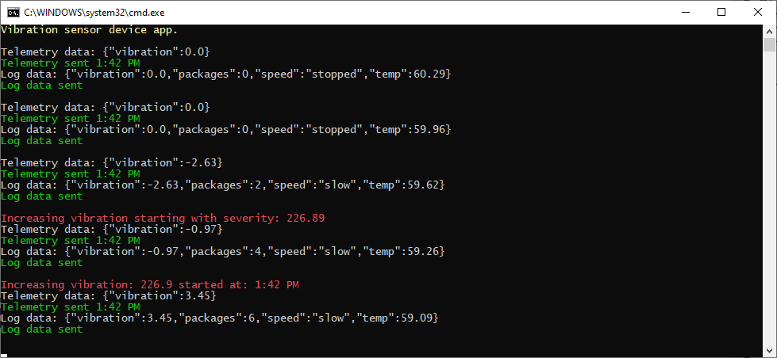

---
lab:
    title: 'Lab 08: Visualize a Data Stream in Power BI'
    module: 'Module 5: Insights and Business Integration'
---

# Visualize a Data Stream in Power BI

> **IMPORTANT**: This lab has several service prerequisites that are not related to the Azure subscription you were given for the course:
>
> 1. The ability to sign in to a "Work or School Account" (Azure Active Directory account)
> 2. You must know your account sign-in name, which may not match your e-mail address.
> 3. Access to Power BI, which could be through:
>       1. An existing Power BI account
>       2. The ability to sign up for Power BI - some organizations block this.
>
> The first lab exercise will validate your ability to access Power BI.  If you are not successful in the first exercise, you will not be able to complete the lab, as there is no quick workaround for blocked access to a work or school account.

## Lab Scenario

You have developed a simulated IoT device that generates vibration data and other telemetry outputs that are representative of the conveyor belt system used in Contoso's cheese packaging process. You have built and tested a logging route that sends data to Azure Blob storage. You will now start work on a new route within IoT hub that will send telemetry data to an Azure Event Hubs service.

The primary difference between Azure IoT Hub and Azure Event Hubs is that Event Hubs is designed for big data streaming, while IoT hub is optimized for an IoT solution. Both services support ingestion of data with low latency and high reliability. Since Azure Event Hubs provides an input to Stream Analytics in a manner that is similar to IoT hub, your choice of Event Hubs in this case allows you explore an additional Azure service option within your solution.

### Make a Call to a Built-in Machine Learning Model

In this lab, you will be calling a built-in Machine Learning (ML) function named `AnomalyDetection_SpikeAndDip`. The `AnomalyDetection_SpikeAndDip` function uses a sliding window to analyze data for anomalies. The sliding window could be, for example, the most recent two minutes of telemetry data. The window advances in near real-time with the flow of telemetry. Generally speaking, if the size of the sliding window is increased to include more data, the accuracy of anomaly detection will increase as well (however, the latency also increases, so a balance must be found).

The function establishes a "normal" range for the data and then uses it to identify anomalies and assign a rating. It works like this: as the function continues to monitor the flow of data, the algorithm establishes a normal range of values, then compares new values against those norms. The result is a score for each value, expressed as a percentage that determines the confidence level that the given value is anomalous. As you may expect, low confidence levels can be ignored, but you may wonder what percentage confidence value is acceptable. In your query, you will set this tipping point at 95%.

There are always complications, like when there are gaps in the data (the conveyor belt stops for a while, perhaps). The algorithm handles voids in the data by imputing values.

> **Note**: In statistics, imputation is the process of replacing missing data with substituted values. You can learn more about imputations [here](https://en.wikipedia.org/wiki/Imputation_%28statistics%29).

Spikes and dips in telemetry data are temporary anomalies. However, since you are simulating vibration data using sine waves, you can expect a period of "normal" values followed by a high or low value that triggers an anomaly alert. An operator may look for a cluster of anomalies occurring in a short time span, which would signal that something is wrong.

There are other built-in ML models, such as a model for detecting trends. We don't include these models as part of this module, but the student is encouraged to investigate further.

### Visualize data using Power BI

Visualizing numerical data, especially volumes of it, is a challenge in itself. How can we alert a human operator of the sequence of anomalies that infer something is wrong?

The solution we use in this module is to use some built-in functionality of Power BI along with the ability of Azure Stream Analytics to send data in a real-time format that Power BI can ingest.

We use the dashboard feature of Power BI to create a number of tiles. One tile contains the actual vibration measurement. Another tile is a gauge, showing from 0.0 to 1.0 the confidence level that the value is an anomaly. A third tile indicates if the 95% confidence level is reached. Finally, the fourth tile shows the number of anomalies detected over the past hour. By including time as the x-axis, this tile makes it clear if a clutch of anomalies were detected in short succession as they will be clustered together horizontally.

The fourth tile allows you to compare the anomalies with the red text in the telemetry console window. Is there a cluster of anomalies being detected when forced, or increasing, or both, vibrations are in action?

The following resources will be created:


## In This Lab

In this lab, you will complete the following activities:

* Verify that the lab prerequisites are met (that you have the required Azure resources)
* Sign-up for Power BI
* Generate Telemetry from Simulated Device
* Analyze Telemetry in Real-Time
* Create an Azure Event Hubs service
* Create a Real-time Message Route
* Add a Telemetry Route to IoT hub
* Create a Power BI dashboard to visualize data anomalies

Let's create the Event Hub, create the second route, update the SQL query, create a Power BI dashboard, and let it all run!

## Lab Instructions

### Exercise 1: Verify Lab Prerequisites

This lab assumes the following Azure resources are available:

| Resource Type | Resource Name |
| :-- | :-- |
| Resource Group | rg-az220 |
| IoT Hub | iot-az220-training-{your-id} |
| Device ID | sensor-v-3000 |
| Storage Account Name | vibrationstore{your-id} |
| Storage Container | vibrationcontainer |
| Event Hub Namespace | vibrationNamespace{your-id} |
| Event Hub Name | vibrationeventhubinstance |
| Streaming Job | vibrationJob |
| Streaming Job Input | vibrationInput |
| Streaming Job Output | vibrationOutput |
| Streaming Job Transformation | VibrationJobTransformation |

If these resources are not available, you will need to run the **lab08-setup.azcli** script as instructed below before moving on to Exercise 2. The script file is included in the GitHub repository that you cloned locally as part of the dev environment configuration (lab 3).

The **lab08-setup.azcli** script is written to run in a **bash** shell environment - the easiest way to execute this is in the Azure Cloud Shell.

1. Using a browser, open the [Azure Shell](https://shell.azure.com/) and login with the Azure subscription you are using for this course.

    If you are prompted about setting up storage for Cloud Shell, accept the defaults.

1. Verify that the Azure Cloud Shell is using **Bash**.

    The dropdown in the top-left corner of the Azure Cloud Shell page is used to select the environment. Verify that the selected dropdown value is **Bash**.

1. On the Azure Shell toolbar, click **Upload/Download files** (fourth button from the right).

1. In the dropdown, click **Upload**.

1. In the file selection dialog, navigate to the folder location of the GitHub lab files that you downloaded when you configured your development environment.

    In _Lab 3: Setup the Development Environment_, you cloned the GitHub repository containing lab resources by downloading a ZIP file and extracting the contents locally. The extracted folder structure includes the following folder path:

    * Allfiles
      * Labs
          * 08-Visualize a Data Stream in Power BI
            * Setup

    The lab08-setup.azcli script file is located in the Setup folder for lab 7.

1. Select the **lab08-setup.zip** file, and then click **Open**.

    A notification will appear when the file upload has completed.

1. To verify that the correct file has uploaded in Azure Cloud Shell, enter the following command:

    ```bash
    ls
    ```

    The `ls` command lists the content of the current directory. You should see the lab08-setup.azcli file listed.

1. To create a directory for this lab that contains the setup script and then move into that directory, enter the following Bash commands:

    ```bash
    mkdir lab8
    unzip lab08-setup.zip -d ./lab8
    cd lab8
    ```

1. To ensure that **lab08-setup.azcli** and **Create-Job.ps1** have the execute permission, enter the following command:

    ```bash
    chmod +x lab08-setup.azcli
    chmod +x Create-Job.ps1
    ```

1. On the Cloud Shell toolbar, to enable access to the lab08-setup.azcli file, click **Open Editor** (second button from the right - **{ }**).

1. In the **FILES** list, to expand the lab8 folder and open the script file, click **lab8**, and then click **lab08-setup.azcli**.

    The editor will now show the contents of the **lab08-setup.azcli** file.

1. In the editor, update the `{your-id}` and `{your-location}` assigned values.

    Referencing the sample below as an example, you need to set `{your-id}` to the Unique ID you created at the start of this course - i.e. **cah191211**, and set `{your-location}` to the location that makes sense for your resources.

    ```bash
    #!/bin/bash

    # Change these values!
    YourID="{your-id}"
    Location="{your-location}"
    ```

    > **Note**:  The `{your-location}` variable should be set to the short name for the region where you are deploying all of your resources. You can see a list of the available locations and their short-names (the **Name** column) by entering this command:

    ```bash
    az account list-locations -o Table

    DisplayName           Latitude    Longitude    Name
    --------------------  ----------  -----------  ------------------
    East Asia             22.267      114.188      eastasia
    Southeast Asia        1.283       103.833      southeastasia
    Central US            41.5908     -93.6208     centralus
    East US               37.3719     -79.8164     eastus
    East US 2             36.6681     -78.3889     eastus2
    ```

1. In the top-right of the editor window, to save the changes made to the file and close the editor, click **...**, and then click **Close Editor**.

    If prompted to save, click **Save** and the editor will close.

    > **Note**:  You can use **CTRL+S** to save at any time and **CTRL+Q** to close the editor.

1. To create the resources required for this lab, enter the following command:

    ```bash
    ./lab08-setup.azcli
    ```

    This script will take a few minutes to run. You will see output as each step completes:

    ```text
    Create resource group rg-az220 - Success
    Create IoT Hub iot-az220-training-dm200420 - Success
    Create device sensor-v-3000 - Success
    Create storage account vibrationstoredm200420 - Success
    Create storage container vibrationcontainer - Success
    Create IoT Hub endpoint vibrationLogEndpoint - Success
    Create IoT Hub route vibrationLoggingRoute - Success
    Create routing-endpoint vibrationTelemetryEndpoint - Success
    Create iot hub route  - Success
    Setup Azure Streaming Job - launching PowerShell

    MOTD: Download scripts from PowerShell Gallery: Install-Script <script name>

    VERBOSE: Authenticating to Azure ...
    VERBOSE: Building your Azure drive ...
    Creating job vibrationJob
    Creating job input vibrationInput
    Creating job output vibrationOutput
    Creating job transformation VibrationJobTransformation
    Device Connection String for the application:
    ----------------------------------------------------
    HostName=iot-az220-training-dm200420.azure-devices.net;DeviceId=sensor-v-3000;SharedAccessKey=5p9giH/AnpcykMaM+OYcidtIkNz0o9/KDnZTrgii4cc=
    ```

1. Notice that, once the script has completed, the connection string for the device is displayed.

    The connection string starts with "HostName="

1. Copy the connection string into a text document, and note that it is for the **sensor-v-3000** device.

    Once you have saved the connection string to a location where you can find it easily, you will be ready to continue with the lab.

### Exercise 2: Sign Up For Power BI

Power BI can be your personal data analysis and visualization tool, and can also serve as the analytics and decision engine behind group projects, divisions, or entire corporations. Later on in this lab, you will build a dashboard and visualize data using Power BI. This exercise explains how to sign up for Power BI as an individual.

>**Note:** If you already have a Power BI subscription and you are able to use it during this course, you can skip to Exercise 2.

#### Task 1: Understand Supported Email Addresses

Before you start the sign-up process, it's important to learn which types of email addresses that you can use to sign-up for Power BI:

* Power BI requires that you use a work or school email address to sign up. You can't sign up using email addresses provided by consumer email services or telecommunication providers. This includes outlook.com, hotmail.com, gmail.com, and others.

* After you sign up, you can [invite guest users](https://docs.microsoft.com/azure/active-directory/active-directory-b2b-what-is-azure-ad-b2b) to see your Power BI content with any email address, including personal accounts.

* You can sign-up for Power BI with .gov or .mil addresses, but this requires a different process. For more info, see [Enroll your US Government organization in the Power BI service](https://docs.microsoft.com/en-us/power-bi/service-govus-signup).

#### Task 2: Sign up for a Power BI Account

Follow these steps to sign up for a Power BI account. Once you complete this process you will have a Power BI (free) license which you can use to try Power BI on your own using My Workspace, consume content from a Power BI workspace assigned to a Power BI Premium capacity or initiate an individual Power BI Pro Trial.

1. In your browser, navigate to the [sign-up page](https://signup.microsoft.com/signup?sku=a403ebcc-fae0-4ca2-8c8c-7a907fd6c235).

1. On the **Get started** page, enter a supported email address.

1. If you see a message requesting you prove you are not a robot, choose either **Text me** or **Call me** and supply the relevant information to receive a verification code, then continue to the next step in this procedure.

    

    If, instead, you are informed that you already have an account, continue to sign-in and you are ready to use Power BI.

    

1. Check your phone texts or wait for the call, then enter the code that you received, then click **Sign up**.

    

1. Check your email for a message like this one.

    

1. On the next screen, enter your information and the verification code from the email. Select a region, review the policies that are linked from this screen, then select Start.

    

1. You're then taken to [Power BI sign in page](https://powerbi.microsoft.com/landing/signin/), and you can begin using Power BI.

Now you have access to Power BI, you are ready to route real-time telemetry data to a Power BI dashboard.

### Exercise 3: Generate Telemetry from Simulated Device

In order to visualize live streaming data from IoT hub in a Power BI dashboard, you will need to have a real or simulated IoT device that is sending telemetry messages. Fortunately, you created a simulated device in Lab 7 that satisfies this requirement.

In this exercise, you will ensure that the Device Simulator app from the previous lab is running. 

> **Important**: If you have not completed lab 7 of this course, do that now.

#### Task 1: Start the VibrationDevice app in Visual Studio Code

1. Open Visual Studio Code.

1. On the **File** menu, click **Open Folder**.

1. In the **Open Folder** dialog, navigate to the lab 8 Starter folder.

    In _Lab 3: Setup the Development Environment_, you cloned the GitHub repository containing lab resources by downloading a ZIP file and extracting the contents locally. The extracted folder structure includes the following folder path:

    * Allfiles
      * Labs
          * 08-Visualize a Data Stream in Power BI
            * Starter
 
1. Click **VibrationDevice**, and then click **Select Folder**.

    You should see the Program.cs and VibrationDevice.csproj files listed in the EXPLORER pane.

1. In the **EXPLORER** pane, click **Program.cs**.

1. In the code editor pane, ensure that the connection string variable, `deviceConnectionString`, is assigned correctly.

    You can find the connection string for the sensor-v-3000 device in IoT hub, or you can check your completed Lab 7 project. 

    The variable assignment in your code should be similar to the following:

    ```csharp
    deviceConnectionString = "HostName=iot-az220-training-cah200509.azure-devices.net;DeviceId=sensor-v-3000;SharedAccessKey=nSUbphUKsS1jEd7INrEtmVWZesMBDIxzjVe4jn01KJI=";
    ```

1. On the **File** menu, click **Save**.

1. On the **View** menu, click **Terminal**.

    Verify that the command prompt shows the folder path to the **VibrationDevice** folder.
 
1. To run the app in the terminal, enter the following command:

    ```bash
    dotnet run
    ```

   This command will run the **Program.cs** file in the current folder.

1. You should quickly see console output, similar to the following:

    

    > **Note**:  Green text is used to show things are working as they should and red text when bad stuff is happening. If you don't get a screen similar to this image, start by checking your device connection string.

1. Leave this app running.

    The telemetry data is needed for data visualization.

### Exercise 4: Create an Azure Event Hubs service

Now that you have telemetry data streaming into the IoT Hub, you're going to add an Azure Event Hubs Namespace and Azure Event Hubs instance to our solution. Azure Event Hubs are ideal for processing streaming data and support live dashboarding scenarios - perfect for passing our vibration data to Power BI.

#### Task 1: Create an Event Hubs Namespace

In this task, you will use the Azure portal to create an Event Hubs resource.

1. Login to [portal.azure.com](https://portal.azure.com) using your Azure account credentials.

    If you have more than one Azure account, be sure that you are logged in with the account that is tied to the subscription that you will be using for this course.

1. On the Azure portal menu, click **All services**.

1. In the Search textbox, type **Event**

1. On the search results panel under the search textbox, click **Event Hubs**.

1. To begin the process of creating your new Event Hubs resource, click **Create event hubs namespace**.

    The **Create Namespace** blade will be displayed.

1. On the **Create Namespace** blade, configure the **Subscription** and **Resource group** fields with the values you are using for this course.

    Resource group should be the same resource group that you used for your IoT hub and other resources - **rg-az220**.

1. In the **Namespace name** field, type **vibrationNamespace** and then enter your unique identifier {your-id}.

    For example: **vibrationNamespacecah191212**

    This name must be globally unique.

1. Under **Location**, choose the same region that you have been using for the other labs in this course.

1. In the **Pricing tier** dropdown, click **Standard**.

   > **Note**:  Choosing the standard pricing tier enables _Kafka_. The Event Hubs for Kafka feature provides a protocol head on top of Azure Event Hubs that is binary compatible with Kafka versions 1.0 and later for both reading from and writing to Kafka topics. You can learn more about Event Hubs and Apache Kafka [here](https://docs.microsoft.com/en-us/azure/event-hubs/event-hubs-for-kafka-ecosystem-overview). We will not be using Kafka in this lab.

1. For the **Throughput units** field, ensure that the value is set to 1.

    This lab does not generate sufficient data to warrant increasing the number of units.

1. At the bottom of the blade, click **Next: Features**.

1. Leave **Enable Availability Zones** unchecked.

    > **Note**:  Checking this option enables enhanced availability by spreading replicas across availability zones within one region at no additional cost - however this capability is not needed for this lab.

1. Leave **Enable Auto-Inflate** unchecked.

    > **Note**:  Auto-Inflate automatically scales the number of Throughput Units assigned to your Event Hubs Namespace when your traffic exceeds the capacity of the Throughput Units assigned to it. You can specify a limit to which the Namespace will automatically scale. This feature is not required for this lab.

1. At the bottom of the blade, click **Review + create**.

    You should see a message indicating that validation succeeded. If not, you will need to address the specified issues.
 
1. To create the resource, click **Create**, and then wait for the resource to be deployed.

    This deployment can take a few minutes. You can open the Notifications pane to monitor progress. 

    Once you have an Event Hubs Namespace, you can create your Event Hubs instance.

#### Task 2: Create an Event Hubs Instance

1. Navigate back to your Azure portal Dashboard page.

1. On your Resources tile, click **vibrationNamespace{your-id}**.

    If the Event Hubs Namespace is not listed, refresh the tile.

    The **Overview** pane of the **Event Hubs Namespace** blade will be displayed.

1. To create an Event Hubs instance, at the top of the pane, click **+ Event Hub**.

    The **Create Event Hub** blade will be displayed.

1. On the **Create Event Hub** blade, under **Name**, enter **vibrationeventhubinstance**.

1. Leave **Partition Count** set to **1**.

    > **Note**:  Partitions are a data organization mechanism that relates to the downstream parallelism required in consuming applications. The number of partitions in an event hub directly relates to the number of concurrent readers you expect to have. You can increase the number of partitions beyond 32 by contacting the Event Hubs team. The partition count is not changeable, so you should consider long-term scale when setting partition count. In this lab, we only require 1.

1. Leave **Message Retention** set to **1**.

    > **Note**:  This is the retention period for events. You can set the retention period between 1 and 7 days. For this lab, we only require the minimum retention.

1. Leave **Capture** set to **Off**.

    > **Note**:  Azure Event Hubs Capture enables you to automatically deliver the streaming data in Event Hubs to an Azure Blob storage or Azure Data Lake Store account of your choice, with the added flexibility of specifying a time or size interval. We do not require this feature for the lab.

1. To create the Azure Hubs instance, click **Create**, and then wait for the resource to be deployed.

### Exercise 5: Create Real-Time Message Route

Now that you have an Event Hubs Namespace and an Event Hubs service, you need to pass the telemetry data from the IoT hub to your Event Hubs.

#### Task 1: Create the Telemetry Route

In this task, you will add a message route to your IoT hub that will send telemetry messages to the Event Hubs instance that you just created.

1. Navigate to your Azure portal dashboard.

1. On the Resources tile, to open your IoT hub, click **iot-az220-training-{your-id}**.

    The **Overview** pane for the IoT Hub will be displayed.

1. On the **Overview** pane, in the left-side menu, under **Messaging**, click **Message routing**.

1. On the **Message routing** pane, to add a new message route, click **+ Add**.

1. On the **Add a route** blade, under **Name**, enter **vibrationTelemetryRoute**.

1. To the right of the **Endpoint** dropdown, click **+ Add endpoint**, and then click **Event hubs**.

1. On the **Add an event hub endpoint** blade, under **Endpoint name**, enter **vibrationTelemetryEndpoint**.

1. Under **Event hub namespace**, select the namespace that you created earlier.

    It should be similar to the following: **vibrationNamespacecah191212**

1. Under **Event hub instance**, click **vibrationeventhubinstance**.

1. To create the endpoint, click **Create**, and then wait for the success message.

    You will be returned to the **Add a route** blade and the **Endpoint** value will have been updated.

1. On the **Add a route** blade, under **Data source**, ensure that **Device Telemetry Messages** is selected.

1. Under **Enable route**, ensure that **Enable** is selected.

1. Under **Routing query**, replace the existing query with the following:

    ```sql
    sensorID = 'VSTel'
    ```

    You may recall that the earlier query sent 'VSLog' messages to the logging storage. This message route will be sending 'VSTel' (the telemetry) to the Event Hubs instance.

1. To create the message route, click **Save**.

1. Once the **Message routing** blade is displayed, verify you have two routes that match the following:

    | Name | Data Source | Routing Query | Endpoint | Enabled |
    |:-----|:------------|:--------------|:---------|:--------|
    |vibrationLoggingRoute|DeviceMessages|sensorID = 'VSLog'|vibrationLogEndpoint|true|
    |vibrationTelemetryRoute|DeviceMessages|sensorID = 'VSTel'|vibrationTelemetryEndpoint|true|

You are now ready to update the Azure Stream Analytics job to hand the real-time device telemetry.

### Exercise 6: Add Telemetry Route

With this new IoT Hub route in place, and the telemetry data streaming into the Event Hub, you now need to update our Stream Analytics job. This job will need to consume the data from the Event Hub, perform analysis using the **AnomalyDetection_SpikeAndDip** ML model and then output the results to Power BI.

#### Task 1: Add a New Input to the Job

1. Return to your Azure portal Dashboard.

1. On your Resources tile, click **vibrationJob**.

    This is the Stream Analytics job that you created in the previous lab.
 
    The **Stream Analytics Job** blade will open displaying the **Overview** pane.

    > **Note**: Ensure the job status is **Stopped**.

1. In the left hand navigation menu, under **Job topology**, click **Inputs**.

1. On the **Inputs** pane, click **+ Add stream input**, and then click **Event Hub**.

1. On the **Event Hub** pane, under **Input alias**, enter **vibrationEventInput**

1. Ensure that **Select Event Hub from your subscriptions** is selected.

1. Under **Subscription**, ensure that the subscription that you have been using for this course is selected.

1. Under **Event Hub namespace**, ensure that the **vibrationNamespace[your-id}** namespace that you entered in the previous section is selected.

1. Under **Event Hub name**, ensure that **Use existing** is selected and that the Event Hub instance you created in the previous section is selected.

    The **vibrationeventhubinstance** should already be selected for you.

1. Under **Event Hub policy name**, click **Use existing**, and then ensure that **RootManageSharedAccessKey** is selected in the dropdown.

    > **Note**: The **Event Hub policy key** is populated and read-only.

1. Under **Event Hub Consumer group**, click **Use existing**, and then ensure that **$Default** is selected.

1. Under **Event serialization format**, ensure that **JSON** is selected.

1. Under **Encoding**, ensure that **UTF-8** is selected.

1. Under **Event compression type**, ensure that **None** is selected.

1. To save the new input, click **Save**, and then wait for the input to be created.

    The **Inputs** list should be updated to show the new input - **vibrationEventInput**.

#### Task 2: Add a New Output

1. On the left-side menu under **Job topology**, click **Outputs**.

    The **Outputs** pane is displayed.

1. On the **Outputs** pane, click **+ Add**, and then click **Power BI**.

    The **Power BI** pane is displayed.

1. Authorize the connection using the Power BI account you created earlier (or an existing account).

1. On the **Power BI - New output** pane, under **Output alias**, enter **vibrationBI**.

1. Under **Group workspace**, select the workspace you wish to use.

    If this is a brand new account, this dropdown will be greyed out.  If you have an existing account, choose an appropriate workspace, or ask your instructor for assistance.

1. Under **Dataset name**, enter **vibrationDataset**

1. Under **Table name**, enter **vibrationTable**

1. Under **Authentication mode**, click **User token**, and then read the note that appears about revoking access.

1. To create the output, click **Save**, and then wait for the output to be created.

    The **Outputs** list will be updated with the new output.

#### Task 3: Update the SQL query for the Job

1. On the left-side menu under **Job topology**, click **Query**.

1. Copy the following SQL query, and then paste it *above* the existing short query.

    ```sql
    WITH AnomalyDetectionStep AS
    (
        SELECT
            EVENTENQUEUEDUTCTIME AS time,
            CAST(vibration AS float) AS vibe,
            AnomalyDetection_SpikeAndDip(CAST(vibration AS float), 95, 120, 'spikesanddips')
                OVER(LIMIT DURATION(second, 120)) AS SpikeAndDipScores
        FROM vibrationEventInput
    )
    SELECT
        time,
        vibe,
        CAST(GetRecordPropertyValue(SpikeAndDipScores, 'Score') AS float) AS
        SpikeAndDipScore,
        CAST(GetRecordPropertyValue(SpikeAndDipScores, 'IsAnomaly') AS bigint) AS
        IsSpikeAndDipAnomaly
    INTO vibrationBI
    FROM AnomalyDetectionStep
    ```

    > **Note**:  This first section of this query takes the vibration data, and examines the previous 120 seconds worth. The `AnomalyDetection_SpikeAndDip` function will return a `Score` parameter, and an `IsAnomaly` parameter. The score is how certain the ML model is that the given value is an anomaly, specified as a percentage. If the score exceeds 95%, the `IsAnomaly` parameter has a value of 1, otherwise `IsAnomaly` has a value of 0. Notice the 120 and 95 parameters in the first section of the query. The second section of the query sends the time, vibration, and anomaly parameters to `vibrationBI`.

1. Verify that the query editor now lists 2 Inputs and Outputs:

    * `Inputs`
      * `vibrationEventInput`
      * `vibrationInput`
    * `Outputs`
      * `vibrationBI`
      * `vibrationOutput`

    If you see more than 2 of each then you likely have a typo in your query or in the name you used for the input or output - correct the issue before moving on.

1. To save the query, click **Save query**.

1. On the left-side menu, click **Overview**.

1. Near the top of the blade, click **Start**.

1. On the **Start job** pane, under **Job output start time**, ensure **Now** is selected, and then click **Start**.

In order for a human operator to easily interpret the output from this query, you need to visualize the data in a friendly way. One way of doing this visualization is to create a Power BI dashboard.

### Exercise 7: Create a Power BI Dashboard

Now for the final part of the scenario - the actual data visualization. You have updated your job to process the vibration telemetry via the ML model and output the results to Power BI. Within Power BI, you need to create a dashboard with a number of tiles to visualize the results and provide decision support for the operator.

#### Task 1: Create a New Dashboard

1. In your browser, navigate to [https://app.powerbi.com/](https://app.powerbi.com/).

1. Once Power BI has opened, on the left-side navigation menu, expand **Workspaces**, and then select the workspace that you specified above.

    > **Note**:  At the time of writing, Power BI has a *New Look* in preview. The steps in this task have been written assuming the *New Look* is **Off**. To turn off the *New Look*, on the toolbar at the top of the screen, ensure that the toggle reads **New look off**. 

1. On the **Datasets** tab, verify that **vibrationDataset** is displayed.

    If not, you might have to wait a short time for this list to populate.

1. At the top right of the page, click **+ Create**, and then click **Dashboard**.

1. In the **Create dashboard** popup, under **Dashboard name**, type **Vibration Dash** and then click **Create**.

    The new dashboard will be displayed as an essentially blank page.

#### Task 2: Add the Vibration Gauge Tile

1. To add a vibration gauge, at the top of the blank dashboard, click **+ Add tile**.

1. In the **Add tile** pane, under **REAL-TIME DATA**, click **Custom Streaming Data**, and then click **Next**.

1. On the **Add a custom streaming data tile** pane, under **YOUR DATASETS**, click **vibrationDataset**, and then click **Next**.

    The pane will refresh to allow you to choose a visualization type and fields.

1. Under **Vibration Type**, open the dropdown, and then click **Gauge**.

    Notice that changing the visualization type changes the fields below.

1. Under **Value**, click **+ Add value**, open the dropdown, and then click **Vibe**.

    Notice that the gauge appears immediately on the dashboard with a value that begins to update!

1. To display the Tile details pane, click **Next**.

1. In the **Tile details** pane, under **Title**, enter **Vibration**.

1. To leave the remaining fields at default values and close the pane, click **Apply**.

    If you see a notification about creating a phone view, you can ignore it and it will disappear shortly (or dismiss it yourself).

1. To reduce the size of the tile, hover your mouse over the bottom-right corner of the tile, and then click-and-drag the resize mouse pointer.

    Make the tile as small as you can. It will snap to various preset sizes.

#### Task 3: Add the SpikeAndDipScore Clustered Bar Chart Tile

1. To add the SpikeAndDipScore Clustered Bar Chart, at the top of the dashboard, click **+ Add tile**.

1. In the **Add tile** pane, under **REAL-TIME DATA**, click **Custom Streaming Data**, and then click **Next**.

1. On the **Add a custom streaming data tile** pane, under **YOUR DATASETS**, click **vibrationDataset**, and then click **Next**.

1. Under **Visualization Type**, open the dropdown, and then click **Clustered bar chart**.

    Notice that changing the visualization type changes the fields below.

1. Under **Value**, click **+ Add value**, open the dropdown, and then click **SpikeAndDipScore**.

1. To display the Tile details pane, click **Next**.

1. To close Tile details pane, click **Apply**.

    If you see a notification about creating a phone view, you can ignore it and it will disappear shortly (or dismiss it yourself).

1. Again, reduce the size of the tile, making it as small as you can.

#### Task 4: Add the IsSpikeAndDipAnomaly Card Tile

1. At the top of the dashboard, to add a IsSpikeAndDipAnomaly Card visualization, click **+ Add tile**.

1. In the **Add tile** pane, under **REAL-TIME DATA**, click **Custom Streaming Data**, and then click **Next**.

1. On the **Add a custom streaming data tile** pane, under **YOUR DATASETS**, click **vibrationDatset**, and then click **Next**.

1. Under **Visualization Type**, open the dropdown, and then click **Card**.

1. Under **Value**, click **+ Add value**, open the dropdown, and then click **IsSpikeAndDipAnomaly**.

1. To display the Tile details pane, click **Next**.

1. In the **Tile details** pane, under **Title**, enter **Is anomaly?**

1. To close the Tile details pane, click **Apply**.

    If you see a notification about creating a phone view, you can ignore it and it will disappear shortly (or dismiss it yourself).

1. Again, reduce the size of the tile, making it as small as you can.

#### Task 5: Rearrange the Tiles

1. Using drag-and-drop, arrange the tiles vertically on the left of the dashboard in the following order:

    * SpikeAndDipScore
    * Is Anomaly?
    * Vibration

#### Task 6: Add Anomalies Over The Hour Line Chart Tile

Now to create a fourth tile, the `Anomalies Over the Hour` line chart.  This one is a bit more complex.

1. At the top of the dashboard, click **+ Add tile**.

1. In the **Add tile** pane, under **REAL-TIME DATA**, click **Custom Streaming Data**, and then click **Next**.

1. On the **Add a custom streaming data tile** pane, under **YOUR DATASETS**, click **vibrationDataset**, and then click **Next**.

    The pane will refresh to allow you to choose a visualization type and fields.

1. Under **Visualization Type**, open the dropdown, and then click **Line chart**.

    Notice that changing the visualization type changes the fields below.

1. Under **Axis**, click **+ Add value**, and then select **time** from the dropdown.

1. Under **Values**, click **+ Add value**, and then select **IsSpikeAndDipAnomaly** from the dropdown.

    Notice that the chart appears immediately on the dashboard with a value that begins to update!

1. Under **Time window to display**, to the right of **Last**, open the dropdown, and then click **60**

    Leave the units set to **Minutes**.

1. To display the Tile details pane, click **Next**.

1. In the **Tile details** pane, under **Title**, enter **Anomalies over the hour**.

1. To close the Tile details pane, click **Apply**.

    If you see a notification about creating a phone view, you can ignore it and it will disappear shortly (or dismiss it yourself).

1. This time, stretch the tile so its height matches the 3 tiles to the left and its width fits the remaining space of the dashboard.

    There is a latency with so many routes and connections, but you should start seeing the vibration data in the visualizations

    > **Note**:  If no data appears, check you are running the device app and the analytics job is running.

    Let the job run for a while, several minutes at least before the ML model will kick in. Compare the console output of the device app, with the Power BI dashboard. Are you able to correlate the forced and increasing vibrations to a run of anomaly detections?

If you're seeing an active Power BI dashboard, you've just completed this lab. Great work.

> **Note**:  Before you go, don't forget to close Visual Studio Code - this will exit the device app if it is still running.
