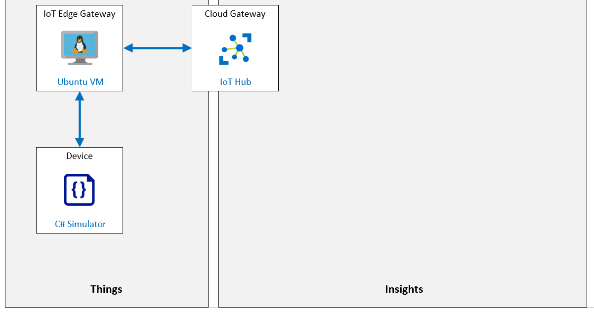

---
lab:
    title: 'Lab 12: Setup an IoT Edge Gateway'
    module: 'Module 6: Azure IoT Edge Deployment Process'
---

# Setup an IoT Edge Gateway

## Lab Scenario

This lab is theoretical and will walk you through how an IoT Edge device can be used as a gateway.

There are three patterns for using an IoT Edge device as a gateway: transparent, protocol translation, and identity translation:

**Transparent** – Devices that theoretically could connect to IoT Hub can connect to a gateway device instead. The downstream devices have their own IoT Hub identities and are using any of the MQTT, AMQP, or HTTP protocols. The gateway simply passes communications between the devices and IoT Hub. The devices are unaware that they are communicating with the cloud via a gateway, and a user interacting with the devices in IoT Hub is unaware of the intermediate gateway device. Thus, the gateway is transparent. Refer to Create a transparent gateway for specifics on using an IoT Edge device as a transparent gateway.

**Protocol translation** – Also known as an opaque gateway pattern, devices that do not support MQTT, AMQP, or HTTP can use a gateway device to send data to IoT Hub on their behalf. The gateway understands the protocol used by the downstream devices, and is the only device that has an identity in IoT Hub. All information looks like it is coming from one device, the gateway. Downstream devices must embed additional identifying information in their messages if cloud applications want to analyze the data on a per-device basis. Additionally, IoT Hub primitives like twins and methods are only available for the gateway device, not downstream devices.

**Identity translation** - Devices that cannot connect to IoT Hub can connect to a gateway device, instead. The gateway provides IoT Hub identity and protocol translation on behalf of the downstream devices. The gateway is smart enough to understand the protocol used by the downstream devices, provide them identity, and translate IoT Hub primitives. Downstream devices appear in IoT Hub as first-class devices with twins and methods. A user can interact with the devices in IoT Hub and is unaware of the intermediate gateway device.

The following resources will be created:



## In This Lab

In this lab, you will complete the following activities:

* Verify that the lab prerequisites are met (that you have the required Azure resources)
* Deploy an Azure IoT Edge Enabled Linux VM as an IoT Edge Device
* Generate and Configure IoT Edge Device CA Certificates
* Create an IoT Edge Device Identity in IoT Hub using Azure Portal
* Setup the IoT Edge Gateway Hostname
* Connect an IoT Edge Gateway Device to IoT Hub
* Open IoT Edge Gateway Device Ports for Communication
* Create the Downstream Device Identity in IoT Hub
* Connect a Downstream Device to IoT Edge Gateway
* Verify Event Flow

## Lab Instructions

### Exercise 1: Verify Lab Prerequisites

This lab assumes that the following Azure resources are available:

| Resource Type | Resource Name |
| :-- | :-- |
| Resource Group | rg-az220 |
| IoT Hub | iot-az220-training-{your-id} |

If these resources are not available, you will need to run the **lab12-setup.azcli** script as instructed below before moving on to Exercise 2. The script file is included in the GitHub repository that you cloned locally as part of the dev environment configuration (lab 3).

> **Note**:  The **lab12-setup.azcli** script is written to run in a **bash** shell environment - the easiest way to execute this is in the Azure Cloud Shell.

1. Using a browser, open the [Azure Cloud Shell](https://shell.azure.com/) and login with the Azure subscription you are using for this course.

1. If you are prompted about setting up storage for Cloud Shell, accept the defaults.

1. Verify that the Cloud Shell is using **Bash**.

    The dropdown in the top-left corner of the Azure Cloud Shell page is used to select the environment. Verify that the selected dropdown value is **Bash**.

1. On the Cloud Shell toolbar, click **Upload/Download files** (fourth button from the right).

1. In the dropdown, click **Upload**.

1. In the file selection dialog, navigate to the folder location of the GitHub lab files that you downloaded when you configured your development environment.

    In Lab 3 of this course, "Setup the Development Environment", you cloned the GitHub repository containing lab resources by downloading a ZIP file and extracting the contents locally. The extracted folder structure includes the following folder path:

    * Allfiles
      * Labs
          * 12-Setup an IoT Edge Gateway
            * Setup

    The lab12-setup.azcli script file is located in the Setup folder for lab 12.

1. Select the **lab12-setup.azcli** file, and then click **Open**.

    A notification will appear when the file upload has completed.

1. To verify that the correct file has uploaded, enter the following command:

    ```bash
    ls
    ```

    The `ls` command lists the content of the current directory. You should see the lab12-setup.azcli file listed.

1. To create a directory for this lab that contains the setup script and then move into that directory, enter the following Bash commands:

    ```bash
    mkdir lab12
    mv lab12-setup.azcli lab12
    cd lab12
    ```

    These commands will create a directory for this lab, move the **lab12-setup.azcli** file into that directory, and then change directory to make the new directory the current working directory.

1. To ensure the **lab12-setup.azcli** has the execute permission, enter the following command:

    ```bash
    chmod +x lab12-setup.azcli
    ```

1. On the Cloud Shell toolbar, to enable access to the lab12-setup.azcli file, click **Open Editor** (second button from the right - **{ }**).

1. In the **Files** list, to expand the lab12 folder and open the script file, click **lab12**, and then click **lab12-setup.azcli**.

    The editor will now show the contents of the **lab12-setup.azcli** file.

1. In the editor, update the values of the `{your-id}` and `{your-location}` variables.

    Referencing the sample below as an example, you need to set `{your-id}` to the Unique ID you created at the start of this course - i.e. **cah191211**, and set `{your-location}` to the location that matches your resource group.

    ```bash
    #!/bin/bash

    # Change these values!
    YourID="{your-id}"
    Location="{your-location}"
    ```

    > **Note**:  The `{your-location}` variable should be set to the short name for the region where you are deploying all of your resources. You can see a list of the available locations and their short-names (the **Name** column) by entering this command:

    ```bash
    az account list-locations -o Table

    DisplayName           Latitude    Longitude    Name
    --------------------  ----------  -----------  ------------------
    East Asia             22.267      114.188      eastasia
    Southeast Asia        1.283       103.833      southeastasia
    Central US            41.5908     -93.6208     centralus
    East US               37.3719     -79.8164     eastus
    East US 2             36.6681     -78.3889     eastus2
    ```

1. In the top-right of the editor window, to save the changes made to the file and close the editor, click **...**, and then click **Close Editor**.

    If prompted to save, click **Save** and the editor will close.

    > **Note**:  You can use **CTRL+S** to save at any time and **CTRL+Q** to close the editor.

1. To create the resources required for this lab, enter the following command:

    ```bash
    ./lab12-setup.azcli
    ```

    This will take a few minutes to run. You will see output as each step completes.

Once the script has completed, you will be ready to continue with the lab.

### Exercise 2: Deploy a Linux VM and install IoT Edge runtime

In this exercise, you will deploy an Ubuntu Server VM.

1. If necessary, log in to your Azure portal using your Azure account credentials.

    If you have more than one Azure account, be sure that you are logged in with the account that is tied to the subscription that you will be using for this course.

1. In the **Search resources, services and docs** field, enter **Virtual machines**.

1. In the search results, under **Services**, click **Virtual machines**.

1. On the **Virtual machines** page, click **+ Add** and select **Virtual machine**.

1. On the **Create a virtual machine** blade, in the **Subscription** dropdown, ensure that the subscription you are using for this course is selected.

1. In the **Resource group** dropdown, click **rg-az220vm**.

    > **Note**: One Resource Group is being used for all of the Virtual Machine resources created during this course. If the **rg-az220vm** resource group has not already been created, use the following instructions to create it now:

    * Under the **Resource group** dropdown, click **Create new**.
    * In the context menu, under **Name**, type **rg-az220vm** and then click **OK**

    > **Note**: You may encounter guidance that suggests creating a separate resource group for each of your VMs. In a production environment, having a separate resource group for each VM can help you to manage any addition resources that you add to the VM. For the simple manner in which you use VMs in this course, having separate resource groups for each VM is not necessary or practical.

1. Under **Instance details**, in the **Virtual machine name** textbox, type **vm-az220-training-gw0001-{your-id}**.

1. In the **Region** dropdown, select the region where your Azure IoT Hub is provisioned.

1. Leave **Availability options** set to **No infrastructure redundancy required**.

1. In the **Image** field, select **Ubuntu Server 18.04 LTS - Gen1** image.

1. Leave **Azure Spot instance** field unchecked.

1. To the right of **Size**, click **Change size**.

1. On the **Select a VM size** blade, under **VM Size**, click **Standard_B1ms**, and then click **Select**.

    You may need to use the **Clear all filters** link to make this size available in the list.

    > **Note**: Not all VM sizes are available in all regions. If, in a later step, you are unable to select the VM size, try a different region. For example, if **West US** doesn't have the sizes available, try **West US 2**.

1. Under **Administrator account**, to the right of **Authentication type**, click **Password**.

1. For the VM Administrator account, enter values for the **Username**, **Password**, and **Confirm password** fields.

    > **Important:** Do not lose/forget these values - you cannot connect to your VM without them.

1. Notice that the **Inbound port rules** are configured to enable inbound **SSH** access to the VM.

    This will be used to remote into the VM to configure/manage it.

1. Click **Review + create**.

1. Wait for the **Validation passed** message to be displayed at the top of the blade, and then click **Create**.

    > **Note**:  Deployment can take as much as 5 minutes to complete. You can continue on to the next exercise while it is deploying.

### Exercise 3: Generate and Configure IoT Edge Device CA Certificates

In this exercise, you will generate test certificates using Linux. You will do this using the **vm-az220-training-gw0001-{your-id}** Virtual Machine that you just created and a helper script that you will find within the "Starter" folder for this lab.

#### Task 1: Connect to the VM

1. Verify that the IoT Edge virtual machine has been deployed successfully.

    You can check the Notification pane in the Azure portal.

1. Verify that your **rg-az220vm** resource group has been pinned to your Azure dashboard.

    To pin your resource group to the dashboard, navigate to your Azure dashboard, and then complete the following:

    * On the Azure portal menu, click **Resource groups**.
    * On the **Resource groups** blade, under **Name**, locate the **rg-az220vm** resource group.
    * On the **rg-az220vm** row, on the right side of the blade, click **...** and then click **Pin to dashboard**.

    You may want to edit your dashboard to make the RG tiles and listed resources more accessible.

1. On the Azure portal menu, click **Resource groups**.

1. On the **Resource groups** blade, under **Name**, locate **rg-az220vm**.

1. On the right-hand side of the blade, across from **rg-az220vm**, click **Click to open context menu** (the ellipsis icon - **...**)

1. On the context menu, click **Pin to dashboard**, and then navigate back to your dashboard.

    You can **Edit** your dashboard to rearrange the tiles if that makes it easier to access your resources.

1. On the **rg-az220vm** resource group tile, to open the Edge Gateway virtual machine, click **vm-az220-training-gw0001-{your-id}**.

    > **Note**: Since the resource names are long and some are similar, be sure to select the VM, not the Disk, Public IP address, or Network security group.

1. At the top of the **vm-az220-training-gw0001-{your-id}** blade, click **Connect**, and then click **SSH**.

1. On the **Connect** pane, under **4. Run the example command below to connect to your VM**, copy the example command.

    This is a sample SSH command that can be used to connect to the virtual machine that contains the IP Address for the VM and the Administrator username. The command should be formatted similar to `ssh username@52.170.205.79`.

    > **Note**: If the sample command includes **-i \<private key path\>**, use a text editor to remove that portion of the command, and then copy the updated command into the clipboard.

1. On the Azure portal toolbar, click **Cloud Shell**

1. At the Cloud Shell command prompt, paste the **ssh** command that you updated in the text editor, and then press **Enter**.

1. When prompted with **Are you sure you want to continue connecting?**, type **yes** and then press **Enter**.

    This prompt is a security confirmation since the certificate used to secure the connection to the VM is self-signed. The answer to this prompt will be remembered for subsequent connections, and is only prompted on the first connection.

1. When prompted to enter the password, enter the administrator password that you created when the Edge Gateway VM was provisioned.

1. Once connected, the terminal will change to show the name of the Linux VM, similar to the following. This tells you which VM you are connected to.

    ``` bash
    username@vm-az220-training-gw0001-{your-id}:~$
    ```

    > **Important**: When you connect, you may be told that there are outstanding OS updates for the Edge VM. You can omit updates during this lab activity, but in production, you always want to be sure to keep your Edge devices up-to-date.

#### Task 2: Generate certificates

1. To download and configure some Azure IoT Edge helper scripts, enter the following command:

    ```bash
    git clone https://github.com/Azure/iotedge.git
    ```

    The **Azure/IoTEdge** GitHub project contains scripts to generate **non-production** certificates. These scripts will help you create the necessary scripts to set up a Transparent IoT Edge Gateway.

    > **Note**:  The [Azure/iotedge](https://github.com/Azure/iotedge) open source project is the official open source project for Azure IoT Edge. This project contains source code for the Edge Agent, Edge Hub, and IoT Edge Security Daemon; in addition to the helper script used in this unit.

1. To create a working directory named "lab12" and then move into that directory, enter the following commands:

    ```bash
    mkdir lab12
    cd lab12
    ```

    > **Note**: You will be using the "lab12" directory on the Gateway VM for generating certificates. To generate the certificates, the helper scripts need to be copied to the working directory.

1.  To copy helper scripts into the lab12 directory, enter the following commands:

    ```bash
    cp ../iotedge/tools/CACertificates/*.cnf .
    cp ../iotedge/tools/CACertificates/certGen.sh .
    ```

    These commands will copy just the necessary files for running the helper script for generating test CA certificates. The rest of the source files within the Azure/iotedge repository are not needed for this lab.

1. To verify that the helper script files have been copied correctly, enter the following command:

    ```bash
    ls
    ```

    This command should output a file list showing that there are 2 files within the directory. The **certGen.sh** is the helper bash script, and the **openssl_root_ca.cnf** file is the configuration file needed for generating the certificates with the helper script using OpenSSL.

    Verify that the command prompt includes **~/lab12**, showing that you are running commands in the correct location. This maps to the **/home/\<username\>/lab12** directory, where **\<username\>** is the user that you are logged into SSH with. You will need to use this directory location later when configuring Azure IoT Edge to use the generated certificates.

1. To generate the root CA certificate and one intermediate certificate, enter the following command:

    ```bash
    ./certGen.sh create_root_and_intermediate
    ```

    The **certGen.sh** helper script uses the **create_root_and_intermediate** parameter to generate the root CA certificate and one intermediate certificate. The script will have created several certificate and key files. You will be using the following root CA certificate file later in this lab:

    ```text
    # Root CA certificate
    ~/lab12/certs/azure-iot-test-only.root.ca.cert.pem
    ```

    Now that the root CA has been generated, the IoT Edge device CA certificate and private key need to be generated.

1. To generate the IoT Edge device CA certificate, enter the following command:

    ```bash
    ./certGen.sh create_edge_device_ca_certificate "MyEdgeDeviceCA"
    ```

    The generated certificates are created with the name specified to this command. If a name other than **MyEdgeDeviceCA** is used, then the generated certificates will reflect that name.

    This script created several certificate and key files. Make note of the following files that will be referred to later:

    ```text
    # Device CA certificate
    ~/lab12/certs/iot-edge-device-ca-MyEdgeDeviceCA-full-chain.cert.pem
    # Device CA private key
    ~/lab12/private/iot-edge-device-ca-MyEdgeDeviceCA.key.pem
    ```

    > **Note**: Now that the IoT Edge Device CA certificate has been generated, do not re-run the previous command that generates the root CA certificate. Doing so will overwrite the existing certificate with a new one that will no longer match the **MyEdgeDeviceCA** IoT Edge Device CA certificate that was just generated.

#### Task 3: Add the Microsoft installation packages to the package manager

1. To configure the VM to access the Microsoft installation packages, run the following command:

    ```bash
    curl https://packages.microsoft.com/config/ubuntu/18.04/multiarch/prod.list > ./microsoft-prod.list
    ```

1. To add the downloaded package list to the package manager, run the following command:

    ```bash
    sudo cp ./microsoft-prod.list /etc/apt/sources.list.d/
    ```

1. To install the packages, the Microsoft GPG public key must be installed. Run the following commands:

    ```bash
    curl https://packages.microsoft.com/keys/microsoft.asc | gpg --dearmor > microsoft.gpg
    sudo cp ./microsoft.gpg /etc/apt/trusted.gpg.d/
    ```

    > **IMPORTANT**: Azure IoT Edge software packages are subject to the license terms located in each package **(usr/share/doc/{package-name}** or the **LICENSE** directory). Read the license terms prior to using a package. Your installation and use of a package constitutes your acceptance of these terms. If you do not agree with the license terms, do not use that package.

#### Task 4: Install a container engine

Azure IoT Edge relies on an OCI-compatible container runtime. For production scenarios, the Moby engine is recommended. The Moby engine is the only container engine officially supported with Azure IoT Edge. Docker CE/EE container images are compatible with the Moby runtime.

1. To update the package lists on the device, run the following command:

    ```bash
    sudo apt-get update
    ```

    This command may take a few minutes to run.

1. To install the **Moby** engine, run the following command:

    ```bash
    sudo apt-get install moby-engine
    ```

    If prompted to continue, enter **Y**. The install may take a few minutes.

#### Task 5: Install IoT Edge

The IoT Edge security daemon provides and maintains security standards on the IoT Edge device. The daemon starts on every boot and bootstraps the device by starting the rest of the IoT Edge runtime.

1. Usually, updating the package list is a good practice before installing a new package, however the packages were updated in the previous task.To update the package lists on the device, you would run the following command:

    ```bash
    sudo apt-get update
    ```

1. To list the versions of **IoT Edge runtime** that are available, run the following command:

    ```bash
    apt list -a iotedge
    ```

    > **TIP**: This command is useful if you need to install an earlier version of the runtime.

1. To install the latest version of the **IoT Edge runtime**, run the following command:

    ```bash
    sudo apt-get install iotedge
    ```

    If prompted to continue, enter **Y**. The install may take a few minutes.

    > **TIP**: If you wanted to install an earlier version that appeared in the output of the `apt list -a iotedge` command, say **1.0.9-1**, you would use the following command:
    > ```bash
    > sudo apt-get install iotedge=1.0.9-1 libiothsm-std=1.0.9-1
    > ```

1. To confirm that the Azure IoT Edge Runtime is installed on the VM, run the following command:

    ```bash
    iotedge version
    ```

    This command outputs the version of the Azure IoT Edge Runtime that is currently installed on the virtual machine.

#### Task 6: Configure IoT Edge

1. To ensure that you are able to configure Azure IoT Edge, enter the following command:

    ```bash
    sudo chmod a+w /etc/iotedge/config.yaml
    ```

    To configure Azure IoT Edge, the **/etc/iotedge/config.yaml** configuration file needs to be modified to contain the full path to the certificate and key files on the IoT Edge Device. Before the file can be edited, you must be sure that the **config.yaml** file is not read-only. The command above sets the **config.yaml** file to be writable.

1. To open the **config.yaml** file within the vi/vim editor, enter the following command:

    ```bash
    sudo vi /etc/iotedge/config.yaml
    ```

    > **Note**: If you would rather use a different editor such as **code**, **nano**, or **emacs**, that's fine.

1. In the vi/vim editor, scroll down within the file until you locate the **Certificate settings** section.

    > **Note**:  Here are some tips for using **vi** when editing the **config.yaml** file:
    > * Press the **i** key to put the editor into Insert mode, then you will be able to make changes.
    > * Press **Esc** to go stop Insert mode and return to Normal mode.
    > * To Save and Quit, type **:x** and then press **Enter**.
    > * Save the file, type **:w** and then press **Enter**.
    > * To quit vi, type **:quit** and then press **Enter**.
    >
    > You have to stop Insert mode before you can Save or Quit.

1. To update the **certificates** code lines, remove the leading **'# '** (pound symbol and space) characters and enter the certificate path as shown below:

    ```yaml
    certificates:
      device_ca_cert: "/home/<username>/lab12/certs/iot-edge-device-ca-MyEdgeDeviceCA-full-chain.cert.pem"
      device_ca_pk: "/home/<username>/lab12/private/iot-edge-device-ca-MyEdgeDeviceCA.key.pem"
      trusted_ca_certs: "/home/<username>/lab12/certs/azure-iot-test-only.root.ca.cert.pem"
    ```

    > **Note**: Be sure to replace the `<username>` placeholder within the file path specification above. You need to specify the **Username** of the user that is connected to SSH (the Admin user that you specified when creating the VM).

    > **Important**: YAML treats spaces as significant characters. In the lines entered above, this means that there should not be any leading spaces in front of **certificates:** and that there should be two leading spaces in front of **device_ca_cert:**, **device_ca_pk:**, and **trusted_ca_certs:**

    The X.509 certificates configured in this section are used for the following purposes:

    | Setting | Purpose |
    | :--- | :--- |
    | **device_ca_cert** | This is the Device CA Certificate for the IoT Edge Device. |
    | **device_ca_pk** | This is the Device CA Private Key for the IoT Edge Device. |
    | **trusted_ca_certs** | This is the Root CA Certificate. This certificate must contain all the trusted CA certificates required for Edge module communications.|

1. To save your changes and exit the editor, type **:x** and then press **Enter**

    Remember that you need to stop "Insert" mode before you can Save or Quit the vi/vim editor.

1. At the Cloud Shell command prompt, to end the SSH session, enter the following command:

    ```sh
    exit
    ```

    Next, you need to "download" the **MyEdgeDeviceCA** certificate from the **vm-az220-training-gw0001-{your-id}** virtual machine so that it can be used to configure the IoT Edge device enrollment within Azure IoT Hub Device Provisioning Service.

1. At the Cloud Shell command prompt, to download the **~/lab12** directory from the **vm-az220-training-gw0001-{your-id}** virtual machine to the **Cloud Shell** storage, enter the following commands:

    ```bash
    mkdir lab12
    scp -r -p <username>@<ipaddress>:~/lab12 .
    ```

    > **Note**: Replace the **<username>** placeholder with the username of the admin user for the VM, and replace the **<ipaddress>** placeholder with the IP Address for the VM. Refer to the command that you used to open the SSH session if needed.

1. Enter the Admin password for the VM when prompted.

    Once the command has executed, it will have downloaded a copy of the **~/lab12** directory with the certificate and key files over SSH to the Cloud Shell storage.

1. To verify that the files have been downloaded, enter the following commands:

    ```bash
    cd lab12
    ls
    ```

    You should see the following files listed:

    ```bash
    certGen.sh  csr        index.txt.attr      index.txt.old  openssl_root_ca.cnf  serial
    certs       index.txt  index.txt.attr.old  newcerts       private              serial.old
    ```

    Once the files are copied to Cloud Shell storage from the **vm-az220-training-gw0001-{your-id}** virtual machine, you will be able to easily download any of the IoT Edge Device certificate and key files to your local machine as necessary. Files can be downloaded from the Cloud Shell using the `download <filename>` command. You will do this later in the lab.

### Exercise 4: Create IoT Edge Device Identity in IoT Hub using Azure Portal

In this exercise, you will use Azure IoT Hub to create a new IoT Edge device identity that you will use for the IoT Edge Transparent Gateway (your IoT Edge VM).

1. If necessary, log in to your Azure portal using your Azure account credentials, and then navigate to your Azure Dashboard.

1. On the **rg-az220** resource group tile, to open your IoT hub, click **iot-az220-training-{your-id}**.

1. On the **iot-az220-training-{your-id}** blade, on the left-side menu under **Automatic Device Management**, click **IoT Edge**.

    The IoT Edge pane allows you to manage the IoT Edge devices connected to the IoT Hub.

1. At the top of the pane, click **Add an IoT Edge device**.

1. On the **Create a device** blade, in the **Device ID** field, enter **vm-az220-training-gw0001-{your-id}**.

    Be sure to replace {your-id} with the value that you created at the beginning of the course. This is the device identity will be used for authentication and access control.

1. Under **Authentication type**, ensure that **Symmetric key** is selected, and leave the **Auto-generate keys** box checked.

    This will have IoT Hub automatically generate the symmetric keys for authenticating the device.

1. Leave the other settings at the default values, and then click **Save**.

    After a moment, the new IoT Edge Device will added to the list of IoT Edge devices.

1. Under **Device ID**, click **vm-az220-training-gw0001-{your-id}**.

1. On the **vm-az220-training-gw0001-{your-id}** blade, copy the **Primary Connection String**.

    A copy button is provided to the right of the value.

1. Save the value of the **Primary Connection String** to a file, making a note about which device it is associated with.

1. On the **vm-az220-training-gw0001-{your-id}** blade, notice that the list of **Modules** is limited to **\$edgeAgent** and **\$edgeHub**.

    The IoT Edge Agent (**\$edgeAgent**) and IoT Edge Hub (**\$edgeHub**) modules are a part of the IoT Edge Runtime. The Edge Hub is responsible for communication, and the Edge Agent deploys and monitors the modules on the device.

1. At the top of the blade, click **Set Modules**.

    The **Set module on device** blade can be used to add additional modules to an IoT Edge Device. For now though, you will be using this blade to ensure the message routing is configured correctly for the IoT Edge Gateway device.

1. At the top of the **Set module on device** blade, click **Routes**.

    Under **Routes**, the editor displays a configured default route for the IoT Edge Device. At this time, it should be configured with a route that sends all messages from all modules to Azure IoT Hub. If the route configuration doesn't match this, then update it to match the following route:

    * **NAME**: `route`
    * **VALUE**: `FROM /* INTO $upstream`

    The `FROM /*` part of the message route will match all device-to-cloud messages or twin change notifications from any module or leaf device. Then, the `INTO $upstream` tells the route to send those messages to the Azure IoT Hub.

    > **Note**:  To learn more about configuring message routing within Azure IoT Edge, reference the [Learn how to deploy modules and establish routes in IoT Edge](https://docs.microsoft.com/azure/iot-edge/module-composition#declare-routes#declare-routes) documentation article.

1. At the bottom of the blade, click **Review + create**.

    This tab of the **Set module on device** blade displays the deployment manifest for your Edge device. You should see a message at the top of the blade that indicates "Validation passed"

1. Take a moment to review the deployment manifest.

1. At the bottom of the blade, click **Create**.

### Exercise 5: Setup IoT Edge Gateway Hostname

In this exercise, you will configure the DNS name for Public IP Address of the **vm-az220-training-gw0001-{your-id}** simulated Edge device, and configure that DNS name as the `hostname` of the IoT Edge Gateway device.

1. If necessary, log in to your Azure portal using your Azure account credentials, and then navigate to your Dashboard.

1. On your **rg-az220vm** resource group tile, to open your IoT Edge virtual machine, click **vm-az220-training-gw0001-{your-id}**.

1. On the **vm-az220-training-gw0001-{your-id}** blade, in the upper section, locate the **DNS name** field.

    If the "Essentials" section at the top of the Overview blade is collapsed, to expand it, click **Essentials**.

1. To the right of the **DNS name** field, click **Configure**.

1. On the **vm-az220-training-gw0001-{your-id}-ip - Configuration** pane, in the **DNS name label** field, enter **vm-az220-training-gw0001-{your-id}**

    This label must be globally unique, and only lowercase letters, numbers and hyphens.

1. At the top of the blade, click **Save**.

1. Notice the text located below and to the right of the **DNS name label** field.

    It should be similar to the following: **.westus2.cloudapp.azure.com**, although yours will probably list a different region.

    The full DNS name is comprised of the **vm-az220-training-gw0001-{your-id}** value suffixed by this text that is located below the **DNS name label** field.

    For example, a full DNS name could be:

    ```text
    vm-az220-training-gw0001-cah191230.westus2.cloudapp.azure.com
    ```

    All Public IP Address DNS names in the standard Azure commercial cloud will be at the **.cloudapp.azure.com** domain name. This example is for the VM being hosted in the **westus2** Azure region. This part of the DNS name will vary depending on what Azure region the VM is hosted within.

    Setting the DNS name for the Public IP Address of the **vm-az220-training-gw0001-{your-id}** virtual machine will give it a FQDN (Fully Qualified Domain Name) for the downstream device(s) to use as the **GatewayHostName** to connect to it. Since the VM, in this case, is accessible across the Internet, an Internet DNS name is needed. If the Azure IoT Edge Gateway were hosted in a Private or Hybrid network, then the machine name would meet the requirements of a **GatewayHostName** for on-premises downstream devices to connect.

1. Make a record of the full DNS name for your **vm-az220-training-gw0001-{your-id}** virtual machine, and save it for reference later.

1. Navigate back to the **vm-az220-training-gw0001-{your-id}** blade, and then click **Refresh**.

    > **Note**: If you are still in the IP configuration blade, you can use the breadcrumb trail at the top of the page to get back to the VM quickly.  In that case, at the top of the **Overview** pane, use the Refresh button to update the DNS name in the display.

1. At the top of the blade, click **Connect**, and then click **SSH**.

1. As before, locate the **4. Run the example command below to connect to your VM.** value.

1. Notice that the example command now includes the new DNS name, not the IP address that was included previously.

1. Under **4. Run the example command below to connect to your VM.**, to copy the command, click **Copy to clipboard**.

    This sample SSH command can be used to connect to the virtual machine that contains the IP Address for the VM and the Administrator username. Now that the DNS name label has been configured, the command should look similar to the following: **ssh demouser@vm-az220-training-gw0001-{your-id}.eastus.cloudapp.azure.com**

    > **Note**: If the sample command includes **-i \<private key path\>**, use a text editor to remove that portion of the command, and then copy the updated command into the clipboard.

1. On the Azure portal toolbar, click **Cloud Shell**.

    Ensure that the Cloud Shell environment is set to use **Bash**.

1. At the Cloud Shell command prompt, enter the `ssh` command that you just constructed, and then press **Enter**.

    If you see a warning asking you if you are sure that you want to continue, enter **yes**

1. When prompted to enter the password, enter the Administrator password that you specified when the VM was provisioned.

1. To open the config.yaml file within the vi/vim editor, enter the following command:

    ```bash
    sudo vi /etc/iotedge/config.yaml
    ```

    > **Note**: Again, you can use another editor if you wish.

1. Scroll down within the file to locate the **Edge device hostname** section.

    > **Note**:  Here are some tips for using **vi** when editing the **config.yaml** file:
    > * Press **Esc** and enter **/** followed by a search string, then press enter to search
    > * Pressing **n** will cycle through matches.
    > * Press the **i** key to put the editor into Insert mode, then you will be able to make changes.
    > * Press **Esc** to go stop Insert mode and return to Normal mode.
    > * To Save and Quit, type **:x**, and press **Enter**.
    > * Save the file, type **:w**, and press **Enter**.
    > * To quit vi, type **:quit** and press **Enter**.

1. Set the **hostname** value to the value of the **Full DNS name** that you saved earlier.

    This is the **Full DNS name** of the **vm-az220-training-gw0001-{your-id}** virtual machine.

    > **Note**: If you did not save the name, you can find it in the **Overview** pane of the virtual machine.  You can even copy it from there to paste into the Cloud Shell window.

    The resulting value will look similar to the following:

    ```yaml
    hostname: "vm-az220-training-gw0001-{your-id}.eastus.cloudapp.azure.com"
    ```

    The `hostname` setting configures the Edge Hub server hostname. Regardless of the case used for this setting, a lowercase value is used to configure the Edge Hub server. This is also the hostname that downstream IoT devices will need to use when connecting to the IoT Edge Gateway for the encrypted communication to work properly.

1. Leave **config.yaml** open in vi/vim (or the editor you are using)

### Exercise 6: Connect IoT Edge Gateway Device to IoT Hub

In this exercise, you will connect the IoT Edge Device to Azure IoT Hub.

1. Return to the **config.yaml** document in vi/vim:

1. Find the **Manual provisioning configuration using a connection string** of the file and uncomment the Manual provisioning configuration using a connection string section, if it isn't already uncommented by removing the leading **'# '** (pound symbol and space) characters and replace `<ADD DEVICE CONNECTION STRING HERE>` with the Connection String you copied previously for your IoT Edge Device:

    ```yaml
    # Manual provisioning configuration using a connection string
    provisioning:
      source: "manual"
      device_connection_string: "<ADD DEVICE CONNECTION STRING HERE>"
      dynamic_reprovisioning: false
    ```

    > **Important**: YAML treats spaces as significant characters. In the lines entered above, this means that there should not be any leading spaces in front of **provisioning:** and that there should be two leading spaces in front of **source:**, **device_connection_string:**, and **dynamic_reprovisioning:**

1. To save your changes and exit the editor, press **Esc** and type **:x** and then press **Enter**

1. To apply the changes, the IoT Edge daemon must be restarted with the following command:

    ```bash
    sudo systemctl restart iotedge
    ```

1. To ensure the IoT Edge daemon is running, enter the following command:

    ```bash
    sudo systemctl status iotedge
    ```

    This command will display many lines of content, of which the first 3 lines indicate if the service is running. For a running service, the output will be similar to:

    ```bash
    ● iotedge.service - Azure IoT Edge daemon
       Loaded: loaded (/lib/systemd/system/iotedge.service; enabled; vendor preset: enabled)
       Active: active (running) since Fri 2021-03-19 18:06:16 UTC; 1min 0s ago
    ```

1. To verify the IoT Edge runtime has connected, run the following command:

    ```bash
    sudo iotedge check
    ```

    This runs a number of checks and displays the results. For this lab, ignore the **Configuration checks** warnings/errors. The **Connectivity checks** should succeed and be similar to:

    ```bash
    Connectivity checks
    -------------------
    √ host can connect to and perform TLS handshake with IoT Hub AMQP port - OK
    √ host can connect to and perform TLS handshake with IoT Hub HTTPS / WebSockets port - OK
    √ host can connect to and perform TLS handshake with IoT Hub MQTT port - OK
    √ container on the default network can connect to IoT Hub AMQP port - OK
    √ container on the default network can connect to IoT Hub HTTPS / WebSockets port - OK
    √ container on the default network can connect to IoT Hub MQTT port - OK
    √ container on the IoT Edge module network can connect to IoT Hub AMQP port - OK
    √ container on the IoT Edge module network can connect to IoT Hub HTTPS / WebSockets port - OK
    √ container on the IoT Edge module network can connect to IoT Hub MQTT port - OK
    ```

    If the connection fails, double-check the connection string value in **config.yaml**.

1. Wait a few moments.

1. To list all the **IoT Edge Modules** currently running on the IoT Edge Device, enter the following command:

    ```sh
    iotedge list
    ```

    After a short time, this command will show the `edgeAgent` and `edgeHub` modules are running. The output will look similar to the following:

    ```text
    root@vm-az220-training-gw0001-{your-id}:~# iotedge list
    NAME             STATUS           DESCRIPTION      CONFIG
    edgeHub          running          Up 15 seconds    mcr.microsoft.com/azureiotedge-hub:1.0
    edgeAgent        running          Up 18 seconds    mcr.microsoft.com/azureiotedge-agent:1.0
    ```

    If an error is reported, then you'll need to double check that the configurations are set correctly. For troubleshooting, the **iotedge check --verbose** command can be run to see if there are any errors.

1. Close your Cloud Shell.

### Exercise 7: Open IoT Edge Gateway Device Ports for Communication

For the Azure IoT Edge Gateway to function, at least one of the IoT Edge hub's supported protocols must be open for inbound traffic from downstream devices. The supported protocols are MQTT, AMQP, and HTTPS.

The IoT communication protocols supported by Azure IoT Edge have the following port mappings:

| Protocol | Port Number |
| --- | --- |
| MQTT | 8883 |
| AMQP | 5671 |
| HTTPS<br/>MQTT + WS (Websocket)<br/>AMQP + WS (Websocket) | 443 |

The IoT communication protocol chosen for your devices will need to have the corresponding port opened for the firewall that secures the IoT Edge Gateway device. In the case of this lab, an Azure Network Security Group (NSG) is used to secure the IoT Edge Gateway, so Inbound security rules for the NSG will be opened on these ports.

In a production scenario, you will want to open only the minimum number of ports for your devices to communicate. If you are using MQTT, then only open port 8883 for inbound communications. Opening additional ports will introduce addition security attack vectors that attackers could take exploit. It is a security best practice to only open the minimum number of ports necessary for your solution.

In this exercise, you will configure the Network Security Group (NSG) that secures access to the Azure IoT Edge Gateway from the Internet. The necessary ports for MQTT, AMQP, and HTTPS communications need to be opened so the downstream IoT device(s) can communicate with the gateway.

1. If necessary, log in to your Azure portal using your Azure account credentials.

1. On your Azure dashboard, locate the **rg-az220vm** resource group tile.

    Notice that your resource group tile includes a link to the associated Network security group.

1. On the **rg-az220vm** resource group tile, click **vm-az220-training-gw0001-{your-id}-nsg**.

1. On the **Network security group** blade, on the left-side menu under **Settings**, click **Inbound security rules**.

1. At the top of the **Inbound security rules** pane, click **Add**.

1. On the **Add inbound security rule** pane, under **Destination port ranges**, change the value to **8883**

1. Under **Protocol**, click **TCP**.

1. Under **Name**, change the value to **MQTT**

1. Leave all other settings at the default, and then click **Add**.

    This will define an inbound security rule that will allow communication for the MQTT protocol to the IoT Edge Gateway.

1. After the MQTT rule is added, to open ports for the **AMQP** and **HTTPS** communication protocols, add two more rules with the following values:

    | Destination port ranges | Protocol | Name |
    | :--- | :--- | :--- |
    | 5671 | TCP | AMQP |
    | 443 | TCP | HTTPS |

   > **Note**: You may need to use the **Refresh** button in the toolbar at the top of the pane to see the new rules appear.

1. With these three ports open on the Network Security Group (NSG), the downstream devices will be able to connect to the IoT Edge Gateway using either MQTT, AMQP, or HTTPS protocols.

### Exercise 8: Create Downstream Device Identity in IoT Hub

In this exercise, you will create a new IoT device identity in Azure IoT Hub for the downstream IoT device. This device identity will be configured so that the Azure IoT Edge Gateway is a parent device for this downstream device.

1. If necessary, log in to your Azure portal using your Azure account credentials.

1. On your Azure dashboard, to open your IoT Hub, click **iot-az220-training-{your-id}**.

1. On the **iot-az220-training-{your-id}** blade, on the left-side menu under **Explorers**, click **IoT devices**.

    This pane of the IoT Hub blade allows you to manage the IoT Devices connected to the IoT Hub.

1. At the top of the pane, to begin configuring a new IoT device, click **+ New**.

1. On the **Create a device** blade, under **Device ID**, enter **sensor-th-0072**

    This is the device identity used for authentication and access control.

1. Under **Authentication type**, ensure that **Symmetric key** is selected.

1. Under **Auto-generate keys**, leave the box checked.

    This will have IoT Hub automatically generate the Symmetric keys for authenticating the device.

1. Under **Parent device**, click **Set a parent device**.

    You will be configuring this downstream device to communicate with IoT Hub through the IoT Edge Gateway device that you created earlier in this lab.

1. On the **Set an Edge device as a parent device** blade, under **Device ID**, click **vm-az220-training-gw0001-{your-id}**, and then click **OK**.

1. On the **Create a device** blade, to create the IoT Device identity for the downstream device, click **Save**.

1. On the **IoT devices** pane, at the top of the pane, click **Refresh**.

1. Under **Device ID**, click **sensor-th-0072**.

    This will open the details view for this device.

1. On the IoT Device summary pane, to the right of the **Primary Connection String** field, click **Copy**.

1. Save the connection string for later reference.

    Be sure to note that this connection string is for the sensor-th-0072 child device.

### Exercise 9: Connect Downstream Device to IoT Edge Gateway

In this exercise, you will configure the connection between a pre-built downstream device and your Edge gateway device.

1. If necessary, log in to your Azure portal using your Azure account credentials.

    If you have more than one Azure account, be sure that you are logged in with the account that is tied to the subscription that you will be using for this course.

1. On the Azure portal toolbar, click **Cloud Shell**.

    Ensure that the environment is set to **Bash**.

    > **Note**: If Cloud Shell was already open and you are still connected to the Edge device, use an **exit** command to close the SSH session.

1. At the Cloud Shell command prompt, to download the root CA X.509 certificate for the IoT Edge Gateway virtual machine, enter the following command:

    ```bash
    download lab12/certs/azure-iot-test-only.root.ca.cert.pem
    ```

    The Azure IoT Edge Gateway was previously configured in the **/etc/iotedge/config.yaml** file to use this root CA X.509 certificate for encrypting communications with any downstream devices connecting to the gateway. This X.509 certificate will need to be copied to the downstream devices so they can use it to encrypt communications with the gateway.

1. Copy the **azure-iot-test-only.root.ca.cert.pem** X.509 certificate file to the **/Starter/DownstreamDevice** directory where the source code for the downstream IoT device is located.

    > **Important**: Make sure the file has that exact name. It may have a different name (for example, with **(1)** added) from previous labs, so rename it after copying it if necessary.

1. Open Visual Studio Code.

1. On the **File** menu, click **Open Folder**.

1. In the **Open Folder** dialog, navigate to the Starter folder for lab 12, click **DownstreamDevice**, and then click **Select Folder**.

    You should see the azure-iot-test-only.root.ca.cert.pem file listed in the EXPLORER pane along with the Program.cs file.

    > **Note**: If you see messages to restore dotnet and/or load the C# extension, you can complete the installs.

1. In the EXPLORER pane, click **Program.cs**.

    A cursory review will reveal that this app is a variant of the **CaveDevice** application that you worked on in previous labs.

1. Locate the declaration for the **connectionString** variable, and then replace the placeholder value with the Primary Connection String for the **sensor-th-0072** IoT device.

1. Append the assigned **connectionString** value with a **GatewayHostName** property, and then set the value of GatewayHostName to be the full DNS name for your IoT Edge gateway device.

    The full DNS name of your Edge gateway device is the Device ID, **vm-az220-training-gw0001-{your-id}**, appended with your specified region and the Azure commercial cloud domain name, for example: **.westus2.cloudapp.azure.com**.

    The completed connection string values should match the following format:

    ```text
    HostName=<IoT-Hub-Name>.azure-devices.net;DeviceId=sensor-th-0072;SharedAccessKey=<Primary-Key-for-IoT-Device>;GatewayHostName=<DNS-Name-for-IoT-Edge-Device>
    ```

    Be sure to replace the placeholders shown above with the appropriate values:

    * **\<IoT-Hub-Name\>**: The Name of the Azure IoT Hub.
    * **\<Primary-Key-for-IoT-Device\>**: The Primary Key for the **sensor-th-0072** IoT device in Azure IoT Hub.
    * **\<DNS-Name-for-IoT-Edge-Device\>**: The DNS name of the **vm-az220-training-gw0001-{your-id}** Edge device.

    The **connectionString** variable with the assembled connection string value will look similar to the following:

    ```csharp
    private readonly static string connectionString = "HostName=iot-az220-training-abc201119.azure-devices.net;DeviceId=sensor-th-0072;SharedAccessKey=ygNT/WqWs2d8AbVD9NAlxcoSS2rr628fI7YLPzmBdgE=;GatewayHostName=vm-az220-training-gw0001-{your-id}.westus2.cloudapp.azure.com";
    ```

1. On the **File** menu, click **Save**.

1. Scroll down to locate the **Main** method, and then take a minute to review the code.

    This method contains the code that instantiates the **DeviceClient** using the configured Connection String, and specifies `MQTT` as the transport protocol to use for communicating with the Azure IoT Edge Gateway.

    ```csharp
    deviceClient = DeviceClient.CreateFromConnectionString(connectionString, TransportType.Mqtt);
    SendDeviceToCloudMessagesAsync();
    ```

    The Main method also:

    * calls the **InstallCACert** method which includes the code to automatically install the root CA X.509 certificate to the local machine.
    * calls the **SendDeviceToCloudMessagesAsync** method that sends event telemetry from the simulated device.

1. Locate the **SendDeviceToCloudMessagesAsync** method, and then take a minute to review the code.

    This method contains the code that generates the simulated device telemetry, and sends the events to the IoT Edge Gateway.

1. Locate the **InstallCACert** and browse the code that installs the root CA X.509 certificate to the local machine certificate store.

    > **Note**: Remember that this certificate is used to secure the communication from the device to the Edge Gateway. The device uses the symmetric key within the connection string for authentication with the IoT Hub.

    The initial code within this method is responsible for ensuring the **azure-iot-test-only.root.ca.cert.pem** file is available. Of course, in production applications you might consider using an alternative mechanism to specify the path to the X.509 certificate, such as an environment variable, or using TPM.

    Once the presence of the X.509 certificate has been verified, the **X509Store** class is used to load the certificate into the current user's certificate store. The certificate will then be available on-demand to secure communication to the gateway - this occurs automatically within the device client, so there is no additional code.

    > **Information**: You can learn more about the **X509Store** class [here](https://docs.microsoft.com/en-us/dotnet/api/system.security.cryptography.x509certificates.x509store?view=netcore-3.1).

1. On the **Terminal** menu, click **New Terminal**.

1. At the TERMINAL command prompt, enter the following command:

    ```bash
    dotnet run
    ```

    This command will build and run the code for the **sensor-th-0072** simulated device, which will start sending device telemetry.

    > **Note**: When the app attempts to install the X.509 certificate on the local machine (so that it can use it to authenticate with the IoT Edge Gateway), you may see a Security Warning asking about installing the certificate. You will need to click **Yes** to allow the app to continue.

1. If you are asked if you want to install the certificate, click **Yes**.

1. Once the simulated device is running, the console output will display the events being sent to the Azure IoT Edge Gateway.

    The terminal output will look similar to the following:

    ```text
    IoT Hub C# Simulated Cave Device. Ctrl-C to exit.

    User configured CA certificate path: azure-iot-test-only.root.ca.cert.pem
    Attempting to install CA certificate: azure-iot-test-only.root.ca.cert.pem
    Successfully added certificate: azure-iot-test-only.root.ca.cert.pem

    10/25/2019 6:10:12 PM > Sending message: {"temperature":27.714212817472504,"humidity":63.88147743599558}
    10/25/2019 6:10:13 PM > Sending message: {"temperature":20.017463779085066,"humidity":64.53511070671263}
    10/25/2019 6:10:14 PM > Sending message: {"temperature":20.723927165718717,"humidity":74.07808918230147}
    10/25/2019 6:10:15 PM > Sending message: {"temperature":20.48506045736608,"humidity":71.47250854944461}
    ```

    > **Note**: If the device send seems to pause for longer than a second on the first send, you likely did not add the NSG incoming rules correctly earlier, so your MQTT traffic is being blocked.  Check your NSG configuration.

1. Leave the simulated device running while you move on to the next exercise.

### Exercise 10: Verify Event Flow

In this exercise, you will use the Azure CLI to monitor the events being sent to Azure IoT Hub from the downstream IoT Device through the IoT Edge Gateway. This will validate that everything is working correctly.

1. If necessary, log in to your Azure portal using your Azure account credentials.

    If you have more than one Azure account, be sure that you are logged in with the account that is tied to the subscription that you will be using for this course.

1. If Cloud Shell is not running, on the Azure portal toolbar, click **Cloud Shell**.

1. If you are still connected to the Edge device with an SSH connection in Cloud Shell, exit that connection.

1. At the Cloud Shell command prompt, to monitor the stream of events flowing to the Azure IoT Hub, run the following command:

    ```bash
    az iot hub monitor-events -n iot-az220-training-{your-id}
    ```

    Be sure to replace the `{your-id}` placeholder for the `-n` parameter with the name of your Azure IoT Hub.

    The `az iot hub monitor-events` command enables you to monitor device telemetry & messages sent to an Azure IoT Hub. This will verify that events from the simulated device, being sent to the IoT Edge Gateway, are being received by the Azure IoT Hub.

1. With everything working correctly, the output from the `az iot hub monitor-events` command will look similar to the following:

    ```text
    chris@Azure:~$ az iot hub monitor-events -n iot-az220-training-1119
    Starting event monitor, use ctrl-c to stop...
    {
        "event": {
            "origin": "sensor-th-0072",
            "payload": "{\"temperature\":30.931512529929872,\"humidity\":78.70672198883571}"
        }
    }
    {
        "event": {
            "origin": "sensor-th-0072",
            "payload": "{\"temperature\":30.699204018199445,\"humidity\":78.04910910224966}"
        }
    }
    ```

Once you have completed this lab and verified the event flow, exit the console application by pressing **CTRL+C**.
