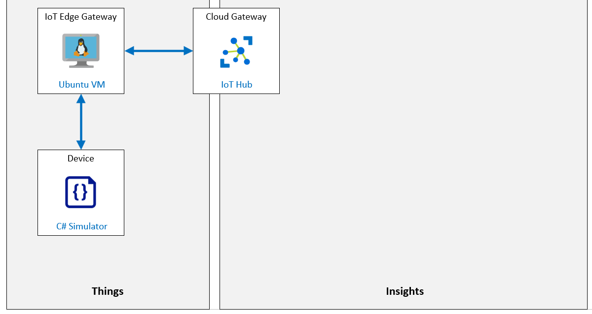
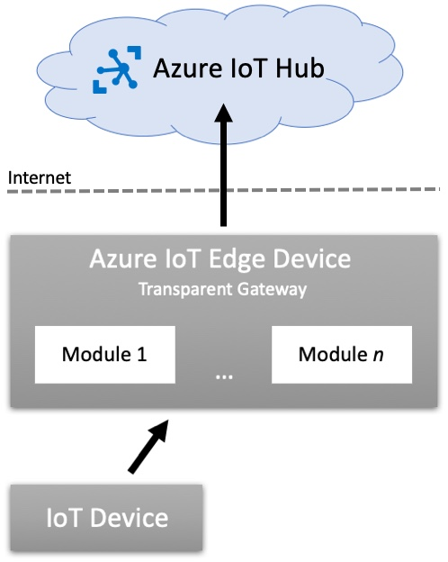

---
lab:
    title: 'Lab 14: Run an IoT Edge device in restricted network and offline'
    module: 'Module 7: Azure IoT Edge Module'
---

# Run an IoT Edge device in restricted network and offline

## Lab Scenario

The conveyor belt monitoring system that you've implemented at Contoso's cheese packaging and shipping facilities is paying off. The system is now sending telemetry data to Azure IoT Hub that helps operations to manage the vibration levels of the belts, and the new IoT Edge devices helping to manage inventory by tracking the number of cheese package that pass through the system.

Your manager wants the system to be resilient to network outages, which do still occur occasionally in some areas of the cheese processing facilities. In addition, the IT department has requested that you optimize the system to bulk upload any non-critical telemetry data at specific times in the day to help load balance network usage.

You propose configuring IoT Edge to support an offline scenario in case the network drops, and you will look into storing telemetry from sensors locally (on device) and configuring the Edge devices for regular syncs at given times.

The following resources will be created:



## In this Lab

In this lab, you will complete the following activities:

* Verify that the lab prerequisites are met (that you have the required Azure resources)

  * The script will create an IoT Hub if needed.
  * The script will create a new device identity needed for this lab.

* Deploy Azure IoT Edge Enabled Linux VM
* Setup an IoT Edge Parent device with a Child IoT device
* Configure the IoT Edge device as Gateway
* Open the IoT Edge Gateway device inbound ports using Azure CLI
* Configure the IoT Edge Gateway device Time-to-Live and Message Store
* Connect the Child IoT device to the IoT Edge Gateway
* Test the device connectivity and offline support

## Lab Instructions

### Exercise 1: Verify Lab Prerequisites

This lab assumes the following Azure resources are available:

| Resource Type | Resource Name |
| :-- | :-- |
| Resource Group | rg-az220 |
| IoT Hub | iot-az220-training-{your-id} |
| IoT Device | sensor-th-0050 |

> **Important**: Run the setup script to create the required device.

To create any missing resources and the new device you will need to run the **lab14-setup.azcli** script as instructed below before moving on to Exercise 2. The script file is included in the GitHub repository that you cloned locally as part of the dev environment configuration (lab 3).

The **lab14-setup.azcli** script is written to run in a **bash** shell environment - the easiest way to execute this is in the Azure Cloud Shell.

>**Note:** You will need the connection string for the **sensor-th-0050** device. If you already have this device registered with Azure IoT Hub, you can obtain the connection string by running the following command in the Azure Cloud Shell:

```bash
az iot hub device-identity connection-string show --hub-name iot-az220-training-{your-id} --device-id sensor-th-0050 -o tsv
```

#### Task 1: Execute Setup Script

1. Using a browser, open the [Azure Cloud Shell](https://shell.azure.com/) and login with the Azure subscription you are using for this course.

    If you are prompted about setting up storage for Cloud Shell, accept the defaults.

1. Verify that the Cloud Shell is using **Bash**.

    The dropdown in the top-left corner of the Azure Cloud Shell page is used to select the environment. Verify that the selected dropdown value is **Bash**.

1. On the Cloud Shell toolbar, click **Upload/Download files** (fourth button from the right).

1. In the dropdown, click **Upload**.

1. In the file selection dialog, navigate to the folder location of the GitHub lab files that you downloaded when you configured your development environment.

    In _Lab 3: Setup the Development Environment_, you cloned the GitHub repository containing lab resources by downloading a ZIP file and extracting the contents locally. The extracted folder structure includes the following folder path:

    * Allfiles
      * Labs
          * 14-Run an IoT Edge device in restricted network and offline
            * Setup

    The lab14-setup.azcli script file is located in the Setup folder for lab 14.

1. Select the **lab14-setup.azcli** file, and then click **Open**.

    A notification will appear when the file upload has completed.

1. To verify that the correct file has uploaded in Azure Cloud Shell, enter the following command:

    ```bash
    ls
    ```

    The `ls` command lists the content of the current directory. You should see the lab14-setup.azcli file listed.

1. To create a directory for this lab that contains the setup script and then move into that directory, enter the following Bash commands:

    ```bash
    mkdir lab14
    mv lab14-setup.azcli lab14
    cd lab14
    ```

1. To ensure that **lab14-setup.azcli** has the execute permission, enter the following command:

    ```bash
    chmod +x lab14-setup.azcli
    ```

1. On the Cloud Shell toolbar, to enable access to the lab14-setup.azcli file, click **Open editor** (second button from the right - **{ }**).

1. In the **FILES** list, to expand the lab14 folder and open the script file, click **lab14**, and then click **lab14-setup.azcli**.

    The editor will now show the contents of the **lab14-setup.azcli** file.

1. In the editor, update the `{your-id}` and `{your-location}` assigned values.

    Referencing the sample below as an example, you need to set `{your-id}` to the Unique ID you created at the start of this course - i.e. **cah191211**, and set `{your-location}` to the location that makes sense for your resources.

    ```bash
    #!/bin/bash

    # Change these values!
    YourID="{your-id}"
    Location="{your-location}"
    ```

    > **Note**:  The `{your-location}` variable should be set to the short name for the region where you are deploying all of your resources. You can see a list of the available locations and their short-names (the **Name** column) by entering this command:

    ```bash
    az account list-locations -o Table

    DisplayName           Latitude    Longitude    Name
    --------------------  ----------  -----------  ------------------
    East Asia             22.267      114.188      eastasia
    Southeast Asia        1.283       103.833      southeastasia
    Central US            41.5908     -93.6208     centralus
    East US               37.3719     -79.8164     eastus
    East US 2             36.6681     -78.3889     eastus2
    ```

1. In the top-right of the editor window, to save the changes made to the file and close the editor, click **...**, and then click **Close Editor**.

    If prompted to save, click **Save** and the editor will close.

    > **Note**:  You can use **CTRL+S** to save at any time and **CTRL+Q** to close the editor.

1. To create the resources required for this lab, enter the following command:

    ```bash
    ./lab14-setup.azcli
    ```

    This script can take a few minutes to run. You will see output as each step completes.

    The script will first create a resource group named **rg-az220** and an IoT Hub named **iot-az220-training-{your-id}**. If they already exist, a corresponding message will be displayed. The script will then add a device with an ID of **sensor-th-0050** to the IoT hub and display the device connection string.

1. Notice that, once the script has completed, the connection string for the device is displayed.

    The connection string starts with "HostName="

1. Copy the connection string into a text document, and note that it is for the **sensor-th-0050** device.

    Once you have saved the connection string to a location where you can find it easily, you will be ready to continue with the lab.

### Exercise 2: Deploy an Azure IoT Edge enabled Linux VM

In this exercise, use Azure CLI to create an Ubuntu Server VM with Azure IoT Edge runtime support.

#### Task 1: Create the VM

1. If necessary, log in to your Azure portal using your Azure account credentials.

    If you have more than one Azure account, be sure that you are logged in with the account that is tied to the subscription that you will be using for this course.

1. Take a moment to verify that you already have the **rg-az220vm** resource group tile pinned to your Azure dashboard.

    > **Note**: The **rg-az220vm** resource group was created in a previous lab and should be pinned to your dashboard. If it is not already pinned to your dashboard, you will create it below using CLI commands before creating the VM.

1. On the Azure portal toolbar, click **Cloud Shell**.

    Ensure that the environment is set to **Bash** in the shell.

1. If you need to create the **rg-az220vm** resource group, follow these instructions:

    To create a resource group for the Azure IoT Edge enabled VM, enter the following command:

    ```bash
    az group create --name rg-az220vm --location {your-location}
    ```

    > **Note**: in the command above, remember to replace `{your-location}` with a region close to you.

    To pin your new resource group to the dashboard, navigate to your Azure dashboard, and then complete the following:

    * On the Azure portal menu, click **Resource groups**.
    * On the **Resource groups** blade, under **Name**, locate the **rg-az220vm** resource group.
    * On the **rg-az220vm** row, on the right side of the blade, click **...** and then click **Pin to dashboard**.

    You may want to edit your dashboard to make the RG tiles and listed resources more accessible.

1. At the Cloud Shell command prompt, to create a Linux VM, enter the following two commands:

    ```bash
    az vm create --resource-group rg-az220vm --name vm-az220-training-gw0002-{your-id} --image Canonical:UbuntuServer:18.04-LTS:latest --admin-username vmadmin --admin-password {YOUR-PASSWORD-HERE} --authentication-type password
    ```

    > **Note**: Be sure to replace the placeholders that are included in the second command.

    The command creates the VM within the resource group specified above. Remember to update **vm-az220-training-gw0002-{your-id}** with your unique id and replace `{YOUR-PASSWORD-HERE}` with a suitably secure password.

    > **Note**: In production, you may elect to generate SSH keys rather than use the username/password approach. You can learn more about Linux VMs and SSH here: [https://docs.microsoft.com/en-us/azure/virtual-machines/linux/create-ssh-keys-detailed](https://docs.microsoft.com/en-us/azure/virtual-machines/linux/create-ssh-keys-detailed).
    >
    > **Note**:  Deployment will take approximately 5 minutes to complete. You can continue on to the next unit while it is deploying.

### Exercise 3: Set up the IoT Edge Parent with Child IoT Devices

The use of a Parent / Child relationship that includes an IoT Edge Gateway (the parent) and other IoT Devices (the child or leaf devices) enables the implementation of Offline capabilities within an Azure IoT solution. As long as the IoT Edge device has had one opportunity to connect to IoT Hub, that device and any child devices can continue to function with intermittent or no Internet connection.

The following diagram shows the relationship between an IoT Edge Device parent and a child device:



In this diagram, the child device connects to and authenticates against the parent IoT Edge Device. The child device uses their Azure IoT Hub credentials to achieve this authentication. Once authenticated, the child IoT Device sends messages to the Edge Hub (`$edgeHub`) on the IoT Edge Device. Once messages reach the parent IoT Edge Device, the IoT Edge Modules and Routing will handle the messages as configured; including sending the messages to the Azure IoT Hub when connected.

When the parent IoT Edge Device is disconnected (or loses connection to the Azure IoT Hub) it will automatically store all device messages to the IoT Edge Device. Once the connection is restored, the IoT Edge Device will resume connectivity and send any stored messages to Azure IoT Hub. Messages stored on the IoT Edge Device may expire according to the Time-to-Live (TTL) configurations for the device; which defaults to store messages for up to `7200` seconds (two hours).

In this exercise, you will register an IoT Edge Device with Azure IoT Hub, and then create an IoT Device and configure it as a child of the IoT Edge Device. This will enable the scenario described above, where the child IoT Device sends messages through the parent IoT Edge Gateway Device before communications are sent to the Azure IoT Hub in the cloud. If the connection between the Edge Gateway Device and IoT Hub is lost, messages will be saved by the Edge Gateway Device (within configured limits) until the connection is restored.

1. If necessary, log in to your Azure portal using your Azure account credentials.

    If you have more than one Azure account, be sure that you are logged in with the account that is tied to the subscription that you will be using for this course.

1. On the Azure portal toolbar, click **Cloud Shell**

    Ensure that the environment is using **Bash**.

1. To create a new **IoT Edge Device Identity** within Azure IoT Hub, enter the following command:

    ```sh
    az iot hub device-identity create --edge-enabled --hub-name iot-az220-training-{your-id} --auth-method shared_private_key --device-id vm-az220-training-gw0002-{your-id}
    ```

    > **Note**:  Be sure to replace the **iot-az220-training-{your-id}** IoT Hub name with the name of your Azure IoT Hub.

    Notice that the following parameters are included in the `az iot hub device-identity create` command:

    * `--hub-name`: This required parameter is used to specify the name of the **Azure IoT Hub** to add the new device to.

    * `--device-id`: This required parameter is used to specify the **Device ID** of the IoT Device being created.

    * `--edge-enabled`: This specifies the IoT Device being created is an **IoT Edge Device** and it will be enabled for IoT Edge.

    * `--auth-method`: This specifies the authentication method used for the IoT device. The value of `shared_private_key` specifies to use Symmetric Key Encryption. Other options available are `x509_ca` and `x509_thumbprint`.

1. Take a minute to review the JSON output generated by the command.

    Notice that when the command completes, there is a blog of JSON returned to the terminal. This JSON includes a few details for the configuration of the **IoT Edge Device** that was just created. Among the device details is the **symmetric keys** that were auto-generated by the service for the device.

    ```json
        {
          "authentication": {
            "symmetricKey": {
              "primaryKey": "gOAYooDeRrinZzyo0yWZNEkvc0wZaF9/4qaXv7s7olw=",
              "secondaryKey": "MzE5VtKJzOO6HGnNkI4kyn+MCziUYXZ/MSJCKxHIHa0="
            },
            "type": "sas",
            "x509Thumbprint": {
              "primaryThumbprint": null,
              "secondaryThumbprint": null
            }
          },
          "capabilities": {
            "iotEdge": true
          },
          "cloudToDeviceMessageCount": 0,
          "connectionState": "Disconnected",
          "connectionStateUpdatedTime": "0001-01-01T00:00:00",
          "deviceId": "vm-az220-training-gw0002-{your-id}",
          "deviceScope": "ms-azure-iot-edge://vm-az220-training-gw0002-{your-id}-637121074930370650",
          "etag": "Nzk1MjE0NjM2",
          "generationId": "637121074930370650",
          "lastActivityTime": "0001-01-01T00:00:00",
          "status": "enabled",
          "statusReason": null,
          "statusUpdatedTime": "0001-01-01T00:00:00"
        }
    ```

1. To retrieve the **Connection String** of the **vm-az220-training-gw0002-{your-id}** device from IoT Hub, enter the following command:

    ```cmd/sh
    az iot hub device-identity connection-string show --hub-name iot-az220-training-{your-id} --device-id vm-az220-training-gw0002-{your-id} -o tsv
    ```

    > **Note**:  Be sure to replace the **iot-az220-training-{your-id}** IoT Hub name with the name of your Azure IoT Hub.

    Notice the `az iot hub device-identity connection-string show` command is called by passing in several parameters:

    * `--hub-name`: This required parameter is used to specify the name of the **Azure IoT Hub** to add the new device to.

    * `--device-id`: This required parameter is used to specify the **Device ID** of the IoT Device being created.

    The IoT Hub connection string output from the **vm-az220-training-gw0002-{your-id}** device will be in the following format:

    ```text
    HostName={iot-hub-name}.azure-devices.net;DeviceId=vm-az220-training-gw0002-{your-id};SharedAccessKey={shared-access-key}
    ```

1. Save a copy of the connection string value for reference later in this lab.

    The next step is to create the child IoT Device that will connect directly to the parent IoT Edge Gateway Device for communications with IoT hub.

1. To create an IoT Device and configure it as a child of your IoT Edge Device, run the following command:

    ```sh
    az iot hub device-identity create -n iot-az220-training-{your-id} --device-id sensor-th-0084 --pd vm-az220-training-gw0002-{your-id}
    ```

    > **Note**:  Be sure to replace the **iot-az220-training-{your-id}** IoT Hub name with the name of your Azure IoT Hub.

    This command is passed the following parameters:

    * `-n`: This required parameter is the shorthand for `--hub-name` and is used to specify the name of the **Azure IoT Hub** to add the new device to.

    * `--device-id`: This required parameter is used to specify the **Device ID** of the IoT Device being created.

    * `--pd`: This parameter specifies the **Parent Device** for the IoT Device being created. The value passed in must be the **Device ID** of the **Parent Device** to assign this **Child Device** to.

    Notice that this command is not passing in the `--auth-method`. By omitting this parameter, the default value of `shared_private_key` will be used.

1. Take a minute to review the JSON output of this command.

    Notice when the command completes, there is a blog of JSON returned to the terminal. This JSON includes a few details for the configuration of the **IoT Device** that was just created. Notice the `symmetricKey` node that contains the Symmetric Keys that can be used to authenticate the device with Azure IoT Hub, or when the child device connects to the parent IoT Edge Gateway.

    You will need the **primaryKey** for this IoT Device so it can be used later.

    ```json
        {
          "authentication": {
            "symmetricKey": {
              "primaryKey": "uMhYoXK/WRoXrIATh25aijyEbA401PKDxy4KCS488U4=",
              "secondaryKey": "9tOPmSkmoqRd2KEP1JFyQQ6y2JdA5HPO7qnckFrBVm4="
            },
            "type": "sas",
            "x509Thumbprint": {
              "primaryThumbprint": null,
              "secondaryThumbprint": null
            }
          },
          "capabilities": {
            "iotEdge": false
          },
          "cloudToDeviceMessageCount": 0,
          "connectionState": "Disconnected",
          "connectionStateUpdatedTime": "0001-01-01T00:00:00",
          "deviceId": "sensor-th-0084",
          "deviceScope": "ms-azure-iot-edge://vm-az220-training-gw0002-{your-id}-637121074930370650",
          "etag": "MTgxNjg1MjE0",
          "generationId": "637121169262975883",
          "lastActivityTime": "0001-01-01T00:00:00",
          "status": "enabled",
          "statusReason": null,
          "statusUpdatedTime": "0001-01-01T00:00:00"
        }
    ```

1. Save a copy of the `primaryKey` value for reference later in this lab.

1. To retrieve the **Connection String** of the **sensor-th-0084** device from IoT Hub, enter the following command:

    ```cmd/sh
    az iot hub device-identity connection-string show --hub-name iot-az220-training-{your-id} --device-id sensor-th-0084 -o tsv
    ```

    > **Note**:  Be sure to replace the **iot-az220-training-{your-id}** IoT Hub name with the name of your Azure IoT Hub.

1. Save a copy of the connection string value for reference later in this lab.

1. Consider the results of the actions that you just completed.

    You now have an IoT Edge Device and a Child IoT Device registered within Azure IoT Hub. The **IoT Device** is configured with the **IoT Edge Device** as its parent.

    This configuration will enable the Child IoT Device to connect to and communicate with the Parent IoT Edge Device instead of connecting directly with Azure IoT Hub. Configuring the IoT device topology this way enables Offline capable scenarios where the IoT Device and IoT Edge Device can keep working even when connectivity to Azure IoT Hub is broken.

### Exercise 4: Configure IoT Edge Device as Gateway

Recall that an IoT Edge Transparent Gateway should be used when you want the downstream devices to have their own IoT Hub identities and could theoretically connect to IoT Hub on their own. The gateway simply passes communications between the devices and IoT Hub. You implement the Gateway device to support the offline scenario that occurs when the network connection is lost.

In this exercise, you will configure the Azure IoT Edge on Ubuntu virtual machine (that was created previously) to be an IoT Edge Transparent Gateway device.

> **Note**: You will use a helper script to configure the IoT Edge Device as a Transparent Gateway. This will enable you to complete the process more quickly.

#### Task 1 - Ensure VM is running

1. If necessary, on the Azure portal toolbar, click **Cloud Shell**

    Ensure that the environment is using **Bash**.

1. To view the status of the VMs in the **rg-az220vm** group, enter the following command:

    ```bash
    az vm list --show-details --resource-group rg-az220vm -o table
    ```

    You will see a list of VMs within the **rg-az220vm**. Find the row for the **vm-az220-training-gw0002-{your-id}** VM and review the value of the **PowerState** column. If the **PowerState** is **VM running**, make a note of the **PublicIps** value.

1. If the VM **PowerState** is not equal to **VM running**, to start the VM, enter the following command:

    ```bash
    az vm start --name vm-az220-training-gw0002-{your-id} --resource-group rg-az220vm
    ```

    The command will take a few minutes to complete.

1. To obtain the **Public IP** of the **vm-az220-training-gw0002-{your-id}** VM, reenter the following command:

    ```bash
    az vm list --show-details --resource-group rg-az220vm -o table
    ```

    Confirm that the **PowerState** is **VM running** and make a note of the **PublicIps** value.

#### Task 2: Add the Microsoft installation packages to the package manager

1. If necessary, log in to your Azure portal using your Azure account credentials.

1. On the Azure portal toolbar, click **Cloud Shell**

    Ensure that the environment is set to use **Bash**.

1. At the Cloud Shell command prompt, to establish an SSH connection to your Edge VM, enter the following command:

    ```bash
    ssh {username}@{Public-IP-Address}
    ```

    Be sure to replace the placeholder values for username and the **Public IP Address**. For example: `ssh vmadmin@52.170.205.37`

1. When you see the prompt **Are you sure you want to continue connecting (yes/no)?**, enter **yes**

1. To configure the VM to access the Microsoft installation packages, run the following command:

    ```bash
    curl https://packages.microsoft.com/config/ubuntu/18.04/multiarch/prod.list > ./microsoft-prod.list
    ```

1. To add the downloaded package list to the package manager, run the following command:

    ```bash
    sudo cp ./microsoft-prod.list /etc/apt/sources.list.d/
    ```

1. To install the packages, the Microsoft GPG public key must be installed. Run the following commands:

    ```bash
    curl https://packages.microsoft.com/keys/microsoft.asc | gpg --dearmor > microsoft.gpg
    sudo cp ./microsoft.gpg /etc/apt/trusted.gpg.d/
    ```

    > **IMPORTANT**: Azure IoT Edge software packages are subject to the license terms located in each package **(usr/share/doc/{package-name}** or the **LICENSE** directory). Read the license terms prior to using a package. Your installation and use of a package constitutes your acceptance of these terms. If you do not agree with the license terms, do not use that package.

#### Task 3: Install a container engine

Azure IoT Edge relies on an OCI-compatible container runtime. For production scenarios, the Moby engine is recommended. The Moby engine is the only container engine officially supported with Azure IoT Edge. Docker CE/EE container images are compatible with the Moby runtime.

1. To update the package lists on the device, run the following command:

    ```bash
    sudo apt-get update
    ```

    This command may take a few minutes to run.

1. To install the **Moby** engine, run the following command:

    ```bash
    sudo apt-get install moby-engine
    ```

    If prompted to continue, enter **Y**. The install may take a few minutes.

#### Task 4: Install IoT Edge

The IoT Edge security daemon provides and maintains security standards on the IoT Edge device. The daemon starts on every boot and bootstraps the device by starting the rest of the IoT Edge runtime.

1. Usually, updating the package list is a good practice before installing a new package, however the packages were updated in the previous task.To update the package lists on the device, you would run the following command:

    ```bash
    sudo apt-get update
    ```

1. To list the versions of **IoT Edge runtime** that are available, run the following command:

    ```bash
    apt list -a iotedge
    ```

    > **TIP**: This command is useful if you need to install an earlier version of the runtime.

1. To install the latest version of the **IoT Edge runtime**, run the following command:

    ```bash
    sudo apt-get install iotedge
    ```

    If prompted to continue, enter **Y**. The install may take a few minutes.

    > **TIP**: If you wanted to install an earlier version that appeared in the output of the `apt list -a iotedge` command, say **1.0.9-1**, you would use the following command:
    > ```bash
    > sudo apt-get install iotedge=1.0.9-1 libiothsm-std=1.0.9-1
    > ```

1. To confirm that the Azure IoT Edge Runtime is installed on the VM, run the following command:

    ```bash
    iotedge version
    ```

    This command outputs the version of the Azure IoT Edge Runtime that is currently installed on the virtual machine.

    The version output will be similar to the following:

    ```bash
    vmadmin@vm-az220-training-gw0002-dm200420:~$ iotedge --version
    iotedge 1.1.1
    ```

1. At the Cloud Shell command prompt, to close the SSH session, type **exit** and then press **Enter**.

#### Task 5: Configure helper scripts

1. Open a new instance of Visual Studio Code.

1. On the Visual Studio Code **File** menu, click **Open Folder**.

1. In the Open Folder dialog, navigate to your lab 14 Setup folder.

    In _Lab 3: Setup the Development Environment_, you cloned the GitHub repository containing lab resources by downloading a ZIP file and extracting the contents locally. The extracted folder structure includes the following folder path:

    * Allfiles
      * Labs
          * 14-Run an IoT Edge device in restricted network and offline
            * Setup

1. Click **Setup**, and then click **Select Folder**.

1. In the **EXPLORER** pane, click **setup-iot-edge-gateway.sh**.

1. In the code editor, replace the placeholder values as follows:

    The variables that you need to update are located near the top of the `setup-iot-edg-gateway.sh` script, and are similar to the following before the placeholders are replaced:

    ```sh
    connectionstring="{iot-edge-device-connection-string}"
    hostname="{iot-edge-device-hostname}"
    ```

    Guidance on the placeholder values:

    | Placeholder | Value to replace with |
    | :--- | :--- |
    | `{iot-edge-device-connection-string}` | Paste in the **Connection String** for the **vm-az220-training-gw0002-{your-id}** IoT Edge Device that was created within Azure IoT Hub.
    | `{iot-edge-device-hostname}` | Paste in the **Public IP address** of the **vm-az220-training-gw0002-{your-id}** IoT Edge on Ubuntu VM that you created above. The Public IP address will be used by the Child IoT Device as the DNS Hostname that it needs to connect to the IoT Edge Transparent Gateway. You can find the Public IP address listed on the Overview pane of the **vm-az220-training-gw0002-{your-id}** virtual machine in the Azure portal.

1. On the **File** menu, click **Save**.

1. In the **EXPLORER** pane, click **setup-remote-iot-edge-gateway.sh**.

1. In the code editor, replace the placeholder values as follows:

    The variables that you need to update are located near the top of the `setup-remote-iot-edg-gateway.sh` script, and are similar to the following before the placeholders are replaced:

    ```sh
    username="{iot-edge-username}"
    ipaddress="{iot-edge-ipaddress}"
    ```

    Guidance on the placeholder values:

    | Placeholder | Value to replace with |
    | :--- | :--- |
    | `{iot-edge-username}` | Enter the admin **username** to connect to the **vm-az220-training-gw0002-{your-id}** IoT Edge on Ubuntu VM. This username will be used to connect to the VM via SSH. This username is specified as **vmadmin** within the Azure CLI command that was provided (for creating the VM) earlier in this lab.
    | `{iot-edge-ipaddress}` | Enter the **Public IP Address** for the **vm-az220-training-gw0002-{your-id}** IoT Edge on Ubuntu VM. This IP address will be used to connect to the VM via SSH.

1. On the **File** menu, click **Save**.

#### Task 6: Execute helper scripts

1. On the Azure Cloud Shell toolbar, click **Upload/Download files** (fourth button from the right).

1. In the dropdown, click **Upload**.

1. In the file selection dialog, navigate to lab 14 Setup folder.

    The setup-iot-edge-gateway.sh and setup-remote-iot-edge-gateway.sh script files are located in the Setup folder for lab 14. This is the same folder location that you opened in Visual Studio Code above, when you updated the script files.

    * Allfiles
      * Labs
          * 14-Run an IoT Edge device in restricted network and offline
            * Setup

1. Select the **setup-iot-edge-gateway.sh** and **setup-remote-iot-edge-gateway.sh** script files, and then click **Open**.

    A notification will appear when the upload has completed.

    > **Note**:  These two helper scripts will assist in setting up the Azure IoT Edge on Ubuntu VM to be a Transparent Gateway device. These scripts are meant to be used for development purposes in this lab, and are not meant for production use.

1. To verify that both files have been uploaded, enter the following command:

    ```bash
    ls
    ```

    The `ls` command lists the content of the current directory. Ensure that you have both files before continuing.

1. To correct any DOS vs UNIX end-of-line character issues, execute the following commands:

    ```sh
    dos2unix setup-remote-iot-edge-gateway.sh
    dos2unix setup-iot-edge-gateway.sh
    ```

1. To ensure that the **setup-remote-iot-edge-gateway.sh** has read/write/execute permissions, enter the following command:

    ```sh
    chmod 700 setup-remote-iot-edge-gateway.sh
    ```

1. To setup your IoT Edge on Ubuntu VM as an IoT Edge Transparent Gateway, enter the following command:

    ```sh
    ./setup-remote-iot-edge-gateway.sh
    ```

    If you see a message telling you that the authenticity of host can't be established and asking you if you sure you want to continue connecting, enter **yes**

1. When prompted, enter the password for the IoT Edge on Ubuntu VM.

    There will be a total of 3 prompts to enter the password. These prompts are due to the `ssh` and `scp` commands used to upload the `setup-iot-edge-gateway.sh` helper script to the VM, run the script, and then download the X.509 certificate that will be used later to authenticate the Child IoT Device to the IoT Edge Transparent Gateway.

    When the helper script finishes configuring the IoT Edge on Ubuntu VM to be an IoT Edge Transparent Gateway, the Cloud Shell will download the `azure-iot-test-only.root.ca.cert.pem` X.509 certificate.

1. When prompted, save the X.509 certificate to your Downloads folder.

    This certificate will be used to configure the Child IoT Device authentication.

    > **Note**: If the X.509 certificate isn't downloaded automatically within the web browser, open a Cloud Shell command prompt, and then run the following command:

    ```sh
    download azure-iot-test-only.root.ca.cert.pem
    ```

    In this exercise, you used helper scripts to setup and configure the IoT Edge on Ubuntu VM as an IoT Edge Transparent Gateway Device. Using script files keeps the lab activity focused on the bigger scenario - understanding the restricted network and offline capabilities of Azure IoT Edge. For step-by-step instruction on setting up the IoT Edge on Ubuntu VM as an IoT Edge Transparent Gateway, see lab 12 of this course.

### Exercise 5: Open IoT Edge Gateway Device Inbound Ports using Azure CLI

For the Azure IoT Edge Gateway to communicate with Child IoT Devices, the TCP/IP port for the devices protocol must be open for **Inbound** communication. Devices can use any one of the three supported protocols to communicate with the IoT Gateway.

These are the TCP/IP port numbers for the supported protocols:

| Protocol | Port Number |
| --- | --- |
| MQTT | 8883 |
| AMQP | 5671 |
| HTTPS<br/>MQTT + WS (Websocket)<br/>AMQP + WS (Websocket) | 443 |

In this exercise, you will use the Azure CLI to configure the Network Security Group (NSG) that secures access to the Azure IoT Edge Gateway from the Internet. The necessary ports for MQTT, AMQP, and HTTPS communications need to be opened so the downstream IoT device(s) can communicate with the gateway.

1. If necessary, log in to your Azure portal using your Azure account credentials.

    If you have more than one Azure account, be sure that you are logged in with the account that is tied to the subscription that you will be using for this course.

1. On your Dashboard, locate the resource group tile containing your **vm-az220-training-gw0002-{your-id}** virtual machine.

1. Notice that this resource group also contains the **vm-az220-training-gw0002-{your-id}NSG** Network security group (NSG) that was created for the **vm-az220-training-gw0002-{your-id}** virtual machine.

1. On the Azure portal toolbar, click **Cloud Shell**.

    Ensure that the environment is set to use **Bash**.

1. At the Cloud Shell command prompt, to list the name of the Network Security Group (NSG) being used by your Azure IoT Edge Gateway VM, enter the following command:

    ```bash
    az network nsg list --resource-group rg-az220vm -o table
    ```

    You should see output similar to the following:

    ```text
    Location    Name                                    ProvisioningState    ResourceGroup    ResourceGuid
    ----------  --------------------------------------  -------------------  ---------------  ------------------------------------
    westus2     vm-az220-training-gw0001-{your-id}-nsg  Succeeded            rg-az220vm       <GUID>
    westus2     vm-az220-training-gw0002-{your-id}NSG   Succeeded            rg-az220vm       <GUID>
    ```

1. At the Cloud Shell command prompt, to add **Inbound rules** to the NSG for MQTT, AMQP, and HTTPS communication protocols, enter the following commands:

    ```cmd/sh
    az network nsg rule create --name MQTT --nsg-name vm-az220-training-gw0002-{your-id}NSG --resource-group rg-az220vm --destination-port-ranges 8883 --priority 101
    az network nsg rule create --name AMQP --nsg-name vm-az220-training-gw0002-{your-id}NSG --resource-group rg-az220vm --destination-port-ranges 5671 --priority 102
    az network nsg rule create --name HTTPS --nsg-name vm-az220-training-gw0002-{your-id}NSG --resource-group rg-az220vm --destination-port-ranges 443 --priority 103
    ```

    Be sure to replace the **{your-id}** placeholders above with the appropriate value before running the commands.

    > **Note**:  In production, it's best practice to only open inbound communication to the communication protocol(s) in use by your IoT devices. If your devices only use MQTT, then only open inbound communication for that port. This will help limit the surface attack area of open ports that could be exploited.

    With the **Inbound rules** added to the **Network Security Group** (NSG), the Child IoT Device will be allowed to communicate with the IoT Edge Gateway virtual machine.

### Exercise 6: Configure IoT Edge Device Time-to-Live and Message Storage

Configuring your IoT Edge Devices for extended offline scenarios includes specifying the supported period of time that you may be offline, often referred to as Time-to-Live, and specifying your local storage settings.

The default value for Time-to-Live (TTL) is `7200` (7200 seconds, which is 2 hours). This is plenty of time for quick interruptions, but there are cases when two hours may not be long enough, when a device or solution needs to function in Offline mode for an extended period of time. For the solution to operate without telemetry data loss when extended periods in a disconnected state can occur, you can configure the TTL property of the IoT Edge Hub module to a value up to 1,209,600 seconds (a 2 week TTL period).

The IoT Edge Hub module (`$edgeHub`) is used to coordinate communications between the the Azure IoT Hub service and the IoT Edge Hub running on the gateway device. Within the Desired Properties for the Module Twin, the `storeAndForwardConfiguration.timeToLiveSecs` property specifies the time in seconds that IoT Edge Hub keeps messages when in a state disconnected from routing endpoints, such as the Azure IoT Hub service. The `timeToLiveSecs` property for the Edge Hub can be specified in the Deployment Manifest on a specific device as part of a single-device or at-scale deployment.

The IoT Edge Device will automatically store messages when in a disconnected / offline state. The storage location can be configured using a `HostConfig` object.

In this exercise, you will use the Azure Portal user interface for Azure IoT Hub to modify the `timeToLiveSecs` property for the Edge Hub (`$edgeHub`) module on the single IoT Edge Gateway device. You will also configure the storage location on the IoT Edge Device where the messages are to be stored.

#### Task 1: Configure the $edgeHub Module Twin

1. If necessary, log in to your Azure portal using your Azure account credentials.

    If you have more than one Azure account, be sure that you are logged in with the account that is tied to the subscription that you will be using for this course.

1. On your **rg-az220** resource group tile, click **iot-az220-training-{your-id}**.

1. On left-side menu of your IoT hub blade, under **Automatic Device Management**, click **IoT Edge**.

    This pane allows you to manage the IoT Edge devices connected to the IoT Hub.

1. Under **Device ID**, click **vm-az220-training-gw0002-{your-id}**.

1. Under **Modules**, click **$edgeHub**.

    The Module Identity Details blade of the **Edge Hub** module provides access to the Module Identity Twin and other resources for your IoT Edge Device.

1. On the **Module Identity Details** blade, click **Module Identity Twin**.

    This blade contains the module identity twin for `vm-az220-training-gw0002-{your-id}/$edgeHub` displayed as JSON in an editor pane.

1. Take a moment to review the contents of the $edgeHub module identity twin.

    Notice that since this is a new device the desired properties are essentially empty.

1. Close the **Module Identity Twin** blade.

1. Navigate back to the **vm-az220-training-gw0002-{your-id}** blade.

1. At the top of the blade, click **Set Modules**.

    The **Set modules on device** blade enables you to create and configure the IoT Edge Modules deployed to this IoT Edge Device.

1. On the **Set modules** blade, under **Iot Edge Modules**, click **Runtime Settings**.

1. On the **Runtime Settings** pane, locate the **Store and forward configuration - time to live (seconds)** field.

1. In the **Store and forward configuration - time to live (seconds)** textbox, enter **1209600**

    This specifies a message Time-to-Live value of 2 weeks for the IoT Edge Device, which is the maximum time.

    > **Note**:  There are several things to consider when configuring the **Message Time-to-Live** (TTL) for the Edge Hub (`$edgeHub`) module. When the IoT Edge Device is disconnected, the messages are stored on the local device. You need to calculate how much data will be stored during the TTL period, and make sure there is enough storage on the device for that much data. The amount of storage and TTL configured will need to meet the solutions requirements if you want to avoid the loss of important data.
    >
    > If the device does not have enough storage, then you need to configure a shorter TTL. Once the age of a message reaches the TTL time limit, it will be deleted if it has not yet been sent to Azure IoT Hub.

    The IoT Edge Device will automatically store messages when in a disconnected / offline state. The storage location can be configured using a `HostConfig` object.

1. Locate the **Create Options** field.

    Notice that this field contains a `HostConfig` JSON object that can be configured. You will create a `HostConfig` property and an Environment Variable to configure the storage location for your Edge device.

1. In the `HostConfig` object, below the closing bracket of `PortBindings` property, add the following `Binds` property:

    ```json
    "Binds": [
        "/etc/iotedge/storage/:/iotedge/storage/"
    ]
    ```

    > **Note**: Be sure to separate the `PortBindings` property from the `Binds` property with a comma.

    The resulting JSON in the **Create Options** textbox should look similar to the following:

    ```json
    {
        "HostConfig": {
            "PortBindings": {
                "443/tcp": [
                {
                    "HostPort": "443"
                }
                ],
                "5671/tcp": [
                {
                    "HostPort": "5671"
                }
                ],
                "8883/tcp": [
                {
                    "HostPort": "8883"
                }
                ]
            },
            "Binds": [
                "/etc/iotedge/storage/:/iotedge/storage/"
            ]
        }
    }
    ```

    This `Binds` value configures the `/iotedge/storage/` directory in the Docker container for the Edge Hub Module to be mapped to the `/etc/iotedge/storage/` host system directory on the physical IoT Edge Device.

    The value is in the format of `<HostStoragePath>:<ModuleStoragePath>`. The `<HostStoragePath>` value is the host directory location on the IoT Edge Device. The `<ModuleStoragePath>` is the module storage path made available within the container. Both of these values must specify an absolute path.

1. Locate the **Environment Variables** field.

    You need to add a new environment variable in order to complete the configuration of the message storage location.

1. Under **Environment Variables**, in the **Name** textbox, enter **storageFolder**

1. Under **Environment Variables**, in the **Value** textbox, enter **/iotedge/storage/**

1. At the bottom of the **Runtime Settings** pane, click **Save**.

1. On the **Set modules on device** blade, click **Review + create**.

1. Take a minute to review the contents of the deployment manifest.

    Find your updates within the deployment manifest. You will need to look under both `$edgeAgent` and `$edgeHub` to find them.

1. At the bottom of the blade, click **Create**.

    Once the change is saved, the **IoT Edge Device** will be notified of the change to the Module configuration and the new settings will be reconfigured on the device accordingly.

    Once the changes have been passed to the Azure IoT Edge device, it will restart the **edgeHub** module with the new configuration.

#### Task 2: Update Directory Permissions

Before continuing, it is essential for you to ensure that the user profile for the IoT Edge Hub module has the required read, write, and execute permissions to the **/etc/iotedge/storage/** directory.

1. On your Azure portal dashboard, click **vm-az220-training-gw0002-{your-id}**.

    This should open a blade for your IoT Edge virtual machine, and the Overview pane should be selected.

1. At the top of the **vm-az220-training-gw0002-{your-id}** blade, click **Connect**, and then click **SSH**.

1. Under **Connect via SSH with Client**, locate the **4. Run the example command below to connect to your VM.** field.

    You will use an SSH command to connect to the virtual machine. You need a command that is formatted similar to `ssh username@52.170.205.79`.

1. Below and to the right of the **4. Run the example command below to connect to your VM.** field, click **Copy to clipboard**.

1. Paste the value into Notepad (or another text editor).

    > **Note**: If the sample command includes `-i <private key path>`, you must remove that portion of the command. You need a command that is formatted similar to `ssh username@52.170.205.79`.

1. On the Azure portal toolbar, click **Cloud Shell**.

    Ensure that the environment is set to **Bash**.

1. At the Cloud Shell command prompt, paste in the `ssh` command from the clipboard, and then press **Enter**.

1. If you are prompted with **Are you sure you want to continue connecting?**, type `yes` and press Enter.

    This prompt is a security confirmation since the certificate used to secure the connection to the VM is self-signed. The answer to this prompt will be remembered for subsequent connections, and is only prompted on the first connection.

1. When prompted to enter the password, enter the Administrator password that was entered when the VM was provisioned.

    Once connected, the terminal prompt will be updated to display the name of the Linux VM that you are connected to. For example:

    ```cmd/sh
    username@vm-az220-training-gw0002-{your-id}:~$
    ```

1. To view the running IoT Edge modules, enter the following command:

    ```bash
    iotedge list
    ```

1. Take a moment to review the output of the `iotedge list` command:

    You should see that the *edgeHub* has failed to start:

    ```text
    NAME             STATUS           DESCRIPTION                 CONFIG
    edgeAgent        running          Up 4 seconds                mcr.microsoft.com/azureiotedge-agent:1.0
    edgeHub          failed           Failed (139) 0 seconds ago  mcr.microsoft.com/azureiotedge-hub:1.0
    ```

    This is due to the fact that the *edgeHub* process does not have permission to write to the **/etc/iotedge/storage/** directory.

1. To confirm the issue with the directory permission, enter the following command:

    ```bash
    iotedge logs edgeHub
    ```

    The terminal will output the current log - if you scroll through the log you will see the relevant entry that looks similar to the following:

    ```text
    Unhandled Exception: System.AggregateException: One or more errors occurred. (Access to the path '/iotedge/storage/edgeHub' is denied.) ---> System.UnauthorizedAccessException: Access to the path '/iotedge/storage/edgeHub' is denied. ---> System.IO.IOException: Permission denied
    ```

1. To update the directory permissions, enter the following commands:

    ```sh
    sudo chown $( whoami ):iotedge /etc/iotedge/storage/
    sudo chmod 775 /etc/iotedge/storage/
    ```

    The first command sets the owner of the directory to the current user and the owning user group to **iotedge**. The second command enables full access to both the current user and members of the **iotedge** group. This will ensure that the *edgeHub* module is able to create directories and files within the **/etc/iotedge/storage/** directory.

    > **NOTE**: If you see an error stating **chown: cannot access '/etc/iotedge/storage/': No such file or directory**, create the directory using the following command and then re-run the commands above:

    ```sh
    sudo mkdir /etc/iotedge/storage
    ```

1. To restart the *edgeHub* module, and then verify that it is started, enter the following commands:

    ```bash
    iotedge restart edgeHub
    iotedge list
    ```

    You should see that the *edgeHub* module is now running:

    ```text
    NAME             STATUS           DESCRIPTION      CONFIG
    edgeAgent        running          Up 13 minutes    mcr.microsoft.com/azureiotedge-agent:1.0
    edgeHub          running          Up 6 seconds     mcr.microsoft.com/azureiotedge-hub:1.0
    ```

You are now ready to connect an IoT device (the child/leaf) to this IoT Edge Gateway device.

### Exercise 7: Connect Child IoT Device to IoT Edge Gateway

The process to authenticate regular IoT devices to IoT Hub with symmetric keys also applies to downstream (or child / leaf) devices. The only difference is that you need to add a pointer to the Gateway Device to route the connection or, in offline scenarios, to handle the authentication on behalf of IoT Hub.

> **Note**: You will be using the connection string value for **sensor-th-0084** that you saved earlier in the lab. If you need a new copy of the connection string, it can be accessed from your Azure IoT Hub in the Azure portal. Open the **IoT devices** pane of your IoT Hub, click **sensor-th-0084**, copy the **Primary Connection String**, and then save it to a text file.

In this exercise, you will configure the downstream IoT device (child or leaf device) to connect to IoT Hub using Symmetric Keys. The devices will be configured to connect to IoT Hub and the parent IoT Edge Device using a Connection String that contains the Symmetric Key (in addition to the Gateway Hostname for the Parent IoT Edge Device).

1. Open the Windows **File Explorer** app, and then navigate to your **Downloads** folder.

    Your Downloads folder should contain the X.509 certificate file that was downloaded when you configured the IoT Edge Gateway. You need to copy this certificate file to the root directory of your IoT device app.

1. In the **Downloads** folder, right-click **azure-iot-test-only.root.ca.cert.pem**, and then click **Copy**.

    > **Note**: If you already had an azure-iot-test-only.root.ca.cert.pem file in your Downloads folder, the file that you need may be named azure-iot-test-only.root.ca.cert (1).pem. You will need to rename it to azure-iot-test-only.root.ca.cert.pem once you've added it to the destination folder.

    This file is the X.509 certificate file that you downloaded and will be adding to the lab 14 /Starter/ChildIoTDevice directory (where the source code for the Child IoT Device is located).

1. Navigate to the lab 14 Starter folder, and then paste the copied file into the **ChildIoTDevice** folder.

1. Ensure that the copied certificate file is named **azure-iot-test-only.root.ca.cert.pem**

    If you already had an azure-iot-test-only.root.ca.cert.pem file in your Downloads folder, the file may have been named azure-iot-test-only.root.ca.cert (1).pem.

1. Open a new instance of Visual Studio Code.

1. On the **File** menu, click **Open Folder**.

1. In the **Open Folder** dialog, navigate to the lab 14 **Starter** folder, click **ChildIoTDevice**, and then click **Select Folder**.

    You should now see the project files listed in the EXPLORER pane.

1. In the Visual Studio Code **EXPLORER** pane, click **Program.cs**.

1. In the **Program.cs** file, locate the declaration for the **connectionString** variable.

1. Replace the placeholder value with the Primary Connection String for the **sensor-th-0084** IoT Device.

1. Modify the Connection String value to include the **GatewayHostName** property as follows:

    The **GatewayHostName** property should be set to the value of the Public IP Address for the IoT Edge Gateway virtual machine.

    The updated Connection String will match the following format:

    ```text
    HostName=<iot-hub-name>.azure-devices.net;DeviceId=DownstreamDevice1;SharedAccessKey=<iot-device-key>;GatewayHostName=<iot-edge-gateway-hostname>
    ```

    Be sure to replace the placeholders shown above with the appropriate values:

    * **\<IoT-Hub-Name\>**: The Name of the Azure IoT Hub.
    * **\<IoT-Device-Primary-Key\>**: The Primary Key for the sensor-th-0084 IoT Device in Azure IoT Hub.
    * **\<IoT-Edge-Gateway-Hostname\>**: The Public IP Address of the **vm-az220-training-gw0002-{your-id}** virtual machine (Edge Gateway).

    The **connectionString** variable assignment code should look similar to the following:

    ```csharp
    private readonly static string connectionString = "HostName=iot-az220-training-1119.azure-devices.net;DeviceId=sensor-th-0084;SharedAccessKey=ygNT/WqWs2d8AbVD9NAlxcoSS2rr628fI7YLPzmBdgE=;GatewayHostName=40.124.67.13";
    ```

1. On the **File** menu, click **Save**.

1. On the **View** menu, click **Terminal**.

    Ensure that the **Terminal** command prompt lists the `/Starter/ChildIoTDevice` directory.

1. To build and run the **ChildIoTDevice** simulated device, enter the following command:

    ```cmd/sh
    dotnet run
    ```

    > **Note**: When the app installs the **X.509 certificate** on the local machine (so it can use it to authenticate with the IoT Edge Gateway), you may see a popup window that asks if you would like to install the certificate. Click **Yes** to allow the app to install the certificate.

1. Notice the output displayed in the Terminal.

    Once the simulated device is running, the console output will display the events being sent to the Azure IoT Edge Gateway.

    The terminal output will look similar to the following:

    ```cmd/sh
    IoT Hub C# Simulated Cave Device. Ctrl-C to exit.

    User configured CA certificate path: azure-iot-test-only.root.ca.cert.pem
    Attempting to install CA certificate: azure-iot-test-only.root.ca.cert.pem
    Successfully added certificate: azure-iot-test-only.root.ca.cert.pem
    11/27/2019 4:18:26 AM > Sending message: {"temperature":21.768769073192388,"humidity":79.89793652663843}
    11/27/2019 4:18:27 AM > Sending message: {"temperature":28.317862208149332,"humidity":73.60970909409677}
    11/27/2019 4:18:28 AM > Sending message: {"temperature":25.552859350830715,"humidity":72.7897707153064}
    11/27/2019 4:18:29 AM > Sending message: {"temperature":32.81164186439088,"humidity":72.6606041624493}
    ```

1. Leave the simulated device running while you move on to the next Exercise.

### Exercise 8: Test Device Connectivity and Offline Support

In this exercise, you will monitor events from the **sensor-th-0084** that are being sent to Azure IoT Hub through the **vm-az220-training-gw0002-{your-id}** IoT Edge Transparent Gateway. You will then interrupt connectivity between the **vm-az220-training-gw0002-{your-id}** and Azure IoT Hub to see that telemetry is still sent from the child IoT Device to the IoT Edge Gateway. After this, you will resume connectivity with Azure IoT Hub and monitor that the IoT Edge Gateway resumes sending telemetry to Azure IoT Hub.

1. If necessary, log in to your Azure portal using your Azure account credentials.

    If you have more than one Azure account, be sure that you are logged in with the account that is tied to the subscription that you will be using for this course.

1. On the Azure portal toolbar, click **Cloud Shell**.

    Ensure that the Environment dropdown is set to **Bash**.

1. At the Cloud Shell command prompt, to start monitoring the Events being received by the Azure IoT Hub, enter the following command:

    ```cmd/sh
    az iot hub monitor-events --hub-name iot-az220-training-{your-id}
    ```

    Be sure to replace the `{your-id}` placeholder with your unique suffix for our Azure IoT Hub instance.

1. Notice that telemetry from the **sensor-th-0084** that is getting sent to Azure IoT Hub.

    Keep in mind that the **sensor-th-0084** simulated device application is configured to send telemetry to the **vm-az220-training-gw0002-{your-id}** IoT Edge Transparent Gateway virtual machine, which is then sending the telemetry on to Azure IoT Hub.

    The Cloud Shell should begin displaying event messages similar to the following:

    ```text
    Starting event monitor, use ctrl-c to stop...
    {
        "event": {
            "origin": "sensor-th-0084",
            "payload": "{\"temperature\":20.30307372114764,\"humidity\":72.6844747889249}"
        }
    }
    {
        "event": {
            "origin": "sensor-th-0084",
            "payload": "{\"temperature\":31.73955729079412,\"humidity\":78.56052768349673}"
        }
    }
    ```

    > **Note**: Next, you will need to test the **Offline** capabilities. To do this, you need to make the **vm-az220-training-gw0002-{your-id}** device go offline. Since this is a Virtual Machine running in Azure, this can be simulated by adding an **Outbound rule** to the **Network security group** for the VM.

1. Within the **Azure portal**, navigate to your Dashboard, and then locate the **rg-az220vm** resource group tile.

1. In the list of resources, to open the **Network Security Group** for the **vm-az220-training-gw0002-{your-id}** virtual machine, click **vm-az220-training-gw0002-{your-id}NSG**.

1. On the **Network security group** blade, on the left side navigation pane under **Settings**, click **Outbound security rules**.

1. At the top of the blade, click **+ Add**.

1. On the **Add outbound security rule** pane, set the following field values:

    * Destination port ranges: **\***
    * Action: **Deny**
    * Name: **DenyAll**

    A **Destination port range** of "**\***" will apply the rule to all ports.

1. At the bottom of the blade, click **Add**.

1. Go back to the **Cloud Shell** in the Azure portal.

1. If the `az iot hub monitor-events` command is still running, end it by pressing **Ctrl + C**.

1. At the Cloud Shell command prompt, to connect to the **vm-az220-training-gw0002-{your-id}** VM using `ssh`, enter the following command:

    ```sh
    ssh <username>@<ipaddress>
    ```

    Be sure to replace the placeholders with the required values for the `ssh` command:

    | Placeholder | Value to replace |
    | :--- | :--- |
    | `<username>` | The admin **Username** for the **IoTEdgeGateaway** virtual machine. This should be **vmadmin**.
    | `<ipaddress>` | The **Public IP Address** for the **vm-az220-training-gw0002-{your-id}** virtual machine.

1. When prompted, enter the admin **Password** for the **vm-az220-training-gw0002-{your-id}**.

    The command prompt will be update once you are connected to the **vm-az220-training-gw0002-{your-id}** VM via `ssh`.

1. To reset the IoT Edge Runtime, enter the following command:

    ```sh
    sudo systemctl restart iotedge
    ```

    This will force the IoT Edge Runtime to disconnect from the Azure IoT Hub service, and then attempt to reconnect.

1. To verify that the *edgeHub* module has restarted correctly, enter the following command:

    ```bash
    iotedge list
    ```

    If the *edgeHub* module failed to restart successfully, retry by entering the following commands:

    ```bash
    iotedge restart edgeHub
    iotedge list
    ```

1. To end the `ssh` session with the **vm-az220-training-gw0002-{your-id}**, enter the following command:

    ```cmd/sh
    exit
    ```

1. At the Cloud Shell command prompt, to start monitoring the Events being received by the Azure IoT Hub, enter the following command

    ```cmd/sh
    az iot hub monitor-events --hub-name iot-az220-training-{your-id}
    ```

    Be sure to replace the `{your-id}` placeholder with your unique suffix for our Azure IoT Hub instance.

1. Notice there are no longer any events being received by the **Azure IoT Hub**.

1. Switch to the Visual Studio Code window.

1. Open the **Terminal** where the **sensor-th-0084** simulated device application is running, and notice that it's still sending device telemetry to the **vm-az220-training-gw0002-{your-id}**.

    At this point the **vm-az220-training-gw0002-{your-id}** is disconnected from the Azure IoT Hub. It will continue to authenticate connections by the **sensor-th-0084**, and receive device telemetry from child device(s). During this time, the IoT Edge Gateway will be storing the event telemetry from the child devices on the IoT Edge Gateway device storage as configured.

1. Switch to you **Azure portal** window.

1. Navigate back to the **Network security group** blade for the **vm-az220-training-gw0002-{your-id}**.

1. On the left side navigation menu, under **Settings**, click **Outbound security rules**.

1. On the **Outbound security rules** pane, click **DenyAll**.

1. On the **DenyAll** pane, to remove this deny rule from the NSG, click **Delete**.

1. On the **Delete security rule** prompt, click **Yes**.

    Once the **vm-az220-training-gw0002-{your-id}** IoT Edge Transparent Gateway is able to resume connectivity with Azure IoT Hub, it will sync the event telemetry from all connected child devices. This includes the saved telemetry that couldn't be sent while disconnected, and all telemetry still being sent to the gateway.

    > **Note**:  The IoT Edge Gateway device will take a couple minutes to reconnect to Azure IoT Hub and resume sending telemetry. After waiting a couple minutes, you will see events showing up in the `az iot hub monitor-events` command output again.

In this lab we have demonstrated that an Azure IoT Edge Gateway can utilize local storage to retain messages that can't be sent due to an interruption in the connection to the IoT Hub. Once connection is reestablished, we saw that messages are then sent.

> **Note**:  Once you have finished with the lab, ensure you exit the device simulation application by pressing **CTRL+C** in the terminal.
