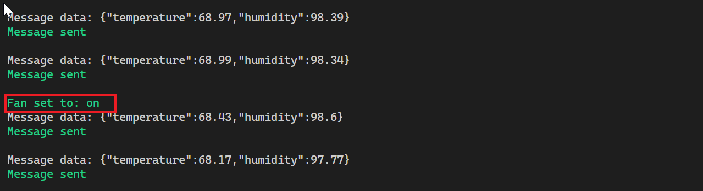
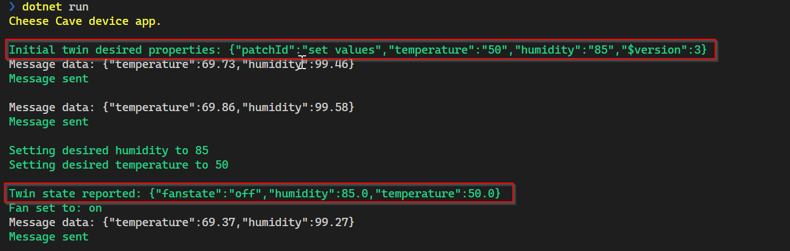

---
lab:
    title: 'Lab 15: Remotely monitor and control devices with Azure IoT Hub'
    module: 'Module 8: Device Management'
---

# Remotely monitor and control devices with Azure IoT Hub

## Lab Scenario

Contoso is proud of its award-winning cheeses and is careful to maintain the perfect temperature and humidity during the entire manufacturing process, but conditions during the aging process have always received special attention.

In recent years, Contoso has used environmental sensors to record the conditions within their natural cheese caves where aging occurs, and has used that data to identify a near perfect environment. Data from the most successful (aka award producing) locations indicates that the ideal temperature for aging cheese is approximately 50 degrees Fahrenheit +/- 5 degrees (10 degrees Celsius +/- 2.8 degrees). The ideal humidity value, measured in percentage of maximum saturation, is approximately 85% +/- 10%.

These ideal temperature and humidity values work well for most types of cheese. However, minor variations are required for especially hard or especially soft cheeses. The environment must also be adjusted at critical times/phases within the aging process to achieve specific results, such as a desired condition for the cheese rind.

Contoso is lucky enough to operate cheese caves (in certain geographic regions) that naturally maintain ideal conditions almost year-round. However, even in these locations, managing the environment during the aging process is critical. Also, natural caves often have a number of different chambers, each of which can have a slightly different environment. Cheese varieties are placed in a chamber (zone) that matches their specific requirements. To keep environmental conditions within desired limits, Contoso uses an air processing/conditioning system that controls both temperature and humidity.

Currently, an operator monitors the environmental conditions within each zone of a cave facility and adjusts the air processing system settings when required to maintain the desired temperature and humidity. Operators are able to visit each zone and check the environmental conditions every 4 hours. In locations where temperature changes dramatically between the daytime high and nighttime low, conditions can slip outside of the desired limits.

Contoso has tasked you with implementing an automated system that keeps the cave environment within control limits.

In this lab, you will be prototyping a cheese cave monitoring system that implements IoT devices. Each device is equipped with temperature and humidity sensors, and is connected to the air processing system that controls temperature and humidity for the zone where the device is located.

### Simplified Lab Conditions

The frequency of telemetry output is an important consideration in production solutions. A temperature sensor in a refrigeration unit may only need to report once a minute, whereas an acceleration sensor on an aircraft may have to report ten times per second. In some cases, the frequency at which telemetry must be sent is dependent on current conditions. For example, if the temperature our cheese cave scenario tends to drop quickly at night, you may benefit from having more frequent sensor readings beginning two hours before sunset. Of course the requirement to change the frequency of telemetry does not need to be part of a predictable pattern, the events that drive our need to change IoT device settings can be unpredictable.

To keep things simple in this lab, we will make the following assumptions:

* The device will send telemetry (temperature and humidity values) to the IoT Hub every few seconds. Although this frequency is unrealistic for a cheese cave, it is great for a lab environment when we need to see changes frequently, not every 15 minutes.
* The air processing system is a fan that can be in one of three states: On, Off, or Failed.
  * The fan is initialized to the Off state.
  * Electrical power to the fan is controlled (On/Off) using a direct method on the IoT device.
  * Device Twin desired property values are used to set the desired state of the fan. The desired property values will override any default settings for the fan/device.
  * Temperature can be controlled by turning the fan On/Off (turning the fan On will lower the temperature)

Coding in this lab is broken down into three parts: sending and receiving telemetry, invoking and running a direct method, setting and reading device twin properties.

You will start by writing two apps: one for a device to send telemetry, and one for a back-end service (that will run in the cloud) to receive the telemetry.

The following resources will be created:


## In this lab

In this lab, you will complete the following activities:

* Verify that the lab prerequisites are met (that you have the required Azure resources)

  * The script will create an IoT Hub if needed.
  * The script will create a new device identity needed for this lab.

* Create a simulated device app to send device telemetry to the IoT Hub
* Create a back-end service app to listen for the telemetry
* Implement a direct method, to communicate settings to the IoT device
* Implement device twins functionality, to manage IoT device properties

## Lab Instructions

### Exercise 1: Verify Lab Prerequisites

This lab assumes the following Azure resources are available:

| Resource Type | Resource Name |
| :-- | :-- |
| Resource Group | @lab.CloudResourceGroup(ResourceGroup1).Name |
| IoT Hub | iot-az220-training-{your-id} |
| IoT Device | sensor-th-0055 |

To ensure these resources are available, complete the following tasks.

1. Select **Deploy to Azure**:

    [](https://portal.azure.com/#create/Microsoft.Template/uri/https%3a%2f%2fraw.githubusercontent.com%2fMicrosoftLearning%2fMSLearnLabs-AZ-220-Microsoft-Azure-IoT-Developer%2fmaster%2fAllfiles%2fARM%2fAllfiles%2FARM%2Flab15.json)

1. If prompted, login to the **Azure Portal**.

    The **Custom deployment** page will be displayed.

1. Under **Project details**, in the **Subscription** dropdown, ensure that the Azure subscription that you intend to use for this course is selected.

1. In the **Resource group** dropdown, select **@lab.CloudResourceGroup(ResourceGroup1).Name**.

    > **NOTE**: If **@lab.CloudResourceGroup(ResourceGroup1).Name** is not listed:
    >
    > 1. Under the **Resource group** dropdown, click **Create new**.
    > 1. Under **Name**, enter **@lab.CloudResourceGroup(ResourceGroup1).Name**.
    > 1. Click **OK**.

1. Under **Instance details**, in the **Region** dropdown, select the region closest to you.

    > **NOTE**: If the **@lab.CloudResourceGroup(ResourceGroup1).Name** group already exists, the **Region** field is set to the region used by the resource group and is read-only.

1. In the **Your ID** field, enter the unique ID you created in Exercise 1.

1. In the **Course ID** field, enter **az220**.

1. To validate the template, click **Review and create**.

1. If validation passes, click **Create**.

    The deployment will start.

1. Once the deployment has completed, in the left navigation area, to review any output values from the template,  click **Outputs**.

    Make a note of the outputs for use later:

    * deviceConnectionString
    * devicePrimaryKey
    * eventHubsCompatibleEndpoint
    * eventHubsCompatiblePath
    * iotHubSasKey
    * serviceConnectionString

The resources have now been created.

### Exercise 2: Review Code to Send and Receive Telemetry

In this exercise, you will be completing the simulated device app (for the sensor-th-0055 device) that sends telemetry to your IoT Hub.

#### Task 1: Open a simulated device that generates telemetry

1. Open **Visual Studio Code**.

1. On the **File** menu, click **Open Folder**

1. In the Open Folder dialog, navigate to the lab 15 Starter folder.

    In _Lab 3: Setup the Development Environment_, you cloned the GitHub repository containing lab resources by downloading a ZIP file and extracting the contents locally. The extracted folder structure includes the following folder path:

    * Allfiles
        * Labs
            * 15-Remotely monitor and control devices with Azure IoT Hub
                * Starter
                    * CheeseCaveDevice
                    * CheeseCaveOperator

1. Click **cheesecavedevice**, and then click **Select Folder**.

    You should see the following files listed in the EXPLORER pane of Visual Studio Code:

    * cheesecavedevice.csproj
    * Program.cs

1. To open the code file, click **Program.cs**.

    A cursory glance will reveal that this application is very similar to the simulated device applications that you have worked on in the preceding labs. This version uses symmetric Key authentication, sends both telemetry and logging messages to the IoT Hub, and has a more complex sensor implementation.

1. On the **Terminal** menu, click **New Terminal**.

    Notice the directory path indicated as part of the command prompt. You do not want to start building this project within the folder structure of a previous lab project.

1. At the terminal command prompt, to verify the application builds, enter the following command:

    ```bash
    dotnet build
    ```

    The output will be similar to:

    ```text
    > dotnet build
    Microsoft (R) Build Engine version 16.5.0+d4cbfca49 for .NET Core
    Copyright (C) Microsoft Corporation. All rights reserved.

    Restore completed in 39.27 ms for D:\Az220-Code\AllFiles\Labs\15-Remotely monitor and control devices with Azure IoT Hub\Starter\CheeseCaveDevice\CheeseCaveDevice.csproj.
    CheeseCaveDevice -> D:\Az220-Code\AllFiles\Labs\15-Remotely monitor and control devices with Azure IoT Hub\Starter\CheeseCaveDevice\bin\Debug\netcoreapp3.1\CheeseCaveDevice.dll

    Build succeeded.
        0 Warning(s)
        0 Error(s)

    Time Elapsed 00:00:01.16
    ```

In the next task, you will configure the connection string and review the application.

#### Task 2: Configure connection and review code

The simulated device app that you will build in this task simulates an IoT device that monitors temperature and humidity. The app will simulate sensor readings and communicate sensor data every two seconds.

1. In **Visual Studio Code**, ensure that the Program.cs file is open.

1. In the code editor, locate the following line of code:

    ```csharp
    private readonly static string deviceConnectionString = "<your device connection string>";
    ```

1. Replace the **\<your device connection string\>** with the device connection string that you saved earlier.

    This is the only change that you need to implement before sending telemetry to the IoT Hub.

1. On the **File** menu, click **Save**.

1. Take a moment to review the structure of the application.

    Notice that the application structure is similar to that used in previous labs:

    * Using statements
    * Namespace definition
      * Program class - responsible for connecting to Azure IoT and sending telemetry
      * CheeseCaveSimulator class - (replaces EnvironmentSensor) rather than just generating telemetry, this class also simulates a running cheese cave environment that is impacted by the operation of a cooling fan.
      * ConsoleHelper - a class that encapsulates writing different colored text to the console

1. Review the **Main** method.

    As in earlier labs, the **Main** method is used to establish a connection to your IoT hub. You may have noticed that it will be used to integrate the device twin property changes, and in this case, you will also be integrating a direct method.

1. Take a brief look at the **SendDeviceToCloudMessagesAsync** method.

    Notice that it is very similar to previous versions you have created in earlier labs.

1. Take a look at the **CheeseCaveSimulator** class.

   This is an evolution of the **EnvironmentSensor** class used in earlier labs. The primary difference is the introduction of a fan -  if the fan is **On**, the temperature and humidity will gradually move towards the desired values, whereas is the fan is **Off** (or **Failed**), then the temperature and humidity values will move towards the ambient values. Of interest is the fact that there is a 1% chance that fan will be set to the **Failed** state when the temperature is read.

#### Task 3: Test your Code to Send Telemetry

1. In Visual Studio Code, ensure that you still have the Terminal open.

1. At the Terminal command prompt, to run the simulated device app, enter the following command:

    ```bash
    dotnet run
    ```

   This command will run the **Program.cs** file in the current folder.

1. Notice the output being sent to the Terminal.

    You should quickly see console output, similar to the following:

    

    > **Note**:  Green text is used to indicate when things are working as they should be. Red text is used to indicate when there is a problem. If you don't get a screen similar to the image above, start by checking your device connection string.

1. Leave this app running.

    You need to be sending telemetry to IoT Hub later in this lab.

### Exercise 3: Complete a Second App to Receive Telemetry

Now that you have your (simulated) cheese cave device sending telemetry to your IoT Hub, you need to complete a back-end app that can connect to IoT Hub and "listen" for that telemetry. Eventually, this back-end app will be used to automate the control of the temperature in the cheese cave.

#### Task 1: Complete an app to receive telemetry

In this task, you will begin work on the back-end app that will be used to receive telemetry from the IoT Hub Event Hub endpoint.

1. Open a new instance of Visual Studio Code.

    Since your simulated device app is running in the Visual Studio Code windows that you already have open, you need a new instance of Visual Studio Code for the back-end app.

1. On the **File** menu, click **Open Folder**

1. In the **Open Folder** dialog, navigate to lab 15 Starter folder.

1. Click **CheeseCaveOperator**, and then click **Select Folder**.

    The CheeseCaveOperator application that has been prepared for you is a simple console application that includes a couple of NuGet package libraries and some comments that will be used guide you through the process of building your code. You will need to add code blocks to the project before you are able to run the application.

#### Task 3: Enable the telemetry receiver code

1. In the **EXPLORER** pane, click **Program.cs**.

1. Locate and review the using statements - most have been used in earlier labs. However, two new namespaces have been added:

    ```csharp
    using Azure.Messaging.EventHubs;
    using Azure.Messaging.EventHubs.Consumer;
    ```

    Both of these namespaces originate from the [**Azure.Messaging.EventHubs** NuGet package](https://www.nuget.org/packages/Azure.Messaging.EventHubs/). This client library allows for both publishing and consuming events using Azure Event Hubs. In this lab, the library will be configured to connect to the IoT Hub built-in EventHub compatible endpoint.

    > **Note**: The NuGet package can be installed with the following command: `dotnet add package Azure.Messaging.EventHubs` and further information can be found at the link below:
    > * [Azure Event Hubs client library for .NET - Version 5.5.0](https://docs.microsoft.com/en-us/dotnet/api/overview/azure/messaging.eventhubs-readme?view=azure-dotnet)

1. Locate the `Global variables.` comment.

1. Take a moment to review the global variables.

    The **eventHubsCompatibleEndpoint** variable is used to store the URI for the IoT Hub built-in service-facing endpoint (messages/events) that is compatible with Event Hubs.

    The **eventHubsCompatiblePath** variable will contain the path to the Event Hub entity.

    The **iotHubSasKey** variable will contain the key name to the corresponding shared access policy rule for the namespace, or entity.

    The **iotHubSasKeyName** variable will contain the key for the corresponding shared access policy rule of the namespace or entity.

    The **eventHubClient** variable will contain the event hub client instance, which will be used to receive messages from the IoT Hub.

    The **serviceClient** variable will contain the service client instance that will be used to send messages from the app to the IoT Hub (and from there, on to targeted devices, etc.).

    The **serviceConnectionString** variable will contain the connection string that will enable the operator app to connect to the IoT Hub.

    The **deviceId** variable contains the device ID (`"sensor-th-0055"`) used by the **CheeseCaveDevice** application.

1. Locate the code line used to assign the service connection string

    ```csharp
    private readonly static string serviceConnectionString = "<your service connection string>";
    ```

1. Replace **\<your service connection string\>** with the IoT Hub Service connection string that you saved earlier in this lab.

    You should have saved the iothubowner shared access policy primary connection string generated by the ARM Template that you ran during Exercise 1.

    > **Note**: You may be curious as to why the **iothubowner** shared policy is used rather than the **service** shared policy. The answer is related to the IoT Hub permissions assigned to each policy. The **service** policy has the **ServiceConnect** permission and is usually used by back-end cloud services. It confers the following rights:
    >
    > * Grants access to cloud service-facing communication and monitoring endpoints.
    > * Grants permission to receive device-to-cloud messages, send cloud-to-device messages, and retrieve the corresponding delivery acknowledgments.
    > * Grants permission to retrieve delivery acknowledgments for file uploads.
    > * Grants permission to access twins to update tags and desired properties, retrieve reported properties, and run queries.
    >
    > For the first part of the lab, where the **serviceoperator** application calls a direct method to toggle the fan state, the **service** policy has sufficient rights. However, during the latter part of the lab, the device registry is queried. This is achieved via the **RegistryManager** class. In order to use the **RegistryManager** class to query the device registry, the shared access policy used to connect to the IoT Hub must have the **Registry read** permission, which confers the following right:
    >
    > * Grants read access to the identity registry.
    >
    > As the **iothubowner** policy has been granted the **Registry write** permission, it inherits the **Registry read** permission, so it is suitable for your needs.
    >
    > In a production scenario, you might consider adding a new shared access policy that has just the **Service connect** and **Registry read** permissions.

1. Replace the **\<your event hub endpoint\>**, **\<your event hub path\>**, and the **\<your event hub SaS key\>** with the values that you saved earlier in this lab.

1. Locate the **Main** method and take a moment to review the code (and code comments).

    Notice how the connection string is constructed from the values you entered earlier. This, along with the default consumer group is then used to create and configure an instance of the **EventHubConsumerClient**.

    > **Note**: The code `var consumerGroup = EventHubConsumerClient.DefaultConsumerGroupName;` assigns the string `"$Default` to the **consumerGroup**. It is common to create a custom consumer group, in which case the name of the consumer group would be used here instead.

    > **Information**: You can learn more about consumer groups [here](https://docs.microsoft.com/en-us/azure/event-hubs/event-hubs-features#consumer-groups)

    This **EventHubConsumerClient** class is used to read values from an **EventHub**, in this case, the built-in Event Hub endpoint of the IoT Hub.

    The **EventHubConsumerClient** reference is stored in the **consumer** variable. Next, the consumer is used to retrieve an array of partition ID strings which are then stored in **d2cPartitions** variable. This array will be used to create a list of tasks that will receive messages from each partition.

    > **Information**: You can learn more about the purpose of partitions [here](https://docs.microsoft.com/en-us/azure/iot-hub/iot-hub-scaling#partitions).

    As messages sent from devices to an IoT Hub may be handled by any of the partitions, the app has to retrieve messages from each. The next section of code creates a list of asynchronous tasks - each task will receive messages from a specific partition. The final line will wait for all tasks to complete - as each task is going to be in an infinite loop, this line prevents the application from exiting.

1. Locate and review the **ReceiveMessagesFromDeviceAsync** method.

    This method is supplied with an argument that defines the target partition. Recall that the default configuration specifies 4 partitions - therefore, this method is called 4 times, each running asynchronously and in parallel, one for each partition.

    Next, the starting position for the first event present in the partition is specified.

    > **Information**: Although `EventPosition.Earliest` may look like it is an enum, `EventPosition` is actually a struct that not only provides definitions for `Earliest` and `Latest`, but also methods that return event positions calculated from enqueued time, offset and sequence number. You can learn more about the **EventPosition Struct** [here](https://docs.microsoft.com/dotnet/api/azure.messaging.eventhubs.consumer.eventposition?view=azure-dotnet).

    The next section reads events from the requested partition as an asynchronous enumerable, allowing events to be iterated as they become available on the partition, waiting as necessary should there be no events available.

    > **Information**: You can learn more about asynchronous streams [here](https://docs.microsoft.com/dotnet/csharp/whats-new/csharp-8#asynchronous-streams)

    If an event is received, then binary body data is converted to a string and written to the console - of course, in the "real-world" the JSON would likely be deserialized and so on. The event data properties are then iterated and, in this case, checked to see if a value is true - in the current scenario, this represents an alert. Should an alert be found, it is written to the console.

1. On the **File** menu, to save your changes to the Program.cs file, click **Save**.

#### Task 3: Test your Code to Receive Telemetry

This test is important, checking whether your back-end app is picking up the telemetry being sent out by your simulated device. Remember your device app is still running, and sending telemetry.

1. To run the **CheeseCaveOperator** back-end app in the terminal, open a Terminal pane, and then enter the following command:

    ```bash
    dotnet run
    ```

   This command will run the **Program.cs** file in the current folder.

   > **Note**:  You can ignore the warning about the unused variable **serviceConnectionString** - you will be adding code to use that variable shortly.

1. Take a minute to observe the output to the Terminal.

    You should quickly see console output, and the app will display telemetry message data almost immediately if it connects to IoT Hub successfully.

    If not, carefully check your IoT Hub service connection string, noting that this string should be the service connection string, and not any other:

    

    > **Note**:  Green text is used to show things are working as they should and red text when bad stuff is happening. If you don't get a screen similar to this image, start by checking your device connection string.

1. Leave this app running for a moment longer.

1. With both apps running, verify that the telemetry displayed by the Operator app is in sync with the telemetry sent by the Device app.

    Visually compare the telemetry that is being sent with the telemetry that is being received.

    * Is there an exact data match?
    * Is there much of a delay between when data is sent and when it is received?

1. Once you have verified the telemetry data, stop the running apps and close the Terminal pane in both instances of VS Code, but do not close the Visual Studio Code windows.

You now have an app sending telemetry from a device, and a back-end app acknowledging receipt of the data. In the next Exercise you will begin work on the steps that handle the control side - what to do when issues arise with the data.

### Exercise 4: Include Code to Invoke a Direct Method

Calls from the back-end app to invoke direct methods can include multiple parameters as part of the payload. Direct methods are typically used to turn features of the device off and on, or specify settings for the device.

In the Contoso scenario, you will be implementing a direct method on the device that controls the operation of a fan located in the cheese cave (simulating the control of temperature and humidity by turing the fan On or Off). The Operator application will communicate with your IoT Hub to invoke the direct method on the device.

There are several error conditions that you need to check for when your cheese cave device receives an instruction to run the direct method. One of these checks is simply to respond with an error if the fan is in a failed state. Another error condition to report is when an invalid parameter is received. Clear error reporting is important, given the potential remoteness of the device.

Direct methods require that the back-end app prepares the parameters, then makes a call specifying the single device on which to invoke the method. The back-end app will then wait for, and report, a response.

The device app contains the functional code for the direct method. The function name is registered with the IoT client for the device. This process ensures the client knows what function to run when the call comes from the IoT Hub (there could be many direct methods).

In this Exercise, you will update your device app by adding the code for a direct method that will simulate turning on the fan in the cheese cave. Next, you will add code to the back-end service app to invoke this direct method.

#### Task 1: Enable Code to Define a Direct Method in the Device App

1. Return to the Visual Studio Code instance that contains your **cheesecavedevice** application.

    > **Note**: If the app is still running, use the Terminal pane to exit the app (click inside the Terminal pane to set the focus and the press **CTRL+C** to exit the running application).

1. Ensure that **Program.cs** is open in the code editor.

1. Locate the `UNCOMMENT register direct method code below here` comment.

1. To register the direct method, uncomment the following code:

    ```csharp
    deviceClient.SetMethodHandlerAsync("SetFanState", SetFanState, null).Wait();
    ```

    Notice that the **SetFanState** direct method handler is also set up by this code. As you can see, the **SetMethodHandlerAsync** method of deviceClient takes the remote method name `"SetFanState"` as an argument, along with the actual local method to call, and a user context object (in this case null).

1. Locate the `UNCOMMENT SetFanState method below here` comment.

1. Uncomment the **SetFanState** direct method, and review the code and comments.

    This is the method that runs on the device when the associated remote method, also called **SetFanState**, is invoked via the IoT Hub. Notice that in addition to receiving a **MethodRequest** instance, it also receives the **userContext** object that was defined when the direct message callback was registered (in this case it will be null).

    The first line of this method determines whether the cheese cave fan is currently in a **Failed** state - the assumption made by the cheese cave simulator is that once the fan has failed, any subsequent command will automatically fail. Therefore, a JSON string is created with the **result** property set to **Fan Failed**. A new **MethodResponse** object is then constructed, with the result string encoded into a byte array and an HTTP status code - in this instance, **400** is used which, in the context of a REST API means a generic client-side error has occurred. As direct method callbacks are required to return a **Task\<MethodResponse\>**, a new task is created and returned.

    > **Information**: You can learn more about how HTTP Status Codes are used within REST APIs [here](https://restfulapi.net/http-status-codes/).

    If the fan state is not **Failed**, the code then proceeds to process the data sent as part of the method request. The **methodRequest.Data** property contains the data in the form of a byte array, so it is first converted to a string. In this scenario, the following two values are expected (including the quotes):

    * "On"
    * "Off"

    It is assumed that the received data maps to members of the **StateEnum** :

    ```csharp
    internal enum StateEnum
    {
        Off,
        On,
        Failed
    }
    ```

    In order to parse the data, the quotes must first be removed and then the **Enum.Parse** method is used to find a matching enum value. Should this fail (the data needs to match exactly), an exception is thrown, which is caught below. Notice that the exception handler creates and returns a similar error method response to the one created for the fan failed state.

    If a matching value is found in the **StateEnum**, the cheese cave simulator **UpdateFan** method is called. In this case, the method merely sets the **FanState** property to the supplied value - a real-world implementation would interact with the fan to change the state and determine if the state change was successful. However, in this scenario, success is assumed and the appropriate **result** and **MethodResponse** are created and returned - this time using the HTTP Status code **200** to indicate success.

1. On the **File** menu, to save the Program.cs file, click **Save**.

You have now completed the coding that is required on the device side. Next, you need to add code to the back-end Operator application that will invoke the direct method.

#### Task 2: Add Code to Call Your Direct Method

1. Return to the Visual Studio Code instance that contains the **CheeseCaveOperator** application.

    > **Note**: If the app is still running, use the Terminal pane to exit the app (click inside the Terminal pane to set the focus and the press **CTRL+C** to exit the running application).

1. Ensure that **Program.cs** is open in the code editor.

1. The application defines a global variable to hold a service client instance:

    ```csharp
    private static ServiceClient serviceClient;
    ```

    The **ServiceClient** is used to send messages to devices.

1. Locate the `UNCOMMENT create service client instance below here` comment.

1. Uncomment the following code:

    ```csharp
    // Create a ServiceClient to communicate with service-facing endpoint
    // on your hub.
    serviceClient = ServiceClient.CreateFromConnectionString(serviceConnectionString);
    // Invokes a Direct Method on the device
    await InvokeMethod();
    ```

    Notice how the **ServiceClient** connects using the **serviceConnectionString** defined earlier. The **InvokeMethod** is then called.

1. Locate the `UNCOMMENT InvokeMethod method below here` comment.

1. Uncomment and review the code that invokes the direct method.

    The **CloudToDeviceMethod** class encapsulates the information regarding the direct method - the method name, timeout, and payload. The **ServiceClient** instance created earlier is then used to invoke the direct method via the IoT Hub, returning a response object. A `response.Status` property value of `200` indicates success.

    > **Information**: The **ServiceClient** class encapsulates interaction with the underlying Azure REST APIs. You can learn more about the underlying REST API for invoking direct methods here - [Understand and invoke direct methods from IoT Hub](https://docs.microsoft.com/en-us/azure/iot-hub/iot-hub-devguide-direct-methods). You can also find the additional status codes documented:
    > * 200 indicates successful execution of direct method;
    > * 404 indicates that either device ID is invalid, or that the device was not online upon invocation of a direct method and for connectTimeoutInSeconds thereafter (use accompanied error message to understand the root cause);
    > * 504 indicates gateway timeout caused by device not responding to a direct method call within responseTimeoutInSeconds.

    This code is used to invoke the **SetFanState** direct method on the device app.

1. On the **File** menu, to save the Program.cs file, click **Save**.

You have now completed the code changes to support the **SetFanState** direct method.

#### Task 3: Test the direct method

To test the direct method, you will need to start the apps in the correct order. You can't invoke a direct method that hasn't been registered!

1. Switch to the instance of Visual Studio Code that contains the **cheesecavedevice** device app.

1. To start the **cheesecavedevice** device app, open a Terminal pane and then enter a `dotnet run` command.

    It will begin writing to the terminal, and telemetry messages will be displayed.

1. Switch to the instance of Visual Studio Code that contains the **CheeseCaveOperator** back-end app.

1. To start the **CheeseCaveOperator** back-end app, open a Terminal pane and then enter a `dotnet run` command.

    > **Note**:  If you see the message `Direct method failed: timed-out` then double check you have saved the changes in the **CheeseCaveDevice** and started the app.

    The CheeseCaveOperator back-end app will immediately call the direct method.

    Notice the output similar to the following:

    

1. Now check the console output for the **cheesecavedevice** device app, you should see that the fan has been turned on.

   

You are now successfully monitoring and controlling a remote device. You have implemented a direct method on the device that can be invoked from the cloud. In the Contoso scenario, the direct method is used to turn on a fan, which will bring the environment in the cave to our desired settings. You should notice that the temperature and humidity readings reduce over time, eventually removing the alerts (unless the fan fails).

But what if you want to remotely specify the desired settings for the cheese cave environment? Perhaps you want to set a particular target temperature for the cheese cave at a certain point in the aging process. You could specify desired settings with a direct method (which is a valid approach), or you could use another feature of IoT Hub that is designed for this purpose, device twins. In the next Exercise, you will work on implementing device twin properties within your solution.

### Exercise 5: Implement the Device Twin functionality

As a reminder, a device twin contains four types of information:

* **Tags**: information on the device that isn't visible to the device.
* **Desired properties**: the desired settings specified by the back-end app.
* **Reported properties**: the reported values of the settings on the device.
* **Device identity properties**: read-only information identifying the device.

Device twins, which are managed through IoT Hub, are designed for querying, and they are synchronized with the real IoT device. The device twin can be queried, at any time, by the back-end app. This query can return the current state information for the device. Getting this data doesn't involve a call to the device, as the device and twin will have synchronized. Much of the functionality of device twins is provided by Azure IoT Hub, so not much code needs to be written to make use of them.

There is some overlap between the functionality of device twins and direct methods. You could set device properties using direct methods, which might seem an intuitive way of doing things. However, using direct methods would require the back-end app to record those settings explicitly, if they ever needed to be accessed. Using device twins, this information is stored and maintained by default.

In this exercise, you will enable some code in the back-end service app, to show device twin synchronization in operation (the device code for twin synchronization is already added and has been covered in earlier labs).

#### Task 1: Enable Code To Use Device Twins To Synchronize Device Properties

1. Return to the Visual Studio Code instance that is running the **CheeseCaveOperator** back-end app.

1. If the app is still running, place input focus on the terminal and press **CTRL+C** to exit the app.

1. Ensure that the **Program.cs** is open.

1. A global variable for a **RegistryManager** instance is already defined:

    ```csharp
    private static RegistryManager registryManager;
    ```

    The **RegistryManager** class encapsulates some of the IoT Hub Service REST APIs that include operations on the device identity registry, querying device twins, and import/export jobs. In this exercise, it will be used to update a device twin.

1. Locate the `UNCOMMENT registry manager variable below here` comment.

1. To insert the registry manager variable, enter the following code:

    ```csharp
    private static RegistryManager registryManager;
    ```

1. Locate the `UNCOMMENT device twin management below here` comment.

1. To add the functionality that creates the registry manager instance and sets the twin properties, enter the following code:

    ```csharp
    // A registry manager is used to access the digital twins.
    registryManager = RegistryManager
        .CreateFromConnectionString(serviceConnectionString);
    await SetTwinProperties();
    ```

    Notice that the **serviceConnectionString** value is used to connect to the IoT Hub with the appropriate access level. The **SetTwinProperties** is then called.

1. Locate the `UNCOMMENT Device twins section below here` comment.

1. To add the functionality that updates device twin desired properties, uncomment the **SetTwinProperties** and review the code and comments:

    The **SetTwinProperties** method creates a piece of JSON that defines tags and properties that will be added to the device twin, and then updates the twin. The next part of the method demonstrates how a query can be performed to list the devices where the **cheeseCave** tag is set to "CheeseCave1". This query requires that the connection has the **Registry read** permission.

1. On the **File** menu, to save the Program.cs file, click **Save**.

#### Task 2: Enable Code to Synchronize Device Twin Settings for the Device

1. Return to the Visual Studio Code instance that contains the **cheesecavedevice** app.

1. If the app is still running, place input focus on the terminal and press **CTRL+C** to exit the app.

1. Ensure that the **Program.cs** file is open in the Code Editor pane.

1. Locate the `UNCOMMENT register desired property changed handler code below here` comment.

1. To register the desired property changed handler, uncomment the following code:

    ```csharp
    // Get the device twin to report the initial desired properties.
    Twin deviceTwin = await deviceClient.GetTwinAsync();
    ConsoleHelper.WriteGreenMessage("Initial twin desired properties: " + deviceTwin.Properties.Desired.ToJson());

    // Set the device twin update callback.
    await deviceClient.SetDesiredPropertyUpdateCallbackAsync(OnDesiredPropertyChanged, null);
    ```

1. Locate the `UNCOMMENT OnDesiredPropertyChanged method below here` comment.

1. To enable the code that responds to a device twin property change, uncomment the **OnDesiredPropertyChanged** method and review the code:

    This code defines the handler that is invoked when a desired property changes in the device twin. Notice that new values are then reported back to the IoT Hub to confirm the change.

1. On the **File** menu, to save the Program.cs file, click **Save**.

    > **Note**:  Now you have added support for device twins to your app, you can reconsider having explicit variables such as **desiredHumidity**. You could use the variables in the device twin object instead.

#### Task 3: Test the Device Twins

To test the code that manages device twin desired property changes, you will start the apps in the correct order, device application first and then back-end application.

1. Switch to the instance of Visual Studio Code that contains the **cheesecavedevice** device app.

1. To start the **cheesecavedevice** device app, open a Terminal pane and then enter a `dotnet run` command.

    It will begin writing to the terminal, and telemetry messages will be displayed.

1. Switch to the instance of Visual Studio Code that contains the **CheeseCaveOperator** back-end app.

1. To start the **CheeseCaveOperator** back-end app, open a Terminal pane and then enter a `dotnet run` command.

1. Switch back to the instance of Visual Studio Code that contains the **cheesecavedevice** device app.

1. Check the console output and confirm that the device twin synchronized correctly.

    

    If you let the fan do its work, you should eventually see red alerts turn off (unless the fan fails)

    

1. For both instances of Visual Studio Code, stop the app and then close the Visual Studio Code window.

The code that you implemented in this lab isn't production quality, but it does demonstrate the basics of monitoring and controlling an IoT device using a combination direct methods and device twin properties. You should recognize that in this implementation, operator control messages are only being sent when the back-end service app is first run. Typically, a back-end service app would require a browser interface, for an operator to send direct methods, or set device twin properties, whenever required.
