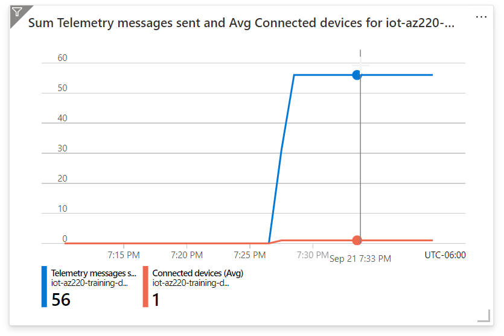
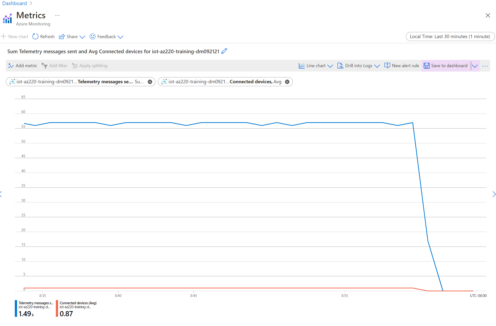

---
lab:
    title: 'Lab 17: How to manage your Azure IoT Hub'
    module: 'Module 9: Solution Testing, Diagnostics, and Logging'
---

# How to manage your Azure IoT Hub

## Lab Scenario

Contoso's Asset Monitoring and Tracking Solution is working great. The system provides continuous monitoring throughout the packaging and shipping process. You have implemented Group Enrollments within DPS to provision devices at scale, and when the container arrives at the destination, the IoT device is "decommissioned" through DPS so that it can re-used for future shipments.

To help manage device utilization and other characteristics of the solution, the IT department has asked your team to implement Azure monitoring and logging services within the IoT solution.

You agree to begin by implementing some simple metrics that can be reviewed with the IT folks before you commit to any additional workload.

In this lab, you will implement monitoring to track the number of connected devices, the number of telemetry messages sent, and you will also send connection events to a log. In addition, you will create an alert that is triggered when the number of connected devices drops below one. To test the system, you will connect a single device and stream telemetry, then disconnect the device to generate an alert.

The following resources will be created:


## In This Lab

In this lab, you will complete the following activities:

* Verify that the lab prerequisites are met (that you have the required Azure resources).
* Download and run an app that simulates an IoT device sending messages to the hub.
* Run the app to generate telemetry.
* Enable diagnostic logs.
* Enable metrics.
* Set up alerts for those metrics.
* Exit the app to raise an alert.
* Observe the metrics and check the diagnostic logs.

## Lab Instructions

### Exercise 1: Verify Lab Prerequisites

This lab assumes that the following Azure resources are available:

| Resource Type | Resource Name |
| :-- | :-- |
| Resource Group | @lab.CloudResourceGroup(ResourceGroup1).Name |
| IoT Hub | iot-az220-training-{your-id} |
| Storage Account | staz220training{your-id} |
| Device ID | sensor-thl-2001 |

To ensure these resources are available, complete the following tasks.

1. Select **Deploy to Azure**:

    [](https://portal.azure.com/#create/Microsoft.Template/uri/https%3a%2f%2fraw.githubusercontent.com%2fMicrosoftLearning%2fMSLearnLabs-AZ-220-Microsoft-Azure-IoT-Developer%2fmaster%2fAllfiles%2FARM%2Flab17.json)

1. If prompted, login to the **Azure Portal**.

    The **Custom deployment** page will be displayed.

1. Under **Project details**, in the **Subscription** dropdown, ensure that the Azure subscription that you intend to use for this course is selected.

1. In the **Resource group** dropdown, select **@lab.CloudResourceGroup(ResourceGroup1).Name**.

    > **NOTE**: If **@lab.CloudResourceGroup(ResourceGroup1).Name** is not listed:
    >
    > 1. Under the **Resource group** dropdown, click **Create new**.
    > 1. Under **Name**, enter **@lab.CloudResourceGroup(ResourceGroup1).Name**.
    > 1. Click **OK**.

1. Under **Instance details**, in the **Region** dropdown, select the region closest to you.

    > **NOTE**: If the **@lab.CloudResourceGroup(ResourceGroup1).Name** group already exists, the **Region** field is set to the region used by the resource group and is read-only.

1. In the **Your ID** field, enter the unique ID you created in Exercise 1.

1. In the **Course ID** field, enter **az220**.

1. To validate the template, click **Review and create**.

1. If validation passes, click **Create**.

    The deployment will start.

1. Once the deployment has completed, in the left navigation area, to review any output values from the template,  click **Outputs**.

    Make a note of the outputs for use later:

    * connectionString
    * deviceConnectionString
    * devicePrimaryKey
    * storageAccountName

The resources have now been created.

### Exercise 2: Simulate Devices

In this exercise, you will be configuring a device simulator, using the device connection string generated above, to connect to the IoT Hub. When executed, the application will create an active connection (counting as a connected device) and will generate telemetry.

#### Task 1: Configure and run device simulator

You will now configure and run the device simulator.

1. Open Visual Studio Code.

1. On the **File** menu, click **Open Folder**.

1. In the **Open Folder** dialog, navigate to the lab 17 Starter folder, click **Starter**, and then click **Select Folder**.

    > **Note**: If Visual Studio Code suggested loading assets or performing a Restore, follow the suggestions.

1. In the **EXPLORER** pane, to open the Program.cs file, click **Program.cs**.

    You should also see the certificate files listed.

1. Ensure that you have the **Program.cs** file opened in Visual Studio Code.

1. Near the top of the **Program** class, locate the declaration of the `deviceConnectionString` variable:

    ```csharp
    private readonly static string deviceConnectionString = "<your device connection string>";
    ```

1. Replace `<your device connection string>` with the device connection string that you saved earlier.

    > **Note**: This is the only change that you are required to make to this code.

1. On the **File** menu, click **Save**.

1. Optionally, take a moment to review the code.

This app is very similar to the apps used in the earlier labs.

#### Task 2: Run the Simulator

1. In Visual Studio Code, on the **Terminal** menu, click **New Terminal**.

1. At the Terminal command prompt, to run the app, enter the following command:

    ```bash
    dotnet run
    ```

   This command will run the **Program.cs** file in the current folder.

1. Console output should be displayed that is similar to the following:

    ```text
    ❯ dotnet run
    IoT Hub C# Simulated Cave Device. Ctrl-C to exit.
    9/21/2021 5:29:03 PM > Sending message: {"temperature":21.709826510264456,"humidity":69.90892255208871,"pressure":1013.2884857487113,"latitude":39.866200822820204,"longitude":-98.44082869457793}
    9/21/2021 5:29:04 PM > Sending message: {"temperature":27.536429445043407,"humidity":79.17065790815775,"pressure":1020.8587537331547,"latitude":40.150104471097904,"longitude":-98.40412401158297}
    9/21/2021 5:29:05 PM > Sending message: {"temperature":30.732068391857702,"humidity":65.15873178148583,"pressure":1017.6406480895312,"latitude":40.09271254628759,"longitude":-98.26298329932496}
    ```

Leave the app running, so that a device is connected and telemetry is being sent.

### Exercise 3: Set Up and Use Metrics and Diagnostic Logs with an IoT Hub

Azure Resource logs are platform logs emitted by Azure resources that describe their internal operation. All resource logs share a common top-level schema with the flexibility for each service to emit unique properties for their own events.

When you have an IoT Hub solution running in production, you will want to set up various metrics and enable diagnostic logs. Then, if a problem occurs, you have data to look at that will help you to diagnose the problem and fix it more quickly.

In this exercise, you will enable diagnostic logs and use them to check for errors. You will also set up some metrics to watch, and alerts that fire when the metrics hit a certain boundary criteria.

#### Task 1: Enable diagnostics

1. If necessary, log in to your Azure portal using your Azure account credentials.

    If you have more than one Azure account, be sure that you are logged in with the account that is tied to the subscription that you will be using for this course.

1. On your Azure dashboard, click **iot-az220-training-{your-id}**.

    Your dashboard should have a link to your IoT Hub on the on the @lab.CloudResourceGroup(ResourceGroup1).Name resource group tile.

1. On the left-side menu, under **Monitoring**, click **Diagnostic settings**.

    > **Note**: Current documentation suggests that Diagnostics may be disabled by default. If so, you may need to "Turn on diagnostics" in order to collect diagnostics data for your IoT Hub. When you click **Turn on diagnostics**, a **Diagnostic settings** pane will open.

1. On the **Diagnostics settings** pane, under **Name**, click **+ Add diagnostic setting**.

1. In the **Diagnostic settings name** textbox, enter **diags-hub**

1. Take a moment to review the options listed under **Destination details**.

    You can see that there are 4 options available for routing the metrics - you can learn more about each by following the links below:

    * [Archive Azure resource logs to storage account](https://docs.microsoft.com/en-us/azure/azure-monitor/platform/resource-logs-collect-storage)
    * [Stream Azure monitoring data to an event hub](https://docs.microsoft.com/en-us/azure/azure-monitor/platform/stream-monitoring-data-event-hubs)
    * [Collect Azure resource logs in Log Analytics workspace in Azure Monitor](https://docs.microsoft.com/en-us/azure/azure-monitor/platform/resource-logs-collect-workspace)
    * [Sending to Partner solutions](https://docs.microsoft.com/en-us/azure/azure-monitor/partners)

    In this lab, you will use the storage account option.

1. Under **Destination details**, click **Archive to a storage account**.

    Additional fields are made available once you select this destination option, including the option to specify **Retention (days)** for the log categories.

    > **Note**: Take a moment to review the notes about storage accounts and costs.

1. For the **Subscription** field, select the subscription that you used to create your IoT Hub.

1. For the **Storage account** field, select the **staz220training{your-id}** storage account.

    This account was created by the lab17-setup.azcli script. If it is not listed in the dropdown, you may need to create an account manually (check with your instructor).

1. On the **Diagnostic settings** blade, under **Category details**, click **Connections**, and then click **DeviceTelemetry**.

1. For each of the Log Categories that you selected, in the **Retention (days)** field, enter **7**

1. At the top of the blade, click **Save**, and then close the blade

    You should now be on the **Diagnostics settings** pane of your IoT Hub, and you should see that the list of **Diagnostics settings** has been updated to show the **diags-hub** setting that you just created.

    Later, when you look at the diagnostic logs, you'll be able to see the telemetry and connect/disconnect logging for the device.

#### Task 2: Setup Metrics

In this task, you will set up various metrics to watch for when messages are sent to your IoT hub.

> **Note**: To ensure the results are available quickly, shorter timelines will be used in this exercise. In production, longer intervals may be more appropriate.

1. Ensure that you have your IoT Hub blade open.

    The previous task left you on the **Diagnostics settings** pane of the IoT HUb blade.

1. On the left-side menu, under **Monitoring**, click **Metrics**.

    The **Metrics** pane is displayed showing a new, empty, chart.

1. In the top-right corner of the screen, to change the time range and granularity for the chart, click **Last 24 hours (Automatic)**.

1. In the context menu that appears, under **Time range**, click **Last 30 minutes**.

1. In the same context menu, in the **Time granularity** dropdown, click **1 minute**, and under **Show time as**, ensure that **Local** is selected.

1. To save your time settings, click **Apply**.

1. Take a minute to examine the settings that are used to specify the chart Metrics.

    Under the **Chart Title** and the toolbar for the chart, you will see an area to specify Metrics.

    * Notice that the **Scope** is already set to **iot-az220-training-{your-id}**.
    * Notice that **Metric Namespace** is already set to **IoT Hub standard metrics**.

    > **Note**: By default, there is only one metric namespace available. Namespaces are a way to categorize or group similar metrics together. By using namespaces, you can achieve isolation between groups of metrics that might collect different insights or performance indicators. For example, you might have a namespace called **az220memorymetrics** that tracks memory-use metrics which profile your app. Another namespace called **az220apptransaction** might track all metrics about user transactions in your application. You can learn more about custom metrics and namespaces [here](https://docs.microsoft.com/en-us/azure/azure-monitor/platform/metrics-custom-overview?toc=%2Fazure%2Fazure-monitor%2Ftoc.json#namespace).

    Your next steps is add a metric that will be used to monitor how many telemetry messages have been sent to your IoT Hub.

1. In the **Metric** dropdown, click **Telemetry messages sent**.

    Notice the large number of metrics that are available for you to select from!

1. Under **Aggregation**, ensure that **Sum** is selected.

    Notice there are 4 aggregation operations available - *Avg*, *Min*, *Max* and *Sum*.

1. Take a moment to review your chart.

    Notice that the chart title has updated to reflect the metric chosen.

    You have completed the specification for the first metric. Next, you will add another metric to monitor the number of connected devices.

1. Under the chart title, on the toolbar, click **Add metric**.

    A new metric will appear. Notice that the **Scope** and **Metric Namespace** values are pre-populated.

1. In the **Metric** dropdown, click **Connected devices**.

1. Under **Aggregation**, ensure that **Avg** is selected.

    Your screen should now show the minimized metric for Telemetry messages sent, as well as the new metric for avg connected devices. Notice that the chart title has updated to reflect both metrics.

    > **Note**: To edit the chart title, click the **pencil** to the right of the title.

1. Under the **Chart Title**, on the right side of the toolbar, click **Pin to dashboard**, and then click **Pin to current dashboard**

    > **Note**: In order to retain the chart you have just created, it **must** be pinned to a dashboard.

1. Navigate to the dashboard chosen above and verify the chart is displayed.

    > **Note**: You can customize the size and position of the chart by using drag and drop operations.

    If the device simulator is running, you should see that telemetry messages have been sent and the device is connected:

    

Now that you have enabled logging and setup a chart to monitor metrics, it's a good time for you to set up an alert.

### Exercise 4: Configure an Alert

Alerts are used to proactively notify you when important conditions are found in your monitoring data. They allow you to identify and address issues before the users of your system notice them.

In your asset tracking scenario, you use sensors to track the containers that are being shipped to customers. Each time a sensor is added in a shipping container, it is auto-provisioned through DPS. In production, you wish to send an alert if the number of sensors in transit exceed a predetermined capacity.

However, for your upcoming proof-of-concept demonstration, to keep things simple, you want to create an Alert that triggers when the number containers drops below one. To trigger the Alert, you will use the number of Device Connected events from IoT Hub.

In this exercise, you are going to add an alert that triggers when 5 or more devices have connected.

1. If necessary, log in to your Azure portal using your Azure account credentials.

    If you have more than one Azure account, be sure that you are logged in with the account that is tied to the subscription that you will be using for this course.

1. On your Azure dashboard, click **iot-az220-training-{your-id}**.

    Your dashboard should have a link to your IoT Hub on the on the @lab.CloudResourceGroup(ResourceGroup1).Name resource group tile.

1. On the left-side menu, under **Monitoring**, click **Alerts**.

    The empty **Alerts** pane is displayed. Notice that the **Subscription**, **Resource group**, **Resource** and **Time range** fields are pre-populated.

1. In the **Time range** dropdown, click **Past hour**.

1. At the top of the **Alerts** pane, click **+ New alert rule**

    The **Create alert rule** blade should now be displayed.

1. Take a moment to review the **Create alert rule** blade.

    The blade includes four sections: Scope, Condition, Action group, and Alert rule details. Scope you can see two fields - Resource and Hierarchy. Notice that these fields are pre-populated with properties from your IoT Hub. You can edit the pre-selected resource if needed.

1. Under **Condition**, click **Add condition**.

    The **Configure signal logic** pane should now be displayed. Notice that there is a paginated table of available signals displayed. The fields above the table filter the table to assist in finding the signal types you want.

1. Under **Signal type**, ensure that **All** is selected.

    If you open the Signal type dropdown, you would see that there are 3 available options: *All*, *Metrics* and *Activity Log*.

    > **Note**: The signal types available for monitoring vary based on the selected target(s). The signal types may be metrics, log search queries or activity logs.

1. Under **Monitor service**, ensure that **All** is selected.

    If you open the Monitor service dropdown, you would see that there are 3 available options: *All*, *Platform* and *Activity Log - Administrative*.

    > **Note**:  The platform service provides metrics on service utilization, where as the activity log tracks administrative activities.

1. In the **Search by signal name** textbox, type **connected**

1. Notice that the list of signals is immediately filtered based on your entry.

1. Under **Signal name**, click **Connected devices**.

    The pane will update to display a chart that is similar to what you created for **Metrics**. The chart displays the values associated with the selected signal (in this case *Connected devices (preview)*).

    Beneath the chart is the area that defines the **Alert logic**.

1. Take a moment to review the options under **Alert logic**

    Notice that **Threshold** has two possible selections - *Static* and *Dynamic*. Also notice that **Static** is selected and **Dynamic** is unavailable for this signal type.

    > **Note**:  As the names suggest, *Static Thresholds* specify a constant expression for the threshold, whereas *Dynamic Thresholds* detection leverages advanced machine learning (ML) to learn metrics' historical behavior, identify patterns and anomalies that indicate possible service issues. You can learn more about *Dynamic Thresholds* [here](https://docs.microsoft.com/en-us/azure/azure-monitor/platform/alerts-dynamic-thresholds).

    You are going to create a static threshold that raises and alert whenever the *connected devices (preview)* signal is equal to 5 or more.

1. In the **Operator** dropdown, click **Less than**.

    You may want to make note of the other options for this and the other fields.

1. Under **Aggregation type**, ensure that **Average** is selected.

1. In the **Threshold value** textbox, enter **1**

    > **Note**: The **Condition preview** shows you the condition under which the display will refresh based on the Operator, Aggregation type, and Threshold value settings that you entered. Below the **Condition preview** is the **Evaluation based on** area. These values determine the historical time period that is aggregated using the **Aggregation type** selected above and how often the condition is evaluated.

1. Under **Unit**, select **Count**.

1. Under **Aggregation granularity (Period)**, ensure that **1 minute** is selected.

1. Under **Frequency of evaluation**, ensure that **Every 1 Minute** is selected.

    > **Note**: If the **Frequency of evaluation** is shorter than **Aggregation granularity (Period)**, this results in a sliding window evaluation. For example if the **Aggregation granularity (Period)** is 5 minutes and **Frequency of evaluation** is 1 minute, it means that every minute, the preceding 5 minutes of values will be aggregated (in this case, averaged), and then evaluated against the condition. After a minute of time has passed, once again the preceding 5 minutes of data will be aggregated - this will include one minute of new data and four minutes of data that was already evaluated. Thus, we have a sliding window that moves forward a minute at a time, but is always including 4 minutes of data that was also evaluated as part of an earlier window.

1. At the bottom of the **Configure signal logic** pane, to configure the alert condition, click **Done**.

    The **Configure signal logic** pane closes and the **Create alert rule** blade is shown. Notice that the **Condition** is now populated and a **Estimated monthly cost** is displayed. At the time of writing, the estimated cost of the alert condition is $0.10 (USD).

    Next, you need to configure the action taken when the alert condition is met.

1. Take a moment to review the **Action group** area.

    Notice that no action group is selected. There is an option to **Select action group**.

    > **Note**: An action group is a collection of notification preferences defined by the owner of an Azure subscription. An action group name must be unique within the Resource Group is is associated with. Azure Monitor and Service Health alerts use action groups to notify users that an alert has been triggered. Various alerts may use the same action group or different action groups depending on the user's requirements. You may configure up to 2,000 action groups in a subscription. You can learn more about creating and managing Action Groups [here](https://docs.microsoft.com/en-us/azure/azure-monitor/platform/action-groups).

1. Under **Actions**, click **Add action groups**.

    The **Select an action group to attach to this alert rule** pane is displayed. If there are existing Action Groups available within the selected subscription, they will be listed here. Notice that you can change the subscription and filter the list. In this lab, we will create a new action group.

1. On the **Select an action group to attach to this alert rule** pane, click **Create action group**.

    The **Create action group** pane is displayed.

1. On the **Basics** tab, under **Subscription**, ensure that the subscription you have been using for this lab is selected.

1. In the **Resource group** dropdown, click **@lab.CloudResourceGroup(ResourceGroup1).Name**.

    > **Note**: Action Groups are usually shared across a subscription and would likely be centrally managed by the Azure subscription owner. As such they are more likely to be included in a common resource group rather than in a project specific resource group such as "@lab.CloudResourceGroup(ResourceGroup1).Name". We are using "@lab.CloudResourceGroup(ResourceGroup1).Name" to make it easier to clean up the resources after the lab.

    The next area, **Instance details** is used to specify the full and display names for the group.

1. Under **Action group name**, enter **AZ-220 Email Action Group**

    > **Note**: An action group name must be unique within the Resource Group it is associated with.

1. Under **Display name**, enter **AZ220EmailAG**

    > **Note**: The display name is used in place of a full action group name when notifications are sent using this group and is limited to a max of 12 characters.

1. Click **Next: Notifications**, to view the action group notification fields.

1. Open the **Notification Type** dropdown, and then review the available options.

1. In the **Notification Type** dropdown, click **Email/SMS message/Push/Voice**.

    > **Note**: After selecting the notification type, a new, blank, row is added to enable multiple notifications to be added. To the right of each row with values, **Edit details** and **Delete** icons are available.

    > **Note**: The **Email/SMS message/Push/Voice** blade opens automatically.

1. Under **Name**, enter **AZ220Notifications**

1. On the **Email/SMS message/Push/Voice** blade, select **Email**, and then enter an email address that you have easy access to.

1. Click **SMS**, and then enter the **Country code** and the **Phone number** for the phone that you wish to use to receive the SMS alert.

1. Skip **Azure app Push Notifications** and **Voice**.

1. Under **Enable the common alert schema**, click **Yes**.

   > **Note**:  There are many benefits to using the Common Alert Schema. It standardizes the consumption experience for alert notifications in Azure today. Historically, the three alert types in Azure today (metric, log, and activity log) have had their own email templates, webhook schemas, etc. With the common alert schema, you can now receive alert notifications with a consistent schema. You can learn more about the Common ALert6 Schema [here](https://docs.microsoft.com/en-us/azure/azure-monitor/platform/alerts-common-schema).

   > **Important:** Given the benefits, you may wonder why the common alert schema is not enabled by default - well, when you select **Yes** you will see a warning **Enabling the common alert schema might break any existing integrations.** Bear this in mind in your own environments.

1. At the bottom of the **Email/SMS message/Push/Voice** blade, to save the action configuration, click **OK**.

    The notification row should now show that Email and SMS message have been selected. The  **Edit details** icon can be clicked if further changes are required.

1. Click **Next: Actions**, to view the action group action fields.

1. Open the **Action type** dropdown, and then review the available options.

    At this point, we could add multiple actions if we needed to launch some business integration via *WebHooks* or an *Azure Function*, however for this lab, a simple notification is enough.

1. At the bottom of the **Add action group** blade, to validate this action group, click **Review + create**.

1. Once the validation has completed, click **Create**.

    A few things happen at the same time. First, **Add action group** blade closes, leaving you on the **Create rule** blade, with the new Action Group added to the list of **ACTIONS**.

    Then, in quick succession, you should receive both an SMS notification and an email, both of which inform you that you have been added to the **AZ220EmailAG** action group. In the SMS message, you will note that you can reply to the message to stop receiving future notifications and so on - you can learn more about the options [here](https://docs.microsoft.com/en-us/azure/azure-monitor/platform/alerts-sms-behavior). In the email, you have links that you can click to view the details on action groups and, towards the bottom of the email (in a smaller font) you can see the option to unsubscribe.

    Next, you will configure the **Alert rule details**.

1. On the **Create alert rule** blade, in the **Alert rule name** field, enter **Connected Devices Less than 1**

    The name should be descriptive enough to identify the alert.

1. In the **Description** field, enter **This alert is raised when the number of devices connected to the iot-az220-training-{your-id} hub is less than 1.**

    The description field is optional, but recommended.

1. In the **Save alert to resource group** field, ensure the expected resource group is selected - i.e. **@lab.CloudResourceGroup(ResourceGroup1).Name**.

1. In the **Severity** field, ensure that **3 - Informational** is selected.

    In our scenario, this alert is *informational* and not indicative of any critical failure, therefore **Sev 3** is the correct choice.

    > **Note**:  The severity level option range between **0 - Critical** and **4 - Verbose**.

1. For the **Enable alert rule upon creation** field, ensure that the checkbox is selected (checked).

    > **Note**:  It can take up to 10 minutes for a metric alert rule to become active.

1. For the **Automatically resolve alerts** field, ensure that the checkbox is selected (checked).

    > **Note**:  This ensures an alert is resolved should the condition no longer be met.

1. At the bottom of the blade, click **Create alert rule**.

    The **Alerts** pane of your IoT Hub should now be displayed. A message in the middle of the should be telling you that you have no alerts, and you should see that a **Manage alert rules(1)** button has been added below that status message.

    > **NOTE**: If the pane has not automatically updated, click **Refresh**.

### Exercise 4: Review Metrics, Alerts and Archive

In this exercise, you will examine some of the reporting and logging resources that you configured earlier in this lab, and review the event data has been recorded in the short time that has elapsed.

#### Task 1: See the Metrics in the Portal

In order to generate the alert where the number of connected devices is less than one, the device simulator app must be closed.

1. Return to to Visual Studio code and exit the running app.

    Wait 30 seconds or so before proceeding to the next step.

1. In the Azure portal, open the Metrics chart that you pinned to the dashboard by clicking on the chart title.

    The chart will open and fill the page.

1. Change the time values to the **Last 30 minutes**.

    Notice that you can see *Telemetry messages sent* and *Connected devices** values, with the most recent numbers at the bottom of the chart - move your mouse over the chart to see values a specific points in time. You should notice that the telemetry and connected devices plot lines have reduced to zero.

    

#### Task 2: See the Alerts

To use the Azure Portal to review alerts, complete the following steps.

1. In the Azure Portal, navigate back to your Dashboard.

1. On the Azure portal toolbar, in the search box, type **monitor**

1. In the search result pane, under **Services**, click **Monitor**.

    The **Monitor - Overview** page is displayed. This is the overview for all of the monitoring activities for the current subscription.

1. On the left-side menu, near the top of the list, click **Alerts**.

    This alerts view shows all alerts for all subscriptions. Let's filter this to the IoT Hub.

1. Near the top of the blade, under **Subscription**, select the subscription you are using for this class.

1. In the **Resource group** dropdown, click **@lab.CloudResourceGroup(ResourceGroup1).Name**.

1. In the **Resource** dropdown, click **iot-az220-training-{your-id}**.

1. In the **Time range** dropdown, click **Past hour**.

    You should now see a summary of alerts for the last hour. Under **Total alert rules** you should see **1**, the alert you created earlier. Below this, you will see a list of the severity categories as well as the count of alerts per category. The alerts we are interested in are **3 - Informational**. You should see at least one (if you have stopped and restarted the device simulator, you may have generated more that one alert).

    > **Note**: If you do not yet see an alert, wait a few more minutes - there is sometimes a delay in the laerts being raised.

1. In the list of severities, click **3 - Informational**.

    The **All Alerts** page will open. At the top of the page you will see a number of filter fields - these have been populated with the values from the preceding screen so that only the **3 - Informational** alerts for the selected IoT hub are shown. It will show you the alerts that are active, and if there are any warnings.

1. Under **Name**, to select your 3 - Informational alert, click **Connected Devices Less than 1**.

    A pane will open showing a **Summary** of the details for the alert. This includes a chart illustrating why the alert fired - a dash line shows the threshold value as well as the current values for the monitored metric. Below this are details of the **Criterion** and other details.

1. At the top of the pane, below the title, click **History**.

    In this view you can see when the alert fired, the action group that was invoked, and any other changes such as when the alert is resolved and so on.

1. At the top of the pane, below the title, click **Diagnostics**.

    If there were any issues related to the alert, addition details would be shown here.

1. At this point check your email and/or text and verify you received an alert message.

1. To automatically resolve the alert, return to Visual Studio Code and restart the app.

    > **Note**: As it will take a few minutes to resolve the alert, continue with the remaining tasks.

#### Task 3: See the Diagnostic Logs

Earlier in this lab, you set up your diagnostic logs to be exported to blob storage. It is a good time to check and see what was written.

1. Navigate to your Dashboard, and then locate your "@lab.CloudResourceGroup(ResourceGroup1).Name" resource group tile.

1. In the list of resources, select the Storage Account that was created earlier - **staz220training{your-id}**.

    The **Overview** for the storage account will be displayed.

1. To view the storage metrics, on the **Overview** page, select the **Monitoring** tab.

1. Scroll down until you can see the metrics charts for the Storage Account: *Total egress*, *Total ingress*, *Average latency* and *Request breakdown*.

    You should see that there is activity displayed.

1. On the left-side menu, to view the data that has been logged, click **Storage Explorer (preview)**.

1. In the **Storage Explorer** pane, expand the **BLOB CONTAINERS** node.

    When Azure Monitor first sends data to a storage account, it creates a container called **insights-logs-connection**.

1. Under **BLOB CONTAINERS**, click **insights-logs-connection**.

    The contents of the container will be listed to the right.

    Logs are written to the container in a very nested fashion. You will need to open each subfolder in turn to navigate to the actual log data. The structure is similar to that shown below:

    * **resourceId=**
      * **SUBSCRIPTIONS**
        * **\<GUID\>** - this is the ID for the subscription that generated the log
          * **RESOURCEGROUPS** - contains a folder for each resource group that generated a log
            * **@lab.CloudResourceGroup(ResourceGroup1).Name** - the resource group that contains the IoT Hub
              * **PROVIDERS**
                * **MICROSOFT.DEVICES**
                  * **IOTHUBS**
                    * **IOT-AZ220-TRAINING-{YOUR-ID}** - contains a folder for each year where a log was generated
                      * **Y=2019** - contains a folder for each month where a log was generated
                        * **m=12** - contains a folder for each day where a log was generated
                          * **d=15** - contains a folder for each hour where a log was generated
                            * **h=15** - contains a folder for each minute where a log was generated
                              * **m=00** - contains the log file for that minute

    Drill down until you get to the current date and select the most recent file.

1. With the file selected, on the toolbar at the top of the pane, click **Download**.

1. Open the downloaded file in Visual Studio Code.

    You should see a number of lines of JSON.

1. To make the JSON easier to read, press **F1**, enter **Format document** and select **Format document** from the list of options.

    The JSON will show a list of connection and disconnection events similar to:

    ```json
    {
        "time": "2021-09-21T22:16:00Z",
        "resourceId": "/SUBSCRIPTIONS/AE82FF3B-4BD0-462B-8449-D713DD18E11E/RESOURCEGROUPS/@lab.CloudResourceGroup(ResourceGroup1).Name/PROVIDERS/MICROSOFT.DEVICES/IOTHUBS/IOT-AZ220-TRAINING-DM092121",
        "operationName": "deviceConnect",
        "category": "Connections",
        "level": "Information",
        "properties": "{\"deviceId\":\"sensor-thl-2001\",\"sdkVersion\":\".NET/1.38.0 (.NET Core 3.1.19; Microsoft Windows 10.0.22000 WindowsProduct:0x00000030; X64; {FF88E933-1C12-457D-A098-A5093B53FBA2})\",\"protocol\":\"Mqtt\",\"authType\":null,\"maskedIpAddress\":\"24.9.142.XXX\",\"statusCode\":null,\"errorMessage\":\"\"}",
        "location": "centralus"
    }
    {
        "time": "2021-09-21T22:33:34Z",
        "resourceId": "/SUBSCRIPTIONS/AE82FF3B-4BD0-462B-8449-D713DD18E11E/RESOURCEGROUPS/@lab.CloudResourceGroup(ResourceGroup1).Name/PROVIDERS/MICROSOFT.DEVICES/IOTHUBS/IOT-AZ220-TRAINING-DM092121",
        "operationName": "deviceDisconnect",
        "category": "Connections",
        "level": "Error",
        "resultType": "404104",
        "resultDescription": "DeviceConnectionClosedRemotely",
        "properties": "{\"deviceId\":\"sensor-thl-2001\",\"protocol\":\"Mqtt\",\"authType\":null,\"maskedIpAddress\":\"24.9.142.XXX\",\"statusCode\":\"404\",\"errorMessage\":\"Device disconnected, see cause and resolution at https://aka.ms/iothub404104\"}",
        "location": "centralus"
    }
    ```

    Notice that each individual entry is a single JSON record - although the overall document is not a valid JSON document as the JSON objects are not delcared within a JSON array `[]` and comma separated. Within each record you can see details relating to the originating IoT Hub and **properties** for each event. Within the **properties** object, you can see the connecting (or disconnecting) **deviceId**.

#### Task 4: Review resolved Alert

By this point, you should have received an email or SMS indicating the Monitor Alert has been resolved. COmplete the following steps to review the resolved Alert in the portal.

> **Note**: If you have not yet received the email/SMS - wait until it arrives before proceeding.

1. In the Azure Portal, navigate back to your Dashboard.

1. On the Azure portal toolbar, in the search box, type **monitor**

1. In the search result pane, under **Services**, click **Monitor**.

    The **Monitor - Overview** page is displayed. This is the overview for all of the monitoring activities for the current subscription.

1. On the left-side menu, near the top of the list, click **Alerts**.

    This alerts view shows all alerts for all subscriptions. Let's filter this to the IoT Hub.

1. In the list of severities, click **3 - Informational**.

    The **All Alerts** page will open. At the top of the page you will see a number of filter fields - these have been populated with the values from the preceding screen so that only the **3 - Informational** alerts for the selected IoT hub are shown. It will show you the alerts that are active, and if there are any warnings.

1. Under **Name**, to select your 3 - Informational alert, click the latest **Connected Devices Less than 1** alert.

    A pane will open showing a **Summary** of the details for the alert. As before, this includes a chart illustrating why the alert fired - a dash line shows the threshold value as well as the current values for the monitored metric. Below this are details of the **Criterion** and other details.

1. At the top of the pane, below the title, click **History**.

    In this view you can see when the alert fired, the action group that was invoked, and when the alert is resolved and so on.

Once you have completed this exercise, you may close the Device Simulator App.