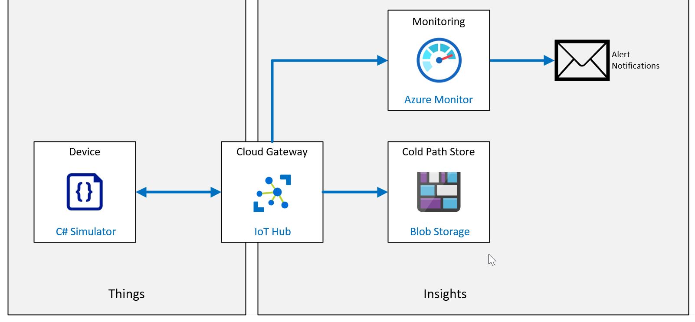

---
lab:
    title: 'Lab 17: How to manage your Azure IoT Hub'
    module: 'Module 9: Solution Testing, Diagnostics, and Logging'
---

# How to manage your Azure IoT Hub

## Lab Scenario

Contoso's Asset Monitoring and Tracking Solution is working great. The system provides continuous monitoring throughout the packaging and shipping process. You have implemented Group Enrollments within DPS to provision devices at scale, and when the container arrives at the destination, the IoT device is "decommissioned" through DPS so that it can re-used for future shipments.

To help manage device utilization and other characteristics of the solution, the IT department has asked your team to implement Azure monitoring and logging services within the IoT solution.

You agree to begin by implementing some simple metrics that can be reviewed with the IT folks before you commit to any additional workload.

In this lab, you will implement monitoring to track the number of connected devices, the number of telemetry messages sent, and you will also send connection events to a log. In addition, you will create an alert that is triggered when the number of connected devices exceeds a threshold limit. To test the system, you will configure 9 simulated IoT Devices that will authenticate with DPS using a Device CA Certificate generated on the Root CA Certificate chain. The IoT Devices will be configured to send telemetry to the the IoT Hub.

The following resources will be created:



## In This Lab

In this lab, you will complete the following activities:

* Verify that the lab prerequisites are met (that you have the required Azure resources).
* Enable diagnostic logs.
* Enable metrics.
* Set up alerts for those metrics.
* Download and run an app that simulates IoT devices connecting via X.509 and sending messages to the hub.
* Run the app until the alerts begin to fire.
* Observe the metrics and check the diagnostic logs.

## Lab Instructions

### Exercise 1: Verify Lab Prerequisites

This lab assumes that the following Azure resources are available:

| Resource Type | Resource Name |
| :-- | :-- |
| Resource Group | rg-az220 |
| IoT Hub | iot-az220-training-{your-id} |
| Device Provisioning Service | dps-az220-training-{your-id} |
| Storage Account | staz220training{your-id} |

If these resources are not available, you will need to run the **lab17-setup.azcli** script as instructed below before moving on to Exercise 2. The script file is included in the GitHub repository that you cloned locally as part of the dev environment configuration (lab 3).

The **lab17-setup.azcli** script is written to run in a **bash** shell environment - the easiest way to execute this is in the Azure Cloud Shell.

1. Using a browser, open the [Azure Cloud Shell](https://shell.azure.com/) and login with the Azure subscription you are using for this course.

    If you are prompted about setting up storage for Cloud Shell, accept the defaults.

1. Verify that the Cloud Shell is using **Bash**.

1. On the Cloud Shell toolbar, click **Upload/Download files** (fourth button from the right).

1. In the dropdown, click **Upload**.

1. In the file selection dialog, navigate to the folder location of the GitHub lab files that you downloaded when you configured your development environment.

    In _Lab 3: Setup the Development Environment_, you cloned the GitHub repository containing lab resources by downloading a ZIP file and extracting the contents locally. The extracted folder structure includes the following folder path:

    * Allfiles
      * Labs
          * 17-How to manage your Azure IoT Hub
            * Setup

    The lab17-setup.azcli script file is located in the Setup folder for lab 17.

1. Select the **lab17-setup.azcli** file, and then click **Open**.

    A notification will appear when the file upload has completed.

1. To verify that the correct file has uploaded in Azure Cloud Shell, enter the following command:

    ```bash
    ls
    ```

    The `ls` command lists the content of the current directory. You should see the lab17-setup.azcli file listed.

1. To create a directory for this lab that contains the setup script and then move into that directory, enter the following Bash commands:

    ```bash
    mkdir lab17
    mv lab17-setup.azcli lab17
    cd lab17
    ```

1. To ensure the **lab17-setup.azcli** script has the execute permission, enter the following command:

    ```bash
    chmod +x lab17-setup.azcli
    ```

1. On the Cloud Shell toolbar, to enable access to the lab17-setup.azcli file, click **Open Editor** (second button from the right - **{ }**).

1. In the **Files** list, to expand the lab17 folder and open the script file, click **lab17**, and then click **lab17-setup.azcli**.

    The editor will now show the contents of the **lab17-setup.azcli** file.

1. In the editor, update the values of the `{your-id}` and `{your-location}` variables.

    Referencing the sample below as an example, you need to set `{your-id}` to the Unique ID you created at the start of this course - i.e. **cah191211**, and set `{your-location}` to the location that makes sense for your resources.

    ```bash
    #!/bin/bash

    # Change these values!
    YourID="{your-id}"
    Location="{your-location}"
    ```

    > **Note**:  The `{your-location}` variable should be set to the short name for the region where you are deploying all of your resources. You can see a list of the available locations and their short-names (the **Name** column) by entering this command:

    ```bash
    az account list-locations -o Table

    DisplayName           Latitude    Longitude    Name
    --------------------  ----------  -----------  ------------------
    East Asia             22.267      114.188      eastasia
    Southeast Asia        1.283       103.833      southeastasia
    Central US            41.5908     -93.6208     centralus
    East US               37.3719     -79.8164     eastus
    East US 2             36.6681     -78.3889     eastus2
    ```

1. In the top-right of the editor window, to save the changes made to the file and close the editor, click **...**, and then click **Close Editor**.

    If prompted to save, click **Save** and the editor will close.

    > **Note**:  You can use **CTRL+S** to save at any time and **CTRL+Q** to close the editor.

1. To create the resources required for this lab, enter the following command:

    ```bash
    ./lab17-setup.azcli
    ```

    This script can take a few minutes to run. You will see output as each step completes.

    The script will first create a resource group named **rg-az220**, then your IoT Hub named **iot-az220-training-{your-id}** and Device Provisioning Service named **dps-az220-training-{your-id}**. If the services already exist, a corresponding message will be displayed. The script will link your IoT Hub and DPS. The script will then create a storage account named **staz220training{your-id}**.

    You should now be ready to proceed with Exercise 2 of this lab.

### Exercise 2: Set Up and Use Metrics and Diagnostic Logs with an IoT Hub

Azure Resource logs are platform logs emitted by Azure resources that describe their internal operation. All resource logs share a common top-level schema with the flexibility for each service to emit unique properties for their own events.

When you have an IoT Hub solution running in production, you will want to set up various metrics and enable diagnostic logs. Then, if a problem occurs, you have data to look at that will help you to diagnose the problem and fix it more quickly.

In this exercise, you will enable diagnostic logs and use them to check for errors. You will also set up some metrics to watch, and alerts that fire when the metrics hit a certain boundary criteria.

#### Task 1: Enable diagnostics

1. If necessary, log in to your Azure portal using your Azure account credentials.

    If you have more than one Azure account, be sure that you are logged in with the account that is tied to the subscription that you will be using for this course.

1. On your Azure dashboard, click **iot-az220-training-{your-id}**.

    Your dashboard should have a link to your IoT Hub on the on the rg-az220 resource group tile.

1. On the left-side menu, under **Monitoring**, click **Diagnostic settings**.

    > **Note**: Current documentation suggests that Diagnostics may be disabled by default. If so, you may need to "Turn on diagnostics" in order to collect diagnostics data for your IoT Hub. When you click **Turn on diagnostics**, a **Diagnostic settings** pane will open.

1. On the **Diagnostics settings** pane, under **Name**, click **+ Add diagnostic setting**.

1. In the **Diagnostic settings name** textbox, enter **diags-hub**

1. Take a moment to review the options listed under **Destination details**.

    You can see that there are 3 options available for routing the metrics - you can learn more about each by following the links below:

    * [Archive Azure resource logs to storage account](https://docs.microsoft.com/en-us/azure/azure-monitor/platform/resource-logs-collect-storage)
    * [Stream Azure monitoring data to an event hub](https://docs.microsoft.com/en-us/azure/azure-monitor/platform/stream-monitoring-data-event-hubs)
    * [Collect Azure resource logs in Log Analytics workspace in Azure Monitor](https://docs.microsoft.com/en-us/azure/azure-monitor/platform/resource-logs-collect-workspace)

    In this lab, you will use the storage account option.

1. Under **Destination details**, click **Archive to a storage account**.

    Additional fields are made available once you select this destination option, including the option to specify **Retention (days)** for the log categories.

    > **Note**: Take a moment to review the notes about storage accounts and costs.

1. For the **Subscription** field, select the subscription that you used to create your IoT Hub.

1. For the **Storage account** field, select the **staz220training{your-id}** storage account.

    This account was created by the lab17-setup.azcli script. If it is not listed in the dropdown, you may need to create an account manually (check with your instructor).

1. On the **Diagnostic settings** blade, under **Category details**, click **Connections**, and then click **DeviceTelemetry**.

1. For each of the Log Categories that you selected, in the **Retention (days)** field, enter **7**

1. At the top of the blade, click **Save**, and then close the blade

    You should now be on the **Diagnostics settings** pane of your IoT Hub, and you should see that the list of **Diagnostics settings** has been updated to show the **diags-hub** setting that you just created.

    Later, when you look at the diagnostic logs, you'll be able to see the connect and disconnect logging for the device.

#### Task 2: Setup Metrics

In this task, you will set up various metrics to watch for when messages are sent to your IoT hub.

1. Ensure that you have your IoT Hub blade open.

    The previous task left you on the **Diagnostics settings** pane of the IoT HUb blade.

1. On the left-side menu, under **Monitoring**, click **Metrics**.

    The **Metrics** pane is displayed showing a new, empty, chart.

1. In the top-right corner of the screen, to change the time range and granularity for the chart, click **Last 24 hours (Automatic)**.

1. In the context menu that appears, under **Time range**, click **Last 4 hours**.

1. In the same context menu, in the **Time granularity** dropdown, click **1 minute**, and under **Show time as**, ensure that **Local** is selected.

1. To save your time settings, click **Apply**.

1. Take a minute to examine the settings that are used to specify the chart Metrics.

    Under the **Chart Title** and the toolbar for the chart, you will see an area to specify Metrics.

    * Notice that the **Scope** is already set to **iot-az220-training-{your-id}**.
    * Notice that **Metric Namespace** is already set to **IoT Hub standard metrics**.

    > **Note**: By default, there is only one metric namespace available. Namespaces are a way to categorize or group similar metrics together. By using namespaces, you can achieve isolation between groups of metrics that might collect different insights or performance indicators. For example, you might have a namespace called **az220memorymetrics** that tracks memory-use metrics which profile your app. Another namespace called **az220apptransaction** might track all metrics about user transactions in your application. You can learn more about custom metrics and namespaces [here](https://docs.microsoft.com/en-us/azure/azure-monitor/platform/metrics-custom-overview?toc=%2Fazure%2Fazure-monitor%2Ftoc.json#namespace).

    Your next steps is add a metric that will be used to monitor how many telemetry messages have been sent to your IoT Hub.

1. In the **Metric** dropdown, click **Telemetry messages sent**.

    Notice the large number of metrics that are available for you to select from!

1. Under **Aggregation**, ensure that **Sum** is selected.

    Notice there are 4 aggregation operations available - *Avg*, *Min*, *Max* and *Sum*.

1. Take a moment to review your chart.

    Notice that the chart title has updated to reflect the metric chosen.

    You have completed the specification for the first metric. Next, you will add another metric to monitor the number of connected devices.

1. Under the chart title, on the toolbar, click **Add metric**.

    A new metric will appear. Notice that the **Scope** and **Metric Namespace** values are pre-populated.

1. In the **Metric** dropdown, click **Connected devices (preview)**.

1. Under **Aggregation**, ensure that **Avg** is selected.

    Your screen should now show the minimized metric for Telemetry messages sent, as well as the new metric for avg connected devices. Notice that the chart title has updated to reflect both metrics.

    > **Note**: To edit the chart title, click the **pencil** to the right of the title.

1. Under the **Chart Title**, on the right side of the toolbar, click **Pin to dashboard**, and then click **Pin to current dashboard**

    > **Note**: In order to retain the chart you have just created, it **must** be pinned to a dashboard.

1. Navigate to the "AZ-220" dashboard and verify the chart is displayed.

    > **Note**: You can customize the size and position of the chart by using drag and drop operations.

Now that you have enabled logging and setup a chart to monitor metrics, it's a good time for you to set up an alert.

### Exercise 3: Configure an Alert

Alerts are used to proactively notify you when important conditions are found in your monitoring data. They allow you to identify and address issues before the users of your system notice them.

In your asset tracking scenario, you use sensors to track the containers that are being shipped to customers. Each time a sensor is added in a shipping container, it is auto-provisioned through DPS.

For your upcoming proof-of-concept demonstration, you want to create an Alert that triggers when the number containers that are currently in transit approaches a capacity limit. To trigger the Alert, you will use the number of Device Connected events from IoT Hub.

In this exercise, you are going to add an alert that triggers when 5 or more devices have connected.

1. If necessary, log in to your Azure portal using your Azure account credentials.

    If you have more than one Azure account, be sure that you are logged in with the account that is tied to the subscription that you will be using for this course.

1. On your Azure dashboard, click **iot-az220-training-{your-id}**.

    Your dashboard should have a link to your IoT Hub on the on the rg-az220 resource group tile.

1. On the left-side menu, under **Monitoring**, click **Alerts**.

    The empty **Alerts** pane is displayed. Notice that the **Subscription**, **Resource group**, **Resource** and **Time range** fields are pre-populated.

1. In the **Time range** dropdown, click **Past hour**.

1. At the top of the **Alerts** pane, click **+ New alert rule**

    The **Create alert rule** blade should now be displayed.

1. Take a moment to review the **Create alert rule** blade.

    The blade includes four sections: Scope, Condition, Action group, and Alert rule details. Scope you can see two fields - Resource and Hierarchy. Notice that these fields are pre-populated with properties from your IoT Hub. You can edit the pre-selected resource if needed.

1. Under **Condition**, click **Add condition**.

    The **Configure signal logic** pane should now be displayed. Notice that there is a paginated table of available signals displayed. The fields above the table filter the table to assist in finding the signal types you want.

1. Under **Signal type**, ensure that **All** is selected.

    If you open the Signal type dropdown, you would see that there are 3 available options: *All*, *Metrics* and *Activity Log*.

    > **Note**: The signal types available for monitoring vary based on the selected target(s). The signal types may be metrics, log search queries or activity logs.

1. Under **Monitor service**, ensure that **All** is selected.

    If you open the Monitor service dropdown, you would see that there are 3 available options: *All*, *Platform* and *Activity Log - Administrative*.

    > **Note**:  The platform service provides metrics on service utilization, where as the activity log tracks administrative activities.

1. In the **Search by signal name** textbox, type **connected**

1. Notice that the list of signals is immediately filtered based on your entry.

1. Under **Signal name**, click **Connected devices**.

    The pane will update to display a chart that is similar to what you created for **Metrics**. The chart displays the values associated with the selected signal (in this case *Connected devices (preview)*).

    Beneath the chart is the area that defines the **Alert logic**.

1. Take a moment to review the options under **Alert logic**

    Notice that **Threshold** has two possible selections - *Static* and *Dynamic*. Also notice that **Static** is selected and **Dynamic** is unavailable for this signal type.

    > **Note**:  As the names suggest, *Static Thresholds* specify a constant expression for the threshold, whereas *Dynamic Thresholds* detection leverages advanced machine learning (ML) to learn metrics' historical behavior, identify patterns and anomalies that indicate possible service issues. You can learn more about *Dynamic Thresholds* [here](https://docs.microsoft.com/en-us/azure/azure-monitor/platform/alerts-dynamic-thresholds).

    You are going to create a static threshold that raises and alert whenever the *connected devices (preview)* signal is equal to 5 or more.

1. In the **Operator** dropdown, click **Greater than or equal to**.

    You may want to make note of the other options for this and the other fields.

1. Under **Aggregation type**, ensure that **Average** is selected.

1. In the **Threshold value** textbox, enter **5**

    > **Note**: The **Condition preview** shows you the condition under which the display will refresh based on the Operator, Aggregation type, and Threshold value settings that you entered. Below the **Condition preview** is the **Evaluation based on** area. These values determine the historical time period that is aggregated using the **Aggregation type** selected above and how often the condition is evaluated.

1. Under **Unit**, select **Count**.

1. Under **Aggregation granularity (Period)**, ensure that **5 minutes** is selected.

1. Under **Frequency of evaluation**, ensure that **Every 1 Minute** is selected.

    > **Note**: As the **Frequency of evaluation** is shorter than **Aggregation granularity (Period)**, this results in a sliding window evaluation. This means that every minute, the preceding 5 minutes of values will be aggregated (in this case, averaged), and then evaluated against the condition. After a minute of time has passed, once again the preceding 5 minutes of data will be aggregated - this will include one minute of new data and four minutes of data that was already evaluated. Thus, we have a sliding window that moves forward a minute at a time, but is always including 4 minutes of data that was also evaluated as part of an earlier window.

1. At the bottom of the **Configure signal logic** pane, to configure the alert condition, click **Done**.

    The **Configure signal logic** pane closes and the **Create alert rule** blade is shown. Notice that the **Condition** is now populated and a **Estimated monthly cost** is displayed. At the time of writing, the estimated cost of the alert condition is $0.10 (USD).

    Next, you need to configure the action taken when the alert condition is met.

1. Take a moment to review the **Action group** area.

    Notice that no action group is selected. There is an option to **Select action group**.

    > **Note**: An action group is a collection of notification preferences defined by the owner of an Azure subscription. An action group name must be unique within the Resource Group is is associated with. Azure Monitor and Service Health alerts use action groups to notify users that an alert has been triggered. Various alerts may use the same action group or different action groups depending on the user's requirements. You may configure up to 2,000 action groups in a subscription. You can learn more about creating and managing Action Groups [here](https://docs.microsoft.com/en-us/azure/azure-monitor/platform/action-groups).

1. Under **Actions**, click **Add action groups**.

    The **Select an action group to attach to this alert rule** pane is displayed. If there are existing Action Groups available within the selected subscription, they will be listed here. Notice that you can change the subscription and filter the list. In this lab, we will create a new action group.

1. On the **Select an action group to attach to this alert rule** pane, click **Create action group**.

    The **Create action group** pane is displayed.

1. On the **Basics** tab, under **Subscription**, ensure that the subscription you have been using for this lab is selected.

1. In the **Resource group** dropdown, click **rg-az220**.

    > **Note**: Action Groups are usually shared across a subscription and would likely be centrally managed by the Azure subscription owner. As such they are more likely to be included in a common resource group rather than in a project specific resource group such as "rg-az220". We are using "rg-az220" to make it easier to clean up the resources after the lab.

    The next area, **Instance details** is used to specify the full and display names for the group.

1. Under **Action group name**, enter **AZ-220 Email Action Group**

    > **Note**: An action group name must be unique within the Resource Group it is associated with.

1. Under **Display name**, enter **AZ220EmailAG**

    > **Note**: The display name is used in place of a full action group name when notifications are sent using this group and is limited to a max of 12 characters.

1. Click **Next: Notifications**, to view the action group notification fields.

1. Open the **Notification Type** dropdown, and then review the available options.

1. In the **Notification Type** dropdown, click **Email/SMS message/Push/Voice**.

    > **Note**: After selecting the notification type, a new, blank, row is added to enable multiple notifications to be added. To the right of each row with values, **Edit details** and **Delete** icons are available.

1. Under **Name**, enter **AZ220Notifications**

1. On the right of the current notification, to enter the notification details, click the **Edit details**.

    The **Email/SMS message/Push/Voice** pane opens.

1. On the **Email/SMS message/Push/Voice** blade, click **Email**, and then enter an email address that you have easy access to.

1. Click **SMS**, and then enter the **Country code** and the **Phone number** for the phone that you wish to use to receive the SMS alert.

1. Skip **Azure app Push Notifications** and **Voice**.

1. Under **Enable the common alert schema**, click **Yes**.

   > **Note**:  There are many benefits to using the Common Alert Schema. It standardizes the consumption experience for alert notifications in Azure today. Historically, the three alert types in Azure today (metric, log, and activity log) have had their own email templates, webhook schemas, etc. With the common alert schema, you can now receive alert notifications with a consistent schema. You can learn more about the Common ALert6 Schema [here](https://docs.microsoft.com/en-us/azure/azure-monitor/platform/alerts-common-schema).

   > **Important:** Given the benefits, you may wonder why the common alert schema is not enabled by default - well, when you select **Yes** you will see a warning **Enabling the common alert schema might break any existing integrations.** Bear this in mind in your own environments.

1. At the bottom of the **Email/SMS message/Push/Voice** blade, to save the action configuration, click **OK**.

    The notification row should now show that Email and SMS message have been selected. The  **Edit details** icon can be clicked if further changes are required.

1. Click **Next: Actions**, to view the action group action fields.

1. Open the **Action type** dropdown, and then review the available options.

    At this point, we could add multiple actions if we needed to launch some business integration via *WebHooks* or an *Azure Function*, however for this lab, a simple notification is enough.

1. At the bottom of the **Add action group** blade, to validate this action group, click **Review + create**.

1. Once the validation has completed, click **Create**.

    A few things happen at the same time. First, **Add action group** blade closes, leaving you on the **Create rule** blade, with the new Action Group added to the list of **ACTIONS**.

    Then, in quick succession, you should receive both an SMS notification and an email, both of which inform you that you have been added to the **AZ220EmailAG** action group. In the SMS message, you will note that you can reply to the message to stop receiving future notifications and so on - you can learn more about the options [here](https://docs.microsoft.com/en-us/azure/azure-monitor/platform/alerts-sms-behavior). In the email, you have links that you can click to view the details on action groups and, towards the bottom of the email (in a smaller font) you can see the option to unsubscribe.

    Next, you will configure the **Alert rule details**.

1. On the **Create alert rule** blade, in the **Alert rule name** field, enter **Connected Devices Greater or Equal To 5**

    The name should be descriptive enough to identify the alert.

1. In the **Description** field, enter **This alert is raised when the number of devices connected to the iot-az220-training-{your-id} hub is greater than or equal to 5.**

    The description field is optional, but recommended.

1. In the **Save alert to resource group** field, ensure the expected resource group is selected - i.e. **rg-az220**.

1. In the **Severity** field, ensure that **3 - Informational** is selected.

    In our scenario, this alert is *informational* and not indicative of any critical failure, therefore **Sev 3** is the correct choice.

    > **Note**:  The severity level option range between **0 - Critical** and **4 - Verbose**.

1. For the **Enable alert rule upon creation** field, ensure that the checkbox is selected (checked).

    > **Note**:  It can take up to 10 minutes for a metric alert rule to become active.

1. At the bottom of the blade, click **Create alert rule**.

    The **Alerts** pane of your IoT Hub should now be displayed. A message in the middle of the should be telling you that you have no alerts, and you should see that a **Manage alert rules(1)** button has been added below that status message.

    > **NOTE**: If the pane has not automatically updated, click **Refresh**.

It is now time to configure the environment needed to trigger the alert.

### Exercise 4: Simulating the Sensors

To simulate Contoso's asset tracking system, you need to simulate the IoT devices that are placed inside in shipping containers. As each device is activated, it should use automatic device provisioning to connect to the Iot solution and start sending telemetry. In order to automatically connect, each device will need its own X.509 certificate that is part of a chain to the root certificate used to create a group enrollment.

In this exercise, you will verify the existing environment, perform any necessary setup, generate 9 device certificates, and configure a console application that will simulate the 9 devices.

> **Note**: In lab 6 of this course (**Lab 6-Automatic Enrollment of Devices in DPS**) you configured DPS to use X.509 resources. If you still have that configuration available, you may be able to skip over one or more of the tasks below.

#### Task 1: Verify DPS Configuration

1. In your browser, navigate to the [Azure Portal](https://portal.azure.com/) and login to your subscription.

1. On your **rg-az220** resource group tile, click **dps-az220-training-{your-id}**.

1. On the left-side menu, under **Settings**, click **Certificates**.

1. With the **Certificates** pane open, follow these instructions:

    * If the certificates list is empty, move directly to Task 2 of this exercise - **Task 2: Verify OpenSSL**.
    * If a certificate named **root-ca-cert** is listed, continue to the next step.

1. For the certificate listed, check the value under **Status**, and follow these instructions:

    * If the certificate status is **Unverified**:
        * click the certificate to view the details, then click **Delete**.
        * Enter the **Certificate Name** to confirm the deletion and click **OK**.
        * Move directly to Task 2 of this exercise - **Task 2: Verify OpenSSL**.
    * If the certificate status is **Verified**, continue to the next step.

1. On the left-side menu, under **Settings**, click **Manage enrollments**

1. On the **Manage enrollments** pane, to view the list of enrollment groups in DPS, click **Enrollment Groups**.

1. If the **simulated-devices** enrollment group is listed, move directly to the next Exercise - **Exercise 5: Simulate Devices**

1. If the **simulated-devices** enrollment group does not exist, follow these instructions:

    * If you have a verified certificate named **root-ca-cert**, move directly to Task 5 of this exercise - **Task 5: Create an Enrollment Group**.
    * If you Did Not find a verified certificate above, continue with Task 2 - **Task 2: Verify OpenSSL**.

#### Task 2: Verify OpenSSL

In the following steps you will verify that OpenSSL tools installed in an earlier lab are still available.

1. In your browser, navigate to the [Azure Cloud Shell](https://shell.azure.com/) and login to your subscription.

1. At the shell prompt, enter the following command:

    ```bash
    cd ~/certificates
    ```

1. If the command above generates an error that states **No such file or directory**, move directly to Task 3 of this exercise - **Task 3: Install OpenSSL Tools**.

1. At the Cloud Shell command prompt, enter the following command:

    ```bash
    cd certs
    ```

    If you see an error that states **No such file or directory**, move directly to Task 4 of this exercise - **Task 4: Generate and Configure x.509 CA Certificates using OpenSSL**.

1. If the **certs** folder is available, move directly to Task 5 of this exercise - **Task 5: Create an Enrollment Group**.

#### Task 3: Install OpenSSL Tools

1. In the cloud shell, enter the following commands:

    ```bash
    mkdir ~/certificates

    # navigate to certificates directory
    cd ~/certificates

    # download helper script files
    curl https://raw.githubusercontent.com/Azure/azure-iot-sdk-c/master/tools/CACertificates/certGen.sh --output certGen.sh
    curl https://raw.githubusercontent.com/Azure/azure-iot-sdk-c/master/tools/CACertificates/openssl_device_intermediate_ca.cnf --output openssl_device_intermediate_ca.cnf
    curl https://raw.githubusercontent.com/Azure/azure-iot-sdk-c/master/tools/CACertificates/openssl_root_ca.cnf --output openssl_root_ca.cnf

    # update script permissions so user can read, write, and execute it
    chmod 700 certGen.sh
    ```

#### Task 4: Generate and Configure x.509 CA Certificates using OpenSSL

The first X.509 certificates needed are CA and intermediate certificates. These can be generated using the `certGen.sh` helper script by passing the `create_root_and_intermediate` option.

1. In the cloud shell, ensure that you are in the **~/certificates** directory.

1. At the Cloud Shell command prompt, to generate the CA and intermediate certificates, enter the following command:

    ```sh
    ./certGen.sh create_root_and_intermediate
    ```

    This command command generates a CA Root Certificate named `azure-iot-test-only.root.ca.cert.pem` and places it in `./certs` directory.

1. At the Cloud Shell command prompt, to download the `azure-iot-test-only.root.ca.cert.pem` certificate to your local machine (so it can be uploaded to DPS), enter the following command:

    ```sh
    download ~/certificates/certs/azure-iot-test-only.root.ca.cert.pem
    ```

1. In the Azure portal, open the **dps-az220-training-{your-id}** Device Provisioning Service.

1. On the **Device Provisioning Service** blade, on the left-side menu under **Settings**, click **Certificates**.

1. If you see an existing **root-ca-cert** certificate, select and delete it.

1. On the **Certificates** pane, at the top of the blade, click **Add**.

1. On the **Add Certificate** pane, to the right of the **Certificate .pem or .cer file** field, click the folder icon.

1. In the **Open** dialog, navigate to your downloads folder, click **azure-iot-test-only.root.ca.cert.pem**, and then click **Open**.

    This is the `azure-iot-test-only.root.ca.cert.pem` CA Certificate that you just created.

1. In the **Certificate Name** field, enter **root-ca-cert**

    This name could be the same as the name of the certificate file, or something different. This is a logical name that has no correlation to the _Common Name_ within the x.509 CA Certificate.

1. Click **Save**.

    Once the x.509 CA Certificate has been uploaded, the **Certificates** pane will display the certificate with the **Status** of **Unverified**. Before this CA Certificate can be used to authenticate devices to DPS, you will need to verify **Proof of Possession** of the certificate.

1. To start the process of verifying Proof of Possession of the certificate, click **root-ca-cert**.

1. On the **Certificate Details** pane, click **Generate Verification Code**.

1. Copy the newly generated **Verification Code** value.

    > **Note**:  You will need to leave the **Certificate Details** pane **Open** while you generate the Verification Certificate. If you close the pane, you will invalidate the Verification Code and will need to generate a new one.

1. Open the **Azure Cloud Shell**, if it's not still open from earlier, and navigate to the `~/certificates` directory.

    **Proof of Possession** of the CA Certificate is provided to DPS by uploading a certificate generated from the CA Certificate with the **Validate Code** that was just generated within DPS. This is how you provide proof that you actually own the CA Certificate.

1. At the Cloud Shell command prompt, to create the **Verification Certificate** (passing in the **Verification Code**), enter the following command:

    ```sh
    ./certGen.sh create_verification_certificate <verification-code>
    ```

    Be sure to replace the `<verification-code>` placeholder with the **Verification Code** generated by the Azure portal.

    For example, the command run will look similar to the following:

    ```sh
    ./certGen.sh create_verification_certificate 49C900C30C78D916C46AE9D9C124E9CFFD5FCE124696FAEA
    ```

    This command generates a **Verification Certificate** that is chained to the CA Certificate with the Verification Code. The generated Verification Certificate named `verification-code.cert.pem` is located within the `./certs` directory of the Azure Cloud Shell.

1. At the Cloud Shell command prompt, to download this **Verification Certificate** to your local machine (so it can be uploaded to DPS), enter the following command:

    ```sh
    download ~/certificates/certs/verification-code.cert.pem
    ```

1. In the Azure portal, navigate back to the **Certificate Details** pane for the **CA Certificate**.

1. To the right of the **Verification Certificate .pem or .cer file** field, click the folder icon.

1. In the **Open** dialog, navigate to your downloads folder, click **verification-code.cert.pem**, and then click **Open**.

    This is your newly created and downloaded **Verification Certificate** file.

1. On the **Certificate Details** pane, click **Verify**.

1. On the **Certificates** pane, click **Refresh**.

    With the **Proof of Possession** completed for the CA Certificate, notice the **Status** for the root-ca-cert certificate is now displayed as **Verified**.

#### Task 5: Create an Enrollment Group

1. In the Azure portal, ensure that you have your **dps-az220-training-{your-id}** Device Provisioning Service blade open.

1. On the left-side menu, under **Settings**, click **Manage enrollments**.

    There should not be any enrollment groups listed.

1. At the top of the blade, click **Add enrollment group**.

1. On the **Add Enrollment Group** blade, in the **Group name** field, enter **simulated-devices**

1. Ensure that the **Attestation Type** is set to **Certificate**.

1. Ensure that the **Certificate Type** field is set to **CA Certificate**.

1. In the **Primary Certificate** dropdown, click **root-ca-cert**.

    Verify that the **Select the IoT hubs this group can be assigned to** dropdown includes your **iot-az220-training-{your-id}** IoT Hub. This will ensure when the device is provisioned, it gets added to this IoT Hub.

1. In the Initial Device Twin State field, modify the `properties.desired` JSON object to include a property named `telemetryDelay` with the value of `"1"`. This will be used by the Device to set the time delay for reading sensor telemetry and sending events to IoT Hub.

    The final JSON will be like the following:

    ```js
    {
        "tags": {},
        "properties": {
            "desired": {
                "telemetryDelay": "1"
            }
        }
    }
    ```

1. At the top of the blade, click **Save**.

Now that the environment is setup, it's time to generate our device certificates.

### Exercise 5: Simulate Devices

In this exercise, you will be generating X.509 certificates from the root certificate. You will then use these certificates in a console application that will simulate 9 devices connecting to DPS and sending telemetry to an IoT Hub.

#### Task 1: Generate Device Certificates

You will now generate and download 9 device certificates.

1. Open the [Azure Cloud Shell](https://shell.azure.com/) and login with the Azure subscription you are using for this course.

1. At the Cloud Shell command prompt, to create and then move into a directory name **monitoring**, enter the following commands:

    ```bash
    mkdir monitoring
    cd monitoring
    ```

1. To create an empty file in which you will copy the device generation script, enter the following commands:

    ```bash
    touch gen-dev-certs.sh
    chmod +x gen-dev-certs.sh
    ```

1. On the Cloud Shell toolbar, click **Open editor**.

    The button to open the Cloud Shell editor is the **{ }** icon, second from the right.

1. Under **FILES**, to edit the contents of the gen-dev-certs.sh file, click **monitoring**, and then click **gen-dev-certs.sh**

    The **gen-dev-certs.sh** file is currently empty.

1. Paste the following code into the cloud editor:

    ```bash
    #!/bin/bash

    # Generate 9 device certificates
    # Rename for each device
    # download from the Cloud CLI
    pushd ~/certificates
    for i in {1..9}
    do
        chmod +w ./certs/new-device.cert.pem
        ./certGen.sh create_device_certificate asset-track$i
        sleep 5
        cp ./certs/new-device.cert.pfx ./certs/sensor-thl-200$i.cert.pfx
        download ./certs/sensor-thl-200$i.cert.pfx
    done
    popd
    ```

    This script will create and download 9 device certificates.

1. To save the edited **gen-dev-certs.sh** file, press **CTRL-Q**.

    If prompted to save you changes before closing the editor, click **Save**.

1. At the Cloud Shell command prompt, to run the **gen-dev-certs.sh** script, enter the following command:

    ```bash
    ./gen-dev-certs.sh
    ```

    While the script runs, you will see the output from the certificate generator and then the browser should automatically download each certificate in turn.

    > **Note**: If your browsers asks what you want to do with the files, click **Save** for each file.


    Once it completes, you will have 9 certificates available in your browser download location:

    * sensor-thl-2001.cert.pfx
    * sensor-thl-2002.cert.pfx
    * sensor-thl-2003.cert.pfx
    * sensor-thl-2004.cert.pfx
    * sensor-thl-2005.cert.pfx
    * sensor-thl-2006.cert.pfx
    * sensor-thl-2007.cert.pfx
    * sensor-thl-2008.cert.pfx
    * sensor-thl-2009.cert.pfx

With these certificates available, you are ready to configure the device simulator.

#### Task 2: Add Certificates to Simulator

1. Copy the downloaded X.509 Device Certificate files to the lab 17 **Starter** folder.

    In _Lab 3: Setup the Development Environment_, you cloned the GitHub repository containing lab resources by downloading a ZIP file and extracting the contents locally. The extracted folder structure includes the following folder path:

    * Allfiles
      * Labs
          * 17-How to manage your Azure IoT Hub
            * Starter

    The Starter folder for lab 17 includes the SimulatedDevice.csproj and Program.cs files. The project will need to access this certificate file when authenticating to the Device Provisioning Service. The files need to pe placed at the root of the project folder:

    After copied, the certificate files will be located in the following locations:

    ```text
    /Starter/sensor-thl-2001.cert.pfx
    /Starter/sensor-thl-2002.cert.pfx
    /Starter/sensor-thl-2003.cert.pfx
    /Starter/sensor-thl-2004.cert.pfx
    /Starter/sensor-thl-2005.cert.pfx
    /Starter/sensor-thl-2006.cert.pfx
    /Starter/sensor-thl-2007.cert.pfx
    /Starter/sensor-thl-2008.cert.pfx
    /Starter/sensor-thl-2009.cert.pfx
    ```

1. Open Visual Studio Code.

1. On the **File** menu, click **Open Folder**.

1. In the **Open Folder** dialog, navigate to the lab 17 Starter folder, click **Starter**, and then click **Select Folder**.

    > **Note**: If Visual Studio Code suggested loading assets or performing a Restore, follow the suggestions.

1. In the **EXPLORER** pane, to open the Program.cs file, click **Program.cs**.

    You should also see the certificate files listed.

1. In the code editor, locate the `GlobalDeviceEndpoint` variable.

    Notice that it's value is set to `global.azure-devices-provisioning.net`. This is the **Global Device Endpoint** for the Azure Device Provisioning Service (DPS) within the Public Azure Cloud. All devices connecting to Azure DPS will be configured with this Global Device Endpoint DNS name.

    ```csharp
    private const string GlobalDeviceEndpoint = "global.azure-devices-provisioning.net";
    ```

1. Locate the `dpsIdScope` variable.

    ```csharp
    private static string dpsIdScope = "<DPS-ID-Scope>";
    ```

    You will need to replace the `<DPS-ID-Scope>` placeholder value with the actual value.

1. Return to your browser window containing the Azure Cloud Shell.

1. At the Cloud Shell command prompt, to display the ID Scope of your DPS service, enter the following command:

    ```bash
    az iot dps show --name dps-az220-training-{your-id} --query properties.idScope
    ```

    > **Note**: Be sure to replace {your-id} with the ID you created at the start of this class

1. Copy the output generated by the command above.

    You can double-click the value to select it, and then copy it normally.

1. Return to Visual Studio Code.

1. Replace the `<DPS-ID-Scope>` value with the value that you copied from Azure Cloud Shell.

    Your code will look similar to the following:

    ```csharp
    private static string dpsIdScope = "0ne000A6D9B";
    ```

1. On the **File** menu, click **Save**.

This app is very similar to the app used in the earlier lab **L06-Automatic Enrollment of Devices in DPS**. The primary difference is that instead of just enrolling a single device simulator and then sending telemetry, it instead enrolls 9 devices, one every 30 seconds. Each simulated device will then send telemetry. This should then cause our alert to be raised and log monitoring data to storage.

#### Task 3: Run the Simulator

1. In Visual Studio Code, on the **Terminal** menu, click **New Terminal**.

1. At the Terminal command prompt, to run the app, enter the following command:

    ```bash
    dotnet run
    ```

    You should see output that shows the first device being connected via DPS and then telemetry being sent. Every 30 seconds thereafter, an additional device will be connected and commence sending telemetry until all 9 devices are connected and sending telemetry.

1. Return to the DPS group enrollment in the Azure Portal.

1. In the **simulated-devices** enrollment group, to view the connected devices, click **Registration Records**.

    You should see a list of the devices that have connected. You can hit **Refresh** to update the list.

    Now that you have the devices connected and sending telemetry, you can await the triggering of the alert once you have 5 or more devices connected for 5 mins. You should receive an SMS message that looks similar to:

    ```text
    AZ220EmailAG:Fired:Sev3 Azure Monitor Alert Connected Devices Greater or Equal to 5 on <your IoT Hub>
    ```

1. Once the alerts have arrived, you can exit the application.

    Either press **CTRL+C** in the Visual Studio Code terminal, or close Visual Studio Code.

    > **Note**:  When the devices are disconnected, you will receive messages informing you the alert has been resolved.

Now, it's time to check the storage account and see if anything has been logged by Azure Monitor.

### Exercise 6: Review Metrics, Alerts and Archive

In this exercise, you will examine some of the reporting and logging resources that you configured earlier in this lab, and review the event data has been recorded in the short time that has elapsed.

#### Task 1: See the Metrics in the Portal

1. In the Azure portal, open the Metrics chart that you pinned to the dashboard by clicking on the chart title.

    The chart will open and fill the page.

1. Change the time values to the **Last 30 minutes**.

    Notice that you can see *Telemetry messages sent* and *Connected devices (preview)** values, with the most recent numbers at the bottom of the chart - move you mouse over the chart to see values a specific points in time.

#### Task 2: See the Alerts

To use the Azure Portal to review alerts, complete the following steps.

1. In the Azure Portal, navigate back to your Dashboard.

1. On the Azure portal toolbar, in the search box, type **monitor**

1. In the search result pane, under **Services**, click **Monitor**.

    The **Monitor - Overview** page is displayed. This is the overview for all of the monitoring activities for the current subscription.

1. On the left-side menu, near the top of the list, click **Alerts**.

    This alerts view shows all alerts for all subscriptions. Let's filter this to the IoT Hub.

1. Near the top of the blade, under **Subscription**, select the subscription you are using for this class.

1. In the **Resource group** dropdown, click **rg-az220**.

1. In the **Resource** dropdown, click **iot-az220-training-{your-id}**.

1. In the **Time range** dropdown, click **Past hour**.

    You should now see a summary of alerts for the last hour. Under **Total alert rules** you should see **1**, the alert you created earlier. Below this, you will see a list of the severity categories as well as the count of alerts per category. The alerts we are interested in are **3 - Informational**. You should see at least one (if you have stopped and restarted the device simulator, you may have generated more that one alert).

1. In the list of severities, click **3 - Informational**.

    The **All Alerts** page will open. At the top of the page you will see a number of filter fields - these have been populated with the values from the preceding screen so that only the **3 - Informational** alerts for the selected IoT hub are shown. It will show you the alerts that are active, and if there are any warnings.

1. Under **Name**, to select your 3 - Informational alert, click **Connected Devices Greater or Equal To 5**.

    A pane will open showing a **Summary** of the details for the alert. This includes a chart illustrating why the alert fired - a dash line shows the threshold value as well as the current values for the monitored metric. Below this are details of the **Criterion** and other details.

1. At the top of the pane, below the title, click **History**.

    In this view you can see when the alert fired, the action group that was invoked, and any other changes such as when the alert is resolved and so on.

1. At the top of the pane, below the title, click **Diagnostics**.

    If there were any issues related to the alert, addition details would be shown here.

#### Task 3: See the Diagnostic Logs

Earlier in this lab, you set up your diagnostic logs to be exported to blob storage. It is a good time to check and see what was written.

1. Navigate to your Dashboard, and then locate your "rg-az220" resource group tile.

1. In the list of resources, select the Storage Account that was created earlier - **staz220training{your-id}**.

    The **Overview** for the storage account will be displayed.

1. Scroll down until you can see the metrics charts for the Storage Account: *Total egress*, *Total ingress*, *Average latency* and *Request breakdown*.

    You should see that there is activity displayed.

1. On the left-side menu, to view the data that has been logged, click **Storage Explorer (preview)**.

1. In the **Storage Explorer** pane, expand the **BLOB CONTAINERS** node.

    When Azure Monitor first sends data to a storage account, it creates a container called **insights-logs-connection**.

1. Under **BLOB CONTAINERS**, click **insights-logs-connection**.

    The contents of the container will be listed to the right.

    Logs are written to the container in a very nested fashion. You will need to open each subfolder in turn to navigate to the actual log data. The structure is similar to that shown below:

    * **resourceId=**
      * **SUBSCRIPTIONS**
        * **<GUID>** - this is the ID for the subscription that generated the log
          * **RESOURCEGROUPS** - contains a folder for each resource group that generated a log
            * "RG-AZ220" - the resource group that contains the IoT Hub
              * **PROVIDERS**
                * **MICROSOFT.DEVICES**
                  * **IOTHUBS**
                    * **IOT-AZ220-TRAINING-{YOUR-INITIALS-AND-CURRENT-DATE}** - contains a folder for each year where a log was generated
                      * **Y=2019** - contains a folder for each month where a log was generated
                        * **m=12** - contains a folder for each day where a log was generated
                          * **d=15** - contains a folder for each hour where a log was generated
                            * **h=15** - contains a folder for each minute where a log was generated
                              * **m=00** - contains the log file for that minute

    Drill down until you get to the current date and select the most recent file.

1. With the file selected, on the toolbar at the top of the pane, click **Download**.

1. Open the downloaded file in Visual Studio Code.

    You should see a number of lines of JSON.

1. To make the JSON easier to read, press **F1**, enter **Format document** and select **Format document** from the list of options.

    The JSON will show a list of connection and disconnection events similar to:

    ```json
    {
        "time": "2019-12-26T14:32:45Z",
        "resourceId": "/SUBSCRIPTIONS/AE82FF3B-4BD0-462B-8449-D713DD18E11E/RESOURCEGROUPS/AZ-220/PROVIDERS/MICROSOFT.DEVICES/IOTHUBS/iot-az220-training-cah191216",
        "operationName": "deviceConnect",
        "category": "Connections",
        "level": "Information",
        "properties": "{\"deviceId\":\"sensor-thl-2009\",\"protocol\":\"Amqp\",\"authType\":\"{\\\"scope\\\":\\\"device\\\",\\\"type\\\":\\\"x509Certificate\\\",\\\"issuer\\\":\\\"external\\\",\\\"acceptingIpFilterRule\\\":null}\",\"maskedIpAddress\":\"67.176.115.XXX\",\"statusCode\":null}",
        "location": "westus"
    }
    {
        "time": "2019-12-26T14:37:29Z",
        "resourceId": "/SUBSCRIPTIONS/AE82FF3B-4BD0-462B-8449-D713DD18E11E/RESOURCEGROUPS/AZ-220/PROVIDERS/MICROSOFT.DEVICES/IOTHUBS/iot-az220-training-cah191216",
        "operationName": "deviceDisconnect",
        "category": "Connections",
        "level": "Information",
        "properties": "{\"deviceId\":\"sensor-thl-2008\",\"protocol\":\"Amqp\",\"authType\":null,\"maskedIpAddress\":\"67.176.115.XXX\",\"statusCode\":null}",
        "location": "westus"
    }
    {
        "time": "2019-12-26T14:37:29Z",
        "resourceId": "/SUBSCRIPTIONS/AE82FF3B-4BD0-462B-8449-D713DD18E11E/RESOURCEGROUPS/AZ-220/PROVIDERS/MICROSOFT.DEVICES/IOTHUBS/iot-az220-training-cah191216",
        "operationName": "deviceDisconnect",
        "category": "Connections",
        "level": "Information",
        "properties": "{\"deviceId\":\"sensor-thl-2004\",\"protocol\":\"Amqp\",\"authType\":null,\"maskedIpAddress\":\"67.176.115.XXX\",\"statusCode\":null}",
        "location": "westus"
    }
    ```

    Notice that each individual entry is a single JSON record - although the overall document is not a valid JSON document. Within each record you can see details relating to the originating IoT Hub and **properties** for each event. Within the **properties** object, you can see the connecting (or disconnecting) **deviceId**.
